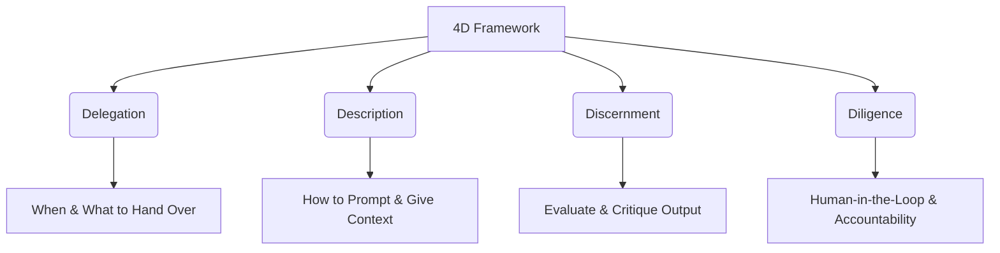

# Study Guide: AI Fluency: Framework & Foundations

This study guide prepares you for topics covered in the **AI Fluency: Framework & Foundations** course by Anthropic and contains key concepts likely to be tested in related foundational assessments.

---

## 1. The 4D Framework Overview
Developed in partnership with academic experts, the **4D Framework** represents a structured mental model for collaborating with AI systems effectively, efficiently, ethically, and safely.

The 4Ds stand for:
1.  **Delegation**
2.  **Description**
3.  **Discernment**
4.  **Diligence**

---

## 2. Core Competencies

### A. Delegation
*Deciding when, whether, and how to engage with AI for a given task.*

*   **Suitable Tasks for AI Delegation:**
    *   Synthesizing or summarizing large volumes of text.
    *   Drafting boilerplate code, basic test suites, or SQL queries.
    *   Brainstorming ideas, exploring alternative architectures, and formatting data.
*   **Unsuitable Tasks for AI Delegation (Critical Exam Concept):**
    *   Making high-stakes ethical, medical, or legal decisions.
    *   Final sign-offs on production code deployments without human review.
    *   Decisions requiring deep personal or organization-specific context that the model lacks.
*   **Preparation Tip:** In the exam, identify scenarios where delegating without constraints leads to failure (e.g., delegating a code review for security vulnerabilities entirely to AI without double-checking).

### B. Description
*Effectively instructing the AI to get the desired behavior and outputs.*

*   **Prompt Architecture:**
    *   **Context:** Explaining the system state, user roles, and business goals.
    *   **Instructions:** Direct commands specifying step-by-step logic.
    *   **Constraints:** Defining boundaries (e.g., "Do not use external libraries", "Limit response to 200 words").
    *   **Examples (Few-Shot Prompting):** Providing inputs and expected outputs to guide model formatting.
*   **XML Tags:** Utilizing tags (like `<instructions>`, `<code_style>`, `<output_format>`) to structure prompts cleanly. Claude is highly optimized to parse structured XML content.

### C. Discernment
*Evaluating the accuracy, quality, and relevance of the AI's output.*

*   **Hallucination Identification:** Understanding that LLMs predict the next token based on probability, which can lead to confident but factually incorrect assertions (e.g., invoking non-existent API endpoints or library functions).
*   **Critical Analysis:** Asking "Does this solution follow security best practices?" rather than just verifying that the code compiles.
*   **Verification Strategies:**
    *   Reviewing documentation of recommended APIs.
    *   Running generated test cases locally.
    *   Analyzing logic boundaries for edge-case errors.

### D. Diligence
*Taking ultimate responsibility and ownership of the AI's work.*

*   **Human-in-the-Loop (HITL):** Maintaining human oversight at critical steps. You, as the developer, are the author of record for any code produced by an AI.
*   **Security & Compliance:** Ensuring confidential/proprietary data is not pasted into public model interfaces or trained on.
*   **Feedback Loops:** Correcting the AI's mistakes during the session to refine the context window instead of restarting from scratch.

---

## 3. Potential Assessment / Exam Practice Scenarios

> [!IMPORTANT]
> Foundational exams often test your ability to categorize developer behaviors into the correct "D" of the 4D Framework.

#### Scenario 1:
*   **Situation:** A developer uses Claude to refactor a complex utility class. Before applying the code, the developer writes unit tests to verify that edge cases (like `null` handling) are correctly covered by the AI's refactored code.
*   **D Category:** **Discernment** (evaluating the quality/correctness of the output) and **Diligence** (ensuring safety and verification before production integration).

#### Scenario 2:
*   **Situation:** A team lead decides that the junior developers should not use Claude to write security-critical cryptographic modules without senior architect supervision.
*   **D Category:** **Delegation** (evaluating when and how it is appropriate to use AI).
