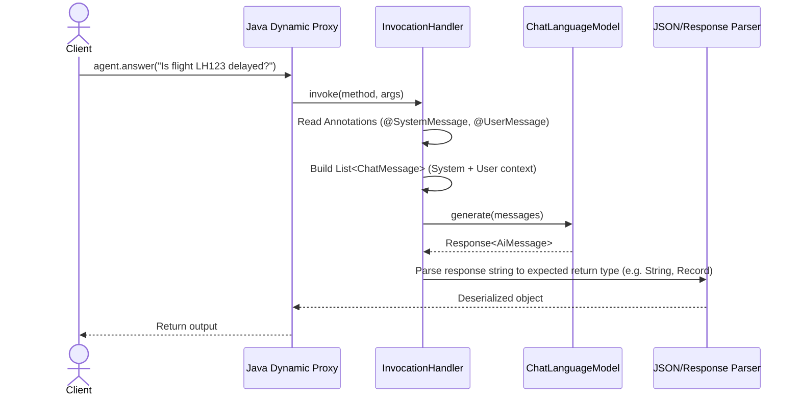

# Java Generative AI Deep-Dive Interview Handbook

This guide is curated for senior Java developers and system architects preparing for technical interviews. It covers the JVM-specific mechanics, concurrency patterns, and architectural designs of Generative AI integration using **LangChain4j** and **Spring AI**.

---

## 1. Under the Hood: Declarative AI Services & Java Dynamic Proxies

One of the most common design questions is: **"How does LangChain4j compile interface methods (annotated with `@SystemMessage` or `@Tools`) into active LLM calls at runtime?"**



### The Reflection & Dynamic Proxy Chain
When you call `AiServices.builder(CustomerSupportAgent.class).build()`, LangChain4j does the following:

1. **Dynamic Proxy Generation:** It uses standard JDK reflection `Proxy.newProxyInstance()` to create a runtime implementation of the interface.
2. **Method Interception:** It overrides the `InvocationHandler.invoke()` method. Whenever any method on your interface is called:
   * It inspects the method signature, parameter types, and annotations using Java Reflection.
   * It reads `@SystemMessage` to create a `SystemMessage` instance.
   * It extracts method parameters and binds them to the `@UserMessage` template or uses default mappings.
3. **ChatMemory Integration:** It retrieves the `ChatMemory` instance (if configured) for the thread/session, loads existing message histories, and appends the new `UserMessage`.
4. **Tool Auto-Binding:** If tools are registered, it generates a list of `ToolSpecification` objects using reflection on the `@Tool` annotated methods of your tool classes. It passes these specifications to the `ChatLanguageModel`.
5. **Execution Loop:** It sends the payload to the LLM. If the model responds with a request to execute a tool (Function Calling), the proxy interceptor executes the tool, gets the result, appends it to the chat memory, and loops back to the LLM.
6. **Deserialization:** It deserializes the final `AiMessage` text into the declared return type of the method (e.g., custom Java records, POJOs, Enums) using JSON parsers like Jackson or Gson.

---

## 2. Function Calling / Tool Execution Mechanics in Java

Interviewers will ask: **"Explain the step-by-step loop of Function Calling. How does the JVM execute local Java code requested by an LLM?"**

```
[Client] --> User Message --> [Agent Proxy] --> Tool Specs + Messages --> [LLM]
                                  ^                                        |
                                  |                                   Tool Call (JSON)
                                  |                                        v
                            Execute Method via Reflection <------- [Tool Executor]
                                  |
                                  v
                             Result String --------------------------------+
```

### Step-by-Step Flow:
1. **Registration:**
   At startup, the framework scans the registered tool classes using reflection. For every `@Tool` annotation:
   * It parses the method name, parameter types, names, and the description.
   * It builds a JSON schema representation of the parameters.
2. **Schema Ingestion:**
   When a user query is sent, the tool schemas are sent along with the prompt as `tools` parameters in the REST payload to OpenAI/Ollama.
3. **Model Selection:**
   The LLM determines that answering the query requires a tool. Instead of returning text, it returns a structured JSON containing:
   * `tool_calls`: An array containing target method name (e.g., `"getBookingStatus"`) and arguments (e.g., `{"bookingReference": "LH123"}`).
4. **JVM Invocation:**
   The Java framework interceptor receives this response. It:
   * Maps the requested tool name to the registered Java class instance.
   * Deserializes the JSON arguments into the method's parameter types.
   * Invokes the method on the target bean instance using reflection:
     ```java
     method.invoke(targetObject, args);
     ```
5. **Completion Loop:**
   The method returns a value (e.g., `"DELAYED"`). The framework wraps this return value into a `ToolExecutionResultMessage` and sends it back to the LLM. The LLM processes this context and produces the final natural language answer for the user.

---

## 3. Concurrency, State, and Thread Safety in Production Java Web Apps

A major interview checkpoint is: **"How do you design a stateful AI Chatbot to be thread-safe and support multiple concurrent users in a Spring Boot REST API?"**

By default, Spring beans are singletons. If you inject a chat agent or chat memory directly as a singleton, **multiple concurrent requests will corrupt and share the same conversation state.**

### Solution A: Token/Memory Scoping with ThreadLocal
If the agent is a singleton, you must pass a unique identifier (like a `chatId` or `userId`) in every method call to fetch the correct memory partition:

```java
public interface CustomerSupportAgent {
    // By annotating a parameter with @MemoryId, LangChain4j isolates memory per user/session
    String answer(@MemoryId String sessionId, @UserMessage String message);
}
```
* **How it works:** Under the hood, LangChain4j's `ChatMemoryStore` uses a `Map<Object, ChatMemory>` structure to retrieve the appropriate token-window memory instance mapped to the `sessionId`.

### Solution B: Persistent ChatMemoryStore (Multi-Tenant Scale)
In-memory solutions (`InMemoryChatMemory`) will overflow the JVM Heap and vanish on application restarts. In production, you must implement a custom `ChatMemoryStore` that saves messages to a database (Redis, PostgreSQL):

```java
@Component
public class PersistentDbChatMemoryStore implements ChatMemoryStore {

    @Autowired
    private ChatMessageRepository repository; // Spring Data JPA

    @Override
    public List<ChatMessage> getMessages(Object memoryId) {
        // Load messages from database sorted by timestamp
        return repository.findBySessionId((String) memoryId);
    }

    @Override
    public void updateMessages(Object memoryId, List<ChatMessage> messages) {
        // Update database with latest messages (inserting new ones)
        repository.saveAll(messages);
    }

    @Override
    public void deleteMessages(Object memoryId) {
        repository.deleteBySessionId((String) memoryId);
    }
}
```

---

## 4. Structured JSON Outputs: Assuring Schema Validity

Query: **"How do you guarantee that an LLM returns a structured JSON payload that maps exactly to a Java Record, and how does the parser handle validation errors?"**

### The Mechanism
1. **JSON Schema Generation:** The framework analyzes the target Java class/record structure (field names, annotations like `@Description`, field types) and generates a matching **JSON Schema**.
2. **OpenAI Structured Outputs:** The framework sends this schema using properties like `response_format: { type: "json_schema", json_schema: ... }`. This forces the model's logits sampler to restrict vocabulary selections to match the target schema exactly.
3. **Java Parsing:** The returned JSON is parsed using Jackson ObjectMapper.

### Record Mapping Example:
```java
public record FlightDetails(
    @Description("The 2-letter airline code and flight number (e.g. LH123)")
    String flightNumber,
    @Description("The status of the flight")
    Status status,
    @Description("Delay duration in minutes, if status is delayed")
    int delayMinutes
) {
    public enum Status { ON_TIME, DELAYED, CANCELLED }
}
```

---

## 5. RAG (Retrieval-Augmented Generation) Design Patterns in Java

Interviewers will test your architectural knowledge on building enterprise RAG pipelines:

```
[Document Ingestion]
File -> DocumentLoader -> DocumentSplitter (recursive) -> EmbeddingModel -> EmbeddingStore (Vector DB)

[Query Pipeline]
User Query -> EmbeddingModel (Vector) -> EmbeddingStore (Similarity Search) -> Context Chunks -> Prompt -> LLM
```

### Ingestion Best Practices
* **Document Chunking:** If text chunks are too small, they lose context. If they are too large, they dilute meaning and exceed context windows. In Java, use `DocumentSplitters.recursive(maxSegmentSize, maxOverlapSize)` to split intelligently across paragraph and sentence boundaries.
* **Vector DB Integrations:** Know the popular options.
  * **PgVector:** Seamless if the enterprise already uses PostgreSQL. Uses `spring-ai-pgvector-store` dependency.
  * **Milvus/Qdrant/Chroma:** Dedicated vector search engines for sub-millisecond retrieval scaling.

---

## 6. Framework Comparison: LangChain4j vs. Spring AI

Be prepared to answer: **"How do you choose between LangChain4j and Spring AI for a new enterprise project?"**

| Dimension | LangChain4j | Spring AI |
|-----------|-------------|-----------|
| **Core Paradigm** | Highly imperative & agentic. Relies heavily on Java interfaces and reflection. | Declarative configurations. Matches standard Spring design patterns (templates, auto-configurations). |
| **Maturity** | Highly mature, extensive third-party integrations, rapid release cycle. | Newer, but backed by the VMware Spring Security & Spring Core teams. |
| **Agentic Support** | Advanced (Built-in memory windows, easy tool/function calling, easy configuration). | Growing (Uses Advisors for intercepting calls, expanding agentic capabilities). |
| **Spring Ecosystem** | Integrates well, but has standalone dependency modules. | Native integration (plugs into Spring Data, Spring Security, etc.). |
