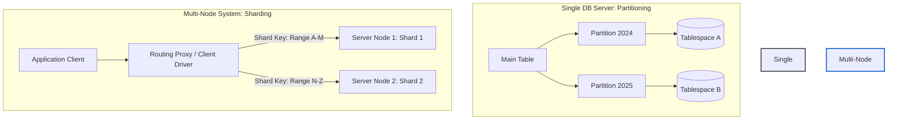
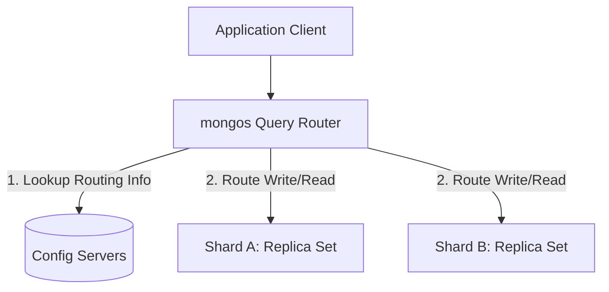

# Database Partitioning and Sharding in Depth

This guide provides an engineering-level deep dive into database scaling strategies: **Partitioning** and **Sharding**. We cover their architectural patterns, clear differences, trade-offs, and practical implementations using **MySQL** (for SQL) and **MongoDB** (for NoSQL).

---

## 1. Architectural Concepts: Partitioning vs. Sharding

To scale databases horizontally and handle billions of rows, engineers divide large datasets into smaller, more manageable subsets. The two primary techniques are Partitioning and Sharding.

| Metric / Dimension | Database Partitioning (Horizontal/Vertical) | Database Sharding (Horizontal Scaling) |
| :--- | :--- | :--- |
| **Physical Location** | Data resides on the **same physical server instance** (disk partitions/separate tablespaces). | Data is distributed across **multiple independent server instances** (shared-nothing architecture). |
| **System Boundary** | Single database instance. The CPU, Memory, and Disk I/O limits of that single server still apply. | Multiple database instances. Aggregated CPU, Memory, and Disk I/O scales horizontally. |
| **Application Logic** | **Transparent** to the application. The SQL engine automatically routes queries to the correct partition. | **Requires routing awareness**. The application layer or a dedicated database routing proxy (like `mongos`) must map queries. |
| **Primary Goal** | Optimize query performance, improve index lookup speed, and simplify maintenance (e.g., dropping old log partitions). | Scale storage capacity and write/read throughput beyond the limits of a single machine. |



---

## 2. SQL Database Partitioning (MySQL Focus)

MySQL supports table partitioning out-of-the-box (specifically in the InnoDB engine). Under the hood, MySQL splits one logical table into multiple physical tablespace files (such as `.ibd` files).

### A. Core Partitioning Strategies in MySQL
1.  **RANGE Partitioning**: Assigns rows to partitions based on column values falling within a specific range. In MySQL, this can be done using range values or range columns (`PARTITION BY RANGE` or `PARTITION BY RANGE COLUMNS`).
2.  **LIST Partitioning**: Similar to RANGE, but partitions are selected based on whether a column value matches one of a set of discrete values (e.g., `PARTITION BY LIST COLUMNS(region)`).
3.  **HASH Partitioning**: Assigns rows to partitions based on the value returned by a user-defined expression or key column (e.g., `PARTITION BY HASH(user_id) PARTITIONS 4;`).
4.  **KEY Partitioning**: Similar to HASH, but MySQL's internal hashing function handles the column values (e.g., `PARTITION BY KEY(id) PARTITIONS 4;`).

### B. MySQL Script Example: Range & Hash Partitioning

Here is a complete, production-grade MySQL script demonstrating how to define, query, and verify partitioned tables.

```sql
-- ==========================================
-- 1. RANGE COLUMNS PARTITIONING BY DATE (MYSQL)
-- ==========================================

CREATE TABLE orders (
    order_id INT NOT NULL,
    customer_id INT NOT NULL,
    order_date DATE NOT NULL,
    total_amount DECIMAL(12, 2) NOT NULL,
    status VARCHAR(50) NOT NULL,
    -- In MySQL, the partition column MUST be part of the primary key / unique index
    PRIMARY KEY (order_id, order_date)
)
PARTITION BY RANGE COLUMNS(order_date) (
    PARTITION p2025_q1 VALUES LESS THAN ('2025-04-01'),
    PARTITION p2025_q2 VALUES LESS THAN ('2025-07-01'),
    PARTITION p2025_q3 VALUES LESS THAN ('2025-10-01'),
    PARTITION p2025_q4 VALUES LESS THAN ('2026-01-01'),
    PARTITION p_future VALUES LESS THAN (MAXVALUE)
);

-- Insert records into the table (MySQL automatically routes them)
INSERT INTO orders (order_id, customer_id, order_date, total_amount, status) VALUES
(1, 101, '2025-02-15', 250.00, 'COMPLETED'), -- routes to partition p2025_q1
(2, 102, '2025-05-20', 99.99,  'PENDING'),   -- routes to partition p2025_q2
(3, 103, '2026-03-10', 45.50,  'COMPLETED');  -- routes to partition p_future


-- ==========================================
-- 2. HASH PARTITIONING FOR UNIFORM DISTRIBUTION
-- ==========================================

CREATE TABLE user_sessions (
    session_id VARCHAR(64) NOT NULL,
    user_id INT NOT NULL,
    last_activity DATETIME NOT NULL,
    PRIMARY KEY (session_id, user_id)
)
-- Modulo hashing is computed on the user_id integer to divide data across 4 partitions
PARTITION BY HASH (user_id)
PARTITIONS 4;
```

### C. How MySQL Partitioning Works & Query Pruning
The primary performance benefit of partitioning is **Query Pruning (Partition Exclusion)**. When a query contains a filter on the partition key, the MySQL query optimizer evaluates the condition and excludes all irrelevant partitions from execution before reading any data from disk.

#### Checking Query Pruning with `EXPLAIN`

We can run the following query in MySQL:
```sql
EXPLAIN SELECT * FROM orders WHERE order_date >= '2025-04-15' AND order_date <= '2025-05-01';
```

#### Output (Simplified Execution Plan):
| id | select_type | table  | partitions | type | key     | rows | Extra       |
| :--- | :--- | :--- | :--- | :--- | :--- | :--- | :--- |
| 1  | SIMPLE      | orders | **p2025_q2** | ALL  | NULL    | 1    | Using where |

*   **Analysis**: In the `partitions` column, MySQL optimizer shows that it checked **only `p2025_q2`**. The other partitions (`p2025_q1`, `p2025_q3`, `p2025_q4`, `p_future`) were completely skipped. This reduces disk I/O and index scan overhead.

---

## 3. NoSQL Database Sharding & Partitioning (MongoDB Focus)

MongoDB is designed for elastic horizontal scalability and implements sharding explicitly to scale storage capacity and throughput.

### A. MongoDB Sharding Architecture
A MongoDB sharded cluster consists of the following components:
1.  **Shard**: A single replica set containing a subset of the sharded data.
2.  **Config Servers**: A replica set storing metadata and routing configuration for the cluster.
3.  **`mongos` Router**: A routing service that acts as the interface for application clients, directing read and write requests to the appropriate shard.



### B. MongoDB Script: Configuration & Enabling Sharding

To shard a collection, we select a **Shard Key** (which must be indexed) and instruct MongoDB to partition the collection.

```javascript
// Step 1: Connect to the mongos instance (via mongosh)
// Enable sharding at the database level
sh.enableSharding("ecomm_db");

// Step 2: Create an index on the proposed shard key inside the target collection
// We use a compound shard key (equality + high-cardinality ID) to prevent jumbo chunks
use ecomm_db;
db.orders.createIndex({ customer_id: 1, order_id: 1 });

// Step 3: Shard the collection using the newly created index
sh.shardCollection("ecomm_db.orders", { customer_id: 1, order_id: 1 });

// Step 4 (Alternative): Sharded using a Hashed Shard Key for even write distribution
// This computes MD5 hashes of the key to distribute data uniformly
db.user_profiles.createIndex({ user_id: "hashed" });
sh.shardCollection("ecomm_db.user_profiles", { user_id: "hashed" });
```

### C. Shard Key Partitioning Strategies in MongoDB
*   **Ranged Sharding**:
    *   MongoDB divides the data into ranges based on the shard key values.
    *   *Advantage*: Highly efficient for range queries (e.g., fetching all orders for `customer_id` 101 to 105), as they are routed to a single shard.
    *   *Disadvantage*: Can lead to hotspots if the key is monotonically increasing (like timestamps or object IDs), as all new inserts will target the same max-range shard.
*   **Hashed Sharding**:
    *   MongoDB computes a hash of the shard key's value and uses it to locate the target chunk.
    *   *Advantage*: Ensures an even distribution of writes across all shards, eliminating insert hotspots.
    *   *Disadvantage*: Range queries turn into "scatter-gather" operations, forcing `mongos` to query every shard in the cluster.

---

## 4. Key Distributed System Challenges & Mitigations

Scaling with sharding solves volume limits but introduces major distributed systems challenges:

### A. The Scatter-Gather Query Problem
*   **Issue**: If a query does not include the shard key in its filter criteria, `mongos` cannot target specific shards. It must send the query to **every single shard** (Scatter), wait for all nodes to reply, and aggregate/sort the results (Gather). This spikes network latency and negates the benefits of horizontal scaling.
*   **Mitigation**: Always include the Shard Key in read/update operations. Avoid queries that scan non-sharded dimensions globally.

### B. Distributed Transactions
*   **Issue**: Ensuring ACID transactions across multiple shards (replica sets) is highly expensive. Under a network partition, standard locks can block database nodes.
*   **Mitigation**: While MongoDB supports multi-document transactions across shards, it uses a two-phase commit protocol under the hood. For maximum performance at scale, keep transactions local to a single shard key (single shard) or denormalize data to avoid cross-shard operations entirely.

### C. Shard Key Hotspots and Jumbo Chunks
*   **Issue**: In MongoDB, data is split into logical partitions called **chunks** (default size 64MB). If a chunk grows beyond the maximum limit, but all documents inside it share the **exact same shard key value**, the chunk cannot be split. MongoDB marks this as a **Jumbo Chunk**, which cannot be moved by the balancer, leading to unbalanced shards and disk hotspots.
*   **Mitigation**: Create a **Compound Shard Key** combining a low-cardinality prefix (e.g., `customer_id` or `tenant_id`) with a high-cardinality suffix (e.g., a unique `order_id` or `uuid`). This maintains query locality while ensuring chunks can be split.
