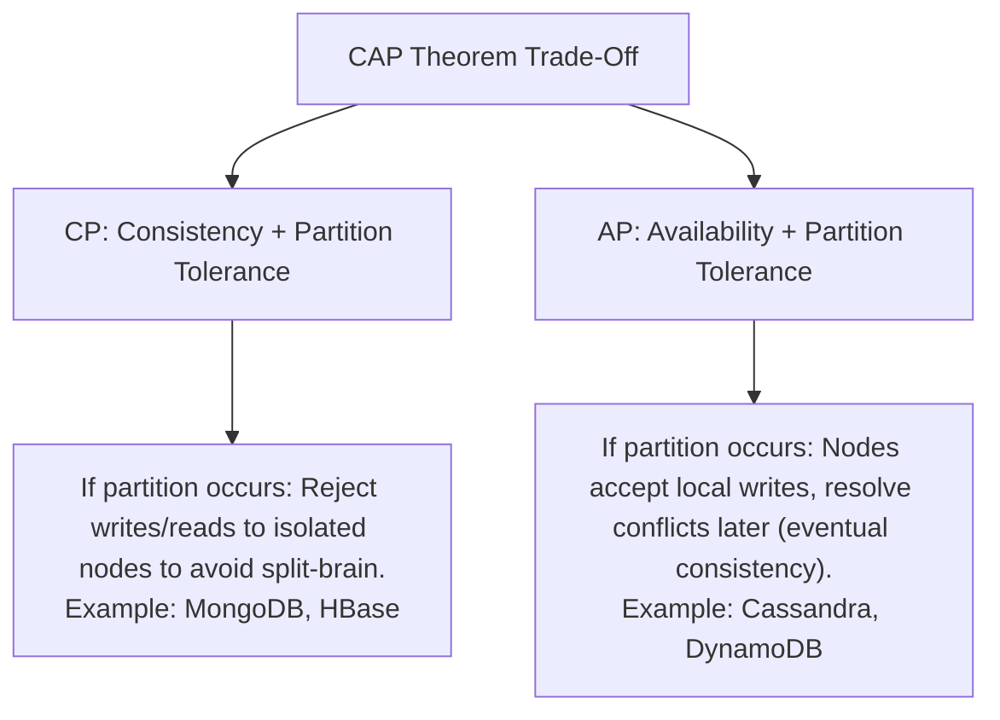
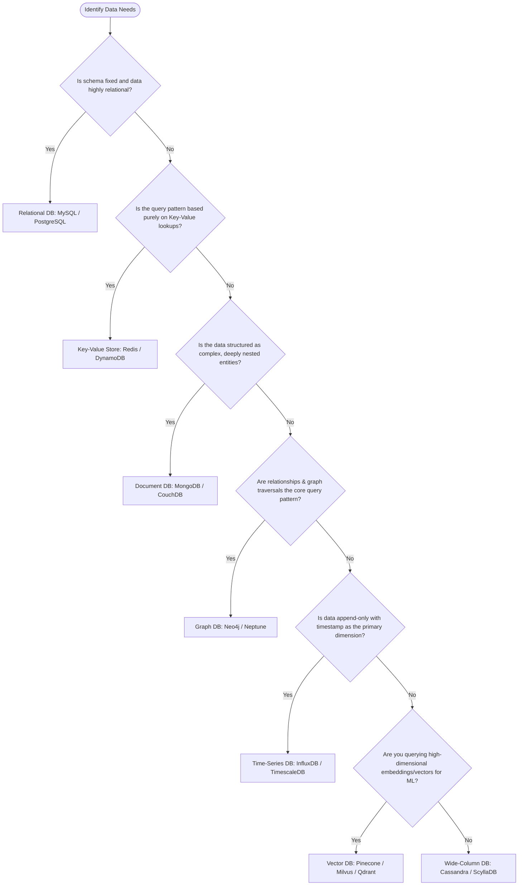

# Database Systems: Concepts, Comparison & Decision Guide

Welcome to the Database Systems engineering guide. This document provides a high-level architectural comparison of relational and non-relational database paradigms, outlines key distributed systems trade-offs (CAP/PACELC), and includes a decision framework for selecting the right data store.

---

## 1. Directory Structure & Topic Map

This repository is structured into specialized packages for deep-dive interview preparation:
*   [SQL (MySQL Focus)](file:///Users/yogeshwarpatel/Workspace/interview/database/sql/README.md) - Deep dive into MySQL architecture, InnoDB internals, indexing (B+Trees), transactions, MVCC, locking, and tuning.
*   [NoSQL (MongoDB Focus)](file:///Users/yogeshwarpatel/Workspace/interview/database/nosql/README.md) - Deep dive into MongoDB architecture, WiredTiger engine, data modeling (embed vs. reference), replication, sharding, and write/read concerns.

---

## 2. Overall Comparison of Database Types

| Feature / Metric | Relational (SQL) | Document (NoSQL) | Key-Value (NoSQL) | Column-Family / Wide-Column | Graph (NoSQL) | Time-Series (TSDB) | Vector Database |
| :--- | :--- | :--- | :--- | :--- | :--- | :--- | :--- |
| **Data Model** | Relations (Tables: Rows & Columns) | Documents (BSON, JSON) | Key-Value pairs | Rows with dynamic columns (keyspaces) | Nodes, Edges, & Properties | Timestamp-value pairs | High-dimensional vectors |
| **Primary Focus** | Data integrity, complex joins, relations | Dynamic schema, nested objects, rapid dev | Ultra-low latency lookups | High write/read scalability, large volumes | Complex relationships and traversals | Fast ingestion of sequential time data | Nearest neighbor search in vector space |
| **Schema** | Strict, pre-defined | Flexible, dynamic | Schemaless | Semi-structured, column families | Flexible | Fixed metadata + variable metrics | Dynamic metadata + vector schema |
| **Transactions** | ACID (Full Support) | Single-doc ACID (Multi-doc since 4.0) | Typically single-key ACID | Eventual consistency, lightweight transactions | ACID (Graph-wide) | Generally append-only, limited transactionality | Metadata ACID (varies by engine) |
| **Scaling** | Vertical (Scale Up), Horizontal via sharding (complex) | Horizontal (Scale Out via sharding) | Horizontal (Scale Out) | Horizontal (Excellent, peer-to-peer) | Hybrid (Graph partitioning is hard) | Horizontal (Optimized for append) | Horizontal (Partitioning indexes) |
| **Joins** | Native and highly optimized (`JOIN`) | No native joins (lookup/denormalization needed) | Non-existent | Minimal (client-side or denormalized) | Native (relationship traversal) | Not applicable | Attribute filtering |
| **Common Engines** | MySQL, PostgreSQL, Oracle, SQL Server | MongoDB, CouchDB | Redis, DynamoDB (key-value mode), Memcached | Cassandra, ScyllaDB, HBase | Neo4j, Amazon Neptune | InfluxDB, TimescaleDB, Prometheus | Pinecone, Milvus, Qdrant, Chroma |

---

## 3. Distributed Database Theorems: CAP vs. PACELC

When designing or choosing a distributed database, you are bound by fundamental laws of distributed computing.

### A. The CAP Theorem
The CAP theorem states that a distributed data store can simultaneously provide at most two of the following three guarantees:
1.  **Consistency (C)**: Every read receives the most recent write or an error. (Single-copy consistency / Linearizability).
2.  **Availability (A)**: Every non-failing node returns a non-error response (without guarantee that it contains the most recent write).
3.  **Partition Tolerance (P)**: The system continues to operate despite an arbitrary number of messages being dropped or delayed by the network between nodes.

In practice, network partitions are inevitable in distributed systems. Therefore, **Partition Tolerance (P) is non-negotiable**. Systems must choose between:
*   **CP (Consistency/Partition Tolerance)**: Blocks writes/reads or returns errors if consistency cannot be guaranteed across network partitions (e.g., MongoDB, HBase).
*   **AP (Availability/Partition Tolerance)**: Accepts writes and returns stale data during network partitions, prioritizing system availability (e.g., Cassandra, DynamoDB).



### B. The PACELC Theorem
An extension of the CAP theorem, **PACELC** defines the trade-offs of a distributed database even under normal operations (when there are no partitions).
*   If there is a **P**artition, trade off **A**vailability vs. **C**onsistency.
*   **E**lse (under normal operations), trade off **L**atency vs. **C**onsistency.

```
       /--- [P]artition ---> [A]vailability OR [C]onsistency
[PACELC]
       \--- [E]lse ---------> [L]atency       OR [C]onsistency
```

#### Classification of Databases under PACELC:
*   **PC/EC (e.g., MongoDB, Spanner)**: In a partition, it chooses Consistency. Under normal operation, it pays a Latency penalty to ensure Consistency (e.g., waiting for quorum/consensus acknowledgments).
*   **PA/EL (e.g., Cassandra, DynamoDB)**: In a partition, it chooses Availability. Under normal operation, it prioritizes Latency (writes return fast without waiting for slow nodes; replication occurs asynchronously).
*   **PC/EL (e.g., Yahoo! PNUTS)**: In a partition, it chooses Consistency. Under normal operation, it favors Latency (but works with master-based ordering models).

---

## 4. Database Selection Decision Tree

Use this flow to determine the best database paradigm for your requirements:



---

## 5. Architectural Trade-offs: ACID vs. BASE

### ACID (SQL Paradigm)
Designed for high data integrity, strict consistency, and reliability.
*   **Atomicity**: Execution is all-or-nothing.
*   **Consistency**: State transitions strictly follow constraints.
*   **Isolation**: Concurrency is managed to behave sequentially.
*   **Durability**: Committed data survives crashes.

### BASE (NoSQL Paradigm)
Designed for massive scale, high availability, and network resilience.
*   **Basically Available**: The system remains operational during partitions, though some nodes may serve degraded/stale data.
*   **Soft State**: The state of the system can drift over time without user interaction because replication is asynchronous.
*   **Eventual Consistency**: Given no new updates, all replicas will eventually converge to the same value.

---

## 6. How Sharding and Replication Impact Consistency

*   **Replication Lag**: In Master-Slave (or Primary-Secondary) replication, writes to the master are replicated asynchronously to read replicas. During this window, reads from replicas will return stale data (violating Read-Your-Own-Writes consistency unless read path goes to the Master).
*   **Split-Brain Scenario**: If a network partition cuts off the leader node from the rest of the cluster, a new leader might be elected by the majority. If the old leader continues to accept writes from a client on its side of the partition, the database diverges. This is resolved in CP systems (like MongoDB) by shutting down/stepping down leaders that lose their majority connection.
*   **Multi-Master Conflicts**: If writes are allowed on multiple nodes simultaneously, write conflicts occur. Conflict resolution strategies include **Last-Write-Wins (LWW)** (which relies on synchronized physical clocks, prone to NTP drift) or **vector clocks/version vectors** (logical clocks that track causal history).
