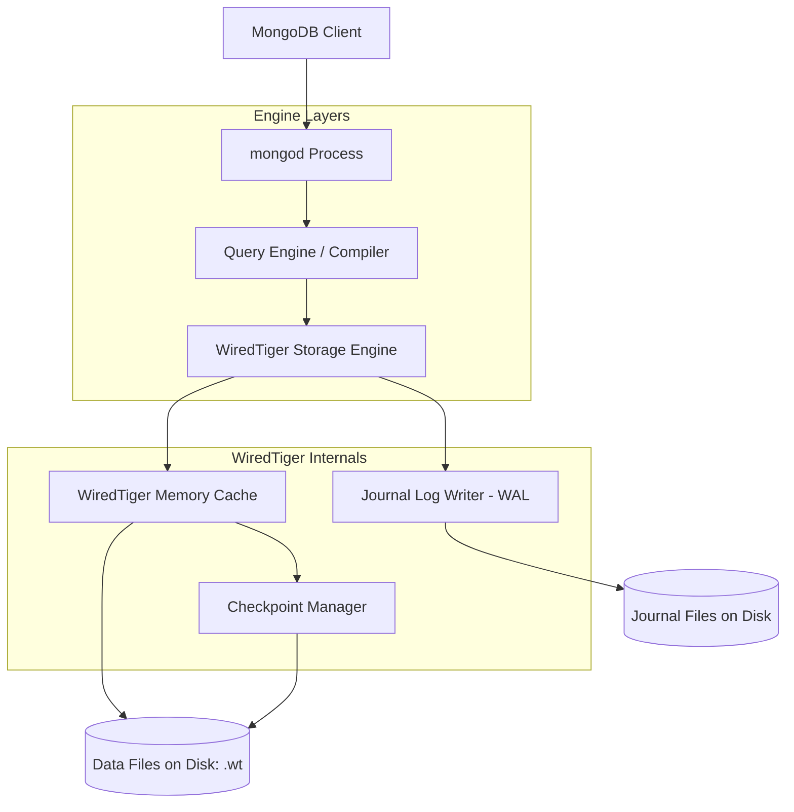
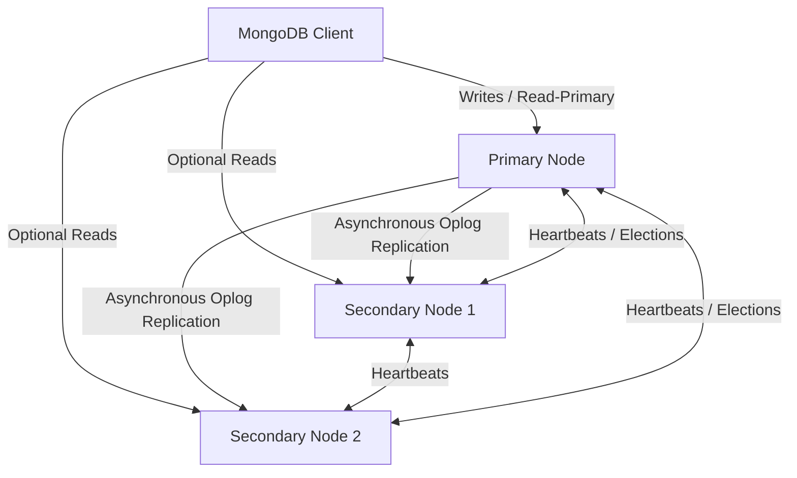
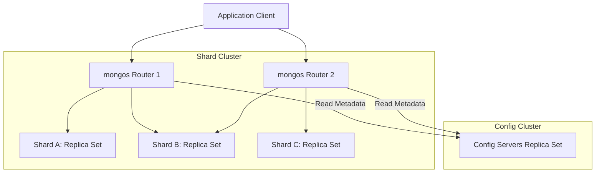

# Non-Relational Database Systems (NoSQL): MongoDB & WiredTiger Internals

This guide provides an engineering-level deep dive into NoSQL database systems, focusing on MongoDB, its default storage engine WiredTiger, data modeling, high availability, and horizontal scaling. It is designed to prepare senior engineers for system design and advanced data modeling interviews.

---

## 1. Classification of NoSQL Databases

NoSQL databases are optimized for specific data access patterns rather than general relations. They are broadly categorized into four classes:

| Class | Core Concept | Characteristics | Example Engines | Primary Use Cases |
| :--- | :--- | :--- | :--- | :--- |
| **Document** | Hierarchical document structures | Stores data as nested JSON/BSON; support for subdocuments and arrays. | MongoDB, CouchDB | Content management, e-commerce product catalogs, rapid prototyping. |
| **Key-Value** | Simple key-to-value map | O(1) read/write latency. Simple queries. Very high performance. | Redis, Memcached, DynamoDB | Session management, distributed cache, shopping carts. |
| **Column-Family (Wide-Column)** | Keyspace containing column families | Stores columns of data together on disk. High write throughput, scalable horizontally. | Apache Cassandra, ScyllaDB, HBase | IoT telemetry, clickstream analysis, massive logging systems. |
| **Graph** | Nodes (Entities), Edges (Relationships), Properties | Optimized for traversing deep paths and complex relationships. | Neo4j, Amazon Neptune | Social networks, fraud detection, recommendation engines. |

---

## 2. MongoDB Architecture & WiredTiger Internals

MongoDB uses **WiredTiger** as its default pluggable storage engine since version 3.2.



### Key WiredTiger Internals:
1.  **WiredTiger Memory Cache**:
    *   By default, WiredTiger allocates **50% of (Physical RAM - 1 GB)** for its cache. The rest is left to the OS file system cache to avoid double caching and facilitate fast disk writes.
    *   Data is loaded into the cache in an uncompressed format for fast CPU access, but written to disk using block compression (e.g., Snappy or zlib).
2.  **Journaling (Write-Ahead Logging)**:
    *   MongoDB writes modifications to an in-memory journal buffer. The journal is flushed to disk every **100ms** (or on commit if write concern requires).
    *   If a crash occurs, MongoDB replays the on-disk journal to restore changes since the last checkpoint.
3.  **Checkpoints**:
    *   Every **60 seconds** (or when 2GB of journal data is written), WiredTiger creates a **Checkpoint**. This writes all dirty pages from the memory cache to disk, making the data files durable up to that point. The journal files prior to the checkpoint are then deleted.
4.  **B-Trees & LSM-Trees**:
    *   WiredTiger uses standard B-Trees for normal collections and indexes.
    *   It can optionally use Log-Structured Merge (LSM) trees for write-intensive time-series workloads.

---

## 3. Data Modeling: Embedding vs. Referencing

In relational databases, normalization is the gold standard. In MongoDB, data modeling is driven by **query access patterns** and **cardinality**.

### A. Embedded Documents (Denormalization)
Data is nested inside a single document (using subdocuments or arrays of subdocuments).
*   **Pros**: Single-document atomic updates; reads are fast because all data is fetched in a single physical I/O (no joins).
*   **Cons**: Document size limit is **16MB**; arrays can grow unboundedly, leading to fragmentation and page moves (highly expensive).
*   **When to use**:
    *   1:1 relationships (e.g., user and their address).
    *   1:N relationships where the "many" side is bounded and small (e.g., a post and its tags, or an invoice and its line items).
    *   Data that is rarely updated.

### B. References (Normalization / Linking)
Documents store references (`ObjectId`) pointing to documents in other collections.
*   **Pros**: Prevents document growth and the 16MB size limit; reduces redundancy; makes updates to referenced data efficient.
*   **Cons**: Requires application-side joins or MongoDB `$lookup` aggregation stages, which are CPU and I/O intensive.
*   **When to use**:
    *   1:N relationships where the "many" side is unbounded (e.g., a sensor and its millions of log readings).
    *   N:M (Many-to-Many) relationships.
    *   Entities that are frequently updated independently of each other.

---

## 4. MongoDB Indexing Strategies

### A. Single Field and Compound Indexes
*   **Single Field**: Index on a single document key.
*   **Compound Index**: Index on multiple fields. The order of fields in a compound index is critical.

#### The ESR (Equality, Sort, Range) Rule:
When designing compound indexes to optimize queries, order the keys in the index as:
1.  **E**quality fields first: Fields checked for exact equality (e.g., `status: "ACTIVE"`).
2.  **S**ort fields second: Fields used in the `sort()` criteria (e.g., `createdAt: -1`).
3.  **R**ange fields last: Fields checked with range filters (e.g., `age: { $gt: 21 }`).
*   *Why?* Placing range fields before sort fields prevents the database engine from using the index for sorting, forcing a slow memory sort (in-memory sort limit in MongoDB is 32MB).

### B. Specialized Indexes
*   **Multikey Index**: Automatically created when you index a field containing an array. MongoDB indexes each element in the array.
*   **Partial Index**: Only indexes documents that match a filter expression. Reduces index size and write overhead.
    *   *Example*: Indexing `email` only for documents where `status: "VERIFIED"`.
*   **Sparse Index**: Only indexes documents where the indexed field exists.
*   **TTL (Time-To-Live) Index**: Automatically deletes documents after a specified number of seconds or at a specific date. Useful for sessions and temporary logs.

---

## 5. Replica Sets: High Availability

MongoDB uses **Replica Sets** to implement active-passive clustering. A replica set consists of a single **Primary** node and multiple **Secondary** nodes.



### A. Consensus and Election Process
*   Replica set members continuously exchange **heartbeats** (every 2 seconds).
*   If the Primary fails to respond within **10 seconds**, the Secondaries initiate an election using a Raft-like consensus protocol.
*   Only voting nodes can participate. A candidate must secure a majority of all voting members in the replica set configuration to become the new Primary.
*   *Note*: To prevent partition-based split-brain scenarios, a replica set should have an odd number of members (or use an Arbiter node that votes but stores no data).

### B. Write Concerns
Write concerns determine the level of acknowledgment requested from the replica set before returning success.
*   `w: 1`: Returns success as soon as the **Primary** node writes the data. Fastest, but prone to data loss if the Primary crashes before replicating to Secondaries.
*   `w: majority`: Returns success only after a **majority of voting members** in the replica set write the data to their memory cache. This prevents data rollbacks during failovers.
*   `j: true`: Requires the write to be written to the **on-disk journal** of the nodes before returning success. Guarantees durability in case of power failure.

### C. Read Preferences & Read Concerns
*   **Read Preferences** control where reads are routed:
    *   `primary`: Always read from the Primary (Strong consistency).
    *   `primaryPreferred`: Read from Primary, fall back to Secondaries if Primary is down.
    *   `secondary`: Always read from a Secondary (good for read-heavy analytical queries, risk of stale reads).
    *   `secondaryPreferred`: Read from Secondaries, fall back to Primary.
    *   `nearest`: Read from the node with the lowest network latency.
*   **Read Concerns** control what version of data is visible:
    *   `local` / `available`: Returns the node's local version of data. May be rolled back if the Primary fails.
    *   `majority`: Returns data that has been acknowledged by a majority of replica set members, ensuring it will never be rolled back.
    *   `linearizable`: Avoids stale reads by forcing the Primary to check with a majority of nodes *during* the read operation to ensure it is still the leader.

---

## 6. Sharding: Horizontal Scaling

When a database grows beyond the CPU, memory, or disk capacity of a single server, MongoDB scales horizontally using **Sharding**.



### A. Sharding Components:
1.  **Shard**: A single replica set containing a subset of the sharded data.
2.  **Config Servers**: A dedicated replica set that stores the cluster's metadata (routing table, range mappings of chunks to shards).
3.  **`mongos` Router**: A lightweight, stateless routing service. Clients connect to `mongos` instead of individual shards. It queries config servers to find where data resides and routes client requests to the correct shards.

### B. Shard Keys:
The choice of Shard Key determines the distribution of data across shards.
*   **Ranged Sharding**: Data is split into chunks based on continuous value ranges of the shard key.
    *   *Pros*: Efficient range queries because similar values reside on the same shard.
    *   *Cons*: Monotonically increasing values (like timestamps or auto-incrementing IDs) will direct all writes to a single shard (the max range shard), causing a write bottleneck.
*   **Hashed Sharding**: Computes an MD5 hash of the shard key value to determine the chunk partition.
    *   *Pros*: Even write distribution across all shards.
    *   *Cons*: Range queries turn into scatter-gather queries, requiring `mongos` to query every single shard in the cluster.

---

## 7. Causal Consistency & Session Guarantees

In distributed systems, eventual consistency means replicas can temporarily lag behind the primary, leading to stale reads. MongoDB solves this for client applications using **Causal Consistency** within client sessions.

When causal consistency is enabled in a session, MongoDB guarantees the following read-your-own-writes and causal order properties:
1.  **Read Your Own Writes**: A client's read will always reflect their previous write (no reading stale data after you just wrote it).
2.  **Monotonic Reads**: A client will never see data revert to an older state on subsequent reads (preventing reads from jumping back in time across lagging secondaries).
3.  **Monotonic Writes**: Writes are guaranteed to be serialized and executed in the order they were submitted.
4.  **Writes Follow Reads**: If a client reads a state and performs a write, that write is guaranteed to occur after the read state chronologically.

#### How it works under the hood:
Causal consistency relies on a logical clock mechanism:
*   Every node in a MongoDB cluster tracks a logical time using a global variable called **Cluster Time** (`$clusterTime`).
*   When a client performs an operation inside a causally consistent session, MongoDB returns the **Operation Time** (`operationTime`) and cluster time.
*   The client driver caches these timestamps and sends them back to the server in subsequent requests.
*   If a read goes to a secondary node, the secondary checks if its own replication state has reached at least the client's sent `operationTime`. If not, it blocks the read request until it catches up, ensuring the client does not receive stale data.

---

## 8. Advanced MongoDB Concepts

### A. The Replica Set Oplog (Operation Log)
The **oplog** is a capped collection (`oplog.rs` in the `local` database) that acts as the replication backbone of a replica set.
*   **Mechanics**: Every write operation (insert, update, delete) on the Primary is logged into the oplog as an idempotent statement (e.g., an update is converted to a specific set operation, so applying it multiple times results in the same state). Secondaries continuously tail the Primary’s oplog and apply the changes to their local collections.
*   **The Oplog Window**: Because the oplog is a **capped collection**, it has a fixed size. Once it fills up, new entries overwrite the oldest entries. The time difference between the newest and oldest entry in the oplog is the **Oplog Window**.
*   **Out of Sync Error**: If a secondary node goes offline or lags behind for a duration longer than the oplog window, the entries it needs to catch up have been overwritten. The secondary falls into an irrecoverable state and must undergo a full resync (re-cloning all data), which degrades cluster performance.

### B. GridFS: Handling Large Files
MongoDB documents are capped at 16MB. To store files larger than 16MB (e.g., videos, audio, large PDFs), MongoDB uses **GridFS**.
*   **How it works**: Instead of saving the file as a single BSON document, GridFS splits the file into chunks (typically 255KB each).
*   **Storage Collections**: GridFS uses two collections to store the files:
    1.  `fs.files`: Stores the metadata (filename, upload date, file size, MD5 checksum, and chunk size).
    2.  `fs.chunks`: Stores the actual binary data chunks, referencing the parent file’s `_id` and tracking their sequential order using a `n` index field.
*   **Use case**: Best when you want to keep files synced with your database backups, avoid OS file system limits, or stream portions of large files directly without loading them fully into memory.

### C. WiredTiger Concurrency and Memory Eviction
WiredTiger uses **Optimistic Concurrency Control (OCC)** at the transaction level.
*   **Hazard Pointers**: Instead of holding traditional database spinlocks (which cause high CPU utilization under thread contention), WiredTiger uses lock-free algorithms with hazard pointers to safely reference pages in memory.
*   **Eviction Policy**: The WiredTiger cache eviction server runs in the background. It continuously monitors cache pressure.
    *   If dirty pages (modified in memory but not on disk) exceed **20%** of cache size, or clean pages exceed **80%**, the eviction threads start writing pages to disk and reclaiming memory.
    *   If dirty pages exceed **20%**, application threads are forced to participate in eviction, causing write latencies to spike.

### D. Sharding Anomalies: Jumbo Chunks
A chunk is a logical partition of sharded data (default size is 64MB). As data is written, chunks that exceed 64MB are split by the router (`mongos`).
*   **What is a Jumbo Chunk?** If a chunk grows beyond the maximum limit, but all documents inside it share the **exact same shard key value**, the chunk cannot be split. MongoDB marks this chunk as **Jumbo**.
*   **The Problem**: The balancer process cannot move a jumbo chunk to another shard because shards can only move whole chunks. This leads to unbalanced shards, disk utilization skew, and severe write hotspots.

---

## 9. Crucial MongoDB Interview Questions & In-Depth Answers

### Q1: What is the ESR rule for compound indexes? Explain with a scenario.
**Answer:**
The **ESR (Equality, Sort, Range)** rule is a guide to optimizing the field ordering in MongoDB compound indexes to ensure efficient indexing and avoid memory sorting.
*   **E (Equality)**: Fields queried with exact values (e.g., `status: "active"`, `category: "electronics"`) should come first. This quickly reduces the search space.
*   **S (Sort)**: Fields used for sorting (e.g., `createdAt: -1`) should come next. Having sorting fields immediately after equality fields allows MongoDB to read index keys in order, satisfying the sort criteria without loading raw documents or running an in-memory sort.
*   **R (Range)**: Fields queried using ranges (e.g., `price: { $gt: 100 }`, `age: { $lte: 30 }`) should come last.

#### Scenario:
Consider the query:
```javascript
db.products.find({ category: "Laptops", price: { $gte: 500 } }).sort({ rating: -1 })
```
*   **Incorrect Index**: `{ price: 1, rating: -1, category: 1 }` (Range first). Since `price` is a range condition, the database engine must scan index keys across a range of prices. For each matched key, it has to collect the documents and sort them in memory.
*   **Correct Index (ESR)**: `{ category: 1, rating: -1, price: 1 }` (Equality `category`, Sort `rating`, Range `price`). The database restricts keys to `category = "Laptops"`, reads them in sorted order of `rating`, and filters by `price` ranges sequentially, resulting in an optimal index seek.

---

### Q2: What happens when a MongoDB replica set primary fails? Explain the failover timeline.
**Answer:**
When a Primary node fails, the replica set automatically performs a failover and elects a new Primary:
1.  **Detection (1-10s)**: Secondaries ping the Primary every 2 seconds via heartbeats. If a secondary cannot reach the Primary for 10 seconds, it marks the Primary as unavailable.
2.  **Election Start (Immediate)**: A Secondary steps up as a candidate. It verifies that it has connectivity to a majority of the replica set members and that its `oplog` (operation log) is up-to-date.
3.  **Voting Consensus**: The candidate requests votes from other nodes. Each node votes for the candidate if the candidate's oplog is at least as fresh as its own.
4.  **Promotion**: Once a candidate receives a majority of votes, it transitions to the **Primary** state. The total time from detection to promotion is typically under 12 seconds.
5.  **Write Interruption**: During the election window (from detection until a new Primary is elected), the replica set cannot accept write operations (writes return errors or block). Reads can continue if the client uses a non-primary read preference (like `secondary`).

---

### Q3: What is "rollback" in the context of MongoDB failovers, and how do you prevent it?
**Answer:**
A **rollback** occurs when a Primary accepts writes that fail to replicate to any Secondaries before the Primary crashes or gets network partitioned. 
*   **How it occurs**:
    1.  Client writes to Primary using Write Concern `w: 1`. Primary acknowledges.
    2.  Primary crashes before sending the update to Secondaries.
    3.  A Secondary is elected as the new Primary.
    4.  The old Primary recovers and rejoins the set. Since its oplog has writes that do not exist on the new Primary, it must rollback those writes. It saves the rolled-back data to a BSON file in the `rollback/` directory for manual recovery, and resets its state to match the new Primary.
*   **Prevention**:
    *   Use write concern `w: majority`. Since writes must be written to a majority of nodes before returning success, any elected new Primary is guaranteed to have the write (since any majority group overlaps with the majority group that voted for the new Primary).

---

### Q4: How does MongoDB support multi-document ACID transactions? What are the limitations?
**Answer:**
MongoDB introduced multi-document ACID transactions in version 4.0 (for replica sets) and 4.2 (for sharded clusters).
*   **Mechanism**: MongoDB transactions use **Snapshot Isolation**. When a transaction starts, it reads from a point-in-time snapshot. It utilizes WiredTiger's transaction API. Changes are buffered in memory and are not written to the oplog or visible to other clients until the transaction explicitly commits.
*   **Limitations**:
    1.  **WiredTiger Cache Pressure**: Uncommitted transaction modifications are buffered in memory. Large or long-running transactions put severe pressure on the WiredTiger cache, which can slow down the entire database.
    2.  **Timeout Limits**: By default, transactions must execute in under 60 seconds (controlled by `transactionLifetimeLimitSeconds`). If it exceeds this, the transaction aborts automatically.
    3.  **Document Limits**: Transactions are bound by the standard 16MB document limit because the transaction oplog entries are themselves documents.
    4.  **Lock Contention**: Transactions acquire locks on documents. High-contention workloads will face write conflicts, causing transactions to abort and require client retries.

---

### Q5: How do you identify slow queries in MongoDB, and what tool do you use to analyze them?
**Answer:**
#### Identification:
1.  **Database Profiler**: MongoDB has an in-memory database profiler. You can set the profiling level:
    *   Level 0: Off.
    *   Level 1: Profile slow operations (defaults to operations taking longer than 100ms, configurable via `slowms`).
    *   Level 2: Profile all operations.
    *   Profiler data is written to the system collection `system.profile`.
2.  **Log Analysis**: Slow operations are written directly to the main `mongod` system logs.

#### Analysis:
Use the **`explain()`** method on the query (e.g., `db.collection.find(...).explain("executionStats")`).
Key output sections to analyze:
1.  **`queryPlanner.winningPlan.stage`**: Shows the execution strategy.
    *   `COLLSCAN`: Full collection scan (worst, indicates missing index).
    *   `IXSCAN`: Index scan (best, uses index keys).
    *   `FETCH`: Retrieving documents from disk (comes after `IXSCAN` unless it's a covering query).
    *   `PROJECTION_COVERED`: Returns data directly from index (best covering query).
    *   `SORT`: In-memory sort (bad, indicates sorting field is not indexed).
2.  **`executionStats.nReturned`**: Number of documents returned.
3.  **`executionStats.totalKeysExamined`**: Number of index keys scanned.
4.  **`executionStats.totalDocsExamined`**: Number of raw documents fetched from disk.
    *   *Ideal ratio*: `totalKeysExamined` should be close to `nReturned`, and `totalDocsExamined` should be close to `nReturned`. If `totalDocsExamined` is high while `nReturned` is low, the index is not selective enough.

---

### Q6: What is a Jumbo Chunk in sharded MongoDB, and how do you resolve it?
**Answer:**
A **Jumbo Chunk** is a logical partition of sharded data that has grown beyond the maximum chunk size (default 64MB) and cannot be split because all documents inside it share the exact same shard key value.
*   **Why it's a problem**: The balancer is unable to migrate a jumbo chunk to other shards because chunk splits are prerequisite to balanced chunk redistribution. This causes storage and query hotspots.
*   **How to resolve**:
    1.  **Refine the Shard Key (Recommended)**: Change the shard key structure (e.g., by creating a compound shard key) to add a suffix field with higher cardinality (like a unique transaction ID or timestamp). This provides granularity for chunk splitting.
    2.  **Manually Force Split**: If the key value actually varies slightly but MongoDB marked it jumbo incorrectly, you can clear the jumbo flag using `sh.clearJumboFlag()` and force a manual split using `sh.splitFind()`.
    3.  **Adjust Chunk Size**: Temporarily increase the maximum chunk size of the cluster so the chunk is no longer considered jumbo (though this is a short-term workaround that increases migration latency later).

---

### Q7: Explain Oplog replication. What is the "Oplog Window" and what are the operational risks of an undersized oplog?
**Answer:**
**Oplog replication** is the mechanism MongoDB uses to sync write operations from the Primary to Secondaries in a replica set. The Primary writes all data-modifying operations to the capped `local.oplog.rs` collection. Secondaries poll this collection, copy the operations, and execute them locally.
*   **Oplog Window**: The duration of time represented by the operations currently stored in the oplog (from the oldest log entry to the newest). Because the oplog is capped, older entries are purged as new ones arrive.
*   **Risks of an Undersized Oplog**:
    1.  **Replication Failure**: If a secondary node goes offline (for maintenance, network partition, or backup) and returns online after a duration longer than the oplog window, the primary has already overwritten the logs the secondary needs. The secondary becomes "stale", falls into the `RECOVERING` state, and cannot catch up.
    2.  **Full Resync Performance Penalty**: To recover, the stale secondary must perform an initial sync, which deletes its local data files and re-copies all collections from the primary. This consumes massive CPU, disk I/O, and network bandwidth, potentially impacting production workloads.
    3.  **No Replication Headroom**: During high-write batch operations (e.g., data migrations), the oplog window shrinks dramatically, reducing the buffer time administrators have to resolve secondary lag.
