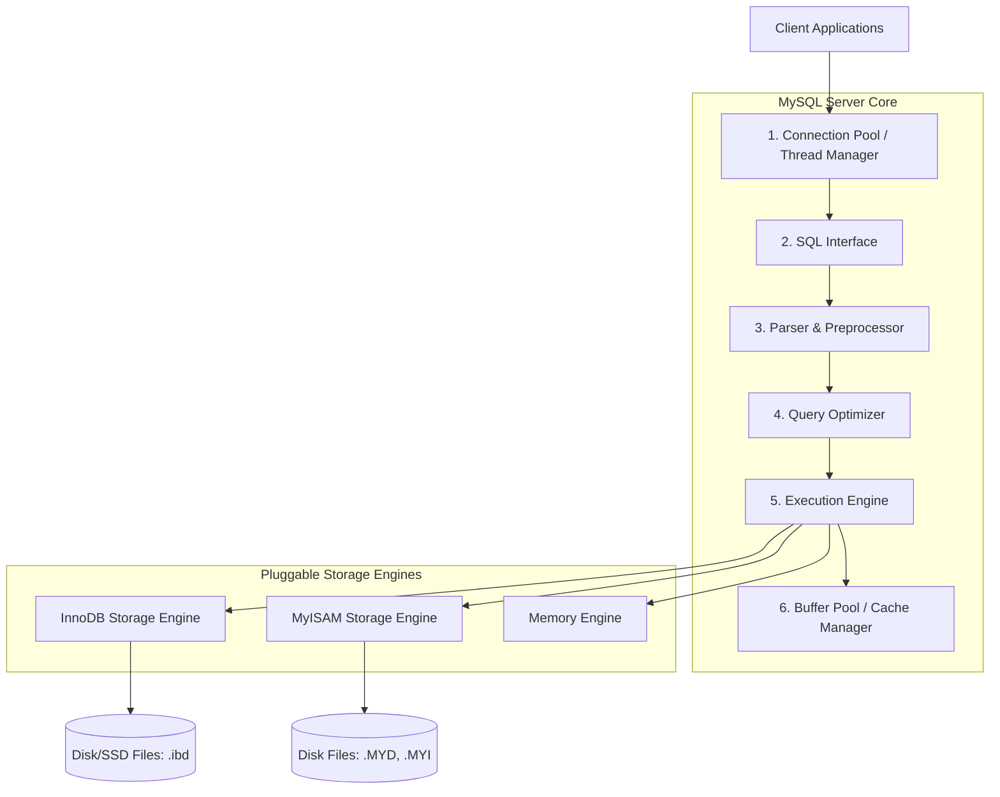
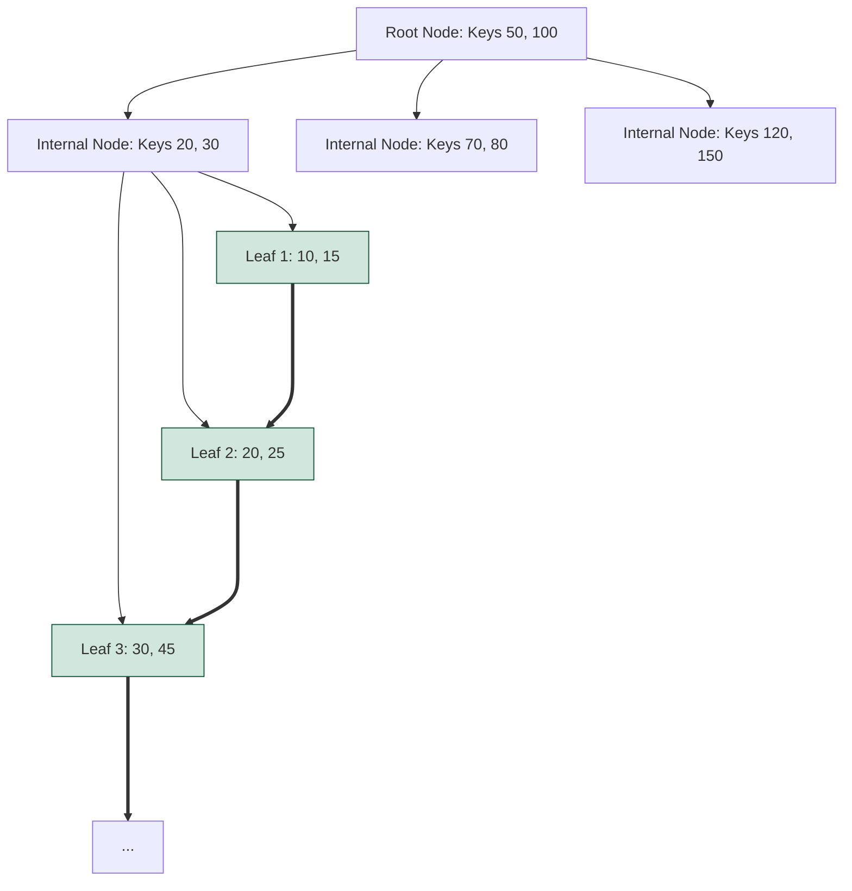

# Relational Database Systems (RDBMS): MySQL & InnoDB Internals

This guide provides an engineering-level deep dive into relational databases, specifically focusing on MySQL and its default storage engine, InnoDB. It is designed to prepare senior engineers for database architecture, query optimization, and transaction concurrency questions.

---

## 1. Directory Structure

You can find specialized SQL topics in this folder:
*   [01 Basics & Architecture](file:///Users/yogeshwarpatel/Workspace/interview/database/sql/01_Basics_and_Architecture.md)
*   [02 Indexing & B-Trees](file:///Users/yogeshwarpatel/Workspace/interview/database/sql/02_Indexing_and_B_Trees.md)
*   [03 Transactions & Concurrency Control](file:///Users/yogeshwarpatel/Workspace/interview/database/sql/03_Transactions_and_Isolation.md)
*   [04 Joins & Queries](file:///Users/yogeshwarpatel/Workspace/interview/database/sql/04_Joins_and_Queries.md)
*   [05 Advanced SQL & Window Functions](file:///Users/yogeshwarpatel/Workspace/interview/database/sql/05_Advanced_SQL_and_Window_Functions.md)
*   [06 Scaling & Performance Tuning](file:///Users/yogeshwarpatel/Workspace/interview/database/sql/06_Scaling_and_Optimization.md)
*   [07 Famous SQL Query Interview Problems](file:///Users/yogeshwarpatel/Workspace/interview/database/sql/07_Famous_SQL_Queries.md)

---

## 2. MySQL Architecture Overview

MySQL employs a client-server architecture with a clear separation between the connection management/SQL parsing layer and the actual physical storage engine layer.



### Key Architectural Layers:
1.  **Connection Pool / Thread Manager**: Manages incoming client connections. Each connection gets its own dedicated OS thread (or a pooled thread). Authenticates users and manages TLS/SSL.
2.  **SQL Interface**: Receives SQL commands (DML, DDL) and returns result sets to the client.
3.  **Parser & Preprocessor**:
    *   *Parser*: Validates SQL syntax, tokenizes the query, and builds a parse tree.
    *   *Preprocessor*: Resolves table names, columns, checks permissions, and verifies semantic correctness.
4.  **Query Optimizer**: Determines the most efficient way to execute the query. It evaluates multiple execution paths (e.g., choice of indexes, join order) using a Cost-Based Optimizer (CBO) and generates the execution plan.
5.  **Execution Engine**: Executes the plan by calling the storage engine APIs via standard interfaces.
6.  **Pluggable Storage Engines**: Responsible for writing data to and reading data from physical disk. MySQL is unique because you can mix and match storage engines per table.

---

## 3. Storage Engines: InnoDB vs. MyISAM

InnoDB is the default, general-purpose transactional storage engine for MySQL since version 5.5.

| Feature | InnoDB | MyISAM |
| :--- | :--- | :--- |
| **Transaction Support** | Yes (ACID compliant) | No (No commit/rollback) |
| **Locking Granularity** | Row-level locking (and gap locks) | Table-level locking only |
| **Foreign Keys** | Yes (Enforces constraints) | No |
| **Index Structure** | Clustered Index (Primary Key contains data) | Heap-based (Indexes point to physical addresses) |
| **Crash Recovery** | Yes (via Redo Logs and Doublewrite Buffer) | No (prone to index corruption on power failure) |
| **Storage Layout** | Tablespace (`.ibd` files) or Shared Tablespace | Separate data (`.MYD`) and index (`.MYI`) files |
| **Full-text Search** | Yes (Since 5.6) | Yes |

### InnoDB Crash Recovery Mechanism:
InnoDB achieves **Durability** via the **Redo Log** (Write-Ahead Logging - WAL). Every modification is written to the in-memory log buffer and flushed to the on-disk Redo Log (`ib_logfile0/1`) before the actual data page is updated in the buffer pool and written to the database files.
*   **Doublewrite Buffer**: To prevent data corruption caused by partial page writes (e.g., OS crash midway through writing a 16KB InnoDB page to an 8KB OS block), InnoDB first writes pages to a contiguous area of disk called the doublewrite buffer before writing them to the actual tablespace. If a crash occurs, InnoDB restores the page from the doublewrite buffer before applying redo logs.
*   **The Purge Thread**: In InnoDB, when a row is modified or deleted, the old version is not immediately overwritten or removed from the data files. Instead, it is marked with a "delete-mark" bit to support concurrent reads via MVCC. Once no active transactions need the old versions stored in the Undo Log, the background **Purge Thread** permanently reclaims the space and deletes the outdated records.

---

## 4. Deep Dive on MySQL Indexing

### A. Why B+Trees?
MySQL InnoDB uses **B+Tree** structures for its indexes. 



#### Comparison of Data Structures for Indexing:
1.  **B+Tree vs. B-Tree**:
    *   In a **B-Tree**, both keys and data (or row pointers) are stored in internal and leaf nodes. This reduces the number of keys that can fit in an internal node, lowering the fan-out and increasing the tree height (requiring more disk I/Os).
    *   In a **B+Tree**, internal nodes *only* store keys and child pointers, maximizing fan-out. All data is stored in the leaf nodes.
    *   Furthermore, B+Tree leaf nodes are linked sequentially (a doubly-linked list), enabling $O(1)$ traversal for range queries (`WHERE age >= 18`). B-Trees require complex in-order tree traversals to fetch ranges.
2.  **B+Tree vs. Hash Index**:
    *   Hash indexes are fast ($O(1)$) but *only* support exact matches (`=`).
    *   They cannot handle range scans, partial prefix matching (e.g., `LIKE 'abc%'`), or sorting (`ORDER BY`).
3.  **B+Tree vs. Binary Search Trees (BST/AVL/Red-Black)**:
    *   Binary trees have a fan-out of 2, making them very tall for millions of records. Each node traversal corresponds to a random disk I/O, which is extremely slow. B+Trees typically have a fan-out of hundreds, keeping the height of the tree at 3 or 4 even for billions of rows.

### B. Clustered vs. Secondary Indexes
*   **Clustered Index**: The index structure where the physical rows are stored in the leaf nodes. InnoDB organizes tables based on the primary key (Index-Organized Tables). There is exactly one clustered index per table. If no primary key is defined, InnoDB chooses the first `UNIQUE` index with non-nullable columns, or generates a hidden 6-byte row ID (`rowid`).
*   **Secondary (Non-Clustered) Index**: Any index other than the clustered index. The leaf node of a secondary index does *not* contain the actual row data; instead, it contains the primary key values of the matching row.

#### The Secondary Lookup Penalty:
When querying using a secondary index, the database engine traverses the secondary B+Tree to find the primary key, and then traverses the Clustered B+Tree to retrieve the actual row. This is called a **Bookmark Lookup** or **Key Lookup**.

```mermaid
sequenceDiagram
    autonumber
    Query ->> Secondary Index B+Tree: Search for 'Name = Bob'
    Secondary Index B+Tree -->> Query: Returns Primary Key (ID = 42)
    Query ->> Clustered Index B+Tree: Search for 'ID = 42'
    Clustered Index B+Tree -->> Query: Returns full row data (ID: 42, Name: Bob, Age: 30)
```

**Optimization - Covering Index**: If the query only selects columns that are fully contained in the secondary index, InnoDB returns the values directly from the secondary index leaf node, skipping the lookup on the clustered index.
*   *Example*: Index on `(email, status)`. Query: `SELECT status FROM users WHERE email = 'test@test.com'`.

### C. Advanced Indexing Concepts
*   **Prefix Indexing**: Indexing only the beginning of a long string column. This reduces index space drastically. E.g., `CREATE INDEX idx_email ON users (email(10));` only indexes the first 10 characters of the email.
    *   *Trade-off*: Cannot be used as a covering index because the index does not hold the full string.
*   **Functional Indexing** (Added in MySQL 8.0): Allows indexing values that are results of expressions or functions rather than raw column values.
    *   *Example*: `CREATE INDEX idx_lower_username ON users ((LOWER(username)));` speeds up queries containing `WHERE LOWER(username) = 'john'`.
*   **Invisible Indexes**: Allows toggling index visibility to the optimizer (`ALTER TABLE t ALTER INDEX idx INVISIBLE;`). Enables testing if dropping an index will hurt query performance without undergoing the expensive drop-and-recreate lifecycle.

---

## 5. Transactions & Concurrency: InnoDB Internals

### A. MVCC (Multi-Version Concurrency Control)
InnoDB implements MVCC to allow lock-free reads while write operations are running, achieving high concurrency.

#### InnoDB Row Structure:
Every clustered index record contains hidden system columns:
*   `DB_TRX_ID` (6 bytes): The transaction ID of the last transaction that inserted or updated the row.
*   `DB_ROLL_PTR` (7 bytes): The roll pointer pointing to the undo log record containing the previous version of the row.

```mermaid
graph LR
    subgraph Active Clustered Index Record
        Row[ID: 1 | Name: 'Charlie' | DB_TRX_ID: 105 | DB_ROLL_PTR: 0x8a92]
     rowid
    end
    subgraph Undo Tablespace
        Undo1[Undo Log Record 1<br>Name: 'Bob'<br>DB_TRX_ID: 102<br>DB_ROLL_PTR: 0x5b31]
        Undo2[Undo Log Record 2<br>Name: 'Alice'<br>DB_TRX_ID: 98<br>DB_ROLL_PTR: NULL]
    end
    Row -->|points to| Undo1
    Undo1 -->|points to| Undo2
```

#### Read View and Isolation Levels:
When a transaction starts under MVCC, InnoDB constructs a **Read View** structure, containing:
*   `low_limit_id`: The transaction ID that is greater than or equal to any transaction ID that has not yet started. Any transaction with ID $\ge$ `low_limit_id` is invisible.
*   `up_limit_id`: The smallest active transaction ID. Any transaction with ID $<$ `up_limit_id` is visible.
*   `descriptors/trx_ids`: The list of active transaction IDs when the Read View was created.

**How levels behave:**
*   **READ COMMITTED (RC)**: A new Read View is created **at the beginning of each SQL statement**. This allows dirty reads to be avoided, but subsequent reads in the same transaction can see changes committed by other transactions (Non-Repeatable Reads).
*   **REPEATABLE READ (RR)**: The Read View is created **once, at the beginning of the transaction**, and reused for all subsequent reads. This guarantees that the transaction reads a consistent snapshot of data, preventing Non-Repeatable Reads.

---

### B. InnoDB Locking Mechanics

InnoDB supports fine-grained row-level locking. To prevent phantom reads, it uses key-range locking.

1.  **Shared (S) and Exclusive (X) Locks**:
    *   `S-Lock`: Allows concurrent reads. Multiple transactions can hold S-locks.
    *   `X-Lock`: Exclusive write lock. Blocks all other locks.
2.  **Intention Locks (IS, IX)**:
    *   Table-level locks that indicate a transaction intends to acquire row-level locks.
    *   Before acquiring an S-lock on a row, a transaction must acquire an `IS` lock on the table.
    *   Before acquiring an X-lock on a row, a transaction must acquire an `IX` lock on the table.
    *   *Purpose*: Allows MySQL to quickly determine if a table lock (`LOCK TABLES ... WRITE`) can be acquired without checking every single row in the table.
3.  **Record Locks**:
    *   Locks the actual index record. E.g., `SELECT * FROM t WHERE id = 10 FOR UPDATE;` locks index record 10.
4.  **Gap Locks**:
    *   Locks the space (gap) *between* index records, or the gap before the first or after the last index record.
    *   *Purpose*: Prevents other transactions from inserting new rows into the gap, preventing Phantom Reads.
5.  **Next-Key Locks**:
    *   A combination of a Record Lock on the index record and a Gap Lock on the gap preceding the index record.
    *   InnoDB uses Next-Key locks for searches and index scans under the default **Repeatable Read** isolation level to fully solve the Phantom Read anomaly.

---

## 6. InnoDB Page & Storage Internals

An InnoDB tablespace is divided into a hierarchical structure that maps logical structures to physical storage blocks.

```
[Tablespace (.ibd file)] 
   └── [Segments (Data / Index Segments)]
          └── [Extents (1MB chunks = 64 contiguous pages)]
                 └── [Pages (16KB primary unit of disk I/O)]
```

### Anatomy of an InnoDB Page (16KB):
1.  **File Header (38 bytes)**: Contains the page checksum, page LSN (Log Sequence Number), and pointers to the previous and next pages (allowing pages to form a doubly linked list).
2.  **Page Header (56 bytes)**: Stores metadata about the page (e.g., number of directory slots, heap top pointer).
3.  **Infimum and Supremum Records (26 bytes)**: Pseudo-records defining the minimum and maximum boundaries of user records in this page.
4.  **User Records**: The actual data rows. Represented as a singly-linked list ordered by the primary key.
5.  **Free Space**: Unallocated space on the page.
6.  **Page Directory**: Contains pointers (slots) to every 4th to 8th record on the page.
    *   *Why?* It allows the database engine to perform a **binary search** to find a record inside a specific page, rather than traversing the linked list from the beginning of the page.
7.  **File Trailer (8 bytes)**: Contains the checksum to detect partial page writes (corruption).

---

## 7. Advanced Concurrency: Transaction Anomalies

Isolation levels are defined by which concurrency anomalies they prevent. Beyond the standard three (Dirty Read, Non-Repeatable Read, Phantom Read), senior engineers must understand:

1.  **Dirty Write**:
    *   *Scenario*: Transaction A updates a row. Transaction B updates the same row before Transaction A commits. If A or B rolls back, the state is corrupted.
    *   *Prevention*: All commercial databases (including Read Uncommitted) prevent Dirty Writes by holding exclusive write locks until the transaction commits or rolls back.
2.  **Write Skew (Snapshot Isolation Anomaly)**:
    *   *Scenario*: Suppose a system requires that the sum of balances of Account A and Account B must be positive. Under Snapshot Isolation (used in many MVCC databases):
        *   Tx 1 reads Balance A ($100) and Balance B ($0). It updates Balance A to -$50 (satisfies $A + B = 50 > 0$).
        *   Tx 2 (concurrently) reads Balance A ($100) and Balance B ($0). It updates Balance B to -$50 (satisfies $A + B = 50 > 0$).
        *   Both commit. The final balance sum is -$100, violating the constraint.
    *   *Prevention*: Requires the `SERIALIZABLE` isolation level, or manual locking (`SELECT ... FOR UPDATE` to block concurrent updates).

---

## 8. Query Optimization: Join Algorithms in MySQL 8.0

When executing queries combining multiple tables, MySQL chooses between the following join execution strategies:

1.  **Simple Nested Loop Join (NLJ)**:
    *   Reads a row from the outer table, loops through the inner table, and finds matches. Very slow if the inner table has no index on the join key.
2.  **Block Nested Loop Join (BNL)**:
    *   Caches rows from the outer table into an in-memory join buffer, then performs a scan on the inner table to find matches for all buffered rows in one pass.
3.  **Hash Join** (Default replacement for BNL in MySQL 8.0):
    *   Used when joining tables without indexes on the join columns.
    *   **Build Phase**: MySQL reads all rows from the smaller table and constructs a hash table in memory using the join key as the hash.
    *   **Probe Phase**: MySQL reads rows from the larger table, hashes their join keys, and checks for matches in the in-memory hash table.
    *   *Advantage*: Extremely fast compared to BNL, transforming $O(N \times M)$ complexity to $O(N + M)$ under optimal memory configurations.

---

## 9. Crucial MySQL Interview Questions & In-Depth Answers

### Q1: How does InnoDB prevent Phantom Reads under the Repeatable Read isolation level?
**Answer:**
According to the SQL standard, the Repeatable Read isolation level only guarantees that read rows do not change (preventing Non-Repeatable Reads), but does not prevent new matching rows from appearing (Phantom Reads).
MySQL InnoDB **fully prevents** Phantom Reads in Repeatable Read using a two-pronged approach:
1.  **Consistent Non-locking Reads (MVCC)**: For regular `SELECT` statements, InnoDB uses MVCC. The transaction reads from a snapshot created when the transaction started. Even if other transactions insert new rows and commit, they do not appear in the snapshot because their transaction IDs are higher than the active range of the transaction's Read View.
2.  **Locking Reads (Next-Key Locks)**: For locking reads (`SELECT ... FOR UPDATE`, `SELECT ... SHARE`, `UPDATE`, `DELETE`), MVCC is not used; instead, current data is read directly. To prevent phantom insertions, InnoDB uses **Next-Key Locks**. When scanning an index range, it locks both the matching index records and the gaps between them. This blocks other transactions from inserting new data into those ranges until the locking transaction commits.

---

### Q2: What is the InnoDB Buffer Pool? How is it managed, and how do you tune it?
**Answer:**
The **Buffer Pool** is a large memory area where InnoDB caches table data and index pages as they are accessed. It drastically reduces disk I/O.
*   **Management (Modified LRU)**: InnoDB uses a modified Least Recently Used (LRU) algorithm to manage the buffer pool. Instead of putting a new page at the very front of the LRU list, it places it in the "sub-list of old blocks" (usually at the 3/8ths mark from the tail). If the page is accessed again within a certain time threshold, it is promoted to the "young sub-list" (head of the list). This prevents "buffer pool pollution" from full table scans (where pages are read once and never accessed again, which would otherwise eject hot pages).
*   **Tuning**:
    *   `innodb_buffer_pool_size`: The most critical setting. On dedicated database servers, this is typically set to **70% to 80% of physical RAM**.
    *   `innodb_buffer_pool_instances`: Divides the buffer pool into multiple independent regions. This reduces thread contention on the buffer pool locks in highly concurrent environments. Typically set to one instance per 1GB-4GB of pool size.

---

### Q3: What is the difference between `EXPLAIN` and `EXPLAIN ANALYZE` in MySQL? How do you read their outputs?
**Answer:**
*   **`EXPLAIN`**: Provides the query execution plan generated by the optimizer without running the query. It is static and based on optimizer statistics.
*   **`EXPLAIN ANALYZE`** (Introduced in MySQL 8.0): Actually executes the query, records runtime statistics (real cost, actual row counts, execution time for each step), and prints them alongside the plan.

#### Crucial `EXPLAIN` Columns:
1.  **`type` (Access Type)**: Shows how MySQL joins tables or scans rows. Ordered from best to worst:
    *   `system`/`const`: Table has at most one matching row (e.g., primary key lookup).
    *   `eq_ref`: One row is read from this table for each combination of rows from the previous table (e.g., primary key join).
    *   `ref`: Non-unique index lookup.
    *   `range`: Index range scan (e.g., using `>`, `<`, `BETWEEN`, `IN`).
    *   `index`: Full index scan (MySQL reads the entire index tree instead of the data table).
    *   `ALL`: Full table scan (Worst).
2.  **`key`**: The actual index selected by the optimizer. If NULL, no index is used.
3.  **`rows`**: An estimate of the number of rows MySQL must examine.
4.  **`Extra`**: Crucial execution details:
    *   `Using index`: The query is covered by the index (covering index), no bookmark lookup needed.
    *   `Using index condition`: Index Condition Pushdown (ICP) is used. The database pushes the filtering of index columns down to the storage engine before fetching rows.
    *   `Using filesort`: MySQL must perform an extra pass to sort the data (bad; indicates missing index on the `ORDER BY` columns).
    *   `Using temporary`: MySQL must create a temporary table to hold the results (very bad; common in inefficient `GROUP BY` or `DISTINCT` queries).

---

### Q4: Explain GTID replication in MySQL and how it differs from classic Binlog Position replication.
**Answer:**
*   **Classic replication** uses the binary log file name and the specific byte offset position (e.g., file: `mysql-bin.000003`, position: `408`) to track where a slave is relative to the master.
    *   *Issue*: If the master crashes and you failover to a slave, promoting it to master, pointing other slaves to this new master is extremely difficult because binlog positions do not align across different servers.
*   **GTID (Global Transaction Identifier) replication** assigns a globally unique identifier to every transaction committed on a master (format: `source_id:transaction_id`, where source_id is the server's `server_uuid`).
    *   *Advantages*:
        1.  **Seamless Failover**: Slaves simply ask the master for transaction logs, and the database engine automatically maps what transactions are missing based on GTIDs. No manual binlog offset alignment needed.
        2.  **Tracking**: Easy to audit and trace the exact source server where a transaction originated in multi-tier topologies.

---

### Q5: What is the Doublewrite Buffer, and why is it needed in InnoDB?
**Answer:**
Operating systems write data to disk in units of blocks (typically 4KB), while InnoDB writes to disk in pages of 16KB.
*   If a server crashes while InnoDB is writing a 16KB page, only a portion of the page (e.g., 8KB) might be written to disk. This is a **partial page write** or **torn page**.
*   A torn page cannot be recovered using Redo Logs alone because the checksums will mismatch, and the physical page on disk is in a corrupt state.
*   **Doublewrite Buffer solution**: Before writing a page to its data files, InnoDB writes the page first to a contiguous disk block known as the Doublewrite Buffer.
    *   If a crash occurs during a write, InnoDB looks at the Doublewrite Buffer.
    *   If a page in the Doublewrite Buffer is healthy, InnoDB copies it from there to overwrite the corrupt page on disk.
    *   Then, InnoDB applies Redo Logs to bring the page fully up-to-date.
    *   Because writing to the contiguous doublewrite buffer is sequential, the disk write performance penalty is negligible.
