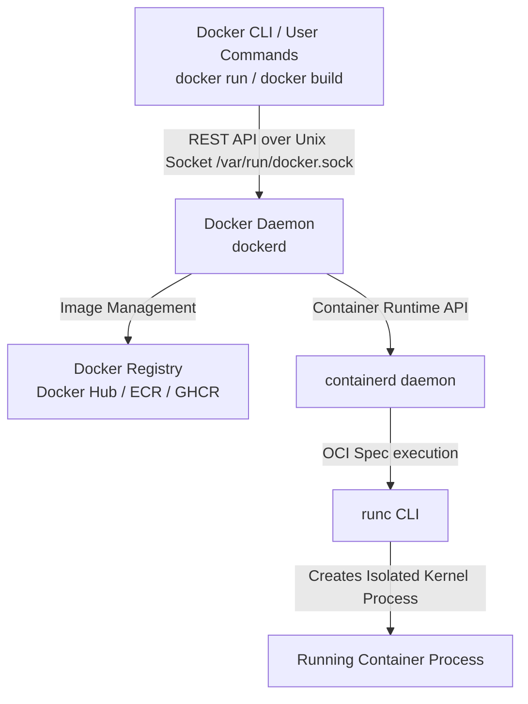

# 01. Docker Basics & Architecture

This guide breaks down Docker architecture, Linux kernel isolation primitives, storage drivers, container lifecycles, and core CLI workflows.

---

## 1. Containers vs Virtual Machines (VMs)

| Feature | Virtual Machines (VMs) | Docker Containers |
| :--- | :--- | :--- |
| **Virtualization Level** | Hardware-level (Hypervisor like ESXi, KVM) | OS-level (Shared Host Linux Kernel) |
| **Guest OS Required** | Yes (Full OS per VM, ~GBs of disk/RAM overhead) | No (Shares host OS kernel, ~MBs overhead) |
| **Boot Time** | Minutes (boots full operating system) | Milliseconds to seconds (launches process) |
| **Performance** | Near-native with hypervisor overhead | Native bare-metal execution speed |
| **Isolation** | Strong (Hardware boundary) | Strong process boundary (Namespaces & Cgroups) |

```
    VIRTUAL MACHINES                           DOCKER CONTAINERS
+------------------------+                +------------------------+
| App A   | App B        |                | App A   | App B        |
| Libs    | Libs         |                | Libs    | Libs         |
| Guest OS| Guest OS     |                +---------+--------------+
+---------+--------------+                |     Docker Engine      |
|      Hypervisor        |                +------------------------+
+------------------------+                |     Host OS Kernel     |
|   Physical Hardware    |                +------------------------+
+------------------------+                |   Physical Hardware    |
                                          +------------------------+
```

---

## 2. Docker Engine Architecture

Docker follows a **Client-Server Architecture**:



### Key Components:
1. **Docker CLI (`docker`)**: The command-line client used to send commands to the daemon.
2. **Docker Daemon (`dockerd`)**: Persistent background process managing images, containers, networks, and volumes.
3. **containerd**: Industry-standard container runtime handling image transfer, container execution, and storage supervision.
4. **runc**: Lightweight OCI-compliant CLI tool that directly invokes Linux kernel syscalls to spawn containers.
5. **Registry**: Repository storing container images (e.g., Docker Hub, AWS ECR).

---

## 3. Linux Kernel Isolation Primitives

Containers are **NOT** virtual machines; they are ordinary Linux processes isolated by two Linux kernel features:

### A. Linux Namespaces (What the process can SEE)
Namespaces partition system resources so that a process sees a dedicated environment:
- **PID Namespace**: Provides process isolation. Container PID 1 is isolated from host PIDs.
- **NET Namespace**: Provides isolated network interfaces, IP addresses, and routing tables.
- **MNT (Mount) Namespace**: Provides an isolated filesystem root directory structure (`/`).
- **IPC Namespace**: Isolates Inter-Process Communication (shared memory, message queues).
- **UTS Namespace**: Isolates hostnames and domain names.
- **USER Namespace**: Maps container root user (UID 0) to an unprivileged host UID.

### B. Control Groups / cgroups (What the process can USE)
cgroups meter, limit, and isolate resource usage for a group of processes:
- **Memory**: Prevents a container from consuming all host RAM (`-m 512m`).
- **CPU**: Restricts CPU share allocation (`--cpus 2.0`).
- **Block I/O**: Limits read/write throughput to disks.

---

## 4. Storage Architecture & Copy-on-Write (CoW)

Docker uses a **Union File System (UnionFS)**—primarily the **`overlay2`** storage driver:

```
+-------------------------------------------------------+
| Container Writable Layer (Read/Write - Lost on rm)   |
+-------------------------------------------------------+
| Image Layer 4: Application Code (Read-Only)          |
| Image Layer 3: Spring Boot Loader (Read-Only)         |
| Image Layer 2: Dependencies (Read-Only)               |
| Image Layer 1: Base JRE Alpine (Read-Only)           |
+-------------------------------------------------------+
```

### How Overlay2 Works:
1. **Image Layers (Read-Only)**: Every `RUN`, `COPY`, `ADD` instruction in a Dockerfile creates an immutable read-only layer.
2. **Container Layer (Read/Write)**: When a container starts, Docker adds a thin, writable layer on top.
3. **Copy-on-Write (CoW)**: When a process inside a container modifies an image file, Overlay2 copies the file up to the container writable layer first, leaving the underlying image layer untouched.

> 🔗 **Code Reference**: See how our [springboot/Dockerfile](file:///Users/yogeshwarpatel/Workspace/interview/springboot/Dockerfile#L31-L34) leverages layer caching by splitting Java dependencies from source code!

---

## 5. Essential Docker Commands for Daily Use

### A. Image Management
```bash
# Pull an image from Docker Hub
docker pull eclipse-temurin:25-jre-alpine

# List locally cached images
docker images

# Build an image with a tag
docker build -t springboot-app:1.0 -f springboot/Dockerfile springboot/

# Remove an unused image
docker rmi springboot-app:1.0
```

### B. Container Lifecycle
```bash
# Run a container detached in background with port mapping & env variables
docker run -d --name my-app -p 8080:8080 -e SPRING_PROFILES_ACTIVE=prod springboot-app:1.0

# List running containers
docker ps

# List all containers (including stopped)
docker ps -a

# Stop a running container (sends SIGTERM, waits 10s, then SIGKILL)
docker stop my-app

# Force kill a container immediately (sends SIGKILL)
docker kill my-app

# Remove a container
docker rm my-app

# Execute an interactive shell inside a running container
docker exec -it my-app /bin/sh
```

### C. Inspection & Clean Up
```bash
# View container logs (follow stream)
docker logs -f --tail 100 my-app

# Inspect low-level details (IP, mounts, env vars, health status)
docker inspect my-app

# Check resource consumption (CPU, RAM, Net I/O)
docker stats my-app

# Clean up all stopped containers, unused networks, and dangling images
docker system prune -f
```

---

## 🎯 Senior Engineer Interview Q&A

### Q1: What actually happens under the hood when you execute `docker run`?
**Answer:**
1. The **Docker CLI** translates the command into an HTTP REST payload and sends it to `dockerd` over `/var/run/docker.sock`.
2. `dockerd` checks if the image exists locally. If missing, it fetches the image layers from the Registry via `containerd`.
3. `dockerd` passes the container configuration (spec) to `containerd`.
4. `containerd` calls `runc` to create the container.
5. `runc` executes Linux kernel syscalls (`clone()`, `unshare()`) to set up **Namespaces** (PID, NET, MNT) and **cgroups** for resource limits.
6. `runc` mounts the `overlay2` root filesystem and executes the container `ENTRYPOINT` process as PID 1 inside the isolated namespace.

---

### Q2: Are containers completely secure from each other by default?
**Answer:**
No. Containers share the host kernel. If a process inside a container running as `root` exploits a kernel vulnerability (e.g., Dirty COW), it can escape container boundaries.  
**Best Practices**:
1. Run container processes under non-root users (`USER spring:spring` as seen in [springboot/Dockerfile](file:///Users/yogeshwarpatel/Workspace/interview/springboot/Dockerfile#L26)).
2. Drop unused Linux capabilities (`cap_drop: [ALL]`).
3. Enable User Namespaces (`userns-remap`) so container root maps to an unprivileged host UID.
