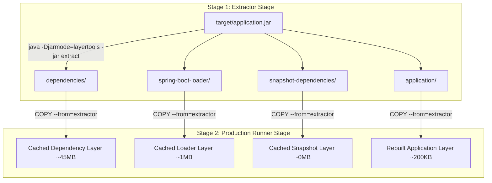

# 04. Dockerfile Engineering & Deep Dive

This guide covers Dockerfile instruction mechanics, layer caching optimization, Exec vs Shell forms, multi-stage builds, and security hardening.

---

## 1. Dockerfile Instruction Reference

| Instruction | Purpose | Senior Best Practice |
| :--- | :--- | :--- |
| `FROM` | Sets base image for subsequent instructions | Use minimal, official images (e.g., `eclipse-temurin:25-jre-alpine` or `distroless`) |
| `WORKDIR` | Sets absolute working directory for instructions | Always set `WORKDIR /application` explicitly instead of polluting root `/` |
| `COPY` | Copies files/directories from host to container | **Preferred over `ADD`**. Use `--from=stage` in multi-stage builds |
| `ADD` | Copies files OR auto-extracts remote URLs/tars | Avoid for simple file copies (can introduce security risks with remote URLs) |
| `RUN` | Executes build commands in a new image layer | Chain commands with `&&` to minimize layer creation (`apt-get update && apt-get install ...`) |
| `ARG` | Defines build-time variables (not available in running container) | Use for passing JAR paths or versions (`ARG JAR_FILE=target/*.jar`) |
| `ENV` | Sets persistent runtime environment variables | Use for container configurations (`ENV SPRING_PROFILES_ACTIVE=prod`) |
| `EXPOSE` | Documents container listening ports | Documentation only; does not publish ports on host machine |
| `USER` | Sets execution UID/GID for subsequent commands | **Critical for Security**. Always run containers as non-root users (`USER spring:spring`) |
| `ENTRYPOINT` | Configures container default executable process | **Always use Exec Form** `["java", "JarLauncher"]` to ensure signal forwarding |
| `CMD` | Supplies default arguments to `ENTRYPOINT` | Can be overridden by user CLI arguments during `docker run` |

---

## 2. Exec Form vs Shell Form (The PID 1 Trap)

Every command instruction (`RUN`, `CMD`, `ENTRYPOINT`) can be written in two syntaxes:

### A. Shell Form: `ENTRYPOINT java -jar application.jar`
- Docker executes `/bin/sh -c "java -jar application.jar"`.
- `/bin/sh` runs as **PID 1** inside the container namespace.
- **DANGER**: POSIX shells do **NOT** forward `SIGTERM` signals to child processes! When Docker stops the container, Java never receives `SIGTERM`, graceful shutdown fails, and Docker forcefully kills the app with `SIGKILL` after 10 seconds.

### B. Exec Form: `ENTRYPOINT ["java", "org.springframework.boot.loader.launch.JarLauncher"]`
- Docker executes `java` directly as **PID 1**.
- Signals (`SIGTERM`, `SIGINT`) reach the JVM immediately.
- Spring Boot executes its graceful shutdown hooks, finishes active requests, and exits cleanly.

---

## 3. Spring Boot Layered JARs (`layertools`) Optimization

Traditional Dockerfiles copy a single monolithic fat JAR (~50MB). Every minor Java code change invalidates the entire Docker cache layer:

```
BAD PRACTICE (Single Fat JAR Layer):
[ Base JRE Layer (150MB) ] -> [ Monolithic Application Fat JAR (50MB - Invalidated every build!) ]
```

### The Senior Engineer Solution: Multi-Stage Build + `layertools`



Because dependencies change rarely, Docker serves Layer 1, 2, and 3 directly from its local layer cache. Rebuilding after a code change only rebuilds Layer 4 (~200KB), reducing build times from minutes to sub-seconds!

---

## 4. Complete Code Walkthrough: `springboot/Dockerfile`

Here is our production [springboot/Dockerfile](file:///Users/yogeshwarpatel/Workspace/interview/springboot/Dockerfile):

```dockerfile
# ==============================================================================
# Stage 1: Extraction Stage (Decompose JAR into layers)
# ==============================================================================
FROM eclipse-temurin:25-jre-alpine AS extractor
WORKDIR /application

ARG JAR_FILE=target/*.jar
COPY ${JAR_FILE} application.jar

# Extract the JAR using Spring Boot layertools
RUN java -Djarmode=layertools -jar application.jar extract

# ==============================================================================
# Stage 2: Production Runner Stage (Minimal runtime image)
# ==============================================================================
FROM eclipse-temurin:25-jre-alpine
WORKDIR /application

# Create unprivileged non-root user and group
RUN addgroup -S spring && adduser -S spring -G spring
USER spring:spring

# Copy each layer individually to maximize Docker layer caching
COPY --from=extractor /application/dependencies/ ./
COPY --from=extractor /application/spring-boot-loader/ ./
COPY --from=extractor /application/snapshot-dependencies/ ./
COPY --from=extractor /application/application/ ./

EXPOSE 8080

ENV SPRING_PROFILES_ACTIVE=prod
ENV JAVA_TOOL_OPTIONS="-XX:+UseG1GC -XX:+UseStringDeduplication"

# Exec Form ENTRYPOINT for clean PID 1 signal forwarding
ENTRYPOINT ["java", "org.springframework.boot.loader.launch.JarLauncher"]
```

> 🔗 **Code Reference**: Inspect [springboot/Dockerfile](file:///Users/yogeshwarpatel/Workspace/interview/springboot/Dockerfile#L1-L45).

---

## 🎯 Senior Engineer Interview Q&A

### Q1: What is the difference between `ARG` and `ENV` in a Dockerfile?
**Answer:**
- **`ARG` (Build-time Variable)**: Available only during the image build process (`docker build --build-arg VERSION=1.0`). It is NOT persisted in the final container image or accessible when the container runs.
- **`ENV` (Runtime Environment Variable)**: Persisted in the container image metadata and available to running application processes. Can be overridden at runtime via `docker run -e` or Docker Compose `environment:`.

---

### Q2: Why is `.dockerignore` important for Dockerfile build performance and security?
**Answer:**
When you run `docker build`, Docker CLI sends the entire build context (current directory files) to the Docker daemon over the Unix socket.  
Without a `.dockerignore` file:
1. Large binary directories like `target/`, `.git/`, `node_modules/` are copied over the socket, dramatically slowing down builds.
2. Sensitive files like `.env`, local credentials, or private SSH keys might accidentally be baked into image layers.
