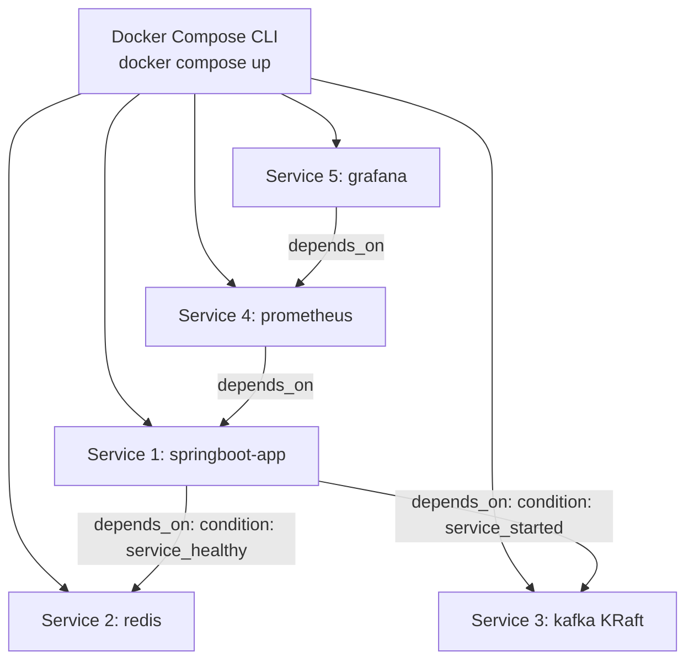

# 05. Docker Compose Orchestration & Deep Dive

This guide covers multi-container orchestration using Docker Compose, dependency ordering, healthcheck conditions, environment variable interpolation, and an architecture deep dive of our multi-service infrastructure.

---

## 1. Core Docker Compose Concepts

Docker Compose is a declarative tool for defining and running multi-container applications via a single YAML file (`docker-compose.yml`).



### Key Declarative Primitives:
1. **Services**: Abstract definition of container instances (image/build, ports, env, networks).
2. **Networks**: User-defined bridge networks connecting specific services (`app-network`).
3. **Volumes**: Persistent storage definitions shared between host and containers.
4. **Environment Interpolation**: Resolving host environment variables with fallback defaults (`${VAR:default}`).

---

## 2. Dependency Ordering: `depends_on` vs Healthchecks

A common orchestration flaw is using plain `depends_on`:

```yaml
# BAD PRACTICE: Plain depends_on
app:
  depends_on:
    - redis
```
- **Why this fails**: Plain `depends_on` only waits until the `redis` container process has **started**. It does NOT wait until Redis has initialized memory and is ready to accept connections. Spring Boot boots in 2 seconds, attempts to connect to Redis, and crashes with `ConnectionRefusedException`.

### The Senior Engineer Solution: Healthchecks + `condition: service_healthy`

```yaml
# SENIOR BEST PRACTICE (From springboot/docker-compose.yml)
services:
  app:
    depends_on:
      redis:
        condition: service_healthy

  redis:
    image: redis:7-alpine
    healthcheck:
      test: ["CMD", "redis-cli", "ping"]
      interval: 5s
      timeout: 5s
      retries: 3
```

1. Redis container starts.
2. Docker executes `redis-cli ping` every 5 seconds inside the Redis container.
3. Once Redis returns `PONG` 3 consecutive times, Docker marks `redis` status as `healthy`.
4. Only AFTER `redis` reaches `healthy` status does Docker launch the `app` container!

> 🔗 **Code Reference**: Inspect [springboot/docker-compose.yml](file:///Users/yogeshwarpatel/Workspace/interview/springboot/docker-compose.yml#L19-L39) to see healthcheck dependency conditions in action.

---

## 3. Dynamic Environment Variable Interpolation

To enable seamless switching between running locally in an IDE and running in Docker Compose:

```properties
# Inside application.properties
spring.data.redis.host=${SPRING_DATA_REDIS_HOST:localhost}
spring.kafka.bootstrap-servers=${SPRING_KAFKA_BOOTSTRAP_SERVERS:localhost:9092}
```

```yaml
# Inside docker-compose.yml
services:
  app:
    environment:
      - SPRING_DATA_REDIS_HOST=redis
      - SPRING_KAFKA_BOOTSTRAP_SERVERS=kafka:29092
```

- **In Docker Compose**: Environment variables are injected (`SPRING_DATA_REDIS_HOST=redis`), overriding defaults to target container hostnames.
- **In Local IDE**: Environment variables are unset; Spring Boot falls back gracefully to `localhost`.

> 🔗 **Code Reference**: Inspect [springboot/docker-compose.yml](file:///Users/yogeshwarpatel/Workspace/interview/springboot/docker-compose.yml#L14-L18).

---

## 4. Full 5-Service Architecture Walkthrough

Our production `docker-compose.yml` orchestrates 5 interconnected microservices:

```yaml
version: '3.8'

services:
  # 1. Spring Boot Application Container
  app:
    build:
      context: .
      dockerfile: Dockerfile
    container_name: springboot-app
    ports:
      - "8080:8080"
    environment:
      - SPRING_PROFILES_ACTIVE=prod
      - SPRING_DATA_REDIS_HOST=redis
      - SPRING_KAFKA_BOOTSTRAP_SERVERS=kafka:29092
    depends_on:
      redis:
        condition: service_healthy
      kafka:
        condition: service_started
    networks:
      - app-network

  # 2. Redis Cache Service with Healthcheck
  redis:
    image: redis:7-alpine
    container_name: redis
    ports:
      - "6379:6379"
    healthcheck:
      test: ["CMD", "redis-cli", "ping"]
      interval: 5s
      timeout: 5s
      retries: 3
    networks:
      - app-network

  # 3. Apache Kafka (KRaft Single-Node Broker)
  kafka:
    image: confluentinc/cp-kafka:7.6.0
    container_name: kafka
    ports:
      - "9092:9092"
    environment:
      KAFKA_NODE_ID: 1
      KAFKA_PROCESS_ROLES: 'broker,controller'
      KAFKA_CONTROLLER_QUORUM_VOTERS: '1@kafka:29093'
      KAFKA_LISTENERS: 'PLAINTEXT://0.0.0.0:29092,CONTROLLER://0.0.0.0:29093,PLAINTEXT_HOST://0.0.0.0:9092'
      KAFKA_ADVERTISED_LISTENERS: 'PLAINTEXT://kafka:29092,PLAINTEXT_HOST://localhost:9092'
      CLUSTER_ID: 'MkU3OEVBNTcwNTJENDM2Qk'
    networks:
      - app-network

  # 4. Prometheus Metrics Scraper
  prometheus:
    image: prom/prometheus:v2.50.1
    container_name: prometheus
    ports:
      - "9090:9090"
    volumes:
      - ./prometheus.yml:/etc/prometheus/prometheus.yml
    depends_on:
      - app
    networks:
      - app-network

  # 5. Grafana Observability Dashboards
  grafana:
    image: grafana/grafana:10.4.1
    container_name: grafana
    ports:
      - "3000:3000"
    environment:
      - GF_SECURITY_ADMIN_PASSWORD=admin
    depends_on:
      - prometheus
    networks:
      - app-network

networks:
  app-network:
    driver: bridge
```

> 🔗 **Code Reference**: Inspect complete source in [springboot/docker-compose.yml](file:///Users/yogeshwarpatel/Workspace/interview/springboot/docker-compose.yml).

---

## 5. Docker Compose CLI Cheat Sheet

```bash
# Build images and start all services detached in background
docker compose -f springboot/docker-compose.yml up --build -d

# View status and healthcheck condition of all services
docker compose -f springboot/docker-compose.yml ps

# View aggregated logs across all 5 containers (tail stream)
docker compose -f springboot/docker-compose.yml logs -f --tail 50

# View logs for a specific service only
docker compose -f springboot/docker-compose.yml logs -f app

# Stop and remove all containers, networks, and volumes
docker compose -f springboot/docker-compose.yml down -v

# Validate and render merged compose configuration
docker compose -f springboot/docker-compose.yml config
```

---

## 🎯 Senior Engineer Interview Q&A

### Q1: What happens if a container in Docker Compose crashes? How do restart policies work?
**Answer:**
Docker Compose supports explicit `restart` policies:
- `no`: Never automatically restart (default).
- `on-failure[:max-retries]`: Restart only if process exits with non-zero exit code.
- `always`: Always restart container regardless of exit status.
- `unless-stopped`: Always restart container unless explicitly stopped by user.

---

### Q2: What is the difference between `docker-compose up` vs `docker compose up`?
**Answer:**
- `docker-compose` (with hyphen): Legacy V1 tool written in Python (`compose` standalone binary). Deprecated since 2023.
- `docker compose` (with space): V2 tool rewritten natively in Go as a plugin integrated directly into the core Docker CLI (`docker compose`). Faster execution, native spec support, and standardized CLI syntax.
