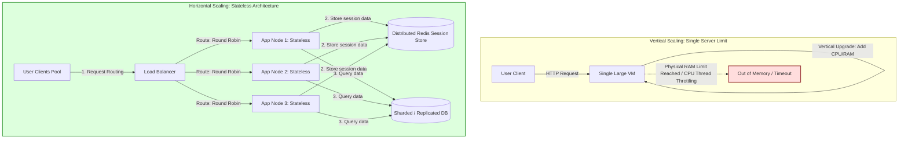
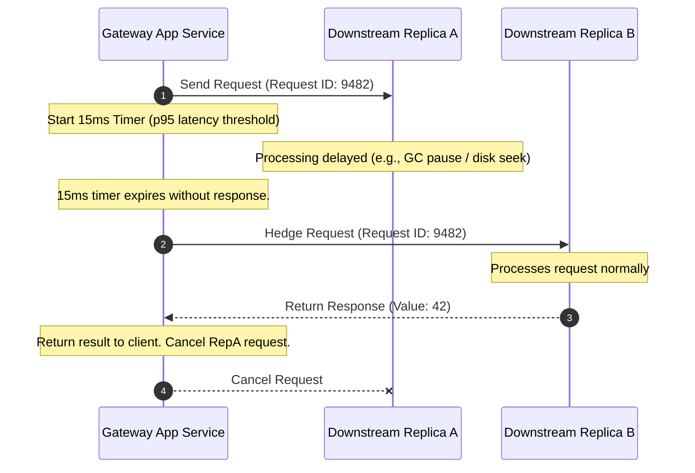

# HLD: Scalability, Latency & Throughput

This section covers the core fundamentals of systems engineering: measuring performance metrics, scaling strategies, and the mathematics of distributed request processing.

---

## 1. Core Concept & Scaling Theory

### Vertical vs. Horizontal Scaling

*   **Vertical Scaling (Scale-Up):** Adding more power (CPU, RAM, faster SSDs) to an existing server.
*   **Horizontal Scaling (Scale-Out):** Adding more server instances to the resource pool and distributing load via a Load Balancer.

#### The Scaling Bottlenecks Matrix

| Dimension | Vertical Scaling (Scale-Up) | Horizontal Scaling (Scale-Out) |
| :--- | :--- | :--- |
| **Limit Bounds** | Hard hardware limits (physical motherboard sockets, RAM bus limits). | Theoretically infinite scale. |
| **Resilience & HA** | Single Point of Failure (SPOF). If the machine dies, the application goes down. | High availability (if one node fails, others take the load). |
| **Cost Curve** | Non-linear (high-end enterprise hardware costs grow exponentially). | Linear cost model (uses cheap commodity instances). |
| **Application State** | Supports stateful applications easily (local memory). | Requires stateless design (sessions must be stored in external caches/DBs). |
| **Network Overhead** | Negligible (in-memory inter-process communication). | High (network calls, serialization, distributed locks). |

---

### Latency vs. Throughput

*   **Latency:** The duration it takes for a single request to complete its round-trip. Measured in milliseconds ($\text{ms}$) or seconds ($\text{s}$).
*   **Throughput:** The volume of requests processed successfully per unit of time. Measured in Queries Per Second (QPS) or Transactions Per Second (TPS).

#### Little's Law (System Capacity Sizing)
Little's Law defines the relationship between concurrent requests, throughput, and latency in a stable system:
$$L = \lambda \times W$$
*   Where:
    *   $L$ = Average number of concurrent requests in the system.
    *   $\lambda$ = Throughput (requests/sec).
    *   $W$ = Average response time (latency per request in seconds).

##### Example Sizing Calculation:
An application server receives $\lambda = 5,000\text{ QPS}$. The average latency is $W = 200\text{ ms}$ ($0.2\text{ seconds}$).
*   **Concurrent Requests ($L$):**
    $$L = 5,000 \times 0.2 = 1,000\text{ concurrent requests}$$
*   **Thread Pool Sizing:** If a single thread handles one request at a time, the server pool must maintain at least $1,000$ active threads across instances to prevent request queueing and timeouts.

---

### Measuring Latency: Why Averages are Deceptive

In high-scale systems, average (mean) latency is an anti-pattern for monitoring because it masks outliers.

```
Scenario: 100 users make requests. 
• 99 users experience 10ms response times.
• 1 user experiences a 5,000ms (5s) timeout due to garbage collection.

Average Latency calculation:
Avg = (99 * 10ms + 1 * 5000ms) / 100 = 59.9ms
```
The metrics dashboard shows an acceptable $59.9\text{ ms}$ response time, while $1\%$ of the user base experienced a major lag.

#### Latency Percentiles (SLA Standards)
*   **p50 (Median):** $50\%$ of requests are faster than this value.
*   **p95:** $95\%$ of requests are faster than this.
*   **p99:** $99\%$ of requests are faster than this. Standard benchmark for user experience SLA.
*   **p99.9:** $99.9\%$ of requests are faster than this. Represents extreme outliers (heavy DB disk seeks, network packets retransmission, Java Stop-the-World GC sweeps).

---

### Tail Latency Amplification (Distributed Fan-Out)

In a microservices architecture, a single user request can trigger parallel requests to multiple downstream services (fan-out). If any single service experiences a latency spike, the entire user request is delayed.

#### Mathematical Formulation
*   Let $p$ be the probability that a single downstream service call experiences a latency spike (e.g., $p = 1\% = 0.01$).
*   Let $N$ be the number of independent downstream services queried in parallel to compile the response.
*   The probability that the overall system request experiences a latency spike ($P_{\text{spike}}$) is:
    $$P_{\text{spike}} = 1 - (1 - p)^N$$

##### Examples:
*   For $N = 10$ downstream services:
    $$P_{\text{spike}} = 1 - (0.99)^{10} \approx 9.56\%$$
*   For $N = 100$ downstream services:
    $$P_{\text{spike}} = 1 - (0.99)^{100} \approx 63.4\%$$
*   For $N = 1000$ downstream services:
    $$P_{\text{spike}} = 1 - (0.99)^{1000} \approx 99.99\%$$

*Conclusion:* In a system with a large fan-out, tail latency amplification makes slow responses the norm rather than the exception unless mitigation strategies are used.

---

## 2. Visual Architecture Diagram

Below is the comparison of scaling topologies, illustrating the single point of failure in vertical scaling and the load-balanced, stateless architecture of horizontal scaling.



---

## 3. Data Models & API Signatures

### Metric Tracking Payload (JSON JSON Schema)
API signature for application servers emitting latency telemetry events to a monitoring system (e.g. Datadog agent or Prometheus push gateway).

```json
{
  "timestamp": 1780400000,
  "service_name": "checkout-service",
  "instance_id": "pod-checkout-84920",
  "request_metrics": {
    "path": "/api/v1/checkout/commit",
    "method": "POST",
    "status_code": 200,
    "latency_ms": 142.52,
    "db_query_time_ms": 84.10,
    "downstream_calls_count": 3
  },
  "tags": {
    "env": "production",
    "region": "us-west-2",
    "canary": "false"
  }
}
```

### Prometheus Metrics Format (Text-Based)
```http
# HELP http_request_duration_seconds Histogram of HTTP request latencies.
# TYPE http_request_duration_seconds histogram
http_request_duration_seconds_bucket{le="0.005",path="/api/v1/checkout/commit"} 1802
http_request_duration_seconds_bucket{le="0.01",path="/api/v1/checkout/commit"} 3209
http_request_duration_seconds_bucket{le="0.05",path="/api/v1/checkout/commit"} 15920
http_request_duration_seconds_bucket{le="0.1",path="/api/v1/checkout/commit"} 48201
http_request_duration_seconds_bucket{le="0.5",path="/api/v1/checkout/commit"} 99804
http_request_duration_seconds_bucket{le="+Inf",path="/api/v1/checkout/commit"} 100000
http_request_duration_seconds_sum{path="/api/v1/checkout/commit"} 12480.52
http_request_duration_seconds_count{path="/api/v1/checkout/commit"} 100000
```

---

## 4. Operational Flows

### Tail Latency Mitigation: Request Hedging Flow

To mitigate downstream latency spikes, high-scale services use **Request Hedging** (or Backup Requests). If a downstream service call takes longer than the p95 threshold, the system sends an identical duplicate request to another replica and processes whichever response arrives first.



1.  **First Attempt:** The gateway service sends a request to Downstream Replica A and starts a timer set to the service's p95 latency threshold (e.g., $15\text{ ms}$).
2.  **Trigger Backup:** Replica A experiences a latency spike (such as a GC pause) and does not respond within $15\text{ ms}$.
3.  **Hedged Call:** The timer expires, and the gateway sends an identical request to Downstream Replica B.
4.  **Resolve Response:** Replica B processes the request quickly and returns a response. The gateway returns the result to the client and cancels the pending request on Replica A, avoiding duplicate work.

---

## 5. High Availability, Failovers & Bottlenecks

### Mitigating the Bottlenecks of Horizontal Scaling
While horizontal scaling enables high availability, it introduces several architectural challenges:

1.  **State Management (The Shared Session Trap):**
    *   *Problem:* If application servers store user session states (like login status or shopping carts) in local memory, subsequent requests from the same user must route to the same instance. This requires sticky sessions, which degrades load balancing efficiency.
    *   *Mitigation:* Design stateless application nodes. Store session states in a centralized cache (like Redis) or encode session details inside encrypted JWT tokens on the client side.
2.  **Load Balancer Bottleneck:**
    *   *Problem:* The Load Balancer (LB) acts as the single entry point for all traffic. Under high traffic volumes, the LB can run out of bandwidth or network port allocations.
    *   *Mitigation:* Use DNS-level Anycast or GeoDNS to distribute traffic across a pool of regional Load Balancer instances.
3.  **Connection Pooling Exhaustion:**
    *   *Problem:* As application server counts scale horizontally, the number of concurrent connections to the central database increases, which can exhaust database connection pools.
    *   *Mitigation:* Use database proxies (like Vitess or PgBouncer) to multiplex and share connections across application instances.

---

## 6. Comprehensive Interview Q&A

### Q1: Detail the mathematics of tail latency amplification. In a microservices system with 50 downstream calls, how does a 1% slow-request rate at the service level affect the overall user experience?
**Answer:**
Let $p$ be the probability of a single downstream service call experiencing a latency spike ($p = 1\% = 0.01$). The probability of a successful request completing without any spikes is $1 - p = 0.99$.

If a user request queries $N = 50$ downstream services in parallel, the probability that *all* 50 calls complete without a spike is:
$$P_{\text{no\_spike}} = (1 - p)^N = 0.99^{50} \approx 0.605 \ (60.5\%)$$

The probability of at least one downstream call experiencing a latency spike ($P_{\text{spike}}$), which delays the entire user request, is:
$$P_{\text{spike}} = 1 - P_{\text{no\_spike}} = 1 - 0.605 = 0.395 \ (39.5\%)$$

*Conclusion:* Despite every individual service being healthy ($99\%$ fast request rate), approximately $40\%$ of all user requests will experience a latency spike. This highlights why tail latency mitigation is critical in microservice environments.

---

### Q2: What is "Request Hedging" (Backup Requests)? How do you implement it without overloading downstream services?
**Answer:**
**Request Hedging** is a technique where a client sends duplicate requests to alternative replicas when the initial request takes longer than a latency threshold (typically the p95 or p99 response time).

**Implementation without Overloading Downstream Services:**
If we send duplicate requests for every slow query, we can double the load on downstream services, creating a cascade of failures. To prevent this:
1.  **Set a Tight Delay Threshold:** Only send backup requests if the first query exceeds the p95 latency threshold. This limits backup requests to at most $5\%$ of total traffic.
2.  **Request Cancellation:** When a hedged request succeeds, send an asynchronous cancellation signal (e.g., using HTTP/2 `RST_STREAM` frames or gRPC context cancellations) to the other replicas to stop them from processing the request.
3.  **Client-Side Rate Limits (Token Buckets):** Configure the client to track backup request rates. If backup requests exceed a limit (e.g., $2\%$ of total traffic), disable hedging temporarily to protect the downstream services from overload.

---

### Q3: Explain Little's Law. How do you use it to calculate server capacity and size thread pools?
**Answer:**
Little's Law states that in a stable system, the average number of active requests ($L$) equals the average throughput ($\lambda$) multiplied by the average response time ($W$):
$$L = \lambda \times W$$

**Application in Thread Pool Sizing:**
Assume a microservice handles $2,000\text{ QPS}$ ($\lambda = 2000$). The average response time is $50\text{ ms}$ ($W = 0.05\text{ seconds}$).
1.  Calculate the average number of concurrent requests:
    $$L = 2000 \times 0.05 = 100\text{ concurrent requests}$$
2.  In an application server with a **thread-per-request** model (like Tomcat or Spring Boot's default configuration), the server pool must maintain at least $100$ threads to handle this load without queueing.
3.  Allowing for traffic bursts, apply a safety factor (e.g., $2\text{x}$ or $3\text{x}$) to size the thread pool to 200-300 threads to prevent request delays during surges.
4.  If response times increase to $200\text{ ms}$ due to database lag:
    $$L = 2000 \times 0.20 = 400\text{ concurrent requests}$$
    The system now requires 400 threads. If the thread pool is capped at 200, incoming requests will queue up, increasing latency and eventually causing timeouts.

---

### Q4: Why are averages misleading in monitoring dashboard graphs? How do systems calculate percentiles efficiently at scale?
**Answer:**
**Why Averages Mislead:**
Averages smooth out data anomalies. If a system processes 10,000 requests where 9,990 complete in $1\text{ ms}$ and 10 take $10,000\text{ ms}$ ($10\text{ seconds}$), the average latency is:
$$\text{Avg} = \frac{(9,990 \times 1) + (10 \times 10,000)}{10,000} \approx 11\text{ ms}$$
An 11ms average latency looks healthy, but it hides the fact that 10 users experienced a 10-second hang.

**Efficient Percentile Calculation at Scale:**
Calculating exact percentiles requires sorting all data points in order, which consumes significant memory and CPU when processing millions of metrics per second. Instead, systems use approximation algorithms:
1.  **Histogram Bucketing (e.g., Prometheus):** Configure metrics with pre-defined latency buckets (e.g., $<5\text{ms}$, $<10\text{ms}$, $<50\text{ms}$, $<100\text{ms}$, etc.). The system increments counters for each bucket. Percentiles are approximated by interpolating values within these buckets, reducing memory usage to a few integer counters.
2.  **Streaming Quantile Sketches (e.g., DDSketch, t-digest):** Algorithms like t-digest group similar data points into dynamic clusters called *centroids*. This tracks tail percentiles (like p99 or p99.9) with high accuracy while keeping the memory footprint small.
