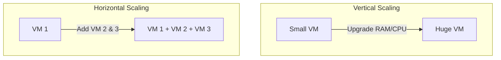

# Scalability, Latency & Throughput

This section covers the core fundamentals of system engineering, measuring performance metrics, and scaling strategies.

---

## 1. Scalability: Vertical vs Horizontal

| Dimension | Vertical Scaling (Scale Up) | Horizontal Scaling (Scale Out) |
|-----------|------------------------------|---------------------------------|
| **Mechanism** | Add resources (CPU, RAM) to a single machine | Add more machines to the pool |
| **SPOF** | Single point of failure (if VM dies, app dies) | Highly resilient (if one machine dies, others take load) |
| **Limit** | Hard hardware limits (CPU sockets, board limits) | Theoretically infinite scale |
| **Complexity**| Zero architecture change needed | Requires Load Balancers, stateless app design |
| **Cost** | Non-linear (high-end hardware is exponentially expensive) | Linear cost (standard cheap VM instances) |

---

## 2. Latency vs Throughput
* **Latency:** The time taken for a single request to complete its round-trip. Measured in milliseconds (ms).
* **Throughput:** The number of requests processed successfully per second. Measured in Queries Per Second (QPS) or Transactions Per Second (TPS).

### Real-world Analogy
Think of a highway:
* **Latency** is the time it takes for a single car to travel from Point A to Point B.
* **Throughput** is the number of cars passing a toll booth per minute.

---

## 3. Measuring Latency: Why Averages are Deceptive
In production systems, measuring the *average* latency (mean) hides outliers. If 99 requests take 10ms, but 1 request takes 5000ms:
* Average latency: $\frac{(99 \times 10) + 5000}{100} = 59.9\text{ ms}$ (Looks acceptable).
* But 1% of users had an atrocious 5-second loading experience!

### Percentiles (p50, p95, p99, p99.9)
Systems are measured using percentiles:
* **p50 (Median):** 50% of requests are faster than this.
* **p99:** 99% of requests are faster than this. The remaining 1% of requests (often heavy DB queries, garbage collection cycles) take longer.
* In HLD interviews, **p99** is the standard benchmark for user experience SLAs.

---

## Interview Q&A Corner

> [!IMPORTANT]
> **Q: A customer reports slow dashboard loading times, but the average latency metric on your monitoring tool shows 50ms. What is wrong?**
> A: You are viewing average (mean) latency, which hides skewness and tail latency. Check the **p99** or **p99.9** latency metrics. If they are in seconds, it indicates that a subset of users or specific heavy queries are experiencing extreme bottleneck conditions.
