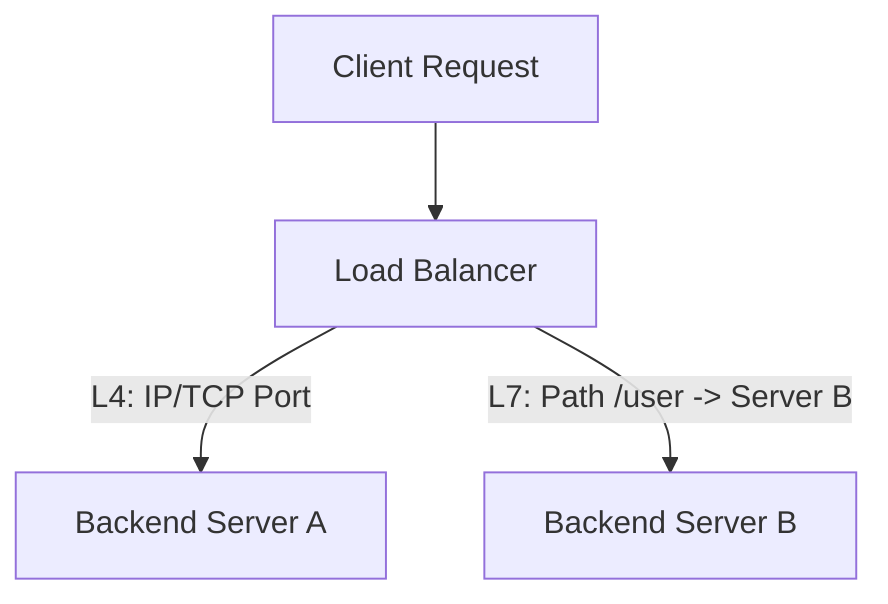

# Load Balancers

Load Balancers (LB) distribute incoming network traffic across multiple backend servers to ensure high availability, redundancy, and performance.

---

## 1. Layer 4 vs Layer 7 Load Balancing

* **Layer 4 (Transport Layer):**
  * Routing decisions are based solely on IP addresses and TCP/UDP ports.
  * The LB does not inspect the contents of HTTP/HTTPS packets.
  * Faster and uses less CPU/memory.
  * Cannot route traffic based on HTTP headers, cookies, or URL paths.

* **Layer 7 (Application Layer):**
  * Routing decisions are based on the content of the request (HTTP header, cookies, body, URL path).
  * The LB must decrypt HTTPS traffic (SSL Termination) to inspect packets.
  * Allows smart routing (e.g. routing `/images` to image storage servers, or `/api/v1` to API instances).
  * Consumes more CPU and memory due to decryption and inspection.

---

## 2. Load Balancing Algorithms

| Algorithm | Description | Pros | Cons |
|-----------|-------------|------|------|
| **Round Robin** | Routes requests to servers sequentially. | Simple, no state tracked | Uneven load if servers have different capacities |
| **Weighted Round Robin** | Assigns weights to servers based on hardware capacity. | Handles heterogeneous servers | Hard to tune weights dynamically |
| **Least Connections** | Routes requests to the server with the fewest active TCP connections. | Excellent for long-lived connections | High overhead tracking connection states |
| **IP Hash** | Hashes client IP to determine the server. | Session persistence (Sticky sessions) | Can lead to hot spotting |

---

## 3. Health Checks
LBs verify server health by sending periodic heartbeats (e.g. GET `/healthz`). If a server fails $N$ consecutive checks, it is removed from the active routing pool. Once it passes $M$ checks, it is added back.

---

## Interview Q&A Corner

> [!WARNING]
> **Q: What is SSL Termination, and why is it handled at the Load Balancer?**
> A: SSL Termination is decrypting SSL/TLS encrypted traffic at the Load Balancer instead of the backend servers. Decryption is CPU-heavy. By terminating SSL at the LB, the traffic travels inside the private subnet in plain HTTP, offloading CPU overhead from the backend application servers.
