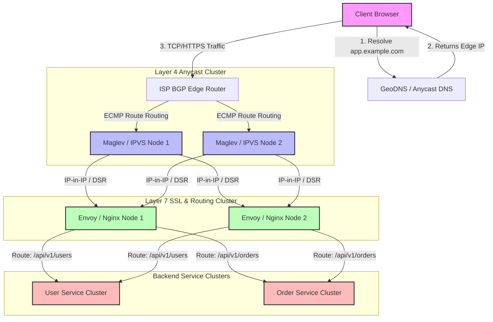
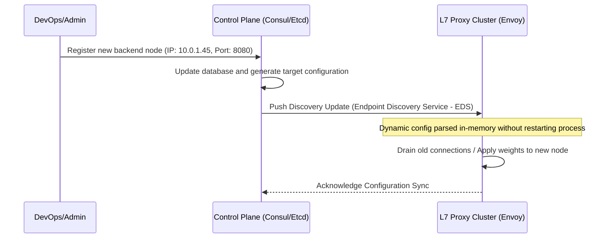

# Load Balancers

## 1. Core Concept & Scaling Theory

Load Balancers (LBs) distribute incoming traffic across backend resources. They function at different layers of the OSI model: Layer 4 (Transport, TCP/UDP) and Layer 7 (Application, HTTP/HTTPS/gRPC).

### Mathematical Estimations & Scaling Calculations

#### A. Layer 4 Connection Table Memory Sizing
An L4 load balancer (e.g., IPVS/LVS or Maglev) tracks active TCP connections using a hash table.
* **Target Scale:** $1,000,000$ concurrent TCP connections.
* **Connection State Size:** Each entry in the connection state tracking table stores:
  * Source IP (4 bytes IPv4 / 16 bytes IPv6)
  * Source Port (2 bytes)
  * Destination IP (4 bytes / 16 bytes)
  * Destination Port (2 bytes)
  * Chosen Backend IP (4 bytes / 16 bytes)
  * Chosen Backend Port (2 bytes)
  * TCP State machine state (1 byte)
  * Timeout counters & pointers (approx. 64 bytes)
  * *Total memory per connection entry:* $\approx 128$ bytes.
* **Total Memory Required:**
  $$\text{Memory} = 1,000,000 \times 128 \text{ bytes} \approx 128 \text{ MB}$$
  Adding hash table overhead (buckets, chaining pointers) with a load factor of $0.5$, we need:
  $$\text{Total Allocation} \approx 256 \text{ MB}$$
  *Conclusion:* Layer 4 LBs are highly memory-efficient and can easily run in-memory on standard commodity hardware.

#### B. Layer 7 SSL/TLS Cryptographic Overhead
An L7 load balancer (e.g., Nginx, HAProxy, Envoy) performs SSL/TLS termination. This requires cryptographic handshakes.
* **Scenario:** $10,000$ new TLS handshakes per second.
* **Crypto Computation Cost:**
  * Using RSA 2048-bit keys: A single modern CPU core can perform $\approx 1,500$ RSA handshakes/sec.
  * Using ECDSA (secp256r1): A single CPU core can perform $\approx 10,000$ ECDSA handshakes/sec.
* **CPU Sizing (RSA 2048):**
  $$\text{Cores} = \frac{10,000 \text{ handshakes/sec}}{1,500 \text{ handshakes/sec/core}} \approx 6.67 \text{ cores} \implies 8 \text{ vCPUs minimum}$$
* **CPU Sizing (ECDSA secp256r1):**
  $$\text{Cores} = \frac{10,000 \text{ handshakes/sec}}{10,000 \text{ handshakes/sec/core}} \approx 1 \text{ vCPU minimum}$$
  *Conclusion:* Choosing modern ECDSA certificates reduces CPU requirements for L7 SSL termination by nearly $85\%$.

### Comparative Analysis: Load Balancing Options

| Criteria | Layer 4 Load Balancing (LVS, Maglev) | Layer 7 Load Balancing (Envoy, Nginx) | DNS Load Balancing (Anycast / GeoDNS) |
| :--- | :--- | :--- | :--- |
| **OSI Layer** | Layer 4 (TCP/UDP) | Layer 7 (HTTP/HTTPS/gRPC) | Application (DNS Resolution) |
| **Throughput** | Ultra-high (Gbps to Tbps, packet-level) | Medium-High (Limited by CPU copy & parse) | Near infinite (handled by client DNS cache) |
| **Inspection Capability** | None (IP and Port only) | Full (Headers, Cookies, URI Path, Payload) | None (Returns IP address list) |
| **SSL Termination** | No (Passthrough only) | Yes (Handles SSL handshake & decryption) | No |
| **Memory/CPU Overhead** | Extremely Low (Simple routing table lookup) | High (Buffers streams, parses protocols) | Negligible |
| **Routing Decisions** | Round-robin, IP Hash, Least Connections | Path-routing, Header-routing, Cookie stickiness | Geolocation-based, Round-robin |

---

## 2. Visual Architecture Diagram

Below is a production-grade multi-tier load balancing architecture. It integrates DNS Geo-routing, BGP Anycast L4 load balancers, and a cluster of auto-scaling L7 load balancers executing SSL termination and path-based routing.



---

## 3. Data Models & API Signatures

### Dynamic Backend Configuration Database Schema (SQL)
Used by L7 control planes (e.g. Consul, dynamic Envoy backends) to register and configure target servers.

```sql
-- Represents backend upstream pools (clusters)
CREATE TABLE upstream_groups (
    id VARCHAR(64) PRIMARY KEY,
    name VARCHAR(128) NOT NULL,
    load_balancing_algorithm VARCHAR(32) DEFAULT 'ROUND_ROBIN', -- ROUND_ROBIN, LEAST_CONN, RANDOM, RING_HASH
    health_check_path VARCHAR(256) DEFAULT '/healthz',
    health_check_interval_seconds INT DEFAULT 10,
    healthy_threshold INT DEFAULT 2,
    unhealthy_threshold INT DEFAULT 3,
    created_at TIMESTAMP DEFAULT CURRENT_TIMESTAMP
);

-- Individual physical or container backends inside a group
CREATE TABLE backend_servers (
    id VARCHAR(64) PRIMARY KEY,
    group_id VARCHAR(64) REFERENCES upstream_groups(id) ON DELETE CASCADE,
    ip_address VARCHAR(45) NOT NULL, -- Supports IPv4 and IPv6
    port INT NOT NULL CHECK (port > 0 AND port <= 65535),
    weight INT DEFAULT 1 CHECK (weight >= 1 AND weight <= 100),
    is_healthy BOOLEAN DEFAULT TRUE,
    last_health_check TIMESTAMP,
    created_at TIMESTAMP DEFAULT CURRENT_TIMESTAMP
);

CREATE INDEX idx_backend_group ON backend_servers(group_id, is_healthy);
```

### Dynamic Routing API Signature (Envoy xDS Inspired REST JSON)
Below is an API endpoint payload used by the control plane to dynamically update the L7 load balancer's routing table (Discovery Service).

#### POST `/api/v1/lb/routes`
```json
{
  "route_config_name": "app_routes",
  "virtual_hosts": [
    {
      "name": "app_vhost",
      "domains": ["app.example.com"],
      "routes": [
        {
          "match": {
            "prefix": "/api/v1/users"
          },
          "route": {
            "cluster": "users_upstream_pool",
            "timeout": "5.000s",
            "retry_policy": {
              "num_retries": 3,
              "retry_on": "5xx,connect-failure,refused-stream"
            }
          }
        },
        {
          "match": {
            "prefix": "/api/v1/orders"
          },
          "route": {
            "cluster": "orders_upstream_pool",
            "timeout": "10.000s"
          }
        }
      ]
    }
  ]
}
```

---

## 4. Operational Flows

### A. The Client-to-Backend Packet Read Path (Reverse Proxy Mode)
1. **DNS Resolution:** Client resolves `app.example.com` to an IP routed to the Layer 4 LBs.
2. **L4 Dispatching:** The L4 LB receives the TCP SYN packet. It selects an L7 proxy node using Consistent Hashing on the 5-tuple (Src IP, Src Port, Dst IP, Dst Port, Protocol).
3. **Connection Encapsulation:** The L4 LB forwards the packet to the L7 proxy (either using IP-in-IP encapsulation or MAC rewriting in a Shared L2 Network, which allows Direct Server Return).
4. **L7 Processing:**
   * **TLS Termination:** The L7 LB completes the TLS handshake with the client, decrypting the payload.
   * **HTTP Parsing:** The L7 LB reads the path (e.g., `/api/v1/users`), checks headers, and evaluates cookie state.
5. **Upstream Request:** The L7 LB establishes (or reuses) a TCP connection to a backend node in the matching service group.
   * **Header Injection:** It injects `X-Forwarded-For: [Client IP]` and `X-Request-ID: [UUID]` for auditability.
6. **Backend Response:** Backend executes the business logic, returns HTTP 200, and sends it back to the L7 LB.
7. **L7 Responders:** The L7 LB encrypts the data and transmits it back down to the client.

### B. The Configuration Synchronization Write Path


---

## 5. High Availability, Failovers & Bottlenecks

### Avoiding Single Points of Failure (SPOFs)
* **BGP Anycast for L4 LBs:** Multiple L4 LB nodes share the same virtual IP (VIP) using Border Gateway Protocol (BGP). Routers use Equal-Cost Multi-Path (ECMP) routing to distribute incoming packets. If one L4 LB goes offline, the router immediately stops routing packets to it.
* **Keepalived / VRRP for L7 VIPs:** If Anycast is not supported at the cloud layer, an active-passive setup using virtual router redundancy protocol (VRRP) assigns a floating IP. If the active node stops emitting heartbeat multicasts, the passive node takes over the MAC address bindings (Gratuitous ARP).

### Replication Lag & Mitigation in Session Stickiness
* If session stickiness uses an in-memory session store on the L7 LB itself, loss of an L7 proxy terminates sessions.
* **Mitigation:** Use cryptographically signed cookies (JWTs) containing session IDs, coupled with a shared caching tier (e.g., Redis Cluster) to preserve session state regardless of which L7 proxy or backend server receives the request.

### Mitigating Bottlenecks (DSR - Direct Server Return)
* **Problem:** In standard reverse proxying, the return traffic passes back through the LBs. Because download sizes (responses) are typically $10\times$ to $100\times$ larger than upload sizes (requests), the LB's outgoing network interface card (NIC) becomes the bottleneck.
* **Mitigation (DSR):** The L4 LB modifies only the destination MAC address of incoming packets to match the chosen L7 LB/backend. The backend has the VIP bound to a loopback interface (`lo`). When the backend replies, it replies directly to the client's public IP, bypassing the load balancer completely for outbound traffic.

---

## 6. Comprehensive Interview Q&A

### Q1: What is the difference between Direct Server Return (DSR) and Reverse Proxying, and when would you use DSR?
**Answer:**
In a **Reverse Proxying** model, the load balancer acts as an intermediary: it terminates the client connection, starts a new connection to the backend, and handles both inbound and outbound traffic. This is required when Layer 7 inspection, header rewrites, SSL termination, or response modifications are needed.

In **Direct Server Return (DSR)**, the load balancer only handles inbound packets. It modifies the target destination MAC address to route the packet to a backend server (which shares the same virtual IP on its loopback interface). The backend server processes the request and sends the response directly back to the client. DSR is used at Layer 4 when throughput is extremely high and the return payload is disproportionately large (e.g., video streaming services, CDNs, large file downloads), preventing the load balancer from becoming a network bottleneck.

### Q2: How does BGP Anycast provide high availability for Layer 4 load balancers?
**Answer:**
With **BGP Anycast**, multiple geographically distributed L4 load balancers announce the exact same IP address (Virtual IP / VIP) to the edge routers using the Border Gateway Protocol. 
* The routing network treats all these nodes as the same destination and uses **ECMP (Equal-Cost Multi-Path)** routing to hash client flows (based on source/destination IP and port) to the closest available LB node.
* If one LB node crashes or is taken offline for maintenance, it stops announcing the path via BGP. The routers detect this withdraw event within seconds and recalculate routes, sending subsequent packets to the remaining active LB nodes.

### Q3: What is "Connection Draining" (or Graceful Shutdown) and why is it critical during auto-scaling events?
**Answer:**
**Connection Draining** is the mechanism used when a backend server is marked for removal from the active load-balancer pool (e.g., during scale-in events or rolling updates).
* When a server is deregistered, the load balancer stops routing *new* requests or connection requests to that server.
* However, it keeps active, established connections open to allow current requests to complete within a configured timeout window (e.g., 30–300 seconds).
* This prevents client-facing errors (like HTTP 502/504 errors) and ensures seamless user experience during infrastructure updates.

### Q4: How does Consistent Hashing prevent catastrophic cache-misses or session losses when a Load Balancer cluster scales up or down?
**Answer:**
In standard modulo routing (`Hash(Client IP) % N`), adding or removing a load balancer changes $N$. This causes the target server calculation to shift for nearly $100\%$ of all incoming client IPs, leading to complete session loss or cache-miss storms across backends.

By using **Consistent Hashing** (e.g., placing servers and client IP hashes onto a logical $360^\circ$ ring):
* A client IP is mapped to the nearest server clockwise on the ring.
* When a new LB/backend node is added or removed, only a small fraction of keys ($\frac{1}{N}$) are remapped to a different server.
* The remaining $\frac{N-1}{N}$ keys continue routing to their existing backends, preserving sessions and cache locality.
