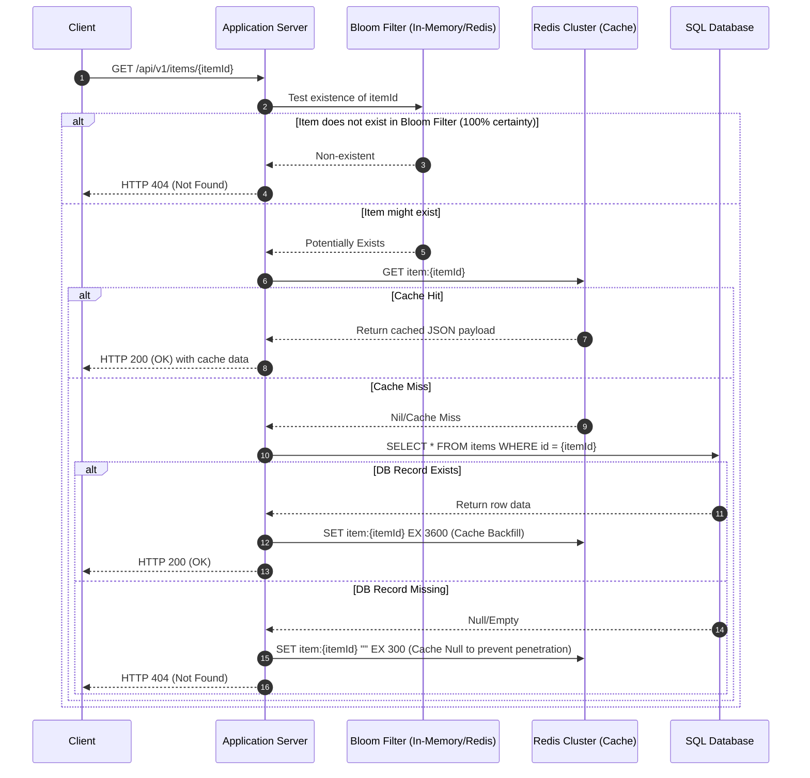
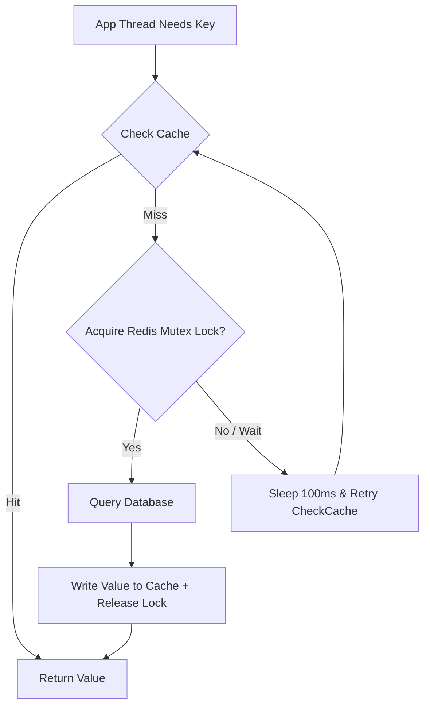

# Caching Strategies

## 1. Core Concept & Scaling Theory

Caching is the process of storing copies of data in a high-speed, volatile data store (typically RAM) to serve reads faster than querying the primary disk-based database.

### Mathematical Estimations & Scaling Calculations

#### A. Redis Memory Sizing for 100 Million Keys
* **Scenario:** Cache $100,000,000$ user session objects.
* **Payload Details:**
  * Key size: `session:user:<uuid>` (average 36 bytes)
  * Value size: Session metadata JSON (average 512 bytes)
* **Redis Internal Struct Overhead:**
  * In Redis, every key-value pair is wrapped in a `dictEntry` (24 bytes in 64-bit systems) and a `redisObject` (16 bytes).
  * The key string is stored as a Simple Dynamic String (SDS), adding $\approx 9$ bytes overhead.
  * The value string is also an SDS, adding $\approx 9$ bytes.
  * Memory allocator (`jemalloc`) rounds up allocations to nearest power of 2 or size classes, adding $\approx 10\%$ overhead.
  * **Memory per key-value pair:**
    $$\text{Size} = \text{Key} (36) + \text{Val} (512) + \text{dictEntry} (24) + \text{redisObject} (16) + \text{SDS Overheads} (18) = 606 \text{ bytes}$$
    Adjusting for allocator rounding and hash table array sizing:
    $$\text{Average Memory Per Entry} \approx 680 \text{ bytes}$$
* **Total Memory Sizing:**
  $$\text{Total RAM} = 100,000,000 \times 680 \text{ bytes} = 68,000,000,000 \text{ bytes} \approx 68 \text{ GB}$$
  To ensure high availability and prevent OOM (Out Of Memory) crashes, we apply a $25\%$ safety buffer:
  $$\text{Target Cluster RAM} = 68 \text{ GB} \times 1.25 = 85 \text{ GB}$$

#### B. Cache Hit Rate Impact on Database Load
Let $H$ be the Cache Hit Rate ($0 \le H \le 1$). Let $Q$ be the incoming traffic volume (queries per second).
* **Database QPS ($Q_{db}$)** is defined as:
  $$Q_{db} = Q \times (1 - H)$$
* **Impact of Hit Rate Decline:**
  * **Case 1 ($H = 0.99$):** For $Q = 10,000$ RPS:
    $$Q_{db} = 10,000 \times (1 - 0.99) = 100 \text{ QPS}$$
  * **Case 2 ($H = 0.90$):** For $Q = 10,000$ RPS:
    $$Q_{db} = 10,000 \times (1 - 0.90) = 1,000 \text{ QPS}$$
* **Analysis:** A seemingly minor $9\%$ drop in the cache hit rate causes a $10\times$ (1000%) increase in database load. This highlights why cache warming and stampede protection are critical.

### Comparative Analysis: Caching Patterns

| Strategy | Read Path | Write Path | Data Freshness | DB Load | Complexity | Best Use Case |
| :--- | :--- | :--- | :--- | :--- | :--- | :--- |
| **Cache-Aside (Lazy)** | App checks cache; if miss, queries DB and updates cache. | App writes to DB directly, then evicts/deletes cache key. | Eventual consistency (temporary stale reads possible). | Low (after warming). | Simple | General-purpose, read-heavy web apps. |
| **Read-Through** | App requests from cache provider; cache library handles DB fetch on miss. | App writes to DB. | Consistent. | Low. | Medium | Keeps app code decoupled from database querying. |
| **Write-Through** | Same as Cache-Aside. | App writes to cache; cache writes to DB synchronously in one transaction. | 100% Consistent. | Low. | High | Critical data requiring immediate consistency (e.g. financial balances). |
| **Write-Behind (Write-Back)** | Same as Cache-Aside. | App writes to cache; cache queues write to DB asynchronously. | Eventual consistency (high lag possible). | Extremely Low (batch writes). | Very High | Write-heavy systems (e.g. IoT sensors, game scoreboards, analytics counters). |

---

## 2. Visual Architecture Diagram

Below is the complete request execution flow showing how an application server coordinates with a Bloom Filter, a distributed Redis cache cluster, and the primary SQL database.



---

## 3. Data Models & API Signatures

### Dynamic Cache Namespace Design
To prevent collisions and enable granular invalidation, keys must follow a strict namespace syntax:
`{tenant_id}:{service_name}:{entity_name}:{entity_id}:{version}`

#### Example Keys:
* `1001:users:profile:94827:v1`
* `1001:inventory:stock:88472:v2`

### Key Purging & Invalidation API (Webhook)
For cache updates in a microservices environment, the Cache Manager exposes an invalidation endpoint.

#### POST `/api/v1/cache/purge`
```json
{
  "tenant_id": "1001",
  "service": "users",
  "entities": [
    {
      "entity_name": "profile",
      "entity_id": "94827",
      "wildcard": false
    }
  ],
  "reason": "user_profile_update",
  "issued_at": "2026-06-03T02:26:00Z"
}
```

#### Redis Command Pipeline for Write-Back Queue
When using Write-Behind, the app pushes tasks to a Redis List (`LPUSH`) and sets the cached value:
```redis
MULTI
SET session:user:94827 "{\"name\":\"Alice\",\"status\":\"active\"}" EX 86400
LPUSH write_back_queue "{\"op\":\"UPDATE\",\"table\":\"users\",\"id\":94827,\"data\":{\"status\":\"active\"}}"
EXEC
```

---

## 4. Operational Flows

### A. Read Path with Cache Stampede Mitigation
Under extreme traffic, when a highly popular key expires, hundreds of concurrent threads might query the database simultaneously (Cache Stampede/Thundering Herd).



### B. Write Path: The Cache Invalidation Race Condition (Why Delete is Preferred)
Updating a cache value directly can lead to stale data if two requests interleave. Deleting the cache key prevents this.

#### Problem: Race Condition when updating Cache
```
Client A: Update database to Val_A
Client B: Update database to Val_B
Client B: Update Cache to Val_B
Client A: Update Cache to Val_A
Result: Database has Val_B, but Cache has Val_A (STALE DATA FOREVER!)
```

#### Solution: Delete Cache Key
```
Client A: Update database to Val_A
Client A: Delete Cache key
Client B: Update database to Val_B
Client B: Delete Cache key
Next Read: Cache miss -> Read Val_B from database -> Write Val_B to cache (CONSISTENT)
```

---

## 5. High Availability, Failovers & Bottlenecks

### Redis Cluster vs Redis Sentinel
* **Redis Sentinel:** Active-passive configuration. Monitors master and replicas. If master crashes, Sentinel promotes a replica. Best for small data volumes (< 50GB) where replication is enough and we don't need scaling of write traffic.
* **Redis Cluster:** Multi-master sharded architecture. Data is distributed across $16,384$ logical hash slots. If one master fails, its replicas take over. Best for high throughput, scaling writes, and large data volumes.

### Eviction Policies under High Memory Pressure
When memory limits are hit (`maxmemory`), Redis evicts keys according to the configured policy:
1. **volatile-lru / allkeys-lru:** Least Recently Used. Tracks when a key was last accessed.
2. **volatile-lfu / allkeys-lfu:** Least Frequently Used. Tracks access counters. Important for retaining keys that are highly popular, even if they haven't been accessed in the last few seconds.
3. **volatile-ttl:** Evicts keys closest to expiration.
4. **noeviction:** Returns out-of-memory errors for write commands. Recommended for databases, but unacceptable for caching.

---

## 6. Comprehensive Interview Q&A

### Q1: Why is deleting a cache key preferred over updating it when database records are modified?
**Answer:**
Updating the cache directly causes race conditions when multiple write operations happen concurrently.
Suppose we have two writes, $W_1$ and $W_2$.
1. $W_1$ updates the database.
2. $W_2$ updates the database.
3. Due to network latency, the cache update for $W_2$ arrives first and writes its value.
4. The cache update for $W_1$ arrives second and overwrites the value.
At this stage, the database contains the value from $W_2$, but the cache contains the stale value from $W_1$. This stale data remains until the TTL expires.

If we **delete** the cache key instead:
1. $W_1$ updates the database and deletes the key.
2. $W_2$ updates the database and deletes the key.
3. The next read operation triggers a cache miss, queries the database (which has the correct $W_2$ data), and updates the cache. The race condition is avoided.

### Q2: What is the "Cache Stampede" (or Thundering Herd) problem, and how do you implement a Mutex Lock to mitigate it?
**Answer:**
A **Cache Stampede** occurs when a highly requested cache key expires. Because the key is gone, all incoming concurrent requests (potentially thousands per second) fail to find it in the cache and attempt to query the database and recompute the value at the same time. This can cause database performance degradation or outages.

To mitigate this, we use a distributed Mutex Lock (like Redis `SET NX`):
1. When a thread gets a cache miss, it attempts to acquire a short-lived lock for that key: `SET lock:key_name "1" EX 5 NX`.
2. Only the single thread that successfully acquires the lock goes to the database to retrieve the fresh value.
3. All other threads fail to acquire the lock. They wait (e.g., sleeping for 50–100ms) and retry reading the cache.
4. Once the lock owner writes the computed value to the cache and releases the lock, the waiting threads read the new value from the cache, preventing database overload.

### Q3: Explain how a Bloom Filter works, its memory footprint, and how it handles false positives.
**Answer:**
A **Bloom Filter** is a space-efficient, probabilistic data structure used to check if an element is a member of a set.
* **Mechanics:** It uses a bit array of size $m$ initialized to 0, and $k$ different cryptographic hash functions. When an element is added, it is passed through all $k$ hashes, and the bits at the resulting positions are set to 1.
* **Membership Check:** To test if an element is present, we hash it with the same $k$ functions. If *any* of the bits at these positions is 0, the element is **definitely not** in the set. If all are 1, the element is **potentially** in the set.
* **False Positives:** A Bloom filter can return false positives (saying an item is present when it isn't, because other keys happened to flip the same bits), but it never returns false negatives.
* **Memory Footprint:** To achieve a false positive probability of $1\%$ ($p = 0.01$) for $1,000,000$ keys, we only need $\approx 9.6$ million bits ($\approx 1.2$ MB) of memory. This is significantly smaller than storing the keys themselves in a hash set.

### Q4: What is the difference between Redis Sentinel and Redis Cluster? When would you use one over the other?
**Answer:**
* **Redis Sentinel** is designed for high availability in a non-sharded setup. It consists of one master node and multiple replica nodes. Sentinel monitors the nodes and automatically performs failover (promoting a replica to master) if the master crashes. However, all writes must go to the single master node, and all data must fit on a single server's RAM.
* **Redis Cluster** is designed for scaling out. It automatically shards data across multiple master nodes using $16,384$ hash slots. It handles both high availability (each master has its own replicas and performs failover automatically) and horizontal scaling (data and traffic are distributed across multiple servers).

**When to use:**
* Use **Sentinel** for smaller datasets (< 50GB) where read traffic is high but write traffic and storage capacity can easily be handled by a single server.
* Use **Cluster** for large datasets or high-throughput write applications that exceed the memory or network capacity of a single server.
