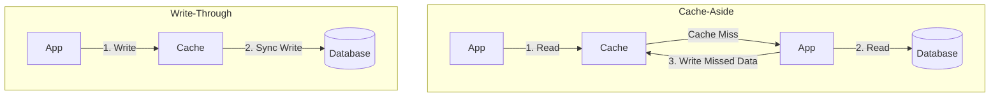

# Caching Strategies

Caching stores copies of frequently accessed data in fast, transient memory (like Redis or Memcached) to reduce database load and latency.

---

## 1. Cache Read/Write Patterns

### Cache-Aside (Lazy Loading) - Most Common
* **Read:** Check cache first. If hit, return. If miss, query database, write to cache, and return.
* **Write:** Write to database directly. Evict/delete the cache key.
* **Pros:** Resilient (if cache dies, database works); memory-efficient.
* **Cons:** Cache misses cause a triple latency penalty on first-time reads.

### Write-Through
* **Write:** Write to cache and database synchronously in a single transaction.
* **Pros:** Cache is never stale.
* **Cons:** High write latency due to dual-write path.

### Write-Behind / Write-Back (Asynchronous)
* **Write:** Write to cache immediately and return success. A background worker periodically aggregates cache changes and batch-writes them to the DB.
* **Pros:** Insanely fast write speeds (good for write-heavy systems like gaming scoreboards or IoT sensors).
* **Cons:** Risk of data loss if the cache server crashes before background persist completes.

---

## 2. Cache Eviction Policies
When the cache fills up, it must evict keys:
1. **LRU (Least Recently Used):** Evicts the key that hasn't been accessed for the longest time.
2. **LFU (Least Frequently Used):** Evicts the key with the lowest hit counter.
3. **FIFO (First In First Out):** Evicts the oldest key in the cache.

---

## 3. Cache Bottlenecks & Mitigations
* **Cache Penetrability:** Querying keys that exist in neither DB nor cache.
  * *Solution:* Cache null values temporarily, or use a **Bloom Filter** to verify key existence before querying cache.
* **Cache Avalanche:** Many cached keys expire at the same time, causing a traffic spike directly to the database.
  * *Solution:* Add a small random jitter (noise) to the TTL of each key.
* **Cache Stampede (Thundering Herd):** Concurrent heavy threads read a missing key, and all attempt to compute the value and write to DB simultaneously.
  * *Solution:* Use locking (`Mutex`) so only one thread re-computes, or pre-warm the cache.

---

## Interview Q&A Corner

> [!CAUTION]
> **Q: How does a Bloom Filter prevent database overload from malicious traffic?**
> A: A Bloom Filter is a space-efficient probabilistic data structure that checks if an element is a member of a set. It can return false positives (indicating a key exists when it doesn't) but **never** false negatives (if it says a key doesn't exist, it definitely doesn't). Placing a Bloom Filter before the cache rejects queries for non-existent items immediately.
