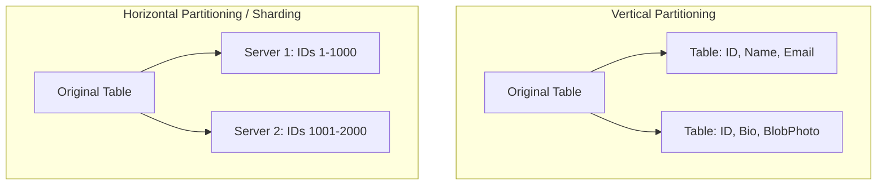

# Database Sharding & Partitioning

Sharding is horizontal partitioning of database rows across multiple independent physical database servers.

---

## 1. Partitioning Types

* **Vertical Partitioning:**
  * Splitting tables by columns. Move large, rarely accessed columns (e.g. `user_bio`, `profile_photo_blob`) into their own tables.
* **Horizontal Partitioning (Sharding):**
  * Splitting tables by rows. Keep the same schema, but distribute subsets of rows to distinct database shards (servers).

---

## 2. Sharding Strategies
1. **Range-Based Sharding:** Split by value ranges (e.g., Shard 1 holds names A-M, Shard 2 holds N-Z).
   * *Cons:* Hotspots (e.g., if many names start with 'M').
2. **Hash-Based Sharding:** Calculate `hash(sharding_key) % number_of_shards`.
   * *Cons:* Adding/removing a shard requires re-hashing and migrating almost all data.
3. **Consistent Hashing:** Map data and servers to a circular hash ring.
   * *Pros:* Minimizes data migration during scaling.

---

## 3. Sharding Challenges & Bottlenecks
* **Joins Across Shards:** Joining tables that live on separate physical servers is highly inefficient and not supported natively.
  * *Solution:* De-normalize data (duplicate common fields to avoid joins), or run joins inside the application layer.
* **Transaction Reliability:** Maintaining ACID transactions across shards requires two-phase commits, which introduces high latency.
* **Hotspots (Celebrity Problem):** If a single partition receives 100x traffic (e.g. Justin Bieber's user ID), the shard hosting that ID will crash.

---

## Interview Q&A Corner

> [!IMPORTANT]
> **Q: What criteria would you use to choose a sharding key?**
> A: 
> 1. **High Cardinality:** The key must have many unique values (e.g., `user_id` is great, `country` is poor).
> 2. **Uniform Distribution:** Evenly distributes writes and reads to prevent hotspots.
> 3. **Common Query Pattern:** If 90% of your queries filter by `tenant_id`, then `tenant_id` is the logical sharding key to avoid "scatter-gather" queries that probe all shards.
