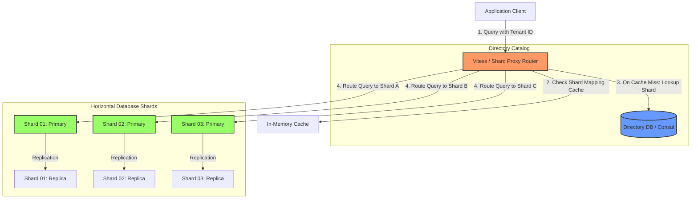
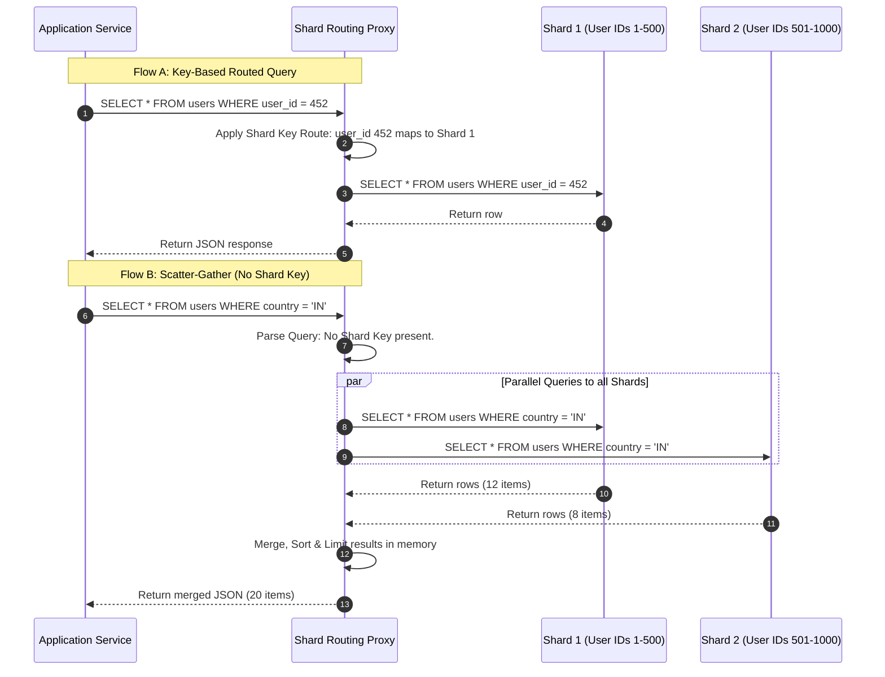

# Database Sharding & Partitioning

## 1. Core Concept & Scaling Theory

Sharding is the process of horizontally partitioning a database, separating rows of a single table across multiple physical database instances. Unlike replication (where every node holds the complete dataset), sharding distributes the dataset so that each physical server (shard) holds a unique subset of the data.

### Mathematical Estimations & Scaling Calculations

#### A. Database Capacity & Shard Sizing Sizing Math
* **Scenario:** Design a sharded MySQL cluster for an e-commerce platform.
* **Requirements:**
  * Total Storage: $12 \text{ TB}$ of order history.
  * Target Write throughput: $12,500$ Write IOPS.
* **Hardware Profile of standard database instance (AWS db.r6g.2xlarge):**
  * Maximum recommended storage per instance (for performance/backups): $2.5 \text{ TB}$.
  * Sustainable disk write throughput: $3,000$ IOPS.
* **Calculations:**
  * **Number of shards required for storage ($N_{storage}$):**
    $$N_{storage} = \frac{12 \text{ TB}}{2.5 \text{ TB/instance}} = 4.8 \implies 5 \text{ Shards}$$
  * **Number of shards required for IOPS ($N_{iops}$):**
    $$N_{iops} = \frac{12,500 \text{ IOPS}}{3,000 \text{ IOPS/instance}} = 4.17 \implies 5 \text{ Shards}$$
* **System Layout:** We deploy $5$ shards. To ensure High Availability (HA), each shard consists of $1$ Primary and $1$ Replica node.
  $$\text{Total database nodes} = 5 \text{ shards} \times 2 \text{ nodes/shard} = 10 \text{ database instances}$$

#### B. Latency Amplification in Scatter-Gather Queries
If a query does not include the sharding key, the query coordinator must query all shards and aggregate the results (Scatter-Gather).
* **Math Formula:** Let $p$ be the probability that a single database node experiences a latency spike (tail latency). If a query must call $N$ shards in parallel, the probability $P_{spike}$ of the overall query experiencing a tail latency spike is:
  $$P_{spike} = 1 - (1 - p)^N$$
* **Impact Analysis:**
  * Let $p = 0.01$ ($1\%$ chance of response taking $>100$ms).
  * For $N = 1$ (single shard query):
    $$P_{spike} = 1 - (1 - 0.01)^1 = 1\%$$
  * For $N = 10$ shards (scatter-gather):
    $$P_{spike} = 1 - (1 - 0.01)^{10} = 1 - 0.904 = 9.6\%$$
  * For $N = 50$ shards:
    $$P_{spike} = 1 - (1 - 0.01)^{50} = 1 - 0.605 = 39.5\%$$
  * *Conclusion:* Even if only $1\%$ of database requests are slow, a scatter-gather query across $50$ shards will experience a tail latency spike nearly $40\%$ of the time. This highlights the importance of choosing a sharding key that covers the majority of read queries.

### Comparative Analysis: Partitioning Strategies

| Strategy | Logic | Pros | Cons | Best Use Case |
| :--- | :--- | :--- | :--- | :--- |
| **Range-Based** | Routes data based on ranges of the sharding key (e.g. Date Range, IDs 1-1M). | Easy to implement and query ranges. | High risk of hot-spotting (e.g. all new writes go to the newest date-range shard). | Archival storage systems. |
| **Hash-Based** | `Hash(Key) % N` where $N$ is the number of shards. | Uniform data distribution. | Resizing (changing $N$) requires re-hashing and migrating almost all data. | Static scale high-volume transactional databases. |
| **Consistent Hashing** | Uses a logical hash ring. Nodes and keys are hashed onto the ring. | Adding/removing a shard only requires migrating $\frac{1}{N}$ of the data. | More complex routing logic and key management. | Scalable cache tiers, NoSQL systems (Cassandra, DynamoDB). |
| **Directory-Based (Lookup)** | Query a central routing directory (Lookup Service) to find the shard mapping. | Highly flexible; shards can be moved or split individually without rehashing. | Lookup service becomes a single point of failure (SPOF) and a network hop bottleneck. | Multi-tenant SaaS with highly unequal tenant sizes. |

---

## 2. Core Sharding Mechanics & Key Selection

### A. How to Choose a Sharding Key
A sharding key is the database column (or combination of columns) used to determine the partition routing for each row. Choosing the wrong sharding key is the most expensive mistake in database design, as changing it later requires a complete cluster migration and rewrite of routing logic.

#### Key Selection Parameters:
1. **Cardinality:**
   * **Definition:** The number of unique values in the column.
   * **Rule:** Use a key with high cardinality. 
   * *Example:* Sharding by `Gender` (cardinality = 2) is extremely bad, as you can only ever scale to 2 shards. Sharding by `User_ID` (cardinality = millions) allows arbitrary horizontal scale.
2. **Frequency / Data Distribution:**
   * **Definition:** The frequency of write/read operations hitting specific keys.
   * **Rule:** Choose keys that prevent data skew and hotspots.
   * *Example:* If you shard an order table by `Created_Date`, all writes for the current day will hit the same shard, overloading it (write hotspot), while older shards sit idle.
3. **Query Access Patterns:**
   * **Rule:** Align the sharding key with your primary query filters (`WHERE` clauses).
   * *Example:* If $95\%$ of read queries seek info using `Tenant_ID`, sharding by `Tenant_ID` ensures that $95\%$ of requests are single-shard routed queries.

---

### B. Query Aggregation Mechanics (Scatter-Gather)
When a query does not target the sharding key, it is intercepted by a routing proxy or coordinator node which executes **Scatter-Gather**.

#### 1. How the Routing Proxy Aggregates Query Functions:
* **SUM / COUNT:** The proxy queries all shards in parallel for local sums/counts, retrieves the values, and sums them up globally.
  $$\text{Global Count} = \sum_{i=1}^N \text{Local Count}_i$$
* **MIN / MAX:** The proxy queries all shards in parallel for their local `MIN` or `MAX`, and then computes the global minimum or maximum from the returned subset:
  $$\text{Global Min} = \min(\text{Local Min}_1, \text{Local Min}_2, \dots, \text{Local Min}_N)$$
* **AVERAGE (AVG):** The proxy cannot simply average local averages (i.e. $\text{Avg}(\text{Avg}_1, \text{Avg}_2)$ is mathematically incorrect due to varying sample sizes). 
  * *Mechanism:* The proxy rewrites the query to request both `SUM` and `COUNT` from all shards, retrieves them, and calculates:
    $$\text{Global Average} = \frac{\sum_{i=1}^N \text{Local Sum}_i}{\sum_{i=1}^N \text{Local Count}_i}$$

#### 2. Sorting, Limits & Pagination (`ORDER BY`, `LIMIT`, `OFFSET`)
If you query `ORDER BY score LIMIT 10 OFFSET 100` without a shard key:
1. The proxy must execute `LIMIT 110` (Limit + Offset) across **every** shard in parallel.
2. If there are 10 shards, the proxy retrieves $1,100$ rows over the network.
3. The proxy sorts all 1,100 rows in its own local memory, drops the first 100 rows, and returns the top 10 rows to the client.
4. *Scale Bottleneck:* Higher offsets exponentially increase memory usage and CPU load on the proxy.

---

### C. Challenges of Database Sharding
1. **Distributed Joins:**
   * Joining tables residing on different shards is highly inefficient. If `users` and `orders` are on different shards, joining them requires pulling entire tables into application memory or routing proxy memory to run the join.
   * *Mitigation:* Denormalize databases to replicate lookup tables (e.g. `countries`) to *every* shard, or split data mappings so related entities (e.g. a user and all their orders) always land on the same shard (co-location).
2. **Transactional Integrity (ACID Compliance):**
   * Transactions spanning multiple shards require **Two-Phase Commit (2PC)** or **Sagas** to prevent inconsistent database states, which introduces network coordination delays and lock contention.
3. **Re-sharding & Shard Splits:**
   * When a shard fills up or physical write limits are hit, it must be split (e.g., Shard 1 splits into Shard 1A and 1B). Migrating gigabytes of active transactional data across networks without dropping connection requests requires highly complex, error-prone replication syncs.
4. **Operational Complexity:**
   * Consistent backups across multiple independent database servers, executing schema migrations in lockstep, and setting up failover replication nodes increase overall server costs and administration overhead.

---

## 3. Visual Architecture Diagram

Below is a production architecture using a Sharding Proxy (e.g. Vitess or Citus) to route requests, coupled with a Directory Lookup service for dynamic tenant mapping.



---

## 4. Data Models & API Signatures

### Schema Design: Lookup Directory Mapping (SQL)
For systems using directory-based sharding (dynamic routing catalog).

```sql
-- Catalog database schema (must be highly available)
CREATE TABLE tenant_shard_mappings (
    tenant_id VARCHAR(64) PRIMARY KEY,
    shard_id INT NOT NULL,
    connection_string VARCHAR(512) NOT NULL,
    status VARCHAR(32) DEFAULT 'ACTIVE', -- ACTIVE, READ_ONLY, MIGRATING
    updated_at TIMESTAMP DEFAULT CURRENT_TIMESTAMP ON UPDATE CURRENT_TIMESTAMP
);

CREATE INDEX idx_tenant_status ON tenant_shard_mappings(tenant_id, status);
```

### Dynamic Shard Split/Migration API
Endpoint used by the database administration plane to notify routing proxies that a tenant is being migrated to a new physical shard.

#### POST `/api/v1/shards/migrate-tenant`
```json
{
  "tenant_id": "tenant_99837",
  "source_shard_id": 4,
  "destination_shard_id": 9,
  "migration_strategy": "LIVE_REPLICATION",
  "lock_duration_ms": 500,
  "dry_run": false
}
```

#### SQL Sharding Target Table Schema (PostgreSQL declarative partitioning)
```sql
-- Parent Table
CREATE TABLE orders (
    order_id UUID NOT NULL,
    tenant_id VARCHAR(64) NOT NULL,
    user_id UUID NOT NULL,
    total_amount DECIMAL(12, 2) NOT NULL,
    created_at TIMESTAMP NOT NULL,
    PRIMARY KEY (tenant_id, order_id)
) PARTITION BY HASH (tenant_id);

-- Child Shards created physically
CREATE TABLE orders_shard_1 PARTITION OF orders
    FOR VALUES WITH (MODULUS 4, REMAINING 0);
CREATE TABLE orders_shard_2 PARTITION OF orders
    FOR VALUES WITH (MODULUS 4, REMAINING 1);
```

---

## 5. Operational Flows

### A. Read Operational Flow (Routed vs Scatter-Gather)



### B. Dynamic Resharding / Shard Splitting Write Path
When a shard becomes too large, it must be split (e.g., Shard A splits into Shards A1 and A2) without downtime.
1. **Replicate:** Set up a replication channel from the parent Shard A to the new Shard A2.
2. **Synchronize:** Allow Shard A2 to catch up via replication log.
3. **Lock Writes (Short window):** The routing proxy pauses writes for keys belonging to the migrating range.
4. **Final Sync:** Ensure replication lag between A and A2 drops to zero.
5. **Update Catalog:** Atomically update the Directory Catalog/Proxy config to map the migrated keys to Shard A2.
6. **Unlock & Route:** Resume writes. They now route directly to Shard A2.

---

## 6. High Availability, Failovers & Bottlenecks

### Mitigating Single Points of Failure (SPOFs)
* **Proxy HA:** Sharding proxy instances (like Vitess's `vtgate`) must be stateless and deployed behind a Layer 4 load balancer.
* **Metadata Directory HA:** The shard mapping directory must be stored in a highly available consensus store like `etcd`, `ZooKeeper`, or an active-active SQL database cluster with fast caching layers.

### Cross-Shard Transactions (ACID across servers)
When a business operation spans multiple shards, normal database transactions cannot guarantee consistency.
* **Two-Phase Commit (2PC):** A coordinator manages prepare and commit phases.
  * *Bottleneck:* The coordinator blocks resources across all involved shards during the prepare phase. If a network partition occurs, locks are held indefinitely, causing cascading timeouts.
* **Saga Pattern:** Break transactions into local independent database operations on each shard. If one step fails, the saga orchestrator executes compensating transactions to undo the previous steps.
  * *Trade-off:* Avoids holding database locks, but is eventually consistent.

---

## 7. Comprehensive Interview Q&A

### Q1: What is the "Celebrity / Hotspotting" problem in database sharding, and how do you resolve it?
**Answer:**
The **Celebrity Problem** (or Hotspotting) occurs when a database is sharded by an entity ID (e.g., `user_id`), and a single, highly popular account (like a celebrity profile) generates millions of reads or writes. Even though the hash algorithm distributes the data evenly, the physical shard hosting that specific account's data will experience extreme resource usage, while other shards remain idle.

**Mitigation strategies:**
1. **Salting the Sharding Key:** Append a random suffix to the sharding key for celebrity accounts. For example, instead of storing all data for `user_1001` on one shard, writes are split using keys like `user_1001_1`, `user_1001_2`, and `user_1001_3`. The application performs parallel queries across all salted variations for reads.
2. **Moving Celebrity Accounts:** Relocate the celebrity account's data to a dedicated physical server.
3. **Caching Layer:** Place a caching layer before the database to absorb read spikes, ensuring only updates reach the database shard.

### Q2: Why is sorting and pagination (`ORDER BY`, `LIMIT`, `OFFSET`) so expensive on sharded databases when the sharding key is not in the query?
**Answer:**
When a query lacks the sharding key, the routing proxy must execute the query across *all* shards.
If a client requests `SELECT * FROM users ORDER BY age LIMIT 10 OFFSET 100`, the routing proxy cannot simply request 10 records offset by 100 from each shard. A shard could hold the oldest users, while another holds the youngest.

Instead, the proxy must:
1. Query each of the $N$ shards for `SELECT * FROM users ORDER BY age LIMIT 110`.
2. Retrieve and transfer $110 \times N$ records back to the proxy.
3. Merge, sort, and paginate the $110 \times N$ records in the proxy's memory.
4. Extract the final 10 records and discard the rest.
This process consumes network bandwidth and CPU/memory on both the database shards and the proxy.

### Q3: Explain the trade-offs between Hash-based Sharding and Directory-based Sharding.
**Answer:**
* **Hash-based Sharding:**
  * *Trade-offs:* Requires no metadata directory lookup, as the destination shard is calculated using `Hash(Key) % N`. This minimizes latency.
  * *Downside:* Resizing the cluster is difficult. Changing $N$ means almost all data keys must be rehashed and migrated. Consistent Hashing reduces this, but still requires significant data transfer.
* **Directory-based Sharding:**
  * *Trade-offs:* Offers maximum flexibility. Individual keys or ranges can be mapped to any shard. Shards can be split and migrated with minimal impact.
  * *Downside:* Every query requires a lookup in the directory to find the shard mapping. This introduces an extra network hop and a database query, unless the directory is cached in memory. The directory itself must be highly available to prevent outages.

### Q4: How does Vitess achieve horizontal scalability for MySQL while hiding the sharding complexity from the application?
**Answer:**
Vitess acts as a database proxy layer between the application and multiple MySQL instances.
* **VTGate:** Stateless proxy servers that receive SQL queries from the application. VTGate parses the SQL, inspects the schema definition, identifies the sharding key, and determines which shard contains the requested data.
* **VTTablet:** A management process that runs alongside each MySQL instance. It acts as an agent, managing connection pooling, query execution, and health monitoring.
* **Metadata Store (TopoServer):** Uses consensus stores (like ZooKeeper or etcd) to maintain the cluster topology and shard mappings.
The application connects to VTGate using standard SQL drivers (as if it were a single MySQL database), and VTGate handles query routing, scatter-gather aggregation, and transaction coordination.
