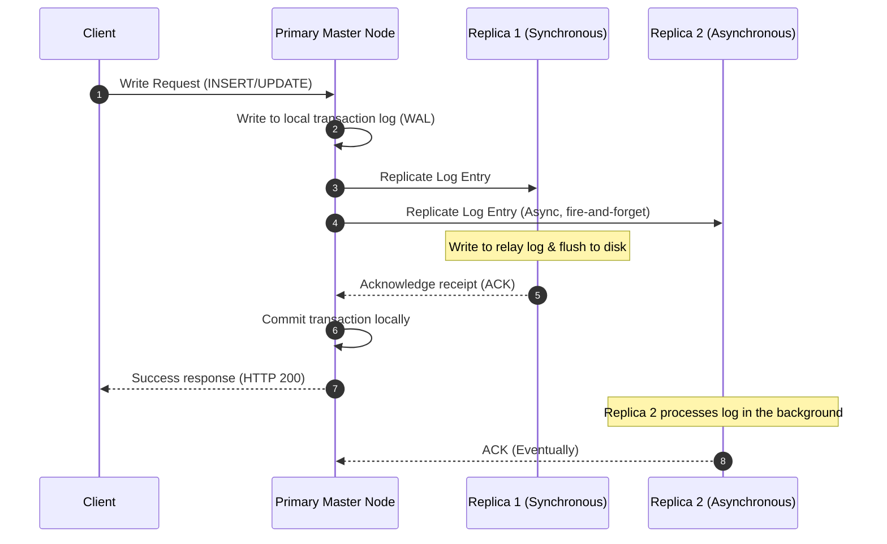
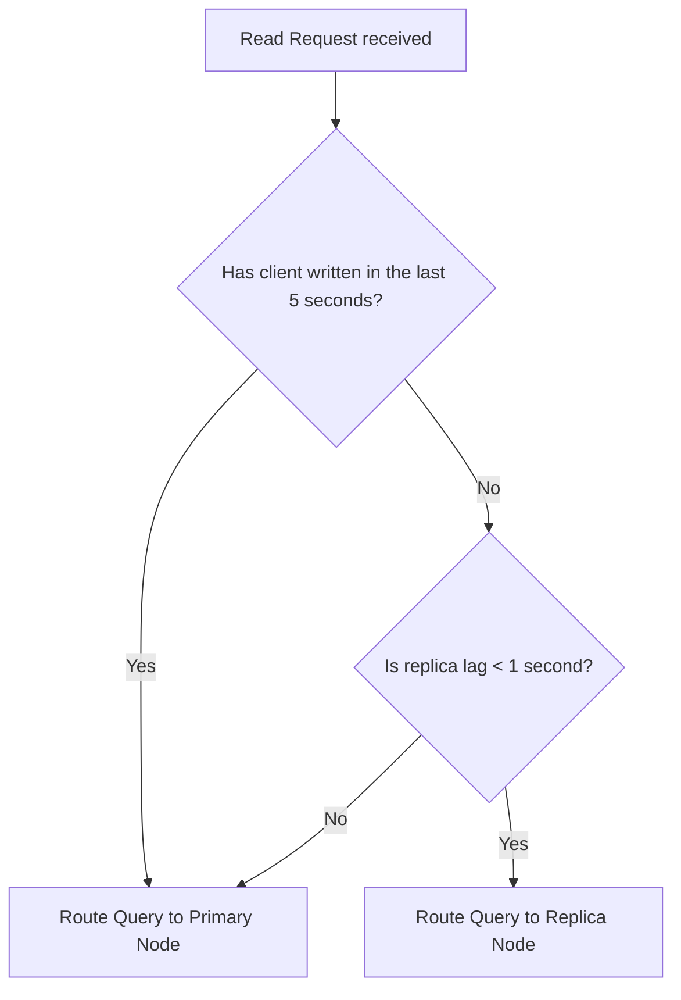

# Database Replication

## 1. Core Concept & Scaling Theory

Database replication copies data across multiple nodes to ensure high availability, load distribution, and disaster recovery.

### Mathematical Estimations & Scaling Calculations

#### A. Replication Lag Recovery Time Math
* **Scenario:** A network partition disconnects a database replica from the primary node for $1$ hour ($3,600$ seconds).
* **System Metrics:**
  * Primary Write Rate ($W_{rate}$): $12 \text{ MB/s}$ of transaction logs (write-ahead log / binlog).
  * Replication Network Link Capacity ($C_{link}$): $100 \text{ Mbps} \approx 12.5 \text{ MB/s}$.
  * Replica Maximum Processing/Write Speed ($R_{speed}$): $15 \text{ MB/s}$.
* **Replication Outage Accumulation:**
  During the outage, write logs accumulate on the primary:
  $$\text{Accumulated Log} = W_{rate} \times T_{outage} = 12 \text{ MB/s} \times 3,600 \text{ s} = 43,200 \text{ MB} \approx 43.2 \text{ GB}$$
* **Recovery / Catchup Analysis:**
  Once connection is restored, the replica pulls data at the maximum network rate ($12.5 \text{ MB/s}$), which is slower than its processing speed ($15 \text{ MB/s}$). Thus, the network link is the bottleneck. The net catch-up speed ($S_{net}$) is the difference between the replication link rate and the ongoing write rate:
  $$S_{net} = C_{link} - W_{rate} = 12.5 \text{ MB/s} - 12 \text{ MB/s} = 0.5 \text{ MB/s}$$
* **Time to catch up ($T_{recovery}$):**
  $$T_{recovery} = \frac{\text{Accumulated Log}}{S_{net}} = \frac{43,200 \text{ MB}}{0.5 \text{ MB/s}} = 86,400 \text{ seconds} = 24 \text{ hours}$$
  *Conclusion:* A $1$-hour outage requires $24$ hours to recover because the network link is close to saturation. This demonstrates the need for network headroom in replication configurations.

#### B. Leaderless Quorum Math ($W + R > N$)
To guarantee that a read operation always retrieves the latest write (strong consistency) in a leaderless system:
* Let $N$ = Replication factor (total replicas).
* Let $W$ = Write quorum (number of nodes that must confirm a write before returning success).
* Let $R$ = Read quorum (number of nodes queried for a read operation).
* **Quorum Condition:**
  $$W + R > N$$
  This inequality ensures that the set of nodes written to and the set of nodes read from must overlap by at least one node. This overlapping node contains the most recent write.

##### Example Configurations ($N = 3$):
1. **Strong Consistency ($W = 2, R = 2$):**
   $$W + R = 4 > 3$$
   Guarantees that at least one node in the read set was also in the write set.
2. **Write-Optimized ($W = 1, R = 3$):**
   $$W + R = 4 > 3$$
   Fast writes, but reads are slower because they must query all $3$ nodes.
3. **Read-Optimized ($W = 3, R = 1$):**
   $$W + R = 4 > 3$$
   Fast reads, but writes are slower because they must update all $3$ nodes.
4. **Eventual Consistency ($W = 2, R = 1$):**
   $$W + R = 3 \ngtr 3$$
   Reads may return stale data because the read node may not have received the latest write.

### Comparative Analysis: Replication Models

| Feature | Single-Leader (Asynchronous) | Single-Leader (Semi-Synchronous) | Multi-Leader (Active-Active) | Leaderless (Cassandra/Dynamo) |
| :--- | :--- | :--- | :--- | :--- |
| **Write Latency** | Low (returns immediately after primary write) | Medium (awaits confirmation from at least one replica) | Low (writes to any local master) | Low/Medium (depends on $W$) |
| **Read Consistency** | Eventual (stale reads possible due to replica lag) | Strong (if reading from the synchronized replica) | Eventual | Strong if $W + R > N$ |
| **Failover Process** | Manual or automatic promotion of replica | Same as asynchronous | Not needed (writes continue on other masters) | Not needed (no leader exists) |
| **Conflict Resolution** | Not required (single writer) | Not required | High complexity (requires CRDTs, LWW, or manual merge) | Resolves conflicts during read/write (e.g. Last-Write-Wins) |
| **Best Use Case** | Read-heavy web systems | High-reliability databases (e.g. financial ledgers) | Multi-region write scaling | High availability, partition-tolerant writes |

---

## 2. Visual Architecture Diagram

Below is the message flow in a **Semi-Synchronous Replication** setup. It illustrates how the primary node commits writes only after at least one replica has acknowledged receipt of the transaction log.



---

## 3. Data Models & API Signatures

### Schema Design: Replication Lag & Heartbeat Monitor (SQL)
Used by orchestration tools (e.g., Orchestrator) to track replica health and manage failover configurations.

```sql
-- Dynamic status of replicas reporting to master
CREATE TABLE replication_health (
    replica_id VARCHAR(64) PRIMARY KEY,
    host_address VARCHAR(45) NOT NULL,
    replication_mode VARCHAR(32) DEFAULT 'ASYNC', -- ASYNC, SEMI_SYNC, SYNC
    replication_state VARCHAR(32) DEFAULT 'RUNNING', -- RUNNING, STOPPED, ERROR
    read_only BOOLEAN DEFAULT TRUE,
    master_binlog_file VARCHAR(256),
    master_binlog_position BIGINT,
    replica_binlog_file VARCHAR(256),
    replica_binlog_position BIGINT,
    seconds_behind_master INT DEFAULT 0, -- Lag metric
    last_heartbeat_timestamp TIMESTAMP DEFAULT CURRENT_TIMESTAMP ON UPDATE CURRENT_TIMESTAMP
);

CREATE INDEX idx_lag_state ON replication_health (seconds_behind_master, replication_state);
```

### Replication Health & Switchover Control API
Endpoints used by the failover manager to promote a replica or monitor replication lag.

#### GET `/api/v1/replication/status`
```json
{
  "cluster_id": "mysql_cluster_01",
  "nodes": [
    {
      "node_id": "node_primary_01",
      "role": "PRIMARY",
      "status": "ONLINE",
      "binlog_position": 94827110
    },
    {
      "node_id": "node_replica_01",
      "role": "REPLICA",
      "status": "ONLINE",
      "replication_mode": "SEMI_SYNC",
      "seconds_behind_master": 0,
      "replica_binlog_position": 94827110
    },
    {
      "node_id": "node_replica_02",
      "role": "REPLICA",
      "status": "ONLINE",
      "replication_mode": "ASYNC",
      "seconds_behind_master": 2,
      "replica_binlog_position": 94826904
    }
  ]
}
```

#### POST `/api/v1/replication/failover`
Used to force a primary failover during a outage or planned maintenance.
```json
{
  "cluster_id": "mysql_cluster_01",
  "action": "PROMOTION",
  "target_replica_id": "node_replica_01",
  "grace_period_seconds": 30,
  "demote_current_primary": true
}
```

---

## 4. Operational Flows

### Read-Your-Own-Writes Consistency Path
When a client updates a profile and immediately refreshes the page, asynchronous replication lag can cause the read query to hit a replica that has not yet received the update. This makes it appear as though the update was lost.

#### Mitigation Design (Session-Based Routing)
1. **Write Path:** The client submits a write request. The application updates the primary database and records the write timestamp (or transaction log identifier, e.g., `GTID`) in the client's session state (stored in a cookie or Redis).
2. **Read Path:** When the client performs a read request, the routing layer checks the update timestamp.
   * If the time elapsed since the last write is less than the maximum replication lag threshold (e.g., $5$ seconds), the read query is routed to the primary node.
   * Alternatively, if the target replica's processed transaction ID is less than the client's session transaction ID, the query is routed to the primary or block-waited on the replica.
   * Otherwise, the read query is routed to a replica.



---

## 5. High Availability, Failovers & Bottlenecks

### Split-Brain Mitigation
In active-passive replication, split-brain occurs if the primary node is temporarily disconnected from the cluster but remains active. The replicas assume the primary is dead and elect a new primary node. When the network connection is restored, both primary nodes accept writes, leading to data inconsistency.

#### Mitigations:
1. **Consensus Protocols (Raft/Paxos):** Ensure elections require a majority of nodes to participate. The old primary, isolated in a minority partition, cannot reach quorum and automatically steps down to read-only mode.
2. **Fencing (STONITH - Shoot The Other Node In The Head):** A node promoted to primary uses an external power distribution unit (PDU) or hypervisor API to power down or reboot the old primary node. This ensures the old primary cannot write to disk.
3. **Fencing Tokens:** Databases use monotonic counters. Replicas reject write requests from any primary node whose fencing token is lower than the current active epoch token.

---

## 6. Comprehensive Interview Q&A

### Q1: What is the difference between MySQL Statement-Based Replication (SBR) and Row-Based Replication (RBR)?
**Answer:**
* **Statement-Based Replication (SBR):** The primary writes the raw SQL statements (e.g., `UPDATE users SET status = 'active' WHERE age > 21`) to the binary log, and the replicas execute the same SQL statements locally.
  * *Pros:* High performance and low network bandwidth usage, as only the query strings are transferred.
  * *Cons:* Non-deterministic functions (like `NOW()`, `RAND()`, or `UUID()`) evaluate differently on the replicas, leading to data drift. Queries using `LIMIT` without an `ORDER BY` can also yield different results.
* **Row-Based Replication (RBR):** The primary writes the actual row modifications (the before-and-after image of each modified row) to the log.
  * *Pros:* Safe and deterministic. All changes are replicated exactly as they were committed on the primary.
  * *Cons:* High network bandwidth usage. For example, an `UPDATE` statement modifying $1,000,000$ rows generates a massive transaction log containing all $1,000,000$ modified row states, which can saturate the replication network link.

### Q2: How does Semi-Synchronous replication balance consistency and performance compared to synchronous and asynchronous replication?
**Answer:**
* **Asynchronous Replication:** The primary commits the transaction locally and responds to the client immediately without waiting for replicas. This offers the lowest latency but carries a risk of data loss if the primary crashes before the logs are transferred to the replicas.
* **Synchronous Replication:** The primary waits for *all* replicas to commit the transaction before responding to the client. This guarantees strong consistency and zero data loss, but write latency is high and writes will fail if any replica goes offline.
* **Semi-Synchronous Replication:** The primary commits the transaction and responds to the client only after *at least one* replica acknowledges that it has received and written the transaction log to its relay log. This guarantees that at least two nodes contain the data, preventing data loss if the primary crashes, while maintaining write availability even if other replicas are offline.

### Q3: Explain the concept of "Replication Lag" and describe three ways to monitor it in production.
**Answer:**
**Replication Lag** is the time difference between a transaction committing on the primary node and that same transaction committing on a replica.
Ways to monitor it:
1. **Seconds Behind Master:** MySQL provides a `Seconds_Behind_Master` metric in `SHOW REPLICA STATUS`. This calculates the difference between the timestamp of the event currently executing on the replica and the timestamp when the event was recorded on the primary.
   * *Limitation:* It can be inaccurate if the replication thread is idle or experiencing network issues.
2. **Heartbeat Injection (e.g., Pt-Heartbeat):** A background monitoring service writes a high-precision timestamp into a dedicated table on the primary every second. Replicas replicate this update. The monitor reads the timestamp from the replica table and subtracts it from the current system time to calculate the exact replication lag.
3. **Transaction ID Checking (GTID/LSN):** Compare the current Log Sequence Number (LSN) in PostgreSQL or Global Transaction ID (GTID) set on the primary with the latest LSN/GTID processed by the replica. The difference in bytes or transaction counts indicates the exact replication backlog.

### Q4: How does a leaderless system like Apache Cassandra resolve conflicts during a read operation if two replicas return different versions of the same row?
**Answer:**
Cassandra resolves read conflicts using **Read Repair** and a conflict resolution strategy:
1. When a client performs a read query with a quorum level (e.g., $R = 2$), the coordinator node queries the two replicas. One replica returns the full row data, while the other returns a hash of the row data.
2. If the hash matches, the data is returned to the client.
3. If the hash does not match, the coordinator requests the full data from both replicas.
4. **Conflict Resolution (Last-Write-Wins - LWW):** Cassandra compares the timestamps of the columns. The column value with the highest timestamp is treated as the correct, current state and returned to the client.
5. **Read Repair:** The coordinator sends an asynchronous write request containing the correct data to the replica that returned the stale data, ensuring the replica's state is updated.
