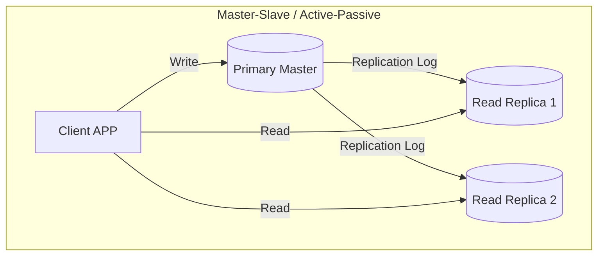

# Database Replication

Replication copies data across multiple database instances to ensure high availability, fault tolerance, and query scaling.

---

## 1. Replication Models

### Primary-Replica (Master-Slave / Active-Passive)
* **Writes:** Sent exclusively to the **Primary Master** node.
* **Reads:** Distributed across multiple **Replica** (Slave) nodes.
* **Pros:** Scales read throughput easily (just add replicas).
* **Cons:** Write scaling is limited by a single primary node. If the master dies, failover election takes time.

### Multi-Primary (Master-Master / Active-Active)
* **Writes/Reads:** Sent to any active master node.
* **Cons:** Concurrency issues. Resolving write conflicts (split-brain, double writes) is extremely complex.

---

## 2. Replication Lag & Consistency Trade-offs
* **Synchronous Replication:** Master blocks until all replicas confirm receipt.
  * *Pros:* No data loss, immediate read-after-write consistency.
  * *Cons:* Extreme latency; if one replica goes offline, writes stall.
* **Asynchronous Replication:** Master writes locally, responds to client immediately, and updates replicas in the background.
  * *Pros:* Zero latency impact.
  * *Cons:* Replicas lag. If master crashes before replication log reaches replicas, data is lost (Dirty Reads occur).

---

## 3. Quorum Reads & Writes
In leaderless distributed databases (e.g. Cassandra), we calculate quorum configuration:
* $N$ = Number of replication nodes.
* $W$ = Number of write nodes that must confirm success before a write is committed.
* $R$ = Number of read nodes queried before returning the value.

### Quorum Equation
To achieve **Strong Consistency** (always reading the latest write), configure nodes such that:
$$W + R > N$$

---

## Interview Q&A Corner

> [!WARNING]
> **Q: What is split-brain in database replication, and how is it solved?**
> A: Split-brain happens in Master-Slave configurations when a network partition cuts off the Master from the Replicas. The replicas assume the master is dead and elect a new master. However, the old master is still active, leading to two active writing master nodes.
> *Solution:* Use a **Quorum-based Consensus algorithm** (Raft or Paxos) requiring a strict majority ($> 50\%$) of nodes to elect a leader and validate write commits. A partitioned minority cannot achieve quorum and transitions to read-only mode automatically.
