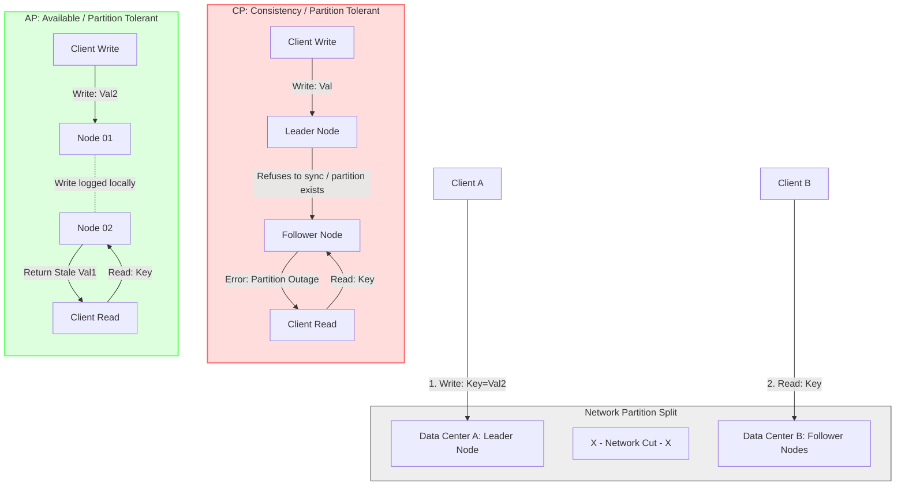

# CAP & PACELC Theorems

## 1. Core Concept & Scaling Theory

The **CAP Theorem** (Brewer's Theorem) states that a distributed data store can simultaneously provide at most two of the following three guarantees:
1. **Consistency (C):** Every read receives the most recent write or an error.
2. **Availability (A):** Every non-failing node returns a non-error response for every request (without guaranteeing it contains the latest write).
3. **Partition Tolerance (P):** The system continues to operate despite arbitrary message loss or network partitions.

The **PACELC Theorem** extends CAP by describing the trade-offs of distributed systems under normal operating conditions:
$$\text{If } \mathbf{P} \text{ (Partition), choose } \mathbf{A} \text{ (Availability) or } \mathbf{C} \text{ (Consistency); } \mathbf{E} \text{lse (Normal operation), choose } \mathbf{L} \text{ (Latency) or } \mathbf{C} \text{ (Consistency).}$$

### Mathematical Latency Estimations & Consensus Trade-offs

#### A. Latency Sizing in a Geodistributed Consensus Cluster (PC/EC)
Consider a 3-node cluster executing Paxos consensus across three regions:
* **Region A (New York):** Coordinator Node.
* **Region B (London):** Network Round-Trip Time (RTT) from New York = $70 \text{ ms}$.
* **Region C (Tokyo):** RTT from New York = $140 \text{ ms}$.
* **RTT B to C (London to Tokyo):** $220 \text{ ms}$.

To complete a write operation in a **Consistency-first (PC/EC)** system (e.g. Google Spanner), the coordinator must receive acknowledgments from a majority of nodes:
$$\text{Majority Quorum} = \left\lfloor \frac{N}{2} \right\rfloor + 1 = \left\lfloor \frac{3}{2} \right\rfloor + 1 = 2 \text{ nodes}$$

* **Write Latency Calculation:**
  When New York receives a write request, it writes locally ($0.5 \text{ ms}$) and sends consensus requests to London and Tokyo in parallel.
  * London responds in: $70 \text{ ms}$ (network) + local write time $\approx 70.5 \text{ ms}$.
  * Tokyo responds in: $140 \text{ ms}$ (network) + local write time $\approx 140.5 \text{ ms}$.
  * The coordinator in New York achieves a majority as soon as it receives the acknowledgment from London (2 nodes: New York + London). It does not need to wait for Tokyo.
  $$\text{Write Latency}_{PC/EC} \approx 70.5 \text{ ms}$$

* **Write Latency in a Latency-optimized (PA/EL) system (e.g. Cassandra / DynamoDB):**
  If configured with local consistency (`ConsistencyLevel.ONE`), the node in New York writes locally and acknowledges the client immediately. Replication to London and Tokyo happens asynchronously in the background.
  $$\text{Write Latency}_{PA/EL} \approx 0.5 \text{ ms}$$
  *Conclusion:* Choosing Latency (EL) over Consistency (EC) during normal operations reduces client write latency from $70.5 \text{ ms}$ to $0.5 \text{ ms}$ ($99.3\%$ reduction), but introduces replication lag and temporary stale reads in London and Tokyo.

### Database Classification Matrix (PACELC)

| Database | CAP Choice | PACELC Choice | Normal Write Latency | Behavior During Partition (P) | Behavior During Normal Run (E) |
| :--- | :--- | :--- | :--- | :--- | :--- |
| **Google Spanner** | CP | **PC/EC** | High (Multi-region Paxos + TrueTime wait) | Rejects writes if majority consensus cannot be reached. | Guarantees external consistency using synchronized clocks. |
| **Cassandra** | AP | **PA/EL** | Low (Writes to any node locally) | Accepts writes on any partition; resolves conflicts on read. | Prioritizes latency; replication is asynchronous. |
| **MongoDB** | CP | **PA/EC** | Medium (Writes to Primary node) | Replicas in the minority partition stop accepting writes. | Replicas pull from primary asynchronously; primary ensures consistency. |
| **CockroachDB** | CP | **PC/EC** | High (Raft consensus per Range) | Aborts transactions in the partitioned range. | Guarantees serializable isolation. |
| **DynamoDB** | AP | **PA/EL** | Low (Configurable) | Accepts writes; uses version vectors to detect conflicts. | Optimizes for low latency read/write paths. |

---

## 2. Visual Architecture Diagram

Below is the behavior of CP and AP systems when a network partition cuts off the connection between Data Center A and Data Center B.



---

## 3. Data Models & API Signatures

### Cassandra Schema Design with Consistency Settings (CQL)
This schema defines a geodistributed keyspace that replicates data across multiple data centers.

```sql
-- Create a keyspace replicating across two regions (US-East and US-West)
CREATE KEYSPACE application_store
WITH replication = {
    'class': 'NetworkTopologyStrategy',
    'us-east': 3,
    'us-west': 3
};

USE application_store;

-- User session tracking table
CREATE TABLE user_sessions (
    user_id UUID,
    session_id TEXT,
    payload BLOB,
    last_accessed TIMESTAMP,
    PRIMARY KEY (user_id)
);
```

### Client Consistency Request API Signature (JSON)
Below is the payload structure used by client drivers to specify consistency levels for individual database operations.

#### POST `/api/v1/db/execute`
```json
{
  "query": "INSERT INTO user_sessions (user_id, session_id, last_accessed) VALUES (9c7c2b3e-e63c-44bf-a292-ba78e63080ff, 'sess_99382', '2026-06-03 02:26:00')",
  "consistency_settings": {
    "write_consistency": "LOCAL_QUORUM", -- Write must succeed on majority of local region nodes
    "read_consistency": "LOCAL_ONE",     -- Read from closest local node (low latency)
    "allow_stale_reads": true,
    "timeout_ms": 250
  }
}
```

---

## 4. Operational Flows

### A. Operational Path Under Partition: CP (Consistency-First)
1. **Network Partition occurs:** Node A (Primary) and Node B (Secondary) are disconnected.
2. **Write Request arrives:** Client attempts to write to Node A.
3. **Consensus Check:** Node A attempts to reach Node B to replicate the write.
4. **Quorum Failure:** Because Node B is unreachable, Node A cannot achieve a write quorum.
5. **Abort:** Node A rejects the write and returns an error (HTTP 503 Service Unavailable) to the client. This maintains consistency, as no data is written that cannot be replicated.

### B. Operational Path Under Partition: AP (Availability-First)
1. **Network Partition occurs:** Node A and Node B are disconnected.
2. **Write Request arrives:** Client writes to Node A.
3. **Local Commit:** Node A commits the write locally and returns success to the client immediately.
4. **Queue Replication (Hinted Handoff):** Node A detects that Node B is unreachable. It stores a "hint" (the write log payload) in a local buffer (`hinted_handoff` table).
5. **Stale Read:** A different client reads from Node B. Since Node B is disconnected from Node A, it returns the older, stale version of the data. This maintains availability, as reads and writes continue despite the partition.
6. **Recovery Sync:** When the partition heals, Node A reads the buffered hints and pushes the updates to Node B, restoring eventual consistency.

---

## 5. High Availability, Failovers & Bottlenecks

### Split-Brain Prevention
If a network partition divides a cluster into two halves (e.g. 5 nodes split into 2 and 3), we must prevent both partitions from acting as the active primary.
* **Majority Rule:** Only the partition containing a strict majority of nodes ($\ge \lfloor \frac{N}{2} \rfloor + 1$) is permitted to elect a leader and accept writes. In a 5-node cluster, the partition with 3 nodes continues to operate, while the partition with 2 nodes blocks writes. This prevents split-brain inconsistencies.

### Vector Clocks & Conflict Resolution in AP Systems
Because AP systems permit writes to multiple partitions during a network split, conflicts can occur when the partition heals.
* **Vector Clocks:** Every write is tagged with a vector clock (a map of nodes and logical counter sequences, e.g., `[NodeA: 1, NodeB: 3]`).
* **Causality Detection:**
  * If Vector Clock $V_1$ has all counters less than or equal to the counters in $V_2$, then $V_2$ is a causal descendant of $V_1$. The database can automatically overwrite $V_1$ with $V_2$.
  * If the clocks have conflicting counter values (e.g., $V_1 = [NodeA: 2, NodeB: 1]$ and $V_2 = [NodeA: 1, NodeB: 2]$), a concurrent conflict is detected.
* **Conflict Resolution:** The system resolves the conflict using either a configured strategy like Last-Write-Wins (LWW) based on system timestamps, or by returning both versions (siblings) to the application layer for manual merging.

---

## 6. Comprehensive Interview Q&A

### Q1: Why is a "CA" (Consistent and Available) system physically impossible to build across a distributed network?
**Answer:**
A **CA** system claims to provide both consistency and availability at all times. However, by definition, a distributed network is subject to physical hardware failures, fiber cuts, and routing errors that cause network partitions (**P**).
If a network partition occurs:
1. Some nodes cannot communicate with others.
2. If a client writes to Node A, Node A cannot replicate that write to Node B due to the partition.
3. If Node B receives a read request, the system must make a choice:
   * **To maintain Consistency (C):** Node B must refuse to return its stale data. It returns an error or blocks, which means the system is not **Available (A)**.
   * **To maintain Availability (A):** Node B returns its current data, but this data does not reflect the write to Node A. This means the system is not **Consistent (C)**.

Since a network partition is a physical reality that cannot be avoided, a distributed system must choose between Consistency and Availability. It cannot choose both, making a "CA" system impossible.

### Q2: What is the PACELC theorem, and what limitation of the CAP theorem does it address?
**Answer:**
The **CAP Theorem** only describes system behavior during a network partition (**P**). It does not address how a system behaves during normal operations when the network is functioning correctly.

The **PACELC Theorem** addresses this limitation:
* **PA/EL:** If there is a Partition (**P**), prioritize Availability (**A**); Else (**E**), prioritize Latency (**L**) over Consistency (**C**). (e.g., Cassandra, DynamoDB).
* **PC/EC:** If there is a Partition (**P**), prioritize Consistency (**C**); Else (**E**), prioritize Consistency (**C**) over Latency (**L**). (e.g., Google Spanner).

This extension captures the trade-off between latency and consistency during normal operations. For example, a system may choose to replicate asynchronously to reduce latency (EL), even if it does not experience a partition.

### Q3: Explain how Google Spanner achieves PC/EC (Consistency under partition, Consistency under normal run) without using global locks.
**Answer:**
Google Spanner achieves serializable consistency globally by using **TrueTime**, a highly synchronized time API.
1. **TrueTime hardware:** Spanner deployments use GPS receivers and atomic clocks in each data center. These clocks are synchronized, and the TrueTime API returns a time interval $[t_{earliest}, t_{latest}]$ representing the current time, with a worst-case uncertainty bound ($\epsilon$) of $\approx 1$ ms.
2. **Commit Wait:** When a transaction commits, the coordinator assigns it a commit timestamp $s$ equal to $t_{latest}$ from the TrueTime API. The coordinator then waits until TrueTime guarantees that the current time has passed $s$ ($t_{earliest} > s$) before releasing locks and making the transaction visible.
3. This ensures that transactions are ordered correctly globally based on real-world time, without requiring a centralized lock manager or cross-region locking, while maintaining **PC/EC** characteristics.

### Q4: How does a database like Apache Cassandra implement "Hinted Handoff" to maintain Availability during network partitions?
**Answer:**
**Hinted Handoff** is a mechanism used in Cassandra and Dynamo-style databases to maintain write availability when a replica node goes offline or becomes unreachable due to a network partition.
1. When a coordinator node receives a write request, it identifies the target replica nodes based on the key's hash.
2. If a target replica node is unreachable, the coordinator writes the update locally to a dedicated directory called **hints**. The hint contains the target node's ID, the column key, the value, and the write timestamp.
3. The coordinator then responds to the client confirming the write (assuming other active nodes met the write consistency quorum).
4. A background daemon on the coordinator periodically checks if the unreachable node has returned online.
5. Once the node is reachable, the coordinator streams the buffered hints to it, restoring consistency.
6. If the target node remains offline longer than a configured threshold (e.g., 3 hours), the hints are expired, and consistency must be restored using manual read repairs or anti-entropy active repair jobs.
