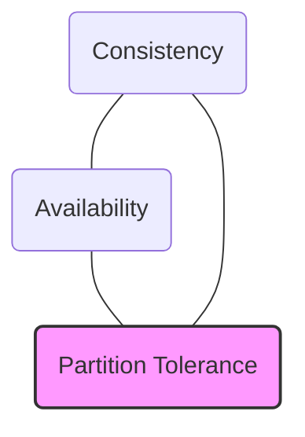

# CAP & PACELC Theorems

These theorems define the structural trade-offs and limits of consistency, availability, and latency in distributed data systems.

---

## 1. CAP Theorem

* **Consistency (C):** Every read receives the most recent write or an error.
* **Availability (A):** Every non-failing node returns a non-error response (without guarantee of containing the latest write).
* **Partition Tolerance (P):** The system continues to operate despite arbitrary message loss or network partitions.

### The Core Rule of CAP
In a distributed system, network partitions **will** happen. Therefore, you **must choose Partition Tolerance (P)**. This leaves you a choice between:
1. **CP (Consistency / Partition Tolerance):** Block/reject writes if nodes cannot talk to ensure consistency.
2. **AP (Availability / Partition Tolerance):** Allow writes to separate partitions, returning stale/conflicting data, to ensure availability.

---

## 2. PACELC Theorem (The Extension)
PACELC addresses CAP's limitations by adding the **Latency** tradeoff during normal operations (when there is no network partition).

$$\text{If } \mathbf{P} \text{ (Partition), choose } \mathbf{A} \text{ or } \mathbf{C}. \quad \mathbf{E} \text{lse (Normal), choose } \mathbf{L} \text{ or } \mathbf{C}.$$

| Class | Partition Scenario (P) | Normal Scenario (E) | Real-world Databases |
|-------|------------------------|---------------------|----------------------|
| **PA/EL** | Availability | Latency | MongoDB, DynamoDB, Cassandra |
| **PC/EC** | Consistency | Consistency | Spanner, BigTable, Relational RDBMS |

---

## Interview Q&A Corner

> [!IMPORTANT]
> **Q: Explain how PACELC applies to a shopping cart database.**
> A: A shopping cart should prioritize low latency to prevent customers from abandoning their checkout. We would choose a **PA/EL** database (like DynamoDB). If a network partition occurs, we allow writes to ensure the cart is always open (Availability). Even when running normally, we write asynchronously to replicas to ensure fast responses (Latency over immediate Consistency).
