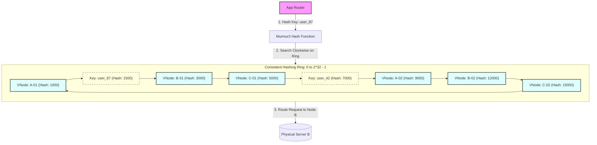

# Consistent Hashing

## 1. Core Concept & Scaling Theory

Consistent Hashing is a distributed hashing scheme that operates independently of the number of servers in a cluster. It maps both data keys and server nodes to a shared logical address space, typically represented as a circular ring.

### Mathematical Estimations & Scaling Calculations

#### A. Key Migration Sizing Comparison
* Let $K$ be the total number of keys in the system, and $N$ be the number of active database shards/cache nodes.
* **Conventional Modulo Hashing (`Hash(Key) % N`):**
  When a new server is added, the hashing denominator shifts from $N$ to $N+1$. The probability that a key routes to the same node is:
  $$P_{\text{same}} = \frac{1}{N+1}$$
  The fraction of keys that must be migrated is:
  $$\text{Migration Fraction}_{\text{modulo}} = 1 - P_{\text{same}} = \frac{N}{N+1}$$
  *Example:* For $N = 9$ scaling to $10$ servers:
  $$\text{Migration Fraction}_{\text{modulo}} = \frac{9}{10} = 90\% \text{ of keys must migrate}$$

* **Consistent Hashing:**
  Consistent hashing assigns keys to the next clockwise node. When a new node is added, it only splits the address space of its immediate counter-clockwise neighbor. The fraction of keys that must be migrated is:
  $$\text{Migration Fraction}_{\text{consistent}} = \frac{1}{N+1}$$
  *Example:* For $N = 9$ scaling to $10$ servers:
  $$\text{Migration Fraction}_{\text{consistent}} = \frac{1}{10} = 10\% \text{ of keys must migrate}$$
  *Conclusion:* Consistent hashing reduces data migration requirements by $88.8\%$ in this scenario, preventing cache-eviction storms and network saturation.

#### B. Sizing Virtual Nodes (VNodes) for Load Balance
If physical servers are mapped directly to the ring, random hashing can cause uneven spacing, leading to load imbalance. We solve this by mapping each physical node to $V$ virtual nodes (VNodes).
* **Imbalance Factor ($\sigma$):** The standard deviation of the load distribution across physical nodes. The relationship between the number of virtual nodes ($V$) per physical node and load variance is:
  $$\sigma \approx \frac{1}{\sqrt{V}}$$
* **Calculations:**
  * If we use $V = 10$ VNodes per physical server:
    $$\sigma \approx \frac{1}{\sqrt{10}} \approx 31.6\% \text{ load variance (high risk of hotspotting)}$$
  * If we use $V = 100$ VNodes per physical server:
    $$\sigma \approx \frac{1}{\sqrt{100}} = 10\% \text{ load variance}$$
  * If we use $V = 1000$ VNodes per physical server:
    $$\sigma \approx \frac{1}{\sqrt{1000}} \approx 3.16\% \text{ load variance (highly uniform distribution)}$$
  * *Trade-off:* While larger $V$ values improve load balance, they increase the memory footprint of the routing table and lookup latency ($O(\log(N \times V))$). A value of $V \in [100, 250]$ is typically chosen in production.

---

## 2. Visual Architecture Diagram

Below is a consistent hashing ring mapping 3 physical servers (A, B, C) using 2 virtual nodes each (e.g. `A-01`, `A-02`) and routing keys clockwise.



---

## 3. Data Models & API Signatures

### Ring Topology Database Schema (SQL)
Used to persist cluster configuration and track which physical nodes own which hash tokens.

```sql
-- Represents physical nodes in the cluster
CREATE TABLE cluster_nodes (
    node_id VARCHAR(64) PRIMARY KEY,
    hostname VARCHAR(256) NOT NULL,
    ip_address VARCHAR(45) NOT NULL,
    port INT NOT NULL,
    capacity_weight INT DEFAULT 100, -- Allows heterogeneous node capacity
    status VARCHAR(32) DEFAULT 'ACTIVE' -- ACTIVE, JOINING, LEAVING, DOWN
);

-- Represents the token ring allocation
CREATE TABLE ring_tokens (
    token_value BIGINT NOT NULL CHECK (token_value >= 0), -- Represents point on the ring [0, 2^32-1]
    node_id VARCHAR(64) REFERENCES cluster_nodes(node_id) ON DELETE CASCADE,
    vnode_identifier VARCHAR(128) NOT NULL, -- e.g., 'node_01-vnode-45'
    PRIMARY KEY (token_value)
);

CREATE INDEX idx_ring_tokens ON ring_tokens (token_value);
```

### Consistent Hashing Ring Core Code Implementation (Java)
Production-grade pseudo-code implementing key routing, node additions, and node removals using a binary search tree (`TreeMap`).

```java
import java.nio.charset.StandardCharsets;
import java.security.MessageDigest;
import java.security.NoSuchAlgorithmException;
import java.util.SortedMap;
import java.util.TreeMap;

public class ConsistentHashRing {
    private final TreeMap<Long, String> circle = new TreeMap<>();
    private final int numberOfReplicas; // Number of virtual nodes per physical node

    public ConsistentHashRing(int numberOfReplicas) {
        this.numberOfReplicas = numberOfReplicas;
    }

    // SHA-256 hash function mapped to 32-bit integer space (0 to 4,294,967,295)
    private long hash(String key) {
        try {
            MessageDigest md = MessageDigest.getInstance("SHA-256");
            byte[] digest = md.digest(key.getBytes(StandardCharsets.UTF_8));
            // Read first 4 bytes as an unsigned 32-bit integer
            long h = 0;
            for (int i = 0; i < 4; i++) {
                h <<= 8;
                h |= (digest[i] & 0xFF);
            }
            return h;
        } catch (NoSuchAlgorithmException e) {
            throw new RuntimeException("SHA-256 not supported", e);
        }
    }

    public synchronized void addNode(String nodeIp) {
        for (int i = 0; i < numberOfReplicas; i++) {
            String vNodeKey = nodeIp + "-vnode-" + i;
            circle.put(hash(vNodeKey), nodeIp);
        }
    }

    public synchronized void removeNode(String nodeIp) {
        for (int i = 0; i < numberOfReplicas; i++) {
            String vNodeKey = nodeIp + "-vnode-" + i;
            circle.remove(hash(vNodeKey));
        }
    }

    public String routeKey(String key) {
        if (circle.isEmpty()) {
            return null;
        }
        long hashVal = hash(key);
        // Find the tail map containing keys >= hashVal
        SortedMap<Long, String> tailMap = circle.tailMap(hashVal);
        // If empty, wrap around to the first key in the circle
        long nodeToken = tailMap.isEmpty() ? circle.firstKey() : tailMap.firstKey();
        return circle.get(nodeToken);
    }
}
```

---

## 4. Operational Flows

### A. The Client Key Routing Read/Write Path
1. **Request Received:** The application client sends a request with an entity key (e.g., `user_87`).
2. **Hash Computation:** The client router or proxy hashes the key `user_87` using a fast hash function (e.g., Murmur3), yielding token value $T_{key} = 1500$.
3. **Lookup Phase:** The router performs a lookup in its in-memory `TreeMap` representation of the token ring.
   * It searches for the smallest token value that is greater than or equal to $T_{key}$.
   * If it finds VNode `B-01` at token position $3000$, it maps this VNode to its physical node IP `10.0.0.12`.
4. **Execution:** The router forwards the request directly to physical server B.

### B. Node Addition Migration Flow
When Node D is added to a cluster of nodes A, B, and C:
1. **Token Allocation:** Node D is assigned $V$ tokens on the ring.
2. **Neighbor Identification:** For each assigned token, the router identifies the immediate clockwise node (which currently owns that segment of the ring).
3. **Replication Sync:** Node D requests data replication for only those specific token segments from the clockwise neighbors.
4. **Ring Update:** The routing catalog updates across the cluster. Node D begins accepting writes for its token segments.
5. **Clean up:** The old owner nodes delete the migrated keys from their local storage.

---

## 5. High Availability, Failovers & Bottlenecks

### Mitigation of Skew and Hotspots
If a physical node has higher hardware specifications (e.g. $2\times$ RAM/CPU), we can scale its participation proportionally.
* **Weighted VNodes:** Instead of a fixed replica count, we assign VNodes based on weight:
  $$V_{\text{node\_id}} = \text{BaseReplicas} \times \text{CapacityWeight}$$
  A server with $64\text{GB}$ RAM gets $200$ VNodes, while a server with $32\text{GB}$ RAM gets $100$ VNodes. This ensures that the high-capacity server owns double the address space on the ring.

### Cascade Failover Prevention (Replica Rings)
If a physical node fails, its key ranges are reassigned to the next clockwise nodes. If those nodes cannot handle the additional load, they may crash, leading to a cascading failure.
* **Mitigation (N-Replicas):** When writing a key, write it not only to the coordinator node (first clockwise node) but also to the next $N-1$ physical nodes clockwise on the ring. If the coordinator node goes offline, the replicas can serve the traffic immediately.

---

## 6. Comprehensive Interview Q&A

### Q1: Explain the time and space complexity of adding a node and routing a key in a Consistent Hashing ring implemented using a binary search tree.
**Answer:**
Let $N$ be the number of physical nodes and $V$ be the number of virtual nodes per physical node. The total number of points on the ring is $M = N \times V$.
* **Space Complexity:**
  * The space complexity is $O(M)$ because the tree must store every token value and its mapping to a physical node.
* **Time Complexity:**
  * **Routing a Key:** Finding the correct node requires searching the tree for the nearest key. This is a binary search operation, which takes $O(\log M) = O(\log(N \times V))$ time.
  * **Adding a Node:** Adding a physical node requires inserting its $V$ virtual nodes into the tree. Each insertion takes $O(\log M)$ time, so the total time complexity is $O(V \log M)$.
  * **Removing a Node:** Removing a physical node requires deleting its $V$ virtual nodes, which takes $O(V \log M)$ time.

### Q2: Why is the Murmur3 or Ketama hashing algorithm preferred over cryptographic hash functions like SHA-256 or MD5 for consistent hashing rings?
**Answer:**
* **Performance:** Cryptographic hash functions like SHA-256 and MD5 are designed to be computationally expensive to prevent brute-force attacks. In contrast, consistent hashing rings perform millions of hashes per second on routing proxies. Non-cryptographic hash functions like Murmur3 or Ketama are optimized for speed, offering significantly higher throughput.
* **Distribution Uniformity:** Murmur3 provides excellent distribution properties (minimizing collisions and ensuring hashes are spread evenly across the 32-bit or 128-bit integer space), which is critical for preventing data skew on the ring.
* **Ketama Algorithm:** Ketama is a specific implementation of consistent hashing designed for Memcached. It provides a standard way to map servers to a ring and ensures that client libraries written in different languages calculate the exact same node positions.

### Q3: How does Consistent Hashing handle heterogeneous node capacities (nodes with different CPU, memory, and disk configurations)?
**Answer:**
In a basic consistent hashing ring, every physical node is assigned the same number of virtual nodes, which assumes all nodes have equal capacity.
To support heterogeneous nodes:
1. We assign a capacity weight to each physical node (e.g., Node A has weight 1.0, Node B has weight 2.0).
2. The number of virtual nodes assigned to a physical node is multiplied by its weight. For example, if the base replica count is 100, Node A gets 100 virtual nodes and Node B gets 200 virtual nodes.
3. This allocates twice as much space on the ring to Node B, allowing it to handle double the write load and storage volume.

### Q4: In Dynamo-style databases, how does Consistent Hashing interact with data replication and the "Preference List"?
**Answer:**
In Dynamo-style leaderless databases:
1. A key is hashed to a position on the ring.
2. The first physical node encountered clockwise from this position is the coordinator node for that key.
3. Instead of storing the key only on the coordinator, it is replicated to the next $N-1$ physical nodes clockwise on the ring.
4. **Preference List:** The list of physical nodes responsible for storing a key is called the *preference list*. To ensure high availability, the preference list can contain more than $N$ nodes, allowing the system to route writes to alternative nodes (using hinted handoff) if any of the primary replicas are unreachable.
5. All virtual nodes belonging to the same physical server are skipped when building the preference list for a key, ensuring that replicas are stored on distinct physical hardware instances.
