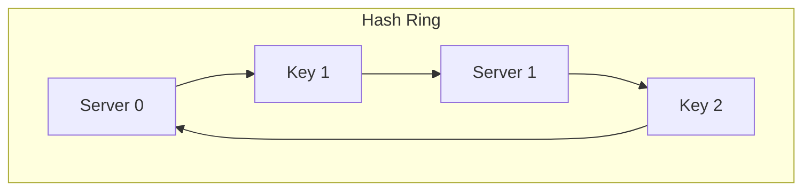

# Consistent Hashing

Consistent Hashing is a distributed hashing scheme that minimizes data migration keys when database shards or cache servers are added or removed.

---

## 1. The Hashing Ring
In normal hashing (`hash(key) % N`), adding a server shifts almost all key locations. 
Consistent Hashing maps both **keys** and **servers** to a circular ring of range $[0, 2^{32}-1]$.

### Route Logic
To find which server hosts a key, locate the key's hash value on the ring, and travel **clockwise** until you hit the first server node.

---

## 2. Virtual Nodes (VNodes)
If servers are mapped directly, random hashes cause uneven distributions, leading to **hotspotting** (one server getting 80% of data).

### Solution
Instead of mapping a server once (e.g. `Server 0`), map it 100+ times using virtual names (e.g. `Server 0-1`, `Server 0-2`, `Server 0-3`). 
* VNodes scatter server endpoints evenly across the ring.
* If a physical server fails, its VNodes are distributed to different physical peers, balancing the failover load.

---

## 3. Operations Impact

| Event | Conventional Hash (`% N`) | Consistent Hashing |
|-------|---------------------------|--------------------|
| **Add Server** | Invalidates $\approx 99\%$ of cached keys | Only $\approx 1/N$ of keys migrate |
| **Remove Server** | Requires full cache reload | Only keys on the dead server migrate |

---

## Interview Q&A Corner

> [!IMPORTANT]
> **Q: How does Consistent Hashing prevent cascading cache failures?**
> A: In conventional hashing, if a cache node dies, the remaining nodes must handle the remapped keys, which miss, causing a massive traffic spike to the DB. In Consistent Hashing, only the keys from the failed node are re-assigned to the next clockwise node. VNodes ensure this fallback load is split evenly across all surviving nodes, preventing a single surviving node from collapsing under the load.
