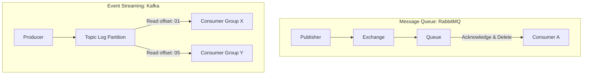

# Message Queues & Event Streaming

Message queues and streaming engines enable asynchronous communication and loose coupling between services.

---

## 1. Message Queue vs Event Streaming

### Message Queue (e.g. RabbitMQ)
* **Behavior:** Messages are stored in a queue. A consumer reads a message, acknowledges it, and the queue **deletes** it.
* **Routing:** Highly flexible routing keys.
* **Ideal for:** Work queues, background task distribution (e.g. converting a PDF).

### Event Streaming (e.g. Apache Kafka)
* **Behavior:** Events are appended to a write-ahead log. Multiple consumers can read the same stream independently by tracking their own **Offset**. Log entries are **durable** and not deleted upon reading.
* **Ideal for:** Activity tracking, event sourcing, log processing.

---

## 2. Kafka Partitioning & Ordering
To scale, Kafka splits topics into **Partitions**.
* Kafka guarantees strict order **only within a single partition**.
* To preserve order (e.g., transactions for `user_id = 42` must process sequentially), supply `user_id` as the **partition key**. All messages with the same key hash to the same partition.

---

## Interview Q&A Corner

> [!WARNING]
> **Q: What happens if a Kafka consumer group has more consumers than there are partitions in a topic?**
> A: Only one consumer can read from a single partition within a consumer group at any given time. If you have 3 partitions and 4 consumers in the same group, the 4th consumer will remain idle. To scale consumption, you must increase the partition count.
