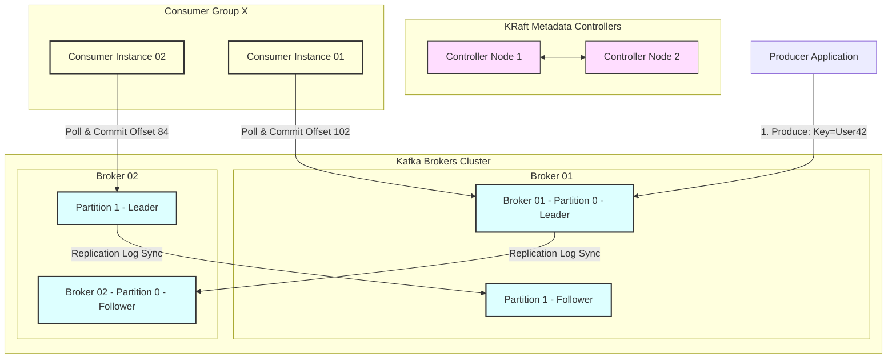
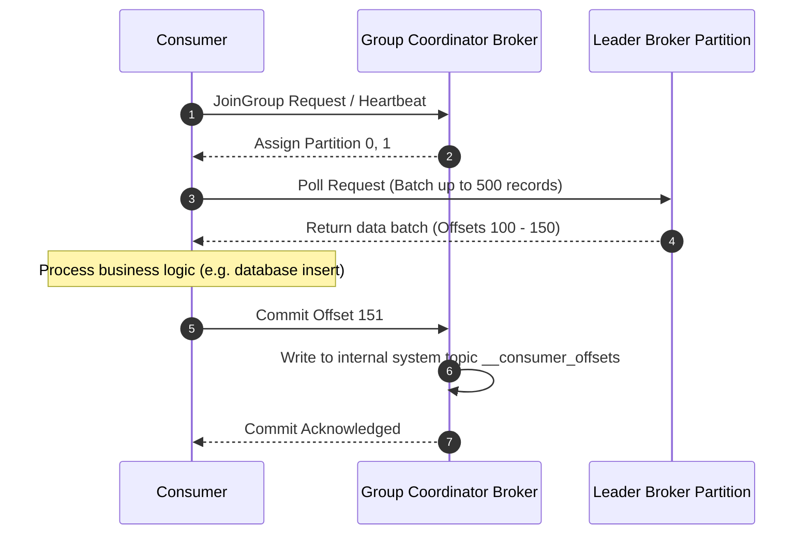

# Message Queues & Event Streaming

## 1. Core Concept & Scaling Theory

Message queues and event streaming systems decouple producers and consumers, enabling asynchronous communication, backpressure buffering, and high-throughput data pipelines.

### Mathematical Estimations & Scaling Calculations

#### A. Event Streaming Storage & Disk Bandwidth Sizing
* **Scenario:** Design a Kafka event streaming cluster for user activity tracking.
* **Input Metrics:**
  * Active Users: $10,000,000$ daily active users.
  * Average Events per User: $50$ events/day.
  * Average Event Size: $1.2 \text{ KB}$ (JSON payload).
  * Data Retention Period: $7$ days.
  * Replication Factor: $3$.
* **Calculations:**
  * **Daily Event Count ($E_{day}$):**
    $$E_{day} = 10,000,000 \times 50 = 500,000,000 \text{ events/day}$$
  * **Daily Raw Storage ($S_{raw\_day}$):**
    $$S_{raw\_day} = 500,000,000 \times 1.2 \text{ KB} = 600,000,000 \text{ KB} \approx 600 \text{ GB/day}$$
  * **Total Storage Sizing (7 days retention + 3x replication + 20% system margin):**
    $$S_{total} = (600 \text{ GB/day} \times 7 \text{ days}) \times 3 \times 1.20 = 15,120 \text{ GB} \approx 15.1 \text{ TB}$$
  * **Network/Disk Write Bandwidth (Average and Peak):**
    * Average write throughput:
      $$\text{Throughput}_{avg} = \frac{600 \text{ GB}}{86,400 \text{ seconds}} \approx 6.94 \text{ MB/s}$$
    * Applying a $5\times$ peak traffic surge factor:
      $$\text{Throughput}_{peak} = 6.94 \text{ MB/s} \times 5 \approx 34.7 \text{ MB/s}$$
    * Due to $3\times$ replication, the cluster network ingress write bandwidth required is:
      $$\text{Cluster Ingress}_{peak} = 34.7 \text{ MB/s} \times 3 = 104.1 \text{ MB/s}$$

#### B. Consumer Lag Catchup Recovery Math
* **Scenario:** A consumer group is offline for maintenance for $3$ hours ($10,800$ seconds).
* **Input Metrics:**
  * Incoming Message Rate ($R_{in}$): $5,000$ messages/sec.
  * Single Consumer Processing Speed ($P_{instance}$): $800$ messages/sec.
  * Number of Consumer Instances ($C$): $10$.
* **Lag Accumulated during Outage ($L$):**
  $$L = R_{in} \times T_{outage} = 5,000 \text{ msg/s} \times 10,800 \text{ s} = 54,000,000 \text{ messages}$$
* **Net Recovery Rate ($R_{recovery}$):**
  $$\text{Total Processing Capacity} = C \times P_{instance} = 10 \times 800 \text{ msg/s} = 8,000 \text{ msg/s}$$
  $$R_{recovery} = \text{Total Processing Capacity} - R_{in} = 8,000 - 5,000 = 3,000 \text{ msg/s}$$
* **Recovery Time ($T_{recovery}$):**
  $$T_{recovery} = \frac{L}{R_{recovery}} = \frac{54,000,000 \text{ messages}}{3,000 \text{ msg/s}} = 18,000 \text{ seconds} = 5 \text{ hours}$$
  *Conclusion:* It will take $5$ hours for the consumer group to catch up to real-time traffic after a $3$-hour outage.

### Comparative Analysis: Queueing vs. Streaming

| Feature | Message Queue (e.g. RabbitMQ) | Event Streaming (e.g. Apache Kafka) |
| :--- | :--- | :--- |
| **Data Model** | Queue (FIFO). Messages deleted upon consumption. | Append-only transaction log. Immutable and persistent. |
| **Consumption Model** | Push (Broker pushes messages to consumers). | Pull (Consumers pull batches of data at their own pace). |
| **Ordering Guarantee** | Guaranteed globally within the queue. | Guaranteed *only* within a partition. |
| **Message Routing** | Highly complex (Topic exchanges, wildcard keys). | Simple (Key-based hashing to partition). |
| **Backpressure** | Broker limits flow when consumer memory fills. | Handled naturally (Consumers read at their own pace). |
| **Replay Capabilities** | No (Messages are transient). | Yes (Consumers can reset offsets and replay data). |

---

## 2. Visual Architecture Diagram

Below is the layout of an Event Streaming Cluster managed via KRaft (Kafka Raft Metadata mode), illustrating partitioning, Leader-Follower replication, and Consumer Group coordination.



---

## 3. Data Models & API Signatures

### Message Payload Schema Design (Apache Avro IDL)
Using Avro is standard in event streaming to guarantee schema evolution safety.

```json
{
  "type": "record",
  "name": "OrderEvent",
  "namespace": "com.example.orders",
  "fields": [
    { "name": "order_id", "type": "string" },
    { "name": "user_id", "type": "string" },
    { "name": "total_amount", "type": "double" },
    { "name": "currency", "type": "string", "default": "USD" },
    { "name": "items_count", "type": "int" },
    { "name": "status", "type": {
        "type": "enum",
        "name": "OrderStatus",
        "symbols": ["PENDING", "COMPLETED", "CANCELLED", "REFUNDED"]
      }
    },
    { "name": "timestamp_epoch_ms", "type": "long" }
  ]
}
```

### Kafka Producer Configuration Template (Properties JSON)
```json
{
  "bootstrap.servers": "broker1:9092,broker2:9092",
  "key.serializer": "org.apache.kafka.common.serialization.StringSerializer",
  "value.serializer": "io.confluent.kafka.serializers.KafkaAvroSerializer",
  "schema.registry.url": "http://schemaregistry:8081",
  "acks": "all",                 -- Strong reliability: write commits on all ISR replicas
  "retries": 2147483647,
  "max.in.flight.requests.per.connection": 1, -- Avoids out-of-order delivery during retries
  "enable.idempotence": true,    -- Eliminates duplicate messages from producer retries
  "compression.type": "zstd",    -- Optimal compression ratio/speed trade-off
  "batch.size": 65536,           -- 64 KB batch size to maximize throughput
  "linger.ms": 20                -- Waits up to 20ms to batch requests before sending
}
```

---

## 4. Operational Flows

### A. The End-to-End Write Log Replication Flow
1. **Produce:** The Producer calculates the partition using `MurmurHash(user_id) % Partitions`. It sends the record to the Leader Broker for that partition.
2. **Append Local:** The Leader Broker receives the batch, writes it to its local pagecache, and appends it to the disk segment log file.
3. **Replication Sync:** Follower brokers poll the leader for new messages. The leader streams the data. Replicas write the data and send an acknowledgment containing their current log end offset.
4. **ISR Verification:** Once all active nodes in the **In-Sync Replicas (ISR)** set acknowledge the write, the leader advances its **High Watermark (HW)** offset (marking the message as committed).
5. **Acknowledge:** The leader returns a success confirmation to the producer.

### B. Read Consumer Offset Commit Path


---

## 5. High Availability, Failovers & Bottlenecks

### ISR (In-Sync Replicas) & Partition Availability
* **ISR Set:** The list of replica brokers that are actively catching up with the leader. If a broker fails to send heartbeats or lags behind for longer than `replica.lag.time.max.ms` (e.g. 30 seconds), it is evicted from the ISR.
* **Under-Replicated Partitions:** Occurs when one or more replicas fall out of the ISR.
* **Mitigating Data Loss:** Set `min.insync.replicas = 2` along with `acks = all`. If the replication level falls below 2, the cluster stops accepting writes for that partition. This ensures that the system fails safe rather than committing data that cannot be replicated.

### Consumer Group Rebalance Storms
A rebalance storm occurs when consumers join or leave a group (e.g., due to pod restarts, GC pauses, or slow processing), causing partitions to be reassigned across instances. During a rebalance, consumers stop reading, causing latency spikes.
* **Mitigations:**
  1. **Static Membership:** Assign a `group.instance.id` to each consumer. If a consumer restarts within the `session.timeout.ms` window, Kafka does not trigger a rebalance, as it recognizes the instance.
  2. **Tuning Processing Timeouts:** Increase `max.poll.interval.ms` if the business logic requires more time to process batches. This prevents the coordinator from assuming the consumer is dead when it is simply processing a slow transaction.

---

## 6. Comprehensive Interview Q&A

### Q1: How does Apache Kafka achieve extremely high throughput despite writing events to disk?
**Answer:**
Kafka uses several design optimizations to maximize I/O throughput:
1. **Sequential Disk I/O:** Random disk access is slow, but sequential disk access can match sequential RAM speeds. Kafka stores events in append-only logs, avoiding index lookups and random writes.
2. **Pagecache Exploitation:** Instead of managing an in-memory cache, Kafka utilizes the OS pagecache. Free physical memory is used to cache transaction logs. The OS handles caching, cache-invalidation, and dirty-page flushes, reducing Java GC overhead.
3. **Zero-Copy Optimization (`sendfile`):** In a standard read path, data is copied from disk to kernel space, then to user space (Java app), then back to kernel space (socket buffer), and finally to the network interface card (NIC). Kafka uses the `sendfile` system call, which streams data directly from the kernel pagecache to the socket buffer, bypassing user space entirely. This reduces context switches and CPU copies.
4. **Batching & Compression:** Producers batch messages in memory before transmitting them to brokers. This minimizes network roundtrips, reduces disk write operations, and improves compression efficiency (e.g., using Zstd or Snappy).

### Q2: Explain the "Exactly-Once Semantics" (EOS) implementation in Kafka. How do transactions work?
**Answer:**
Exactly-Once Semantics guarantees that even if a producer retries sending a message, or if a consumer restarts after a crash, the message is processed exactly once by the downstream system.
EOS is implemented using three mechanisms:
1. **Idempotent Producers:** Every producer is assigned a unique Producer ID (PID), and every message is tagged with a monotonic Sequence Number. The broker tracks sequence numbers per partition. If a retry occurs with a duplicate sequence number, the broker rejects it, preventing duplicate commits.
2. **Transactional Coordinator:** A dedicated coordinator manages multi-partition writes. Producers write to multiple partitions and commit their offsets within a transaction.
3. **Two-Phase Commit for Streams:**
   * The producer sends a `BeginTransaction` request to the Transaction Coordinator.
   * The producer writes messages to the target partitions, and these writes are marked as *uncommitted*.
   * The producer writes the consumer offsets to the `__consumer_offsets` topic within the same transaction.
   * The producer requests a commit. The coordinator writes a `COMMIT` marker to the transaction log, and then writes commit markers to all target partitions. Consumers configured with `isolation.level = read_committed` will only read messages that have a corresponding commit marker.

### Q3: What is a "Rebalance Storm" in Kafka, and how do static membership and poll configurations mitigate it?
**Answer:**
A **Rebalance Storm** occurs when the Group Coordinator broker repeatedly reassigns partition ownership across consumers in a group. During a rebalance, consumption is paused (Stop-The-World phase), causing lag to accumulate. If the rebalance itself causes consumers to time out, it can trigger a loop of continuous rebalances.

**Mitigations:**
1. **Static Membership:** Assign a unique `group.instance.id` to each consumer container. If a container restarts (e.g. during a deployment), it retains its ID. The coordinator waits up to `session.timeout.ms` before reassigning partitions. If the container restarts and rejoins within this window, no rebalance is triggered.
2. **Tuning `max.poll.interval.ms`:** If a consumer takes too long to process a batch of messages, it fails to send its heartbeat. The coordinator assumes the consumer is dead and triggers a rebalance. Increasing `max.poll.interval.ms` gives the consumer more time to process slow batches, preventing false timeouts.

### Q4: Compare RabbitMQ (AMQP) vs Kafka (Log-based) in terms of data durability, scalability, and routing capabilities.
**Answer:**
* **Data Durability:**
  * **RabbitMQ:** Messages are transient by default. While you can configure queues and messages to be durable (persisted to disk), they are deleted once acknowledged by a consumer.
  * **Kafka:** Data is durable by design. Events are appended to disk partition logs and retained until the configured retention time or size limit is reached, regardless of consumption.
* **Scalability:**
  * **RabbitMQ:** Scaled by adding queues or using mirroring, but throughput is limited because the broker tracks message state (delivery confirmations, acknowledgments) in real time.
  * **Kafka:** Scaled horizontally by adding partitions. Consumers pull data in batches, and brokers only track consumer progress via simple offsets. This allows Kafka to handle millions of messages per second.
* **Routing Capabilities:**
  * **RabbitMQ:** Supports complex routing out of the box using Exchanges (Direct, Fanout, Topic, Headers) and routing keys, allowing you to route messages to specific queues based on patterns.
  * **Kafka:** Routing is simpler. Message keys are hashed to determine partition routing. Consumers read all messages in a partition, and complex filtering is typically handled downstream by processing frameworks like Kafka Streams.
