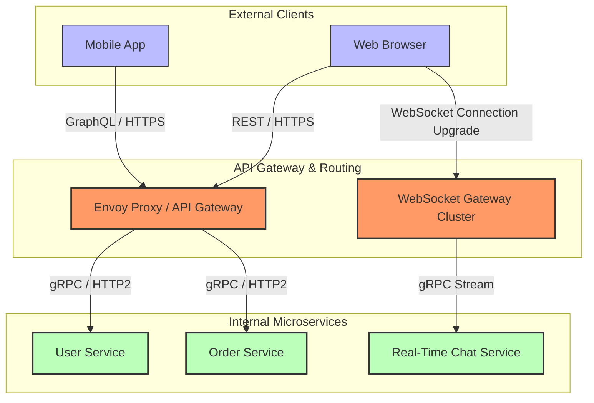
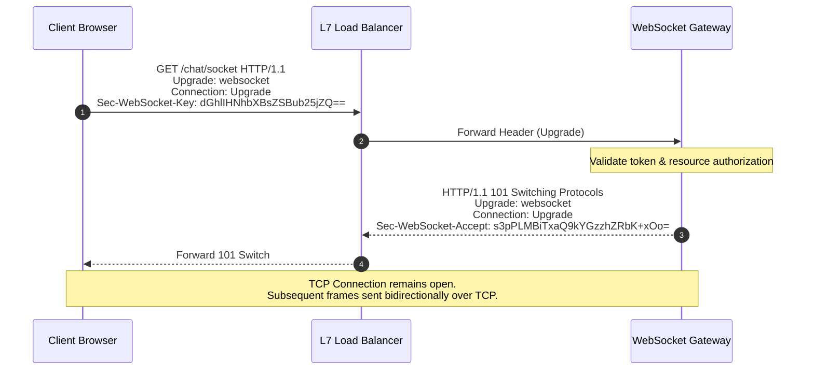

# API Protocols

## 1. Core Concept & Scaling Theory

API protocols govern the structure, transport, and serialization of data exchanged between client applications and servers, as well as between internal microservices.

### Mathematical Estimations & Scaling Calculations

#### A. Serialization Efficiency: JSON vs. Protocol Buffers (gRPC)
* **Scenario:** A service returns a list of $1,000$ order records.
* **Data Fields per Record:**
  * Order ID: UUID string (36 bytes)
  * User ID: UUID string (36 bytes)
  * Total Price: Double (8 bytes)
  * Status: String (average 10 bytes)
  * Epoch Timestamp: Long (8 bytes)
* **Payload Serialization Math:**
  * **JSON Encoding:**
    JSON is text-based and repeats key names in every object:
    `{"orderId":"f81d4fae-7dec-11d0-a765-00a0c91e6bf6","userId":"d3b07384-d113-11d0-a765-00a0c91e6bf6","totalPrice":129.99,"status":"COMPLETED","timestamp":1780444000}`
    * Average size per record in JSON format: $\approx 220 \text{ bytes}$.
    * Total payload size for 1,000 records:
      $$\text{Size}_{\text{json}} = 1,000 \times 220 \text{ bytes} \approx 220 \text{ KB}$$
  * **Protocol Buffers Encoding (Protobuf):**
    Protobuf is binary-encoded and maps keys to tag numbers (e.g. tag 1 represents `order_id`). Key names are not sent. Numeric values are serialized using variable-length varints.
    * UUIDs are represented as raw 16-byte arrays (using most/least significant bits).
    * Total Price is encoded as a fixed double (8 bytes).
    * Status is encoded as an Enum integer (1 byte).
    * Timestamp is encoded as a varint (average 6 bytes).
    * Field tags and lengths add $\approx 5$ bytes overhead.
    * Average size per record in Protobuf format:
      $$\text{Size}_{\text{record-proto}} = \text{Order ID} (16) + \text{User ID} (16) + \text{Price} (8) + \text{Status} (1) + \text{Time} (6) + \text{Tags} (5) = 52 \text{ bytes}$$
    * Total payload size for 1,000 records:
      $$\text{Size}_{\text{proto}} = 1,000 \times 52 \text{ bytes} \approx 52 \text{ KB}$$
  * **Analysis:** Protobuf reduces the payload size by $76.3\%$. Additionally, parsing binary Protobuf requires up to $10\times$ less CPU time than parsing text-based JSON, as it avoids regex-like string parsing.

#### B. WebSocket Server Memory Sizing Sizing Math
* **Scenario:** Design a real-time messaging gateway supporting $1,000,000$ concurrent client WebSocket connections on a cluster of servers.
* **Resource Consumption per Connection:**
  * Each TCP connection requires kernel buffers. Under Linux, default minimum buffer allocations are:
    * Read Buffer (`rmem`): $8 \text{ KB}$
    * Write Buffer (`wmem`): $8 \text{ KB}$
  * Application-level connection context (user ID, session details, file descriptors): $4 \text{ KB}$.
  * Total memory footprint per connection:
    $$\text{RAM}_{\text{conn}} = 8 \text{ KB} + 8 \text{ KB} + 4 \text{ KB} = 20 \text{ KB}$$
* **Total RAM Requirement:**
  $$\text{Total Memory} = 1,000,000 \times 20 \text{ KB} = 20,000,000 \text{ KB} \approx 20 \text{ GB}$$
  To handle peak write activity and connection handshake bursts, we add a $50\%$ overhead margin:
  $$\text{Target Cluster RAM} = 20 \text{ GB} \times 1.50 = 30 \text{ GB}$$
  *Conclusion:* A cluster of three 16GB RAM virtual machines can handle 1 million concurrent WebSockets connections.

### Comprehensive Protocol Comparison Matrix

| Protocol | Transport | Serialization | Communication Pattern | Pros | Cons | Best Use Case |
| :--- | :--- | :--- | :--- | :--- | :--- | :--- |
| **REST** | HTTP/1.1 or HTTP/2 | JSON, XML, HTML | Unary Request-Response | Universal, easy to debug, caching support. | Over-fetching / Under-fetching, high header overhead. | Public-facing external APIs. |
| **GraphQL** | HTTP/1.1 | JSON | Request-Response, Subscription | Clients specify exact fields needed. | Complex caching, query parsing CPU overhead. | Aggregator APIs, Mobile frontends. |
| **gRPC** | HTTP/2 | Protocol Buffers | Unary, Streaming (Client, Server, Bidi) | High performance, code generation, streaming. | Poor browser support, binary payloads are hard to debug. | Internal microservice-to-service communication. |
| **WebSockets** | TCP (Upgrade from HTTP) | Binary or Text | Persistent Bi-directional | Low overhead, real-time messaging. | Requires sticky routing, hard to scale load balancing. | Chat, gaming, collaborative editors. |
| **SSE (Server-Sent Events)** | HTTP/1.1 / HTTP/2 | Text (Event Stream) | One-way Streaming (Server to Client) | Native browser API, automatic reconnection. | One-way only, HTTP/1.1 limits connections to 6. | Live feeds, stock tickers, notifications. |

---

## 2. Visual Architecture Diagram

Below is an API topology showing how external clients interact with the system via REST, GraphQL, and WebSockets, while internal services communicate using gRPC.



---

## 3. Data Models & API Signatures

### A. REST Endpoint Design
#### GET `/api/v1/orders/f81d4fae-7dec-11d0-a765-00a0c91e6bf6`
```json
{
  "order_id": "f81d4fae-7dec-11d0-a765-00a0c91e6bf6",
  "user_id": "d3b07384-d113-11d0-a765-00a0c91e6bf6",
  "total_price": 129.99,
  "status": "COMPLETED",
  "timestamp": 1780444000
}
```

### B. GraphQL Schema Definition
```graphql
enum OrderStatus {
  PENDING
  COMPLETED
  CANCELLED
}

type Order {
  id: ID!
  userId: ID!
  totalPrice: Float!
  status: OrderStatus!
  timestamp: Long!
}

type Query {
  getOrder(id: ID!): Order
  listOrders(userId: ID!, limit: Int): [Order!]!
}

type Mutation {
  createOrder(userId: ID!, totalPrice: Float!): Order!
}
```

### C. gRPC Proto3 Definition
```protobuf
syntax = "proto3";

package com.example.orders;

option java_multiple_files = true;

service OrderService {
  rpc GetOrder(OrderRequest) returns (OrderResponse);
  rpc StreamOrders(UserRequest) returns (stream OrderResponse); // Server Streaming
}

message OrderRequest {
  string order_id = 1;
}

message UserRequest {
  string user_id = 1;
}

message OrderResponse {
  string order_id = 1;
  string user_id = 2;
  double total_price = 3;
  string status = 4;
  int64 timestamp = 5;
}
```

---

## 4. Operational Flows

### WebSocket Handshake Connection Upgrade Path
The WebSocket protocol starts with an HTTP/1.1 request that is upgraded to a persistent TCP connection.



---

## 5. High Availability, Failovers & Bottlenecks

### The gRPC Load Balancing Problem (HTTP/2 Connection Pinning)
* **Problem:** HTTP/2 multiplexes multiple logical requests over a single persistent TCP connection. Standard Layer 4 load balancers routing at the TCP layer only balance connection establishment. When a client establishes a gRPC connection, it remains pinned to one backend server indefinitely, bypassing load balancing for subsequent requests.
* **Mitigation:**
  * **L7 Proxy Load Balancing:** Use a Layer 7 proxy like Envoy. Envoy acts as a gRPC endpoint, decrypts and parses HTTP/2 streams, and routes individual gRPC requests across backend instances using round-robin or least-connections algorithms.
  * **Client-Side Load Balancing:** The client queries a service registry (e.g., DNS, Consul) to resolve a list of backend IPs, opens connection pools to all of them, and routes requests across the pool.

### WebSocket Scaling & Max Connection Bottlenecks
* **Port Exhaustion Myth:** A common concern is that a server can only support $65,535$ connections. However, a TCP connection is uniquely identified by a 4-tuple: `(Source IP, Source Port, Destination IP, Destination Port)`. A single server IP can accept millions of concurrent connections, provided it has sufficient file descriptors and memory.
* **Proxy Configuration:** Under Linux, we increase limits in `/etc/security/limits.conf`:
  `nofile 1048576` (allocating 1 million file descriptor limits).
* **Sticky Sessions / Redis PubSub:** Since WebSocket servers are stateful, a client connected to Server A cannot receive messages from a client on Server B. To resolve this, use a shared message broker (like Redis Pub/Sub or RabbitMQ). When Server A wants to send a message to a user, it publishes it to the broker, and all WebSocket servers subscribe to route the message to the target client.

---

## 6. Comprehensive Interview Q&A

### Q1: Why is a Layer 4 Load Balancer insufficient for load-balancing gRPC traffic? How do you resolve this?
**Answer:**
A **Layer 4 Load Balancer** operates at the TCP transport layer. It routes traffic by establishing a TCP connection. 
* Because **gRPC uses HTTP/2**, it establishes a single, long-lived TCP connection and multiplexes many requests/responses over that same connection.
* When a gRPC client connects via a Layer 4 load balancer, the balancer selects a backend server and routes the TCP connection to it. All subsequent gRPC requests from that client will travel over that same TCP connection, pinning the traffic to a single backend server. This can lead to CPU overload on one server while other instances remain idle.

To resolve this, you must use **Layer 7 Load Balancing** (e.g., using Envoy Proxy or Nginx). An L7 load balancer terminates the HTTP/2 connection, parses the individual request frames, and routes requests to backends on a request-by-request basis. Alternatively, you can implement **Client-Side Load Balancing**, where the client retrieves a list of backend IPs from a service registry and distributes requests across them using a connection pool.

### Q2: Compare WebSockets and Server-Sent Events (SSE). When would you choose SSE over WebSockets?
**Answer:**
* **WebSockets:**
  * **Protocol:** Independent TCP-based protocol (upgraded from HTTP).
  * **Direction:** Full duplex (bi-directional real-time communication).
  * **Data:** Binary and UTF-8 text formats.
* **Server-Sent Events (SSE):**
  * **Protocol:** Standard HTTP transport.
  * **Direction:** Half duplex (server-to-client streaming only).
  * **Data:** Text format (UTF-8, event stream).

**When to choose SSE over WebSockets:**
Choose **SSE** if communication only needs to flow from the server to the client (e.g., news feeds, stock tickers, dashboards, or live push notifications).
* SSE is simpler to implement because it operates over standard HTTP, bypassing firewall and proxy blocking issues that can affect WebSockets.
* SSE provides native browser support for automatic reconnection, event IDs, and connection recovery out of the box.

### Q3: What is the "N+1 Queries" problem in GraphQL, and how does the DataLoader utility resolve it?
**Answer:**
The **N+1 Queries** problem occurs when a GraphQL query requests nested child elements.
Suppose we query a list of $N$ books, and for each book, we request its author:
```graphql
{
  books {
    title
    author { name }
  }
}
```
If the resolver for `books` returns $N$ records, the GraphQL execution engine will call the resolver for `author` once for each book. This triggers $1$ query to fetch the books, and $N$ subsequent database queries to fetch each author, resulting in $N+1$ database queries.

**DataLoader Resolution:**
The **DataLoader** utility resolves this using batching and caching:
1. Instead of executing database queries immediately, DataLoader intercepts the resolver calls and queues the requested author IDs.
2. In the next tick of the event loop, DataLoader coalesces the individual IDs into a single batch query (e.g. `SELECT * FROM authors WHERE id IN (1, 2, ..., N)`).
3. It resolves the promises with the batched results, reducing the query count from $N+1$ to $2$.
4. DataLoader also caches results within the scope of a single request, preventing redundant queries if the same author wrote multiple books in the list.

### Q4: How do Webhooks work, and what security measures should you implement to protect Webhook endpoints from malicious traffic?
**Answer:**
A **Webhook** is an HTTP callback. The source system (e.g. Stripe) makes an HTTP POST request to a pre-configured URL on the target system when an event occurs.

To secure Webhook endpoints:
1. **Signature Verification (HMAC):** The source system signs the request payload using a shared secret key and includes the signature in an HTTP header (e.g., `X-Signature: sha256=...`). The receiver calculates the HMAC-SHA256 signature of the incoming request body using the same secret key. If the signatures do not match, the request is rejected. This prevents request tampering and spoofing.
2. **Replay Attack Protection:** The source system includes a timestamp in the signed payload. The receiver validates that the timestamp is within a configured tolerance window (e.g. less than 5 minutes old) to prevent replay attacks.
3. **IP Whitelisting:** If possible, configure firewalls to only accept connections to the webhook URL from the source system's published IP ranges.
4. **Idempotency:** Webhook deliveries can fail and retry. The receiver must track processed event IDs (e.g. in a database table) to avoid processing the same webhook event multiple times.
