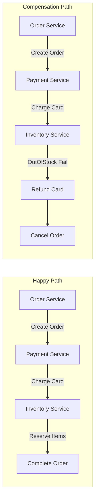
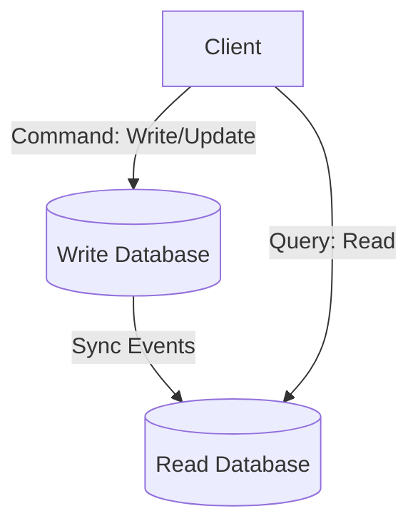

# Microservices Patterns

This section covers structural patterns used to solve database orchestration, read/write scaling, and routing in a microservices ecosystem.

---

## 1. Saga Pattern
In microservices, each service has its own database. Distributing transactions across databases using Two-Phase Commit (2PC) blocks databases and limits throughput. **Saga solves this by executing a sequence of local transactions.**

### Saga Orchestration vs Choreography
* **Choreography:** Each service publishes events. Other services listen and react. (Simple to start, hard to track flows).
* **Orchestration:** A central controller manages the steps, executes actions, and coordinates rollback transactions (Compensating Transactions) if any step fails. (Clear dependencies, slightly complex controller).

---

## 2. CQRS (Command Query Responsibility Segregation)
CQRS splits the write path (Commands) and the read path (Queries) into separate database models.

* **Write DB:** Optimized for normalization and transaction updates.
* **Read DB:** Optimized for queries (e.g. read replicas, Elasticsearch, or fully de-normalized documents).
* **Sync:** Synchronized asynchronously using event streams (Eventual Consistency).

---

## Interview Q&A Corner

> [!IMPORTANT]
> **Q: What is the main challenge of CQRS?**
> A: **Eventual Consistency.** Because database updates are synchronized asynchronously, a user who updates their profile (Write DB) might refresh the page and read from the Read DB before synchronization completes, seeing stale data.
> *Mitigations:* Force critical read paths (e.g., checkout pages) to read directly from the Write DB, or implement caching strategies.
