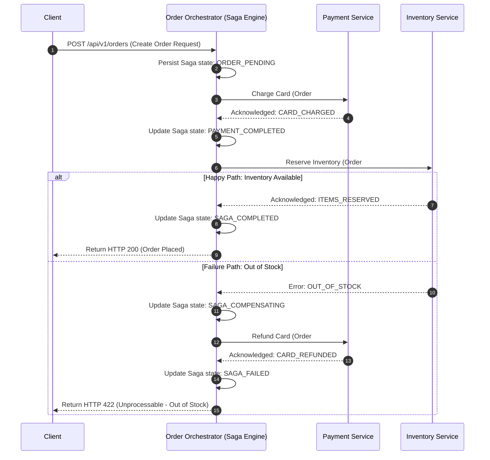

# Microservices Patterns

## 1. Core Concept & Scaling Theory

Microservice architectures split monolithic systems into independent, specialized services. This introduces challenges in managing data consistency, transactions, and event distribution across multiple databases.

### Mathematical Estimations & Scaling Calculations

#### A. Transaction Failure Chain Probability Math
Consider a distributed transaction spanning $K$ independent microservices in a sequence (e.g. Order $\to$ Payment $\to$ Inventory $\to$ Delivery).
* Let $p_i$ be the probability of success for service $i$.
* The overall transaction success probability ($P_{success}$) is:
  $$P_{success} = \prod_{i=1}^{K} p_i$$
* **Calculations:**
  * If $K = 5$ services, and each has a success rate of $99\%$ ($p_i = 0.99$):
    $$P_{success} = 0.99^5 \approx 95.1\% \implies 4.9\% \text{ of transactions will fail}$$
  * For $1,000,000$ transactions per day, this means $49,000$ transactions fail daily and require compensating rollbacks.
  * **Compensating Overhead:** A compensating transaction (e.g., refunding a card) often requires more database and network resources than the original transaction. If a compensating transaction consumes $1.5\times$ the resources of a normal step, the daily resource overhead is:
    $$\text{Overhead} = 49,000 \times 1.5 = 73,500 \text{ transaction-equivalents daily}$$

#### B. Latency and Resource Lock holding (2PC vs. Saga)
* **Two-Phase Commit (2PC):** Holds database locks across all $K$ nodes for the duration of the entire transaction.
  $$\text{Lock Hold Duration}_{\text{2PC}} \approx 2 \times \sum_{i=1}^{K} (\text{ExecutionTime}_i + \text{RTT}_i)$$
  If average execution time is $50 \text{ ms}$ and cross-service RTT is $10 \text{ ms}$ across $3$ services:
  $$\text{Lock Hold Duration}_{\text{2PC}} \approx 2 \times (150 \text{ ms} + 30 \text{ ms}) = 360 \text{ ms}$$
  During this $360 \text{ ms}$, the rows in all databases are locked, reducing throughput.
* **Saga Pattern:** Executes local transactions sequentially, releasing database locks immediately after each step.
  $$\text{Local Lock Duration}_{\text{Saga}} \approx \text{ExecutionTime}_i \approx 50 \text{ ms}$$
  *Conclusion:* Sagas release database locks $\approx 7\times$ faster than 2PC, reducing lock contention and scaling transaction throughput.

### Comparative Analysis: Microservice Orchestration Patterns

| Criteria | Saga: Choreography | Saga: Orchestration | Two-Phase Commit (2PC) | Transactional Outbox |
| :--- | :--- | :--- | :--- | :--- |
| **Consistency** | Eventual | Eventual | Strong | Eventual |
| **Complexity** | Low (decidely decentralized) | Medium (requires state engine) | Very High (distributed lock coordination) | Medium (requires CDC engine) |
| **Throughput** | High (fully asynchronous) | Medium-High | Low (blocked by locks) | High |
| **Dependency Coupling** | Low (services listen to events) | Medium (orchestrator depends on services) | High | Low |
| **Failure Recovery** | Automatic (reactive events) | Centralized workflow logic | Handled by coordinator rollback | Retries via event broker |

---

## 2. Visual Architecture Diagram

### A. Saga Orchestration Happy Path and Compensating Flow
Below is a workflow managed by a central Orchestrator that handles order creation, payment charging, and inventory reservation, including compensating rollbacks if inventory is unavailable.



### B. Transactional Outbox Pattern
To prevent dual-write failures (e.g. updating the database succeeds but publishing to Kafka fails), the application writes both the business entity and an event record to an **Outbox** table in a single local database transaction.

```mermaid
graph LR
    subgraph Microservice [Order Service]
        App[Application Logic] -->|1. Local Transaction| DB[(Database)]
        subgraph DB [(Database)]
            TableA[Orders Table]
            TableB[Outbox Table]
        end
    end
    
    Debezium[Debezium CDC Service] -->|2. Poll log / Stream changes| TableB
    Debezium -->|3. Publish Event| Kafka[Kafka Event Stream]
    Kafka -->|4. Consume| Email[Email Service]

    classDef ms fill:#dff,stroke:#333,stroke-width:2px;
    classDef infra fill:#fdf,stroke:#333,stroke-width:1px;
    class Microservice ms;
    class Debezium,Kafka infra;
```

---

## 3. Data Models & API Signatures

### Transactional Outbox Schema Design (SQL)
This table stores event payloads that must be published to a message broker.

```sql
CREATE TABLE outbox_events (
    event_id UUID PRIMARY KEY,
    aggregate_type VARCHAR(128) NOT NULL, -- e.g. 'ORDER'
    aggregate_id VARCHAR(128) NOT NULL,   -- e.g. 'order_10012'
    event_type VARCHAR(128) NOT NULL,     -- e.g. 'ORDER_CREATED'
    payload JSONB NOT NULL,               -- The complete event body
    created_at TIMESTAMP DEFAULT CURRENT_TIMESTAMP
);

CREATE INDEX idx_outbox_created ON outbox_events (created_at);
```

### Saga Orchestrator Workflow Log Schema (SQL)
Used by the Saga orchestration engine to track transaction state and progress.

```sql
CREATE TABLE saga_instances (
    saga_id UUID PRIMARY KEY,
    saga_type VARCHAR(128) NOT NULL,      -- e.g. 'ORDER_CREATION_SAGA'
    current_state VARCHAR(64) NOT NULL,   -- PENDING, PAYMENT_COMPLETED, COMPENSATING, SUCCESS, FAILED
    payload JSONB NOT NULL,               -- The context state metadata
    steps_completed INT DEFAULT 0,
    created_at TIMESTAMP DEFAULT CURRENT_TIMESTAMP,
    updated_at TIMESTAMP DEFAULT CURRENT_TIMESTAMP ON UPDATE CURRENT_TIMESTAMP
);

CREATE INDEX idx_saga_state ON saga_instances (current_state, updated_at);
```

### Orchestrator Step Controller API
Endpoints used by microservices to report task completion back to the orchestrator.

#### POST `/api/v1/orchestrator/callback`
```json
{
  "saga_id": "8c7c2b3e-e63c-44bf-a292-ba78e63080ff",
  "step_name": "CARD_PAYMENT",
  "status": "SUCCESS", -- SUCCESS or FAILED
  "output_data": {
    "transaction_id": "tx_99283710",
    "gateway": "STRIPE",
    "amount_charged": 100.00
  },
  "error_details": null
}
```

---

## 4. Operational Flows

### A. CQRS Write & Read Path Operational Flows
1. **Write Command:** The client submits an update (e.g. `UpdateUserAddress`). The API Gateway routes the command to the Write Service.
2. **Write execution:** The Write Service validates the command, updates the normalized Write Database (MySQL), and appends an `AddressUpdated` event to the Outbox table.
3. **Async Sync:** A Change Data Capture (CDC) connector (e.g. Debezium) streams the event from the Outbox table to Kafka.
4. **Read DB Update:** A consumer service reads the event from Kafka and updates the de-normalized Read Database (Elasticsearch/MongoDB).
5. **Read Query:** When a client queries the user's profile, the query is routed to the Read Service, which retrieves the data from the Read Database, bypasssing the Write Database.

---

## 5. High Availability, Failovers & Bottlenecks

### Orchestrator Failures & State Recovery
* **Problem:** If the central Saga Orchestrator crashes mid-workflow, transactions can remain in a half-completed state.
* **Mitigation:** The Orchestrator must persist its state machine transition history to a database (the Saga Log) before invoking any external service. Upon restart, the orchestrator scans the Saga Log for incomplete instances and resumes the workflow from the last recorded state.

### Idempotency in Compensating Transactions
* **Problem:** In a network partition, retry requests can cause a service to execute a compensating transaction multiple times (e.g. refunding a payment twice).
* **Mitigation:** Every service must implement idempotency. When a service receives a request, it checks an idempotency key (e.g., the unique `saga_id` or `order_id`).
  * If the ID exists in the database's processed transactions table, the service returns the cached success response immediately without re-executing the operation.
  * Databases should enforce unique constraints on the idempotency key:
    ```sql
    CREATE UNIQUE INDEX uq_idempotent_tx ON completed_transactions (idempotency_key);
    ```

---

## 6. Comprehensive Interview Q&A

### Q1: How does the Transactional Outbox pattern solve the problem of dual-writes in microservices?
**Answer:**
In microservices, applications often need to write data to their local database and publish an event to a message broker (like Kafka) to notify other services.
* **Dual-Write Problem:** If the application attempts to write to the database and publish to the message broker in two separate operations, one can fail. If the database write succeeds but the broker publish fails, downstream services are never notified, leading to data inconsistency. If we attempt to reverse the order, the broker publish may succeed but the database write fails, leading to ghost events.

**Transactional Outbox Solution:**
The application writes both the business entity record and an event record to an **Outbox** table in the local database within a single local database transaction.
1. Local transactions are ACID-compliant, guaranteeing that either both writes succeed or both fail.
2. A background process (e.g., a Change Data Capture engine like Debezium or a polling daemon) monitors the Outbox table for new rows.
3. The CDC engine publishes the events to the message broker.
4. Once the message broker acknowledges receipt, the CDC engine marks the outbox event as sent or deletes the row, ensuring **at-least-once** event delivery.

### Q2: What is the Saga Pattern, and how does Orchestration compare to Choreography in terms of operational complexity?
**Answer:**
The **Saga Pattern** manages transactions across multiple databases in microservice architectures by executing a sequence of local transactions. Each step updates its local database. If a step fails, the Saga executes compensating transactions (rollbacks) in reverse order to undo the changes.

* **Choreography:**
  * **Mechanics:** Decentralized model. Each service executes its local transaction and publishes an event (e.g., `PaymentCharged`). Other services listen to this event and execute their tasks.
  * **Pros:** Highly decoupled, simple to set up for small workflows, and has no single point of control.
  * **Cons:** Hard to understand the overall workflow, risk of cyclic dependencies, and debugging complex flows is difficult.
* **Orchestration:**
  * **Mechanics:** Centralized model. A dedicated service (Orchestrator) acts as a state machine. It sends commands to services, tracks their responses, and coordinates compensating rollback calls if any step fails.
  * **Pros:** Centralized visibility of the workflow state, clear dependencies, and easier to implement error handling.
  * **Cons:** The orchestrator can become a single point of failure (SPOF) if not configured for high availability, and it introduces additional infrastructure and development overhead.

### Q3: What is a "Pivot Transaction" in a Saga, and why is it important for designing compensating transactions?
**Answer:**
In a Saga workflow, steps are categorized relative to a **Pivot Transaction**:
1. **Compensable Transactions:** Steps before the pivot transaction that can be rolled back using compensating transactions (e.g., releasing reserved inventory).
2. **Pivot Transaction:** The critical step in the Saga. If the pivot transaction succeeds, the Saga cannot be rolled back; it must run to completion. If the pivot transaction fails, the Saga rolls back all preceding compensable transactions. (e.g., charging a customer's credit card is often the pivot transaction).
3. **Retriable Transactions:** Steps after the pivot transaction that are guaranteed to eventually succeed. If they fail temporarily (e.g., due to a network timeout), they are retried until they succeed, rather than triggering a rollback. (e.g., sending an order confirmation email).

Design of compensating transactions:
* They must be **idempotent**, as they can be called multiple times due to retries.
* They must be **commutative**, meaning they can be executed safely even if the target service receives them out of order (e.g., a refund command arriving before the charge command has completed).

### Q4: Explain the API Gateway pattern. How does it handle request aggregation and cross-cutting concerns at scale?
**Answer:**
An **API Gateway** acts as the single entry point for all client requests in a microservices architecture. It sits between the clients and the internal microservices, routing traffic and handling cross-cutting concerns.

**Key capabilities:**
1. **Routing:** It maps external request paths to the appropriate internal microservice IPs.
2. **Request Aggregation:** It consolidates multiple microservice calls into a single response. For example, to render a product page, instead of the client calling the Product Service, Reviews Service, and Inventory Service separately, the client makes one call to the API Gateway. The gateway calls the services in parallel, aggregates the responses, and returns a single payload, reducing client-side latency and network overhead.
3. **Authentication & Authorization Offloading:** The gateway validates client credentials (JWT, OAuth tokens) once at the edge. Internal services can trust requests routed through the gateway, reducing duplicate validation logic.
4. **Rate Limiting & Throttling:** The gateway limits request volume based on client API keys or IP addresses, protecting internal microservices from denial-of-service (DoS) attacks and traffic spikes.
