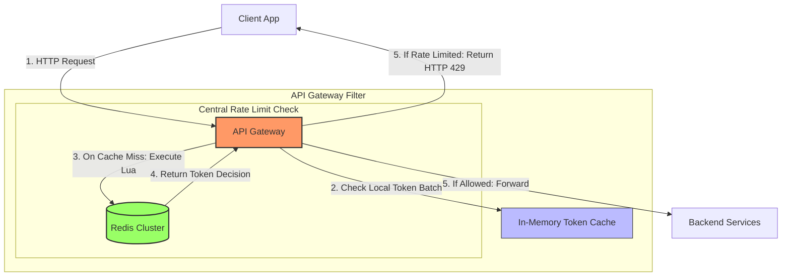

# Rate Limiting Algorithms

## 1. Core Concept & Scaling Theory

Rate limiting restricts the volume of requests a client can make to an API within a defined timeframe. This protects infrastructure from denial-of-service (DoS) attacks, brute-force attempts, and resource exhaustion.

### Mathematical Estimations & Scaling Calculations

#### A. Memory Footprint: Sliding Window Log vs. Sliding Window Counter
* **Scenario:** Rate limit is $10,000$ requests per hour per user. The system tracks $1,000,000$ active users.
* **Sliding Window Log (Timestamp Set):**
  This algorithm stores a timestamp for every request in a sorted set (e.g., Redis ZSET).
  * Size per timestamp: 8 bytes (64-bit integer).
  * Redis sorted set overhead (pointers, hash table entry): $\approx 32$ bytes per entry.
  * Memory per user (at limit capacity of 10,000 requests):
    $$\text{Memory}_{\text{user}} = 10,000 \times (8 + 32) \text{ bytes} \approx 400 \text{ KB}$$
  * Total memory for 1 million active users:
    $$\text{Total Memory}_{\text{log}} = 1,000,000 \times 400 \text{ KB} = 400,000,000 \text{ KB} \approx 400 \text{ GB}$$
  *Conclusion:* Sliding Window Log is too expensive for high-volume rate limits.

* **Sliding Window Counter (Window Approximator):**
  This algorithm tracks only the request counts for the current window and the previous window, approximating the rate:
  $$\text{Request Count} = \text{Count}_{\text{prev-window}} \times \left(1 - \frac{t_{\text{elapsed}}}{\text{WindowSize}}\right) + \text{Count}_{\text{curr-window}}$$
  * Data stored: Two integers (4 bytes each) and one timestamp for the start of the window (8 bytes).
  * Total state size per user: $16 \text{ bytes}$ ($\approx 32 \text{ bytes}$ with Redis keys).
  * Total memory for 1 million active users:
    $$\text{Total Memory}_{\text{counter}} = 1,000,000 \times 32 \text{ bytes} \approx 32 \text{ MB}$$
  *Conclusion:* Sliding Window Counter reduces memory usage by $99.99\%$, making it highly scalable for distributed rate limiters.

#### B. Token Bucket Refill Mathematical Formulation
The token count at query time $t$ is calculated dynamically, avoiding background cron jobs:
$$\text{Tokens}_t = \min\Big(C, \text{Tokens}_{\text{last}} + (t - t_{\text{last}}) \times R\Big)$$
* Where:
  * $C$ = Bucket capacity.
  * $R$ = Refill rate (tokens per second).
  * $t_{\text{last}}$ = Timestamp of the last processed request.
  * $\text{Tokens}_{\text{last}}$ = Token count after the last request.

---

### Comparative Analysis: Rate Limiting Algorithms

| Algorithm | Data Structure | Memory Complexity | Burst Capability | Accuracy | Downside |
| :--- | :--- | :--- | :--- | :--- | :--- |
| **Token Bucket** | Counter + Timestamp | $O(1)$ | Yes (up to capacity $C$) | High | Race conditions in distributed clusters unless synchronized. |
| **Leaky Bucket** | Queue (FIFO) | $O(\text{QueueSize})$ | No (smooths traffic to rate $R$) | High | Can delay client requests under burst conditions (adds latency). |
| **Fixed Window** | Counter | $O(1)$ | No | Low (allows double the limit at window boundaries) | Traffic bursts at boundary windows can overload backends. |
| **Sliding Window Log** | Sorted Set (ZSET) | $O(\text{Limit})$ | Yes | 100% | High memory footprint. |
| **Sliding Window Counter**| 2 Counters | $O(1)$ | Yes | High (approximate) | Small approximation error ($\approx 5\%$) if traffic is uneven. |

---

## 2. Visual Architecture Diagram

Below is the design of a distributed rate limiting architecture integrated into an API Gateway, using Redis for centralized state storage and local caching to minimize network overhead.



---

## 3. Data Models & API Signatures

### Rate Limiter Response HTTP Headers
When an API gateway processes a request, it returns rate limit metadata in the headers:
```http
HTTP/1.1 200 OK
Content-Type: application/json
X-RateLimit-Limit: 100
X-RateLimit-Remaining: 98
X-RateLimit-Reset: 1780444060
```
If the limit is exceeded, it returns HTTP 429:
```http
HTTP/1.1 429 Too Many Requests
Retry-After: 30
Content-Type: application/json

{
  "status": 429,
  "error": "Too Many Requests",
  "message": "API rate limit exceeded. Please retry after 30 seconds."
}
```

### Redis Lua Script for Token Bucket Algorithm (Atomic)
This script runs atomically inside Redis, preventing race conditions between gateway instances.

```lua
-- KEYS[1]: Redis key for token bucket (e.g. "rate:user_992837")
-- ARGV[1]: Bucket capacity (C)
-- ARGV[2]: Refill rate per millisecond (R)
-- ARGV[3]: Request cost (typically 1)
-- ARGV[4]: Current epoch timestamp in milliseconds (t)

local key = KEYS[1]
local capacity = tonumber(ARGV[1])
local refill_rate = tonumber(ARGV[2])
local cost = tonumber(ARGV[3])
local now = tonumber(ARGV[4])

-- Retrieve current state or initialize
local state = redis.call('HMGET', key, 'tokens', 'last_updated')
local tokens = tonumber(state[1])
local last_updated = tonumber(state[2])

if not tokens then
    tokens = capacity
    last_updated = now
else
    -- Compute dynamic refill based on time elapsed
    local elapsed = now - last_updated
    if elapsed > 0 then
        local generated = elapsed * refill_rate
        tokens = math.min(capacity, tokens + generated)
        last_updated = now
    end
end

-- Validate and update token count
if tokens >= cost then
    tokens = tokens - cost
    redis.call('HMSET', key, 'tokens', tokens, 'last_updated', last_updated)
    redis.call('PEXPIRE', key, math.ceil(capacity / refill_rate)) -- Auto-clean keys
    return {1, tokens} -- Allowed
else
    return {0, tokens} -- Rejected (Rate Limited)
end
```

---

## 4. Operational Flows

### Rate Limiting Evaluation Flow (API Gateway Filter)
1. **Extraction:** The gateway receives a request and extracts the client identifier (e.g. API Key, JWT token claim, or Client IP).
2. **Local Memory Evaluation:** The gateway checks its local in-memory token cache. If a token is available, the request is allowed immediately, avoiding a network call.
3. **Redis Evaluation (Lua Script):** On a local cache miss, the gateway sends a query to Redis, executing the Token Bucket Lua script.
4. **Headers Injection:** The gateway receives the results (Allowed/Rejected and remaining tokens) and updates the HTTP headers.
5. **Failover Execution:** If Redis is down, the rate limiter falls back to a **Fail-Open** policy, allowing the request to proceed while logging an alert.

---

## 5. High Availability, Failovers & Bottlenecks

### Mitigating Redis CPU & Network Bottlenecks (Token Batching)
Under high load (100k+ RPS), sending every request to Redis can saturate the network interface cards (NICs) and exhaust Redis CPU capacity.
* **Token Batching Solution:**
  * Instead of requesting 1 token from Redis per request, the API Gateway instance requests a batch of $B$ tokens (e.g., $B = 100$) and caches them locally in memory for up to 1 second.
  * Incoming client requests consume tokens from the local batch.
  * When the local batch is exhausted or expires, the gateway requests another batch from Redis.
  * This reduces Redis queries by up to $99\%$, protecting the shared database.

### Fail-Open vs. Fail-Closed Policies
* **Fail-Open (Recommended for general APIs):** If the rate limiting database (Redis) is unreachable, the gateway logs the error and permits all incoming requests. This ensures service availability, though it temporarily disables abuse protection.
* **Fail-Closed (Recommended for security-critical endpoints):** If Redis is unreachable, the gateway rejects all requests with an HTTP 500 or 429 error. This protects backend databases (like payments or order processing) from cascading failures during traffic surges.

---

## 6. Comprehensive Interview Q&A

### Q1: Why are Lua scripts executed atomically inside Redis, and how does this prevent race conditions in distributed rate limiting?
**Answer:**
Redis is a single-threaded event loop system.
* When a **Lua script** is sent to Redis, the server executes the entire script from start to finish as a single command, blocking other clients.
* **Race Condition Problem:** If we implement rate limiting using separate Redis commands:
  1. Server A queries `GET rate:user_123` and receives `9` tokens (limit is 10).
  2. Server B queries `GET rate:user_123` and receives `9` tokens.
  3. Both servers deduct 1 token and write the updated count back to Redis (`SET rate:user_123 8`).
  Instead of deducting 2 tokens for the 2 requests, only 1 token was deducted, permitting more traffic than the rate limit allows.
* **Lua Script Resolution:** By grouping the read, refill calculation, and write logic into a single Lua script, Redis executes the steps as a single atomic operation. No other client can read or modify the keys mid-execution, preventing race conditions.

### Q2: Compare the memory footprint and accuracy of the Sliding Window Log and Sliding Window Counter algorithms.
**Answer:**
* **Sliding Window Log:**
  * **Accuracy:** 100% accurate. It records every request's timestamp in a sorted set and prunes records older than the sliding window size.
  * **Memory Complexity:** $O(L)$, where $L$ is the rate limit. If a user has a limit of $10,000$ requests per hour, we must store up to $10,000$ integers in memory. This scales to gigabytes of RAM when managing millions of active users.
* **Sliding Window Counter:**
  * **Accuracy:** Approximated. It calculates a weighted average of the previous window's request count and the current window's count.
  * **Memory Complexity:** $O(1)$. It only stores two integer counters and a timestamp, requiring less than $32\text{ bytes}$ per user.
  * **Comparison:** While the Sliding Window Log is more accurate, the Sliding Window Counter is preferred for high-volume distributed systems due to its $99.9\%$ lower memory footprint.

### Q3: In a system handling 500,000 Requests Per Second (RPS), how do you design the rate limiter to prevent the database from becoming a bottleneck?
**Answer:**
A centralized database like Redis cannot handle 500k queries per second on a single instance due to network I/O and CPU limits. To scale the rate limiter:
1. **Local Token Batching:** API gateway instances request tokens from Redis in batches (e.g. 200 tokens at a time) and cache them in local memory for up to 1 second. Requests are validated locally against the cached tokens, reducing the query volume to Redis to $\approx 2,500$ QPS.
2. **Redis Cluster Sharding:** Shard rate limiting keys across multiple Redis nodes using the client identifier (e.g. `user_id` or `api_key`) as the sharding key. This distributes the network and CPU load across the cluster.
3. **Local Cache Fallbacks:** Implement local rate limiters on each gateway instance using a Fixed Window algorithm to drop traffic during extreme DDoS attacks before invoking Redis.

### Q4: What is the difference between Rate Limiting, Request Throttling, and Load Shedding?
**Answer:**
* **Rate Limiting:** Restricts traffic from specific clients based on identifying attributes (API Keys, User IDs, or IP addresses). It isolates and rejects abusive traffic with HTTP 429 errors while keeping the service available for other users.
* **Request Throttling:** Slows down incoming requests instead of rejecting them. If a client exceeds their soft limit, subsequent requests are delayed (e.g., introducing a sleep delay in the connection loop) to match the permitted rate.
* **Load Shedding:** Protects the system as a whole when it is overloaded, regardless of who is sending the traffic. When system metrics (e.g. CPU usage, queue depth, or thread pools) exceed safety thresholds, the server drops lower-priority requests (like background analytics reports) to ensure core services (like checkout paths) remain available.
