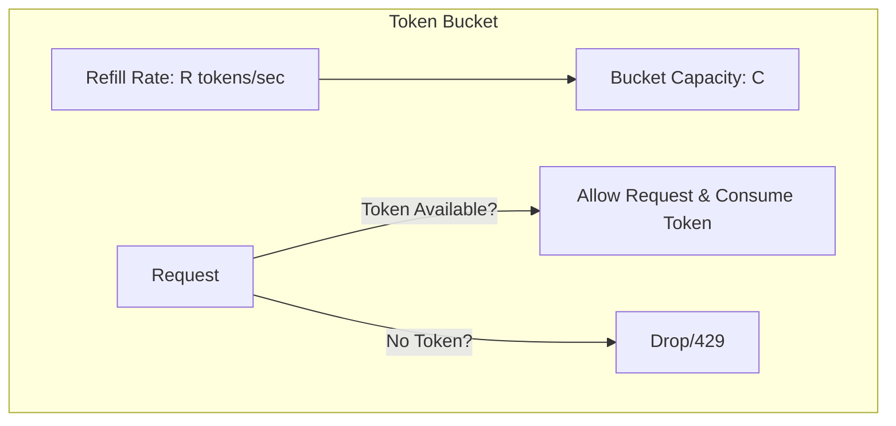

# Rate Limiting Algorithms

Rate limiters protect servers from traffic spikes, DDoS attacks, and abuse by restricting the number of client requests.

---

## 1. Core Algorithms

| Algorithm | Mechanism | Pros | Cons |
|-----------|-----------|------|------|
| **Token Bucket** | Tokens added to bucket at rate $R$. Limit is capacity $C$. Request consumes 1 token. | Handles bursts of traffic | Requires memory lock sync |
| **Leaky Bucket** | Requests enter a queue and leak out at a constant rate $R$. | Smooths traffic output rate | Drops requests if bucket fills up |
| **Sliding Window Counter** | Uses timestamps to calculate requests inside a sliding timeline window. | Memory efficient, highly accurate | Slightly high calculation overhead |

---

## 2. Distributed Rate Limiting (Scale Bottlenecks)
In a distributed backend environment, local memory rate limiting fails. We use a central store like **Redis**.

### Problem: Race Conditions
If two servers read a Redis token counter at the same time, both read `1` (when limit is `1`). Both increment, allowing two requests and violating the rate limit.

### Solutions
1. **Redis Lua Scripts:** Lua scripts run atomically inside Redis, preventing race conditions.
2. **Sorted Sets (ZSET):** Store request timestamps in Redis Sorted Sets, pruning old entries and counting size inside a multi/exec atomic transaction block.

---

## Interview Q&A Corner

> [!WARNING]
> **Q: How would you prevent Redis latency from slowing down client requests during rate limiting checks?**
> A: Use a **hybrid approach**:
> 1. Clients query a local cache rate limiter first.
> 2. Sync token allocations asynchronously with Redis using background threads (e.g. reserving a batch of 100 tokens locally for 1 second, reducing Redis round-trip queries).
