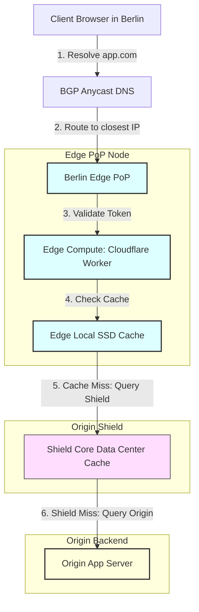
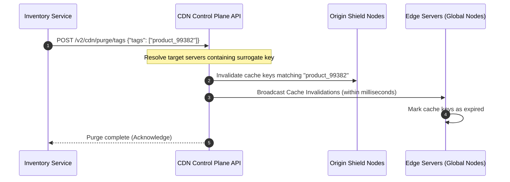

# CDNs & Edge Servers

## 1. Core Concept & Scaling Theory

Content Delivery Networks (CDNs) are globally distributed networks of proxy servers (Edge Servers) deployed at the internet's edge, close to end-users. They cache static assets (images, JavaScript, CSS, videos) and optimize dynamic content delivery.

### Mathematical Estimations & Scaling Calculations

#### A. Bandwidth Egress Cost & Latency Savings Math
* **Scenario:** A global web application serves $10,000,000$ image downloads daily.
* **Asset Profile:** Average image size = $200 \text{ KB}$.
* **Geographical Distribution:** Origin is located in AWS `us-east-1` (Virginia, USA). $30\%$ of users are in Tokyo, Japan.

##### Cost Sizing without CDN (Direct Origin Access):
* **Daily Egress Data Volume:**
  $$\text{Data Volume} = 10,000,000 \times 200 \text{ KB} = 2,000,000,000 \text{ KB} = 2,000 \text{ GB} = 2 \text{ TB/day}$$
* **Monthly Egress Volume:** $2 \text{ TB/day} \times 30 \text{ days} = 60 \text{ TB/month}$.
* **AWS Data Transfer Egress Cost:** $\approx \$0.08$ per GB.
  $$\text{Cost}_{\text{no\_cdn}} = 60,000 \text{ GB} \times \$0.08 = \$4,800\text{/month}$$

##### Cost Sizing with CDN (99% Cache Hit Ratio):
* When a CDN caches the images, $99\%$ of requests are served directly from the CDN edge cache. Only $1\%$ of requests (cache misses) reach the origin server.
* **Monthly Origin Egress Volume:**
  $$\text{Volume}_{\text{origin\_miss}} = 60 \text{ TB} \times 0.01 = 0.6 \text{ TB} = 600 \text{ GB/month}$$
* **Monthly Origin Data Transfer Cost:**
  $$\text{Cost}_{\text{origin}} = 600 \text{ GB} \times \$0.08 = \$48\text{/month}$$
* **Monthly CDN Cost** (CDN egress rate $\approx \$0.015$ per GB):
  $$\text{Cost}_{\text{cdn}} = 60,000 \text{ GB} \times \$0.015 = \$900\text{/month}$$
* **Total Monthly Cost with CDN:** $\$48 + \$900 = \$948\text{/month}$.
* **Savings:** $\$4,800 - \$948 = \$3,852\text{/month}$ ($80.2\%$ cost reduction).

##### Latency Analysis for Tokyo Users:
* Network Round-Trip Time (RTT) from Tokyo to Virginia $\approx 160 \text{ ms}$.
* For an HTTPS request (TCP Handshake + TLS Client Hello + HTTP GET):
  $$\text{Latency}_{\text{no\_cdn}} = 3 \times \text{RTT} = 3 \times 160 \text{ ms} = 480 \text{ ms}$$
* Latency to Tokyo Edge PoP: RTT $\approx 15 \text{ ms}$.
  $$\text{Latency}_{\text{with\_cdn}} = 3 \times \text{RTT} = 3 \times 15 \text{ ms} = 45 \text{ ms}$$
* **Performance Gain:** $90.6\%$ reduction in latency for Tokyo users.

---

### Comparative Analysis: CDN Topologies

| Feature | Pull CDN (Origin Pull) | Push CDN (Origin Push) |
| :--- | :--- | :--- |
| **Data Ingestion** | Lazy Loading: Fetches asset from origin on first request (cache miss). | Active push: Origin uploads assets directly to CDN storage via API. |
| **Cache Hit Rate** | Lower initially, stabilizes over time. | 100% Cache Hit Rate from day one. |
| **Storage Cost** | Low (unused or expired assets are evicted from cache). | High (CDN stores all pushed assets indefinitely). |
| **Origin Load** | High during traffic spikes on un-cached assets. | Negligible (CDN serves all reads). |
| **Best Use Case** | Dynamic sites with millions of changing assets (e.g. e-commerce product pages). | Heavy static assets, releases, video binaries, app updates. |

---

## 2. Visual Architecture Diagram

Below is the request routing path through a CDN, featuring DNS Anycast geo-routing, Edge PoPs executing Edge Compute (JWT token verification), an Origin Shield cache layer, and the origin server.



---

## 3. Data Models & API Signatures

### Caching Control Headers (HTTP Response)
Sent by origin servers to configure caching rules on the CDN edge nodes.

```http
HTTP/1.1 200 OK
Content-Type: image/webp
Cache-Control: public, max-age=31536000, immutable
Surrogate-Control: max-age=2592000
Surrogate-Key: product_99382 category_electronics tenant_1002
ETag: "w/3827a8f9c0"
```
* **`Cache-Control`**: Configures downstream browser caches (cached for 1 year, file is `immutable`).
* **`Surrogate-Control`**: Overrides browser caching rules for CDN nodes only (cached for 30 days on edge).
* **`Surrogate-Key`**: Space-separated tags used for grouping and selective cache purging.

### Selective Tag-Based Purge API (JSON Payload)
API endpoint exposed by the CDN control plane to purge cached items by tag rather than URL path.

#### POST `/api/v2/cdn/purge/tags`
```json
{
  "tenant_id": "tenant_1002",
  "tags": [
    "product_99382",
    "category_electronics"
  ],
  "purge_type": "SOFT", -- SOFT (invalidates headers, keeps file for stale-while-revalidate) or HARD (delete instantly)
  "regions": ["GLOBAL"],
  "issued_by": "inventory_service"
}
```

---

## 4. Operational Flows

### A. The End-to-End Cache-Miss Read Path
1. **DNS Resolution:** The client resolves `app.example.com` via BGP Anycast DNS, returning the IP of the closest Edge Point of Presence (PoP).
2. **Edge Check:** The client requests `/images/logo.png`. The Edge Server checks its local cache index for the key `hash(/images/logo.png)`.
3. **Shield Query:** On a cache miss, the Edge Server routes the request to the **Origin Shield** (a centralized, high-capacity CDN data center close to the origin).
4. **Origin Fetch:** If the Shield Cache also misses, the request is forwarded to the Origin Server.
5. **Backfill:** The Origin Server returns the image with caching headers. The Shield Cache saves it, and the Edge Server caches it locally before returning the asset to the client.

### B. Dynamic Tag-Based Purge Execution Flow


---

## 5. High Availability, Failovers & Bottlenecks

### Origin Shielding (Mitigating Cache Stampedes at Origin)
* **Problem:** If a popular asset expires globally, Edge Servers across all regions will simultaneously request the asset from the origin on their next request. This can overload the origin server.
* **Mitigation (Origin Shielding):** By introducing a **Shield Cache** tier between the Edge Servers and the origin:
  * Only the single Shield Node queries the origin to retrieve the updated asset.
  * All other Edge Servers query the Shield Cache, protecting the origin from traffic surges.

### Edge Failover via BGP Anycast
* **BGP Anycast Routing:** Edge nodes across multiple geographical regions announce the exact same IP address to the internet's routing nodes (ASNs).
* **Failover Automation:** If a CDN Edge PoP in Frankfurt goes offline (e.g. due to fiber cut or hardware failure):
  * The local routers stop advertising the path for the Anycast IP.
  * The BGP routing protocol automatically converges, routing client traffic from Germany to the next closest active Edge PoP (e.g., Paris or Amsterdam) within seconds, without requiring DNS changes.

---

## 6. Comprehensive Interview Q&A

### Q1: How does BGP Anycast route a user's traffic to the nearest CDN Edge Point of Presence (PoP)?
**Answer:**
With **BGP Anycast**, multiple geographically distributed CDN Edge PoPs advertise the exact same IP address (or IP range) to the internet routing network using the Border Gateway Protocol.
1. Edge routers throughout the internet calculate the routing paths to this IP address.
2. Under BGP routing metrics, the network selects the path with the fewest network hops (lowest AS-Path length).
3. When a client in Berlin sends a request to the Anycast IP, the routers naturally forward the packets along the shortest path, routing them to the Berlin Edge PoP.
4. If a client in Tokyo sends a request to the same IP, the packets are routed to the Tokyo PoP.
5. If the Berlin PoP fails, the local routers withdraw its BGP routes. The network converges, and subsequent requests from Berlin are routed to the next closest PoP (e.g., Frankfurt or Amsterdam).

### Q2: What is "Origin Shielding", and what specific problem does it resolve?
**Answer:**
**Origin Shielding** (or Cache Shielding) is an optimization that introduces a centralized cache tier between the global CDN edge nodes and the origin server. The shield is typically located in a high-capacity data center close to the origin.

**Problem it resolves:**
Without Origin Shielding, when a cached asset expires, Edge PoPs globally (e.g., in Tokyo, Sydney, Frankfurt, and New York) will query the origin server on their next request for that asset. This can cause a surge of concurrent requests (a cache stampede) that degrades origin performance or causes an outage.

**How it works:**
With Origin Shielding, all global Edge PoPs route cache-miss requests to the Shield Cache instead of the origin. If the shield has the asset, it returns it. If the shield experiences a cache miss, it sends a single request to the origin server to fetch the asset. This protects the origin from getting overwhelmed by global cache misses.

### Q3: Explain "Tag-Based Purging" (Surrogate Keys) and why it is superior to Path-Based Purging for dynamic web applications.
**Answer:**
* **Path-Based Purging:** Requires specifying the exact URL paths of the files to invalidate (e.g., `https://example.com/products/electronics/item_99.html`).
  * *Limitation:* If an item's stock status changes, we must identify and purge all pages that link to or display that item (e.g., the home page, the search results page, the category page, and the product page). This is complex and prone to errors.
* **Tag-Based Purging:** Allows the origin server to tag responses with identifier headers using the `Surrogate-Key` header (e.g. `Surrogate-Key: product_99 category_electronics`).
  * *Advantage:* The CDN caches the asset and maps the keys to the cached object. When the product is updated, the origin sends a purge request for the single tag `product_99`. The CDN automatically invalidates all cached pages that were tagged with `product_99`, regardless of their URLs.

### Q4: What is Edge Compute, and how can it be used to handle JWT Validation and A/B Testing at the CDN edge?
**Answer:**
**Edge Compute** allows running lightweight serverless code (e.g. JavaScript or WebAssembly using V8 isolates) directly on CDN Edge Servers.

**Applications:**
1. **JWT Validation:**
   * Instead of routing requests to the origin server to validate authorization headers, the Edge Worker intercepts the request, decodes the JWT token, and validates its cryptographic signature using public keys cached at the edge.
   * If the signature is invalid or expired, the Edge Worker rejects the request immediately with an HTTP 401 Unauthorized, protecting the origin from processing unauthorized traffic.
2. **A/B Testing:**
   * The Edge Worker checks the client's cookie to see if they are assigned to group A or group B.
   * Based on this, it rewrites the request path to fetch different static HTML templates (e.g., `/index_v1.html` or `/index_v2.html`) directly from the edge cache, without requiring origin server logic. This eliminates layout shifts and page loading delays for the user.
