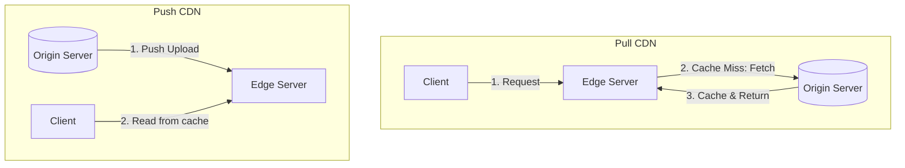

# CDNs & Edge Servers

Content Delivery Networks (CDNs) distribute static and dynamic web content using servers placed close to users (Edge Servers).

---

## 1. CDN Topologies: Push vs Pull

### Pull CDN
* **Mechanism:** The CDN pulls content from the origin server *only* when a cache miss occurs (lazy loading).
* **Pros:** Highly automated, low maintenance, low storage costs.
* **Cons:** First request experiences high latency (cache miss).

### Push CDN
* **Mechanism:** Origin server actively uploads (pushes) all content changes directly to the CDN.
* **Pros:** 100% cache hit rate for users.
* **Cons:** High storage overhead; origin must track all content updates.
* **Ideal for:** Large, rarely changing assets (e.g. video files, app binaries).

---

## 2. Cache Invalidation Strategies
1. **TTL (Time to Live):** Static files expire after a set time.
2. **Purging:** Active API call to the CDN to force delete keys immediately.
3. **File Versioning / Hash naming:** Append a hash of the file content to its name (e.g. `bundle.a8f9c.js`). When code updates, the file name changes, bypassing the cache naturally without requiring manual invalidations.

---

## Interview Q&A Corner

> [!TIP]
> **Q: What is Edge Compute (e.g., Cloudflare Workers, AWS Lambda@Edge)?**
> A: Edge Compute allows running small, lightweight scripts (like JS/WASM) directly on the CDN edge servers. This enables validating JWT tokens, managing A/B testing flags, or routing API requests directly at the edge, saving round-trips to the origin server.
