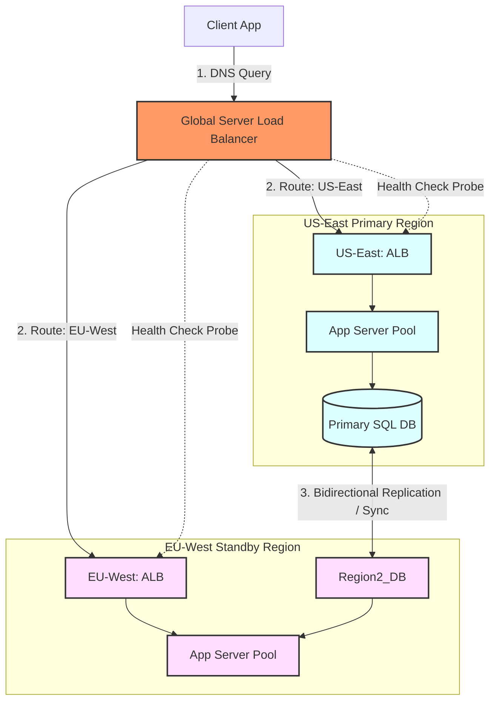
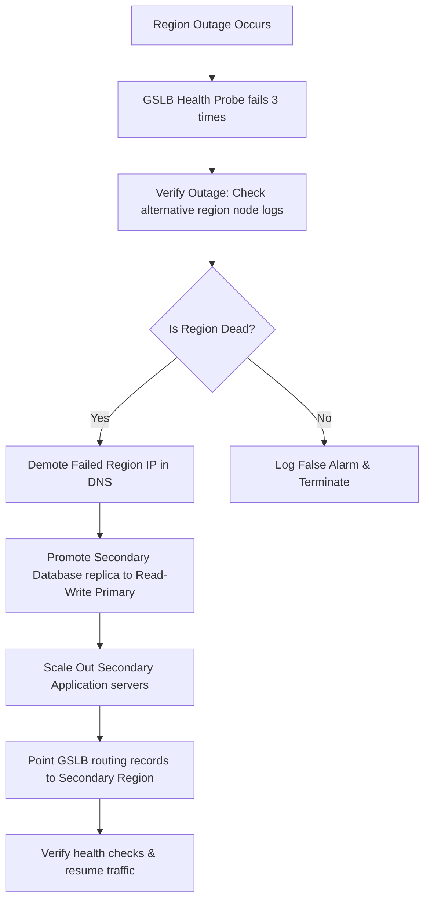

# Disaster Recovery & High Availability

## 1. Core Concept & Scaling Theory

Disaster Recovery (DR) and High Availability (HA) define a system's resilience against infrastructure failures, ranging from individual server crashes to entire data center outages. 
* **RPO (Recovery Point Objective):** The maximum age of data that can be lost when a disaster occurs (e.g., if RPO is 1 hour, backups must run at least every hour).
* **RTO (Recovery Time Objective):** The maximum duration of time allowed to restore the system after a disaster occurs.

### Mathematical Estimations & Scaling Calculations

#### A. Cost of Downtime vs. Disaster Recovery ROI
* **Business Metrics:**
  * Average Revenue Loss per hour of downtime ($V_{\text{hour}}$): $\$100,000$.
  * Annual Probability of a major regional outage ($P_{\text{outage}}$): $5\%$ ($0.05$).
* **Disaster Recovery Topologies Comparison:**
  * **Option A: Backup & Restore**
    * RTO = $24 \text{ hours}$.
    * Annual Maintenance Cost ($\text{Cost}_{\text{A}}$): $\$5,000$.
  * **Option B: Warm Standby (Secondary region running at minimal scale)**
    * RTO = $15 \text{ minutes}$ ($0.25 \text{ hours}$).
    * Annual Maintenance Cost ($\text{Cost}_{\text{B}}$): $\$30,000$.

* **Calculations:**
  * **Expected Annual Loss with Option A ($\text{Loss}_{\text{A}}$):**
    $$\text{Loss}_{\text{A}} = P_{\text{outage}} \times (\text{RTO}_{\text{A}} \times V_{\text{hour}}) = 0.05 \times (24 \times \$100,000) = \$120,000\text{/year}$$
  * **Expected Annual Loss with Option B ($\text{Loss}_{\text{B}}$):**
    $$\text{Loss}_{\text{B}} = P_{\text{outage}} \times (\text{RTO}_{\text{B}} \times V_{\text{hour}}) = 0.05 \times (0.25 \times \$100,000) = \$1,250\text{/year}$$
  * **Return on Investment (ROI) of upgrading to Option B:**
    $$\text{Net Annual Savings} = (\text{Loss}_{\text{A}} - \text{Loss}_{\text{B}}) - (\text{Cost}_{\text{B}} - \text{Cost}_{\text{A}})$$
    $$\text{Net Annual Savings} = (\$120,000 - \$1,250) - (\$30,000 - \$5,000) = \$118,750 - \$25,000 = \$93,750\text{/year}$$
  *Conclusion:* Upgrading to a Warm Standby topology saves the business an expected $\$93,750$ annually, justifying the investment.

---

### Comparative Analysis: Disaster Recovery Topologies

| Strategy | RTO (Recovery Time) | RPO (Data Loss) | Cost | Complexity | Mechanism |
| :--- | :--- | :--- | :--- | :--- | :--- |
| **Backup & Restore** | 24+ Hours | 24 Hours | Low | Simple | DB snapshots are copied to remote storage. Restored on new servers if a failure occurs. |
| **Pilot Light** | 1 - 2 Hours | 15 - 30 Minutes | Low-Medium | Medium | Core databases replicate continuously to the secondary region. Application servers remain shut down and boot up during failover. |
| **Warm Standby** | 15 - 30 Minutes | < 1 Minute | Medium-High | High | Databases replicate continuously. Application servers run in the secondary region at minimum capacity and scale out during failover. |
| **Multi-Site (Active-Active)**| Near 0 Seconds | 0 Seconds | Extremely High| Very High | Both regions actively serve traffic. Data is synchronized synchronously (or asynchronously with conflict resolution). |

---

## 2. Visual Architecture Diagram

Below is the design of a Multi-Region Active-Active topology, showing Global Server Load Balancing (GSLB), regional load balancers, and cross-region database replication.



---

## 3. Data Models & API Signatures

### Global Load Balancer Failover Routing Schema (JSON)
Used by DNS-level routers (e.g. AWS Route 53, Cloudflare) to configure health checks and failover rules.

```json
{
  "routing_policy": "GEOLOCATION",
  "dns_record": "api.example.com",
  "ttl": 30,
  "endpoints": [
    {
      "endpoint_id": "us-east-1-endpoint",
      "ip_address": "198.51.100.12",
      "region": "us-east-1",
      "health_check": {
        "path": "/healthz",
        "port": 443,
        "interval_seconds": 10,
        "unhealthy_threshold": 3,
        "timeout_seconds": 2
      },
      "failover_target": "eu-west-1-endpoint",
      "weight": 100
    },
    {
      "endpoint_id": "eu-west-1-endpoint",
      "ip_address": "203.0.113.45",
      "region": "eu-west-1",
      "health_check": {
        "path": "/healthz",
        "port": 443,
        "interval_seconds": 10,
        "unhealthy_threshold": 3,
        "timeout_seconds": 2
      },
      "failover_target": "us-east-1-endpoint",
      "weight": 100
    }
  ]
}
```

### Heartbeat Status Database Schema (SQL)
Used by monitoring engines to track system availability and coordinate automated failovers.

```sql
CREATE TABLE regional_heartbeats (
    region_id VARCHAR(32) PRIMARY KEY,
    last_reported_timestamp TIMESTAMP DEFAULT CURRENT_TIMESTAMP ON UPDATE CURRENT_TIMESTAMP,
    status VARCHAR(32) NOT NULL, -- HEALTHY, DEGRADED, OFFLINE
    active_connections INT DEFAULT 0,
    failover_in_progress BOOLEAN DEFAULT FALSE
);

CREATE INDEX idx_heartbeat_status ON regional_heartbeats (status, last_reported_timestamp);
```

---

## 4. Operational Flows

### Automated Failover Runbook Flow
When a regional outage occurs, the system executes an automated failover sequence to route traffic to the secondary region.



---

## 5. High Availability, Failovers & Bottlenecks

### Split-Brain Risk in Automated Failovers
* **Problem:** If a network partition cuts off the connection between two regions, they cannot send heartbeats. If the secondary region assumes the primary is dead and promotes its replica database, both regions will accept write requests. This is a **split-brain** state. When the partition heals, merging the conflicting writes can cause data corruption.
* **Mitigation:**
  * **Consensus Quorum:** Require a third region or voting node to act as a tie-breaker. A region can only promote its database if it can communicate with the voting node and confirm the other region is down.
  * **Manual Gate:** For critical databases (like relational transactional systems), automate application failover but require manual approval to promote databases.

### Cross-Region Replication Lag
* **Problem:** Cross-region data replication is usually asynchronous because light-speed limits introduce $100\text{ms}$+ network latencies. If the primary region fails, data written in the last few seconds may not have reached the replica, leading to data loss (violating RPO goals).
* **Mitigation:**
  * **Semi-Synchronous Replication:** Wait for the transaction log to write to at least one close standby region before returning success to the client.
  * **Lossless Failover:** If the primary region is accessible but degraded, block writes, allow replication lag to drop to zero, and then perform a controlled failover.

---

## 6. Comprehensive Interview Q&A

### Q1: Explain the difference between "Pilot Light" and "Warm Standby" disaster recovery models.
**Answer:**
* **Pilot Light:**
  * **Mechanics:** The core databases are running and replicating data continuously in the secondary region. However, application servers, caches, and queue instances are kept shut down or deployed as empty templates (e.g. AWS CloudFormation or Terraform).
  * **Recovery Process:** During a failover, we must boot the application servers, configure their network routes, pull dependencies, and attach them to the promoted databases.
  * **RTO:** Medium ($1$ to $2$ hours) due to server boot and provisioning times.
  * **Cost:** Low, as we only pay for database storage and minimal replication resources.
* **Warm Standby:**
  * **Mechanics:** Application servers and background services are running in the secondary region, but at a reduced capacity (e.g., $10\%$ of the primary region's server count).
  * **Recovery Process:** During a failover, traffic is routed to the secondary region immediately. The system triggers auto-scaling policies to scale the server capacity to handle the full load.
  * **RTO:** Low ($10$ to $30$ minutes) since the system is already online.
  * **Cost:** Medium-High, as we pay for active servers running in the secondary region.

### Q2: How does a Global Server Load Balancer (GSLB) detect a regional outage and route traffic?
**Answer:**
A **Global Server Load Balancer (GSLB)** uses DNS-level and IP-routing methods:
1. **Health Check Probes:** GSLB servers globally send health probes (HTTP GET to `/healthz`) to the public IPs of regional load balancers every 10 seconds.
2. **Outage Detection:** If the probes fail to receive a response (or receive a 5xx status code) for a configured number of consecutive attempts (e.g., 3 times), the endpoint is marked as unhealthy.
3. **DNS Update:** When a client resolves `api.example.com`, the GSLB's DNS servers exclude the unhealthy region's IP from the DNS response and return the IP of the healthy standby region.
4. **Anycast IP Failover:** If using IP-level Anycast, routers update their routing tables to stop sending packets to the failed region, routing them to the active region instead.

### Q3: What is "Split-Brain" during database failover, and how do you protect against it?
**Answer:**
**Split-brain** occurs when a network partition disconnects the primary and secondary regions, but both remain online.
* Because the secondary region cannot reach the primary, it assumes the primary is dead and promotes its replica database to accept writes.
* However, the primary region is still online and accepting writes from clients that can access it.
* Both regions accept writes, leading to divergent datasets. Merging these writes when the network partition heals is difficult and can cause data corruption.

**Mitigation strategies:**
1. **Majority Voting (Quorum Consensus):** Deploy a three-region cluster (or place a lightweight quorum witness node in a third region). A database promotion requires a majority vote. If Region A and Region B cannot communicate, the region that can communicate with the witness node reaches quorum and remains active, while the other region transitions to read-only.
2. **Fencing Tokens:** Ensure client requests include a monotonic fencing token. When the secondary database is promoted, it updates the epoch token. The storage layer rejects subsequent write requests from the old primary because they contain an outdated epoch token.

### Q4: In an Active-Active multi-region database setup, how are write conflicts resolved when the same row is updated in two regions simultaneously?
**Answer:**
Because cross-region synchronization is asynchronous due to network latency, two users can update the same database row in different regions at the same time.
To resolve these conflicts, databases use:
1. **Last-Write-Wins (LWW):** The database compares the timestamps of the conflicting updates and retains the update with the highest timestamp.
   * *Limitation:* It depends on synchronized system clocks (NTP), which can drift. This can cause the database to overwrite a newer write with an older one.
2. **Conflict-Free Replicated Data Types (CRDTs):** Special data structures (like Grow-Only Counters or Observed-Removed Sets) designed to merge updates mathematically without conflicts. For example, a counter update is stored as an addition (e.g., $+2$) rather than a absolute state value, allowing both region updates to sum correctly when merged.
3. **Multi-Version Concurrency Control (MVCC) / Sibling Resolution:** The database retains both versions of the row and flags the conflict. The next read operation retrieves both versions (siblings), and the application layer resolves the conflict using business logic.
