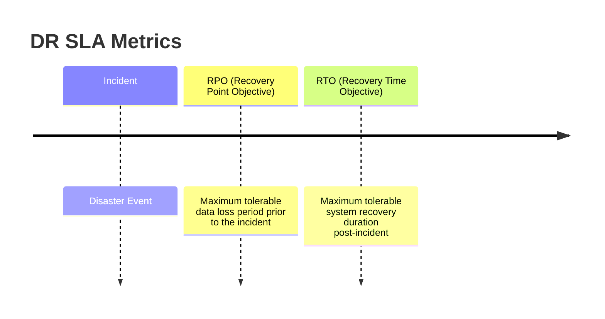

# Disaster Recovery & High Availability

Disaster Recovery (DR) models guarantee service continuity and data protection in case of catastrophic datacenter failures.

---

## 1. Key Metrics: RPO and RTO

* **RPO (Recovery Point Objective):** The maximum age of data that must be recovered from backup storage for normal operations to resume (determines backup frequency).
* **RTO (Recovery Time Objective):** The maximum duration of time allowed to restore the system after a disaster (determines recovery speed).

---

## 2. DR Topologies

### Active-Passive (Warm Standby / Pilot Light)
* **Design:** Primary region handles 100% of traffic. Replicas are kept idle or in a shut-down state in a secondary region.
* **Failover:** If primary fails, DNS points to secondary, and secondary instances boot up.
* **Cost:** Low.
* **RTO:** Medium-High.

### Active-Active (Multi-Region)
* **Design:** Both regions actively accept read and write traffic.
* **Failover:** Immediate routing shift via Anycast DNS.
* **Cost:** Extremely high.
* **RTO:** Low (Seconds).

---

## Interview Q&A Corner

> [!WARNING]
> **Q: What is the main database challenge in an Active-Active Multi-Region setup?**
> A: Multi-region write conflicts. If a user in the US updates a database row, and another user in Europe updates the same row simultaneously, cross-region latency ($\approx 100-200\text{ ms}$) prevents immediate locking. Resolving conflicts requires algorithms like **Conflict-free Replicated Data Types (CRDTs)**, **Last-Write-Wins (LWW)**, or using synchronized atomic clocks (like Google Spanner TrueTime).
