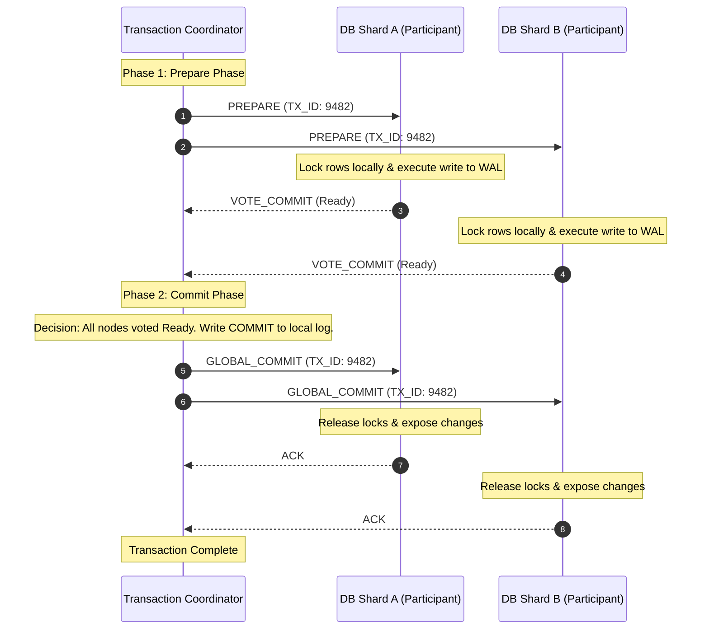
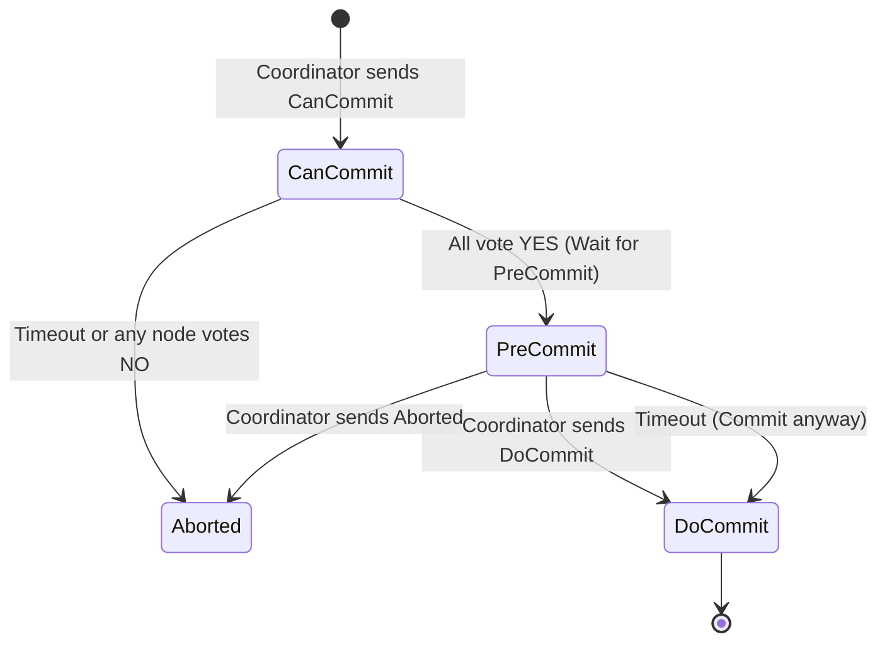

# Distributed Transactions

## 1. Core Concept & Scaling Theory

Distributed transactions coordinate database operations across multiple physical servers or microservices to guarantee data integrity. They ensure that a business transaction either completes fully across all databases or leaves them unmodified.

### Mathematical Latency & Availability Modeling

#### A. Availability Decay under 2PC
In a Two-Phase Commit (2PC) transaction, all participating databases must be available. If any participant is unreachable, the transaction fails.
* Let $A_i$ be the availability (uptime probability) of database node $i$, and $K$ be the number of participating nodes.
* The overall availability of a 2PC transaction ($A_{\text{2pc}}$) is:
  $$A_{\text{2pc}} = \prod_{i=1}^{K} A_i$$
* **Calculations:**
  * For $K = 5$ databases, each with $99.9\%$ availability ($A_i = 0.999$):
    $$A_{\text{2pc}} = 0.999^5 \approx 99.5\% \text{ availability (expected 1.8 days of downtime per year)}$$
  * For $K = 20$ databases:
    $$A_{\text{2pc}} = 0.999^{20} \approx 98.0\% \text{ availability (expected 7.3 days of downtime per year)}$$
  * *Conclusion:* 2PC availability decays exponentially as the number of nodes increases. This makes it unsuitable for large microservice architectures.

#### B. Latency Sizing: 2PC vs. Saga
* **2PC Transaction Latency ($T_{\text{2pc}}$):**
  $$T_{\text{2pc}} = 2 \times \max_{i} (\text{PrepareTime}_i + \text{RTT}_i) + 2 \times \max_{i} (\text{CommitTime}_i + \text{RTT}_i)$$
  * Let there be $3$ database shards. The network Round-Trip Time (RTT) to the shards is $5 \text{ ms}$, $25 \text{ ms}$, and $60 \text{ ms}$. Database processing times are $10 \text{ ms}$ for prepare and $5 \text{ ms}$ for commit.
  * The maximum latency is determined by the slowest node (the $60\text{ ms}$ RTT node):
    $$\text{Max Prepare} = 10 \text{ ms} + 60 \text{ ms} = 70 \text{ ms}$$
    $$\text{Max Commit} = 5 \text{ ms} + 60 \text{ ms} = 65 \text{ ms}$$
    $$T_{\text{2pc}} = 2 \times 70 \text{ ms} + 2 \times 65 \text{ ms} = 270 \text{ ms}$$
  * All database records remain locked for the entire $270 \text{ ms}$ duration.

* **Saga Transaction Latency ($T_{\text{Saga}}$):**
  A Saga executes local transactions sequentially without global locks.
  $$T_{\text{Saga}} = \sum_{i=1}^{K} (\text{ExecutionTime}_i + \text{RTT}_i)$$
  Using the same metrics:
  $$T_{\text{Saga}} = (10 + 5) + (10 + 25) + (10 + 60) = 15 + 35 + 70 = 120 \text{ ms}$$
  *Conclusion:* The Saga transaction completes in less than half the time of 2PC ($120\text{ ms}$ vs. $270\text{ ms}$), and individual database locks are held only locally for $10\text{ ms}$ on each node, maximizing write concurrency.

---

### Comparative Analysis: Distributed Consistency Models

| Feature | Two-Phase Commit (2PC) | Three-Phase Commit (3PC) | Saga Pattern |
| :--- | :--- | :--- | :--- |
| **Consistency** | Strong Consistency (ACID) | Strong Consistency (ACID) | Eventual Consistency (BASE) |
| **Locking** | Synchronous global locks. | Synchronous global locks. | No global locks. |
| **Protocol Mode** | Blocking (stalls if coordinator fails). | Non-blocking (uses timeouts). | Non-blocking (asynchronous retries). |
| **Throughput** | Low (limited by slowest node and lock contention). | Low. | High (immediate lock release). |
| **Network Overhead** | 4 message round-trips. | 6 message round-trips. | Linear sequence of local calls. |
| **Best Use Case** | Monolithic databases with local shards. | Highly reliable networks with low latency requirements. | Distributed microservices, e-commerce. |

---

## 2. Visual Architecture Diagram

### A. The Two-Phase Commit Protocol (Prepare & Commit phases)


### B. The Three-Phase Commit Protocol State Diagram
3PC introduces a non-blocking state (`PreCommit`) and timeouts to prevent participants from blocking indefinitely if the coordinator fails.



---

## 3. Data Models & API Signatures

### Participant Database Transaction Log Schema (SQL)
Every participant database must log 2PC transaction states to coordinate recovery.

```sql
CREATE TABLE participant_tx_log (
    tx_id VARCHAR(64) PRIMARY KEY,
    coordinator_id VARCHAR(64) NOT NULL,
    tx_state VARCHAR(32) NOT NULL, -- PREPARED, COMMITTED, ABORTED
    local_locks_held TEXT[],       -- Array of row locks acquired
    updated_at TIMESTAMP DEFAULT CURRENT_TIMESTAMP ON UPDATE CURRENT_TIMESTAMP
);

CREATE INDEX idx_participant_state ON participant_tx_log (tx_state);
```

### gRPC API Signature: Coordinator-to-Participant Interface
```protobuf
syntax = "proto3";

package com.example.tx;

service ParticipantService {
  rpc Prepare (PrepareRequest) returns (PrepareResponse);
  rpc Commit (CommitRequest) returns (CommitResponse);
  rpc Rollback (RollbackRequest) returns (RollbackResponse);
}

message PrepareRequest {
  string tx_id = 1;
  bytes transaction_payload = 2; // Write operations details
}

message PrepareResponse {
  enum Vote {
    VOTE_COMMIT = 0;
    VOTE_ABORT = 1;
  }
  Vote vote = 1;
}

message CommitRequest {
  string tx_id = 1;
}

message CommitResponse {
  bool success = 1;
}

message RollbackRequest {
  string tx_id = 1;
}

message RollbackResponse {
  bool success = 1;
}
```

---

## 4. Operational Flows

### 2PC Failure Path (Abort Flow)
If any participant votes `VOTE_ABORT` (or fails to respond within a timeout window) during Phase 1:
1. **Vote Invalidation:** The coordinator receives a `VOTE_ABORT` response from Participant A, while Participant B votes `VOTE_COMMIT`.
2. **Write Log:** The coordinator writes a `GLOBAL_ABORT` entry to its local transaction log.
3. **Rollback Command:** The coordinator sends `GLOBAL_ROLLBACK` commands to all participants.
4. **Release Lock:** Participant B receives the rollback command, discards its buffered writes, releases its local row locks, and returns an acknowledgment.
5. **Abort Complete:** The coordinator reports the rollback success to the client, ensuring consistency.

---

## 5. High Availability, Failovers & Bottlenecks

### The Blocking Coordinator Problem (2PC SPOF)
* **Problem:** If the coordinator crashes *after* participants have voted YES (PREPARED) but *before* broadcasting the `GLOBAL_COMMIT`, participants are left in a blocked state. They must retain their database locks indefinitely to prevent inconsistencies, as they do not know if the transaction was committed or aborted. This lock contention can quickly exhaust database resource pools.
* **Mitigation:**
  * **Co-Coordinator Heartbeats:** Standby coordinators track the primary coordinator's log. If the primary crashes, a standby coordinator reads the state and takes over.
  * **Google Spanner's Paxos integration:** Spanner wraps the transaction coordinator and participants in **Paxos groups**. If a participant or coordinator fails, another node in the Paxos group takes over immediately, avoiding blocking states.

---

## 6. Comprehensive Interview Q&A

### Q1: Why is Two-Phase Commit (2PC) classified as a "blocking protocol"? What are the consequences of this?
**Answer:**
2PC is classified as a **blocking protocol** because participants must wait for the coordinator's commit or abort command after voting YES (PREPARED). 
* If the coordinator crashes or becomes unreachable during this window, the participants cannot make independent decisions.
* They do not know if the coordinator decided to commit or abort the transaction.
* As a result, they must hold their local database locks indefinitely to prevent data inconsistency.
* **Consequences:** These active locks block subsequent read/write requests targeting the same rows. This can cause connection pools to saturate, leading to cascading timeouts and outages across microservices.

### Q2: How does Three-Phase Commit (3PC) address the blocking problem of 2PC, and what is its primary limitation under network partitions?
**Answer:**
3PC addresses the blocking problem of 2PC by spliting the commit phase and introducing timeouts:
1. **Can-Commit Phase:** Participants check if they can commit and vote.
2. **Pre-Commit Phase:** If all vote YES, the coordinator sends a `PreCommit` command. Participants transition to a pre-commit state.
3. **Do-Commit Phase:** The coordinator sends a `DoCommit` command.

**Timeout Resolution:**
* If a participant is in the `PreCommit` state and does not receive a command from the coordinator within a timeout window, it **assumes success and commits**. This is safe because transition to the `PreCommit` state requires confirmation that *all* nodes voted YES in the first phase.

**Primary Limitation (Split-Brain Commit):**
If a network partition occurs during the transition from `PreCommit` to `DoCommit`:
* One partition of nodes receives the coordinator's `DoCommit` command and commits.
* Another partition of nodes is cut off from the coordinator. Because they are still in the `CanCommit` state, they timeout and abort the transaction.
* This results in a **split commit** (some nodes commit while others abort), violating atomicity and consistency guarantees. Thus, 3PC does not work reliably in partition-prone distributed networks.

### Q3: Explain how Google Spanner uses a combination of 2PC and Paxos to achieve distributed transactions at global scale without the usual availability bottlenecks.
**Answer:**
Google Spanner combines 2PC and Paxos to provide global consistency and high availability:
1. **Data Sharding:** Spanner shards data into logical ranges called *splits*.
2. **Paxos Replication:** Every split is replicated across multiple regions using a Paxos group (typically 3 or 5 replicas). One replica in the group is elected the Paxos Leader.
3. **Paxos-Backed 2PC:**
   * When a transaction spans multiple splits, Spanner uses 2PC to coordinate the write across the splits.
   * However, instead of using single servers as the coordinator and participants, Spanner uses the **Paxos Group Leaders**.
   * If a Paxos Leader crashes during the 2PC process, the Paxos group immediately elects a new leader. The new leader retrieves the replicated Paxos log and resumes the 2PC workflow.
   * This eliminates the single-point-of-failure (SPOF) blocking vulnerability of 2PC.

### Q4: Compare the ACID guarantees of a 2PC-based system with the BASE characteristics of a Saga-based microservices system.
**Answer:**
* **ACID (2PC-based):**
  * **Atomicity:** All participant databases commit or abort the transaction.
  * **Consistency:** The system transitions from one consistent state to another. Intermediate states are invisible.
  * **Isolation:** Serializability is maintained. Global locks prevent concurrent transactions from reading uncommitted data.
  * **Durability:** Committed data is persisted to non-volatile storage.
* **BASE (Saga-based):**
  * **Basically Available:** The system prioritizes response availability. Databases do not lock rows globally, so requests are not blocked.
  * **Soft State:** Data states can change over time without user interaction due to asynchronous updates and compensating transactions.
  * **Eventual Consistency:** The database states converge to consistency eventually, though clients may temporarily read stale or intermediate data.
* **Comparison:** While 2PC provides strong consistency, it limits scalability due to lock contention and blocking risks. Sagas trade immediate consistency for high availability and throughput, managing failure recovery using compensating transactions.
