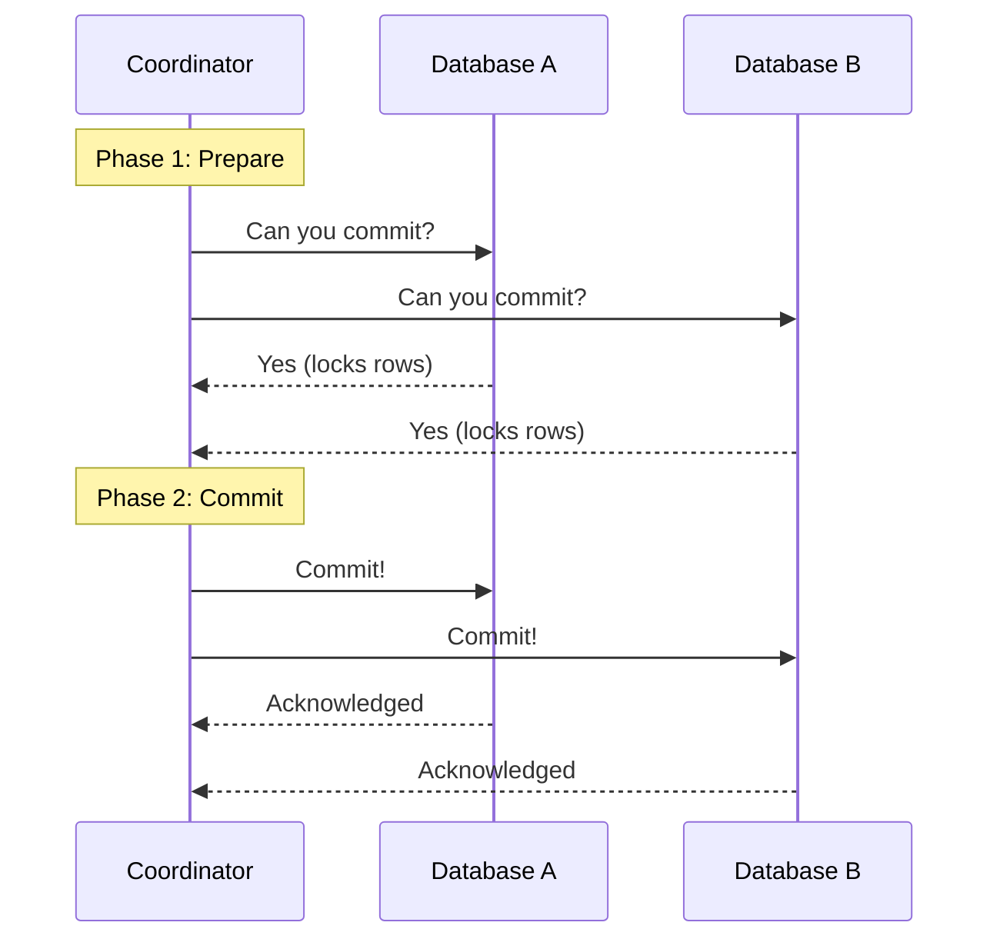

# Distributed Transactions

Distributed transactions maintain data integrity and consistency across multiple database databases and services.

---

## 1. Two-Phase Commit (2PC)
A locking protocol coordinated by a central manager to ensure atomic writes.

### 2PC Failures
* **Blocking Protocol:** If the coordinator crashes mid-commit, participants remain locked, causing database resource exhaustion.
* **Performance:** High network round-trips cause massive latencies.

---

## 2. Three-Phase Commit (3PC)
3PC divides Phase 2 into two sub-phases: **Pre-Commit** and **Commit**, introducing timeouts.
* If a participant doesn't receive a commit message, it times out and commits anyway (since it was already in pre-commit).
* *Cons:* Network partitions can still cause inconsistencies (e.g., split commits).

---

## 3. Comparison: 2PC vs Saga

| Feature | Two-Phase Commit (2PC) | Saga Pattern |
|---------|------------------------|--------------|
| **Locking** | Synchronous locking of database rows | No locking (asynchronous local transactions) |
| **Consistency** | Strong Consistency | Eventual Consistency |
| **Performance** | Low throughput, high latency | High throughput, low latency |

---

## Interview Q&A Corner

> [!IMPORTANT]
> **Q: Why is the Saga pattern preferred over 2PC in modern microservices?**
> A: 2PC requires locking resources across multiple databases, which doesn't scale. If one microservice goes down, all database locks remain, blocking the entire system. Saga runs local transactions immediately without locking, making the system highly available and resilient, accepting eventual consistency instead.
