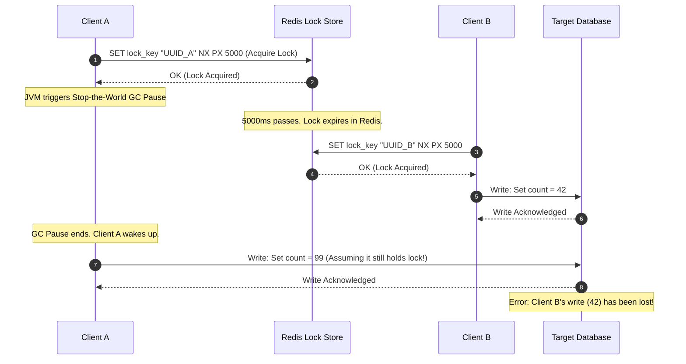
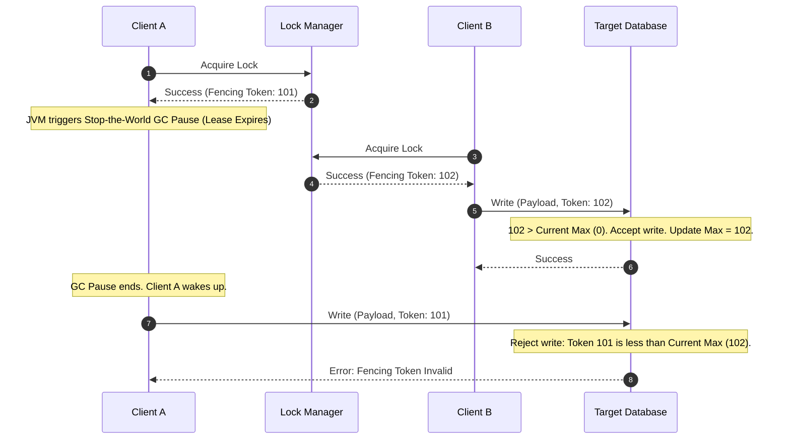

# Distributed Locking

## 1. Core Concept & Scaling Theory

A distributed lock coordinates access to a shared resource across multiple independent server nodes. Unlike local locks (e.g. Java mutexes or synchronized blocks), distributed locks must be managed by an external consensus system or dynamic database.

### Mathematical Clock Drift & GC Pause Sizing

#### A. Lock Hold Duration Calculation
When using TTL-based distributed locks (like Redis), the actual lease duration ($T_{\text{hold}}$) available to the client is shorter than the configured time-to-live ($T_{\text{ttl}}$) due to network delay and physical clock drift.
* Let $T_{\text{ttl}}$ be the lock lease time (e.g., $10,000 \text{ ms}$).
* Let $T_{\text{acquire}}$ be the time required to complete lock registration across the cluster (e.g., $400 \text{ ms}$ for network round-trips to Redis nodes).
* Let $\delta$ be the maximum clock drift bound between the cluster nodes (typically $50 \text{ ms}$ for systems synced via NTP).
* The remaining lock hold time ($T_{\text{hold}}$) is:
  $$T_{\text{hold}} = T_{\text{ttl}} - T_{\text{acquire}} - \delta$$
  $$T_{\text{hold}} = 10,000 \text{ ms} - 400 \text{ ms} - 50 \text{ ms} = 9,550 \text{ ms}$$
  The client must complete its work and release the lock within $9,550 \text{ ms}$.

#### B. The Stop-the-World GC Pause Failure Scenario
* **Scenario:**
  * Client A acquires a lock with $T_{\text{ttl}} = 5 \text{ seconds}$.
  * Client A successfully completes the lock acquisition in $100 \text{ ms}$.
  * Immediately after acquiring the lock, Client A's JVM triggers a **Stop-the-World (STW) Garbage Collection pause** lasting $8 \text{ seconds}$.
  * **Result:** While Client A is paused, the lock's $5$-second TTL expires in the database.
  * Client B queries the lock manager, finds the lock is free, and acquires it. Client B begins modifying the database.
  * After $8$ seconds, Client A's GC pause ends. Client A resumes execution.
  * Client A assumes it still holds the lock and writes its changes to the database, overwriting Client B's writes.
  * This violates mutual exclusion guarantees.

---

### Comparative Analysis: Distributed Lock Managers

| Feature | Redis (Redlock) | ZooKeeper (Consensus) | Relational Database (SQL) |
| :--- | :--- | :--- | :--- |
| **Throughput** | Extremely High (in-memory, sub-millisecond) | Medium-High (limited by consensus writes) | Low (limited by disk I/O and lock tables) |
| **Failover Detection** | TTL / Lease Expiration. | Ephemeral Node + Session Heartbeat. | Manual timeout cleanup scripts. |
| **Consistency Class** | AP (prioritizes availability). | CP (strict consistency). | CP. |
| **Clock Dependency** | High (vulnerable to clock drift and GC pauses). | None. | Low. |
| **Complexity** | Low (simple client libraries like Redisson). | Medium (requires managing ZooKeeper clusters). | Low (uses existing database tables). |

---

## 2. Visual Architecture Diagram

### A. Failure Path: GC Pause without Fencing Tokens
This diagram illustrates how a GC pause causes a client to overwrite database changes made by another client, violating mutual exclusion.



### B. Mitigation: Fencing Tokens (Monotonic Counter)
A fencing token is a monotonically increasing counter returned with each lock lease. The target database tracks the latest token and rejects writes containing older tokens.



---

## 3. Data Models & API Signatures

### Storage Schema with Fencing Token Verification (SQL)
To support fencing tokens, the target database table must include a column to track the latest token.

```sql
CREATE TABLE target_resources (
    resource_id VARCHAR(64) PRIMARY KEY,
    resource_value TEXT NOT NULL,
    last_fencing_token BIGINT NOT NULL DEFAULT 0,
    updated_at TIMESTAMP DEFAULT CURRENT_TIMESTAMP ON UPDATE CURRENT_TIMESTAMP
);

-- Store procedure or update query checking token constraint
-- UPDATE target_resources 
-- SET resource_value = 'new_value', last_fencing_token = 102 
-- WHERE resource_id = 'res_01' AND last_fencing_token < 102;
```

### Distributed Lock Service Interface
API signatures exposed by a central Distributed Lock Manager.

#### POST `/api/v1/locks/acquire`
```json
{
  "resource_id": "lock_user_profile_94827",
  "client_id": "client_pod_8842",
  "lease_duration_ms": 10000,
  "wait_timeout_ms": 2000
}
```
##### Response (Success)
```json
{
  "acquired": true,
  "lock_token": "token_uuid_8a7c2b3e",
  "fencing_token": 102,
  "expires_at": 1780444010000
}
```

#### POST `/api/v1/locks/release`
```json
{
  "resource_id": "lock_user_profile_94827",
  "lock_token": "token_uuid_8a7c2b3e",
  "client_id": "client_pod_8842"
}
```

---

## 4. Operational Flows

### ZooKeeper Lock Acquisition Flow (Ephemeral Sequential Nodes)
ZooKeeper implements locking using ephemeral nodes and watchers, avoiding physical clock dependency.
1. **Node Creation:** The client attempts to acquire a lock by creating an ephemeral, sequential node under the lock path:
   `CREATE /locks/lock_resource_01/lock_node_ -e -s`
2. **Retrieve Children:** The client lists all children under `/locks/lock_resource_01`.
3. **Evaluate Ownership:**
   * If the client's node has the lowest sequence number, it holds the lock.
   * If the client's node does not have the lowest sequence, the client sets a **watch** on the node with the next lowest sequence number.
4. **Blocking State:** The client blocks and waits for a change notification.
5. **Watcher Trigger:** When the holder releases the lock (or crashes, which automatically deletes its ephemeral node), the watcher fires. The waiting client re-evaluates the children list to verify ownership.

---

## 5. High Availability, Failovers & Bottlenecks

### The Herd Effect in ZooKeeper Locks
* **Problem:** If $10,000$ client instances attempt to acquire a lock simultaneously, a change in lock ownership can trigger watch events across all $10,000$ clients. This causes a spike in CPU and network usage on the ZooKeeper cluster (the **Herd Effect**).
* **Mitigation:**
  * Clients should only watch the node immediately preceding theirs on the sequence ring (e.g., Node 3 watches Node 2, Node 2 watches Node 1). This ensures that a lock release only notifies the single next client in queue, scaling lookup operations to $O(1)$.

### Clock Drift and NTP adjustments
* **Problem:** In virtualized environments, physical clocks can experience drift. If NTP updates correct a clock by jumping it forward or backward, it can cause TTL calculations on the lock manager to expire early or run long, breaking safety assumptions.
* **Mitigation:** Configure NTP daemons to use **slewing** (gradually adjusting the clock rate over time) rather than **stepping** (jumping the clock time instantly).

---

## 6. Comprehensive Interview Q&A

### Q1: Explain Martin Kleppmann's critique of the Redlock algorithm. Why does he argue it is unsafe for critical systems?
**Answer:**
Martin Kleppmann's critique of **Redlock** focuses on its dependency on physical system clocks and assumptions about network timing:
1. **Clock Dependency:** Redlock determines lock validity by subtracting the elapsed acquisition time from the lock's TTL. It assumes that physical clocks across all Redis nodes run at the same speed. If a node's clock drifts or jumps due to an NTP update, the lock can expire early on one node, permitting another client to acquire it and violating mutual exclusion.
2. **Stop-the-World (STW) GC Pauses:** If a client experiences a long GC pause immediately after acquiring a lock, the lock's TTL can expire in Redis. The client is unaware of the pause. When it resumes, it performs its write operations under the false assumption that it still holds the lock, which can cause data corruption.
3. **Network Delays:** A network spike can delay the lock acquisition process. If the client takes longer than the TTL to acquire the lock across a majority of nodes, Redlock may assume the lock is acquired when it has already expired on the first nodes.

Kleppmann argues that for a lock to guarantee safety, it cannot rely on physical clock values. It must use logical counters (like ZooKeeper epoch tokens) to validate operations.

### Q2: How does a "Fencing Token" guarantee safety during lock lease expiration?
**Answer:**
A **Fencing Token** is a monotonically increasing identifier (e.g., a counter that increments with each lock acquisition) returned by the lock manager.

**Mechanics:**
1. When Client A acquires the lock, it receives fencing token `101`.
2. Client A is delayed (e.g. due to a GC pause), and the lock expires.
3. Client B acquires the lock and receives fencing token `102`.
4. Client B writes its update to the database, including its token `102`. The database records that the latest processed token is `102`.
5. When Client A wakes up, it attempts to write its update using token `101`.
6. The database compares the token in the request (`101`) with the latest processed token (`102`). Because `101 < 102`, the database rejects Client A's write.

Fencing tokens move the validation check to the storage layer, ensuring that out-of-order writes from expired lock holders are rejected.

### Q3: How does ZooKeeper's Ephemeral Sequential Node mechanism prevent the "Herd Effect"?
**Answer:**
The **Herd Effect** occurs when a state change notifies many waiting clients, causing a spike in network and CPU load.

ZooKeeper prevents this using **Sequential Nodes**:
1. When clients compete for a lock, each creates a sequential node (e.g. `/lock/node_001`, `/lock/node_002`, `/lock/node_003`).
2. Instead of all clients watching the root lock path (which would trigger notifications to everyone when the lock is released), each client sets a watcher only on the node **immediately preceding** its own sequence number.
3. For example, `node_003` watches `node_002`, and `node_002` watches `node_001`.
4. When `node_001` is deleted (releasing the lock), only `node_002` is notified.
5. `node_002` acquires the lock, while `node_003` continues waiting. This limits notifications to a single node, scaling lock release operations to $O(1)$.

### Q4: Compare Redis Redlock vs. ZooKeeper locks in terms of performance, consensus requirements, and safety guarantees.
**Answer:**
* **Performance:**
  * **Redis (Redlock):** High performance. Redis operates in memory and can handle hundreds of thousands of operations per second with sub-millisecond latencies.
  * **ZooKeeper:** Moderate performance. Every node write requires consensus replication across a quorum of nodes, persisting transaction logs to disk.
* **Consensus Requirements:**
  * **Redis:** Does not use a formal consensus protocol like Raft or Paxos. Redlock requires a simple majority of independent Redis master nodes to accept the lock key.
  * **ZooKeeper:** Requires a strict consensus protocol (ZAB). It maintains a consistent, synchronized tree state across nodes.
* **Safety:**
  * **Redis:** AP classification. It trades strict safety for availability. Vulnerable to clock drift and GC pause issues unless combined with fencing tokens.
  * **ZooKeeper:** CP classification. It prioritizes consistency. If ZooKeeper says a client holds a lock, it is guaranteed by the consensus protocol. Ephemeral nodes automatically clean up if a client loses connection, preventing deadlock states.
