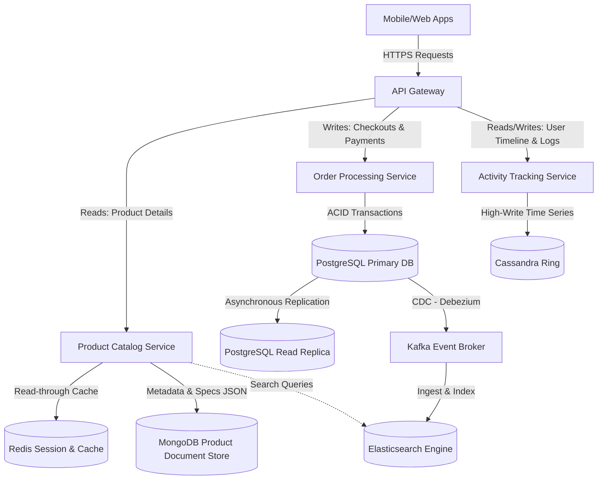
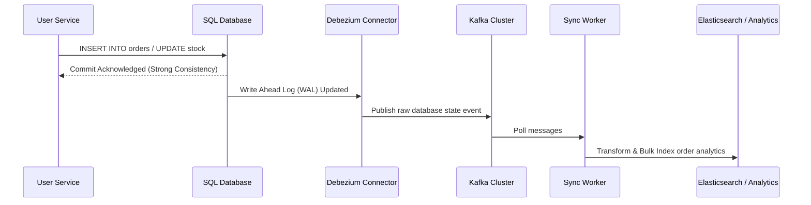

# SQL vs NoSQL (Relational vs Non-Relational)

## 1. System Scale & Core Theory

Choosing between Relational (SQL) and Non-Relational (NoSQL) databases is a fundamental architectural decision. It defines how a system handles ACID properties, horizontal scaling, partition tolerance, and schema flexibility.

### Mathematical Sizing & Scale Estimations

Consider a global e-commerce system with the following traffic and data requirements:
*   **Active Users:** $100\text{ Million}$ monthly active users (MAU), $10\text{ Million}$ daily active users (DAU).
*   **Write QPS (Orders):** Average $200\text{ orders/second}$, peak $2,000\text{ orders/second}$.
*   **Read QPS (Product Views/Searches):** Average $10,000\text{ reads/second}$, peak $100,000\text{ reads/second}$.
*   **Retention Period:** 5 years.

#### Storage Estimation (SQL - Relational Transactions)
An order record contains:
*   `order_id` (UUID): $16\text{ bytes}$
*   `user_id` (UUID): $16\text{ bytes}$
*   `payment_id` (UUID): $16\text{ bytes}$
*   `total_amount` (Decimal): $8\text{ bytes}$
*   `status` (Enum/Varchar): $16\text{ bytes}$
*   `created_at` (Timestamp): $8\text{ bytes}$
*   **Total core row size:** $\approx 80\text{ bytes}$.
*   **Order Line Items:** Average 3 items per order. Each item: `order_item_id` ($16\text{ bytes}$), `product_id` ($16\text{ bytes}$), `quantity` ($4\text{ bytes}$), `price` ($8\text{ bytes}$) = $44\text{ bytes}$. 3 items = $132\text{ bytes}$.
*   **Total storage per order:** $80 + 132 = 212\text{ bytes}$.
*   **Annual Volume:** $200\text{ writes/sec} \times 86400\text{ sec/day} \times 365\text{ days} \approx 6.3\text{ Billion orders/year}$.
*   **Annual Storage Size:** $6.3\text{ Billion} \times 212\text{ bytes} \approx 1.33\text{ TB/year}$.
*   With a metadata and secondary indexes factor of $1.5\times$ and replication factor of $3$, total SQL storage needed per year:
    $$\text{Total Storage} = 1.33\text{ TB} \times 1.5 \times 3 \approx 6\text{ TB/year}$$

#### Storage Estimation (NoSQL - Columnar/Document Product Catalog)
A product record contains dynamic attributes, description, image links, and reviews.
*   **Product JSON Size:** Average $5\text{ KB}$ per product.
*   **Total Products:** $50\text{ Million}$ items.
*   **Total Catalog Storage:** $50\text{ Million} \times 5\text{ KB} = 250\text{ GB}$.
*   **Replication Factor (3x):** $750\text{ GB}$.
*   NoSQL easily stores this in memory-mapped document structures for fast retrieval.

### Database Selection Trade-off Matrix

| Feature / Attribute | Relational (SQL - e.g., PostgreSQL, MySQL) | Key-Value (e.g., Redis, DynamoDB) | Document (e.g., MongoDB, CouchDB) | Wide-Column (e.g., Cassandra, ScyllaDB) | Graph (e.g., Neo4j) |
| :--- | :--- | :--- | :--- | :--- | :--- |
| **Data Model** | Tabular (Rows/Columns) with strict relations | Key-Value pairs (Opaque values) | Semi-structured JSON/BSON documents | Partitioned rows with sparse dynamic columns | Nodes, Edges, and Properties |
| **Schema** | Static, predefined schema (DDL required) | Schema-less | Dynamic, flexible schema | Dynamic columns per row (predefined column families) | Dynamic schema for nodes/edges |
| **Transactions** | Strong ACID, Multi-row transactions | Single-key atomicity (Redis has transactions) | Single-document ACID (MongoDB supports multi-doc since 4.0) | Tunable consistency, lightweight transactions (LWT) | ACID transactions for graph operations |
| **Scaling** | Vertical scaling, horizontal reads via replicas | Horizontal sharding based on hash of key | Horizontal partitioning (sharding) | Linear horizontal scalability via peer-to-peer ring | Difficult to partition; scales vertically or via read-replicas |
| **PACELC Class** | PC/EC (Consistent on partition, Else Consistent) | PA/EL (DynamoDB) or PC/EC (Redis) | PA/EC (MongoDB primary-secondary) | PA/EL (Configurable to PC/EC) | PC/EC |
| **Best Use Case** | Financial ledger, billing, inventory control | Caching, session store, shopping carts | Content management, product catalog, user profile | Time-series, IoT metrics, chat logs, user tracking | Social graph, fraud detection, recommendation engine |

---

## 2. Visual Architecture Diagram

A polyglot persistence architecture leverages the strengths of both SQL and NoSQL. The API Gateway routes transactional operations to SQL databases and unstructured/highly scalable data feeds to NoSQL stores.



---

## 3. Data Models & API Signatures

### Relational Database Schema (SQL)
The core transactional ledger uses strict foreign keys and index strategies to maintain referential integrity.

```sql
-- PostgreSQL Schema
CREATE TABLE users (
    user_id UUID PRIMARY KEY,
    email VARCHAR(255) UNIQUE NOT NULL,
    password_hash VARCHAR(255) NOT NULL,
    created_at TIMESTAMP WITH TIME ZONE DEFAULT CURRENT_TIMESTAMP
);

CREATE TABLE orders (
    order_id UUID PRIMARY KEY,
    user_id UUID NOT NULL REFERENCES users(user_id),
    total_amount NUMERIC(12, 2) NOT NULL CHECK (total_amount >= 0),
    status VARCHAR(50) NOT NULL,
    created_at TIMESTAMP WITH TIME ZONE DEFAULT CURRENT_TIMESTAMP
);

CREATE TABLE order_items (
    order_item_id UUID PRIMARY KEY,
    order_id UUID NOT NULL REFERENCES orders(order_id) ON DELETE CASCADE,
    product_id VARCHAR(100) NOT NULL,
    quantity INT NOT NULL CHECK (quantity > 0),
    price NUMERIC(12, 2) NOT NULL CHECK (price >= 0)
);

-- Optimization Indexes
CREATE INDEX idx_orders_user_id ON orders(user_id);
CREATE INDEX idx_order_items_order_id ON order_items(order_id);
```

### NoSQL Document Schema (MongoDB Catalog JSON)
Product attributes vary significantly across categories.

```json
{
  "_id": "prod_77821389-9b7e-4029-a1b4-706f5c531ee9",
  "name": "UltraBook Pro 15",
  "category": "Electronics",
  "brand": "TechCorp",
  "price": 1299.99,
  "stock_quantity": 425,
  "attributes": {
    "cpu": "Intel Core i7",
    "ram": "16GB DDR5",
    "storage": "512GB NVMe SSD",
    "screen_size": "15.6 inches",
    "ports": ["USB-C", "Thunderbolt 4", "HDMI"]
  },
  "ratings": {
    "average": 4.7,
    "count": 1240
  },
  "tags": ["laptop", "ultrabook", "workstation"],
  "updated_at": "2026-06-03T02:00:00Z"
}
```

### API Signatures

#### 1. Create Order (SQL transactional write)
*   **Protocol:** HTTPS POST
*   **Path:** `/api/v1/orders`
*   **Request Payload:**
```json
{
  "user_id": "893fd2bc-9d3f-422d-a2f1-5f21e51b1f89",
  "items": [
    {
      "product_id": "prod_77821389-9b7e-4029-a1b4-706f5c531ee9",
      "quantity": 1,
      "price": 1299.99
    }
  ]
}
```
*   **Response Payload (201 Created):**
```json
{
  "order_id": "bfd60920-5c6d-4ee8-a92c-0e782beee930",
  "status": "PENDING",
  "total_amount": 1299.99,
  "created_at": "2026-06-03T02:26:10Z"
}
```

#### 2. Get Product Details (NoSQL document read)
*   **Protocol:** HTTPS GET
*   **Path:** `/api/v1/products/{product_id}`
*   **Response Payload (200 OK):**
```json
{
  "product_id": "prod_77821389-9b7e-4029-a1b4-706f5c531ee9",
  "name": "UltraBook Pro 15",
  "attributes": {
    "cpu": "Intel Core i7",
    "ram": "16GB DDR5",
    "storage": "512GB NVMe SSD"
  },
  "price": 1299.99,
  "in_stock": true
}
```

---

## 4. Operational Flows

### Transactional Order Flow (SQL Write Path)

1.  **Request Ingestion:** The client sends a checkout request.
2.  **Concurrency Locking & Validation:**
    *   Start SQL transaction: `BEGIN TRANSACTION;`
    *   Acquire row-level locks on stock counts: `SELECT quantity FROM inventory WHERE product_id = ? FOR UPDATE;`
    *   Verify sufficient stock.
3.  **Insert Ledger Records:**
    *   Insert row into `orders` table.
    *   Insert rows into `order_items` table.
    *   Update inventory levels: `UPDATE inventory SET quantity = quantity - ? WHERE product_id = ?;`
4.  **Transaction Commit:**
    *   `COMMIT;` to make all database changes permanent.
    *   If any step fails, `ROLLBACK;` to guarantee consistency.

### Catalog Retrieval Flow (NoSQL Read Path)

1.  **Cache Lookup:** The Product Service checks Redis using the key `product:prod_77821389`.
    *   *Cache Hit:* Return the product JSON payload.
2.  **Database Fallback:** If there is a cache miss, the service queries MongoDB.
3.  **JSON Deserialization:** MongoDB returns the document. The service returns the payload to the client.
4.  **Asynchronous Cache Refill:** The service writes the returned document back to Redis with a Time To Live (TTL) of 3600 seconds.

### Eventual Consistency Synchronization Flow

To sync transactional data with reporting databases or search indexes:



---

## 5. High Availability, Failovers & Bottlenecks

### Mitigating Failover Risks
*   **SQL Primary Failure:** To prevent single point of failure (SPOF) risks, configure PostgreSQL in a multi-availability-zone deployment with a standby instance. Orchestration tools like **Patroni** monitor the primary database. If it fails, they promote the standby to primary using Raft consensus and redirect writes.
*   **Replication Lag:** Read replicas are eventually consistent. If a user writes to the primary and reads from a replica immediately, they might see stale data.
    *   *Mitigation:* Route critical reads (like payment confirmations or user settings changes) to the primary database, or use session tokens to track write positions.

### Network Partitions & Split-Brain Mitigation
Under the CAP Theorem, network partitions ($P$) force a trade-off between Availability ($A$) and Consistency ($C$).

```
                      [ Client Application ]
                                |
               ==================================
              |                                  |
    [ Partition Side A ]                [ Partition Side B ]
    [ PostgreSQL Master ]               [ PostgreSQL Standby ]
    * Can accept writes                 * Separated from Master
    * Progresses forward                * Denies promotion (No Quorum)
```

*   **SQL Split-Brain Mitigation:** If the network partitions, a backup node might assume the primary failed and promote itself. This creates two active primary nodes accepting writes. When the partition heals, data reconciliations are complex and error-prone.
    *   *Mitigation:* Use odd-numbered node configurations ($3$ or $5$) and require a majority quorum ($> 50\%$) for a node to promote itself.
*   **NoSQL Partition Handling (PACELC - PA/EL vs. PC/EC):**
    *   **MongoDB (PC/EC):** In a network partition, MongoDB halts writes to the partition containing the minority of nodes. It prioritizes consistency over availability.
    *   **Cassandra (PA/EL):** Cassandra prioritizes availability. It accepts local writes and uses hint-handoffs, read-repair, and background anti-entropy node synchronization (using Merkle trees) to resolve discrepancies when the partition heals.

---

## 6. Comprehensive Interview Q&A

### Q1: How do you perform a zero-downtime schema migration on a SQL table with hundreds of millions of rows?
**Answer:**
Directly applying a schema migration like `ALTER TABLE orders ADD COLUMN discount_code VARCHAR(255);` can lock large tables, causing application downtime. To perform this migration without downtime:

1.  **Online Schema Migration Tools:** Use tools like GitHub's **gh-ost** or SoundCloud's **pt-online-schema-change**.
2.  **Mechanism:**
    *   Create a ghost table with the new schema structure: `orders_ghost`.
    *   Create triggers or tail the Write-Ahead Log (WAL) to replicate writes from the active `orders` table to `orders_ghost`.
    *   Copy historical rows in small, throttled batches from `orders` to `orders_ghost` to prevent database performance degradation.
    *   Swap the tables inside a fast transaction: rename `orders` to `orders_old` and `orders_ghost` to `orders`.
    *   Drop the old table during off-peak hours.
3.  **For Simple Column Additions (PostgreSQL 11+):** Adding a column with a `NULL` default or a constant default value is a metadata-only operation. It does not rewrite the table or block operations.

---

### Q2: How does Cassandra handle write operations at scale without locking? Why are writes faster than reads?
**Answer:**
Cassandra uses a log-structured, append-only storage engine. This design allows it to perform writes without updating existing records in place, which avoids lock contention and makes writes faster than reads.

```
Write Path:
[Client Write Request] 
      │
      ├──> [Append to CommitLog (Sequential Disk Write - Durable)]
      │
      └──> [Write to MemTable (In-Memory SkipList)]
                 │
                 └──> (When MemTable is full) ──> [Flush to SSTable (Immutable Disk File)]
```

*   **Write Path:**
    1.  Append the write to the **CommitLog** on disk sequentially for durability.
    2.  Write the update to the **MemTable**, an in-memory data structure.
    3.  Acknowledge the write to the client immediately.
    4.  When the MemTable reaches its capacity limit, flush its contents to disk as an immutable **SSTable** (Sorted String Table).
*   **Why Writes are Faster than Reads:**
    *   Writes require only memory modifications and sequential disk writes, avoiding random disk I/O.
    *   Reads must query the MemTable and search across multiple SSTables. The database uses **Bloom Filters** to check if an SSTable contains the requested key before performing disk I/O. It then runs **Compaction** to merge SSTables in the background, which reconciles old values.

---

### Q3: Explain the hot partition problem in Sharded NoSQL databases. How do you detect and mitigate it?
**Answer:**
The hot partition problem occurs when write or read traffic is unevenly distributed across database shards. This causes one shard to exhaust its CPU, memory, or disk resources while other shards remain underutilized.

*   **Cause:** Using low-cardinality keys (like `country_code` or `status`) as shard keys. This routes all items with the same key to the same shard.
*   **Detection:** Monitor query rates, latency spikes, and CPU utilization across individual nodes.
*   **Mitigation Strategies:**
    1.  **Composite Shard Keys:** Combine the shard key with an additional high-cardinality attribute (e.g., `user_id + order_date`).
    2.  **Salting:** Append a random suffix (like a number from `0` to `N-1`) to the shard key for writes. This splits writes across $N$ physical locations.
        *   *Trade-off:* Reads must query all $N$ locations and aggregate the results. This makes reads more complex, but it distributes the write load.

---

### Q4: If an e-commerce platform requires both ACID transactions for checkouts and horizontal scalability for product catalogs, how would you design the storage tier?
**Answer:**
A **Polyglot Persistence Architecture** addresses this requirement by using different databases for different workloads:

1.  **Core Transaction Engine (ACID):**
    *   Use a Relational Database (PostgreSQL or MySQL) to manage inventory, payments, and order tracking.
    *   This guarantees ACID compliance, preventing issues like double-spending or overselling.
2.  **Product Catalog (Dynamic Schemas & High Read Loads):**
    *   Use a Document Store (MongoDB or DynamoDB) to store product specifications, media links, and user reviews.
    *   This supports dynamic attributes and handles high read traffic.
3.  **Synchronization Layer:**
    *   Deploy a **Change Data Capture (CDC)** tool like Debezium on the transactional database.
    *   Publish updates to an event bus like Apache Kafka.
    *   Use consumer workers to update the MongoDB product catalog, Elasticsearch engine, and analytics warehouses. This architecture keeps search indexes and reporting stores eventually consistent without degrading checkout performance.
