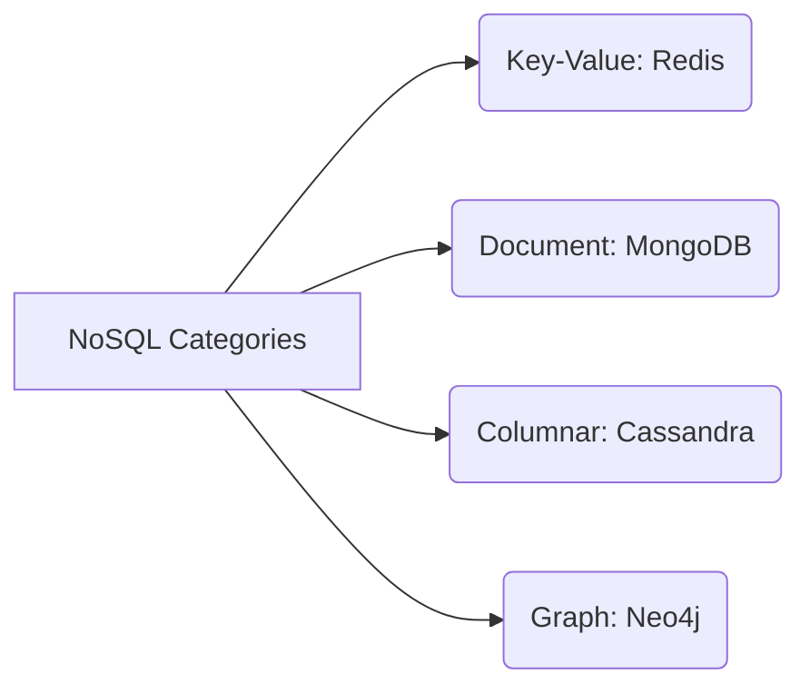

# SQL vs NoSQL

This section outlines database modeling choices, scaling trade-offs, and architectural use-cases for SQL and NoSQL.

---

## 1. Relational Databases (SQL)
* **Design:** Structured tables, strict schemas, relations mapped via foreign keys.
* **Transactions:** Strong ACID compliance.
* **Scaling:** Primarily vertical. Can scale reads horizontally via read replicas. Sharding is complex.
* **Use-cases:** Financial systems, user account tables, billing ledgers.

---

## 2. NoSQL Databases

### Key-Value (e.g. Redis, DynamoDB)
* **Structure:** Opaque values stored against unique string keys.
* **Use-case:** Caching, session management, shopping carts.

### Document (e.g. MongoDB, CouchDB)
* **Structure:** Hierarchical nested documents (JSON/BSON).
* **Use-case:** Catalogs, content management, user profiles.

### Columnar / Wide-Column (e.g. Cassandra, HBase)
* **Structure:** Stores rows of columns grouped by partition key. Column structures can vary per row.
* **Use-case:** Time-series logs, IoT sensor data, chat history.

### Graph (e.g. Neo4j)
* **Structure:** Nodes, edges, and properties representing interconnected data.
* **Use-case:** Social networks, recommendation engines, fraud detection.

---

## Interview Q&A Corner

> [!TIP]
> **Q: When should I choose SQL vs NoSQL for an e-commerce catalog?**
> A: Use **NoSQL Document DB** (like MongoDB) for the product catalog. Products have highly dynamic attributes (e.g., a laptop has RAM/CPU; a t-shirt has Size/Color). Storing this in SQL leads to sparse tables, EAV (Entity-Attribute-Value) anti-patterns, or complex joins. A document database maps product details to a single JSON document naturally.
