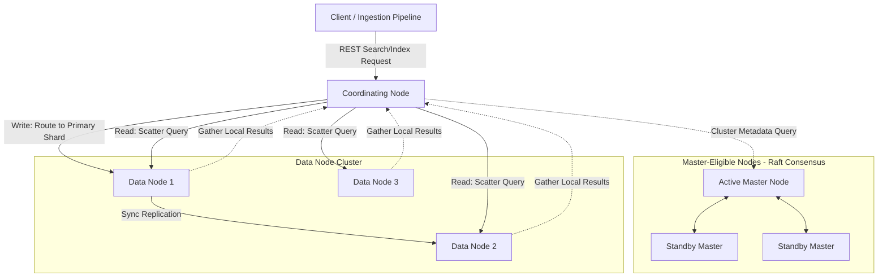

# Distributed Search Systems (e.g., Elasticsearch)

## 1. System Scale & Core Theory

Distributed search systems are designed for sub-second, full-text search and analytical aggregation over petabyte-scale unstructured or semi-structured data.

### Mathematical Sizing & Cluster Sizing Estimations

Consider a centralized log monitoring system for a microservices cluster:
*   **Daily Raw Log Volume:** $1\text{ TB/day}$.
*   **Retention Period:** $30\text{ days}$.
*   **Replication Factor:** $2$ (1 primary shard, 1 replica shard).
*   **Peak Search Rate:** $200\text{ searches/second}$.

#### Shard Sizing Math
*   **Raw Data Input:** $1\text{ TB/day} = 1000\text{ GB/day}$.
*   **Elasticsearch Index Overhead:** Full-text indexing, tokenization, and storing `_source` fields, `doc_values` (for aggregations), and inverted indexes typically adds a $1.3\times$ expansion factor:
    $$\text{Daily Indexed Volume} = 1000\text{ GB} \times 1.3 = 1300\text{ GB/day}$$
*   **Replication:** With a replication factor of 2, the total daily footprint is:
    $$\text{Total Daily Storage} = 1300\text{ GB} \times 2 = 2600\text{ GB/day} = 2.6\text{ TB/day}$$
*   **Total retention storage (30 days):** $2.6\text{ TB/day} \times 30 \approx 78\text{ TB}$.
*   **Shard Configuration Strategy:** The recommended target size for search/logging shards is between $30\text{ GB}$ and $50\text{ GB}$. Let's target $40\text{ GB}$ per shard.
*   **Number of Primary Shards per Day:** 
    $$\text{Primary Shards} = \frac{1300\text{ GB}}{40\text{ GB}} \approx 33\text{ shards/day}$$
*   **Total active shards in cluster:** $33\text{ primary} \times 2\text{ (replication)} \times 30\text{ days} = 1980\text{ active shards}$.

#### JVM Heap Sizing Strategy
Elasticsearch relies heavily on the JVM heap for in-memory operations like Lucene segment merges and caching, while using the OS Page Cache for file access.
*   **Rule of Thumb:** Limit individual JVM heap sizes to a maximum of **$32\text{ GB}$** to maintain Compressed Ordinary Object Pointers (Compressed OOPs). Exceeding this limit switches the JVM to 64-bit pointers, which increases memory overhead and degrades CPU cache performance.
*   **Memory sizing:** For a $78\text{ TB}$ raw storage cluster, if we allocate $1\text{ GB}$ of Heap for every $100\text{ GB}$ of data on disk:
    $$\text{Total Heap Required} = \frac{78\text{ TB}}{100} \approx 780\text{ GB}$$
*   **Instance Count:** Using instances with $64\text{ GB}$ of physical RAM ($32\text{ GB}$ allocated to the JVM heap and $32\text{ GB}$ reserved for the OS Page Cache):
    $$\text{Data Nodes Needed} = \frac{780\text{ GB heap}}{32\text{ GB heap/node}} \approx 25\text{ Data Nodes}$$

### Technology Matrix: B-Tree vs. Inverted Index vs. Columnar Store

| Feature | Relational B-Tree (SQL) | Inverted Index (Elasticsearch Lucene) | Columnar / Doc Values (SSTable/OLAP) |
| :--- | :--- | :--- | :--- |
| **Primary Data Structure** | Balanced Tree mapping keys to rows | Postings Lists mapping tokens to document IDs | Column-oriented files storing values sequentially |
| **Search Pattern** | Precise key lookups, prefix match, range queries | Full-text search, fuzzy search, phrase matching | Sorting, filtering, metric aggregations |
| **Complexity** | $O(\log N)$ for lookups | $O(\text{Number of search terms})$ | $O(N)$ scanning values sequentially |
| **Write Performance** | Medium (requires balancing and index updates) | Slow (analyzing, segment creation, flush cycles) | Fast (append-only write paths) |
| **Memory Footprint** | Moderate (holds key index pages) | High (requires FST and postings lists in memory) | Low (designed for sequential streaming) |

---

## 2. Visual Architecture Diagram

A standard Elasticsearch cluster divides responsibilities among dedicated Master, Data, and Coordinating nodes.



---

## 3. Data Models & API Signatures

### Elasticsearch Index Mapping
Index mappings define how fields are analyzed and stored. This configuration defines mapping fields as both parsed `text` (for search) and raw `keyword` (for sorting and aggregations).

```json
{
  "settings": {
    "index": {
      "number_of_shards": 3,
      "number_of_replicas": 1,
      "refresh_interval": "1s"
    },
    "analysis": {
      "analyzer": {
        "autocomplete_analyzer": {
          "type": "custom",
          "tokenizer": "standard",
          "filter": ["lowercase", "edge_ngram_filter"]
        }
      },
      "filter": {
        "edge_ngram_filter": {
          "type": "edge_ngram",
          "min_gram": 2,
          "max_gram": 15
        }
      }
    }
  },
  "mappings": {
    "properties": {
      "log_id": { "type": "keyword" },
      "timestamp": { "type": "date" },
      "service_name": { "type": "keyword" },
      "severity": { "type": "keyword" },
      "message": {
        "type": "text",
        "analyzer": "autocomplete_analyzer",
        "fields": {
          "raw": { "type": "keyword" }
        }
      },
      "response_time_ms": { "type": "integer" }
    }
  }
}
```

### API Signatures

#### 1. Ingest Log Document (Index API)
*   **Protocol:** HTTP POST / PUT
*   **Path:** `/logs_service_prod/_doc/{log_id}`
*   **Request Payload:**
```json
{
  "log_id": "log_a34fd2bc-9d3f-422d",
  "timestamp": "2026-06-03T02:26:15Z",
  "service_name": "payment-api",
  "severity": "ERROR",
  "message": "Connection timeout when accessing payment gateway server gateway.net",
  "response_time_ms": 5000
}
```
*   **Response Payload (201 Created):**
```json
{
  "_index": "logs_service_prod",
  "_id": "log_a34fd2bc-9d3f-422d",
  "_version": 1,
  "result": "created",
  "_shards": {
    "total": 2,
    "successful": 2,
    "failed": 0
  }
}
```

#### 2. Search Logs with Aggregations (Search API)
*   **Protocol:** HTTP POST
*   **Path:** `/logs_service_prod/_search`
*   **Request Payload:**
```json
{
  "query": {
    "bool": {
      "must": [
        { "match": { "message": "timeout" } }
      ],
      "filter": [
        { "term": { "severity": "ERROR" } },
        { "range": { "timestamp": { "gte": "now-24h" } } }
      ]
    }
  },
  "aggs": {
    "avg_response_time": {
      "avg": { "field": "response_time_ms" }
    }
  },
  "size": 10,
  "from": 0
}
```

---

## 4. Operational Flows

### Write Path (Indexing Flow)

```
[Client] ──> 1. Ingest Request ──> [Coordinating Node]
                                         │
                                   2. Routing: Shard = Hash(Routing) % PrimaryShards
                                         │
                                         ▼
                                   [Primary Shard (Data Node A)]
                                   • Parse token strings
                                   • Add to Index Buffer & write Translog
                                         │
                   ┌─────────────────────┴─────────────────────┐
                   ▼ (Sync Replication)                        ▼ (Sync Replication)
        [Replica Shard (Data Node B)]               [Replica Shard (Data Node C)]
        • Update local structures                   • Update local structures
                   └─────────────────────┬─────────────────────┘
                                         ▼
                               3. Acknowledge Write
                                         │
                                         ▼
                               [Coordinating Node] ──> 4. HTTP 201 ──> [Client]
```

1.  **Ingestion & Shard Calculation:** The Client sends a document write request to a Coordinating node. The Coordinating node computes the target shard ID:
    $$\text{Shard ID} = \text{hash}(\text{routing\_key}) \pmod{\text{number\_of\_primary\_shards}}$$
2.  **Routing to Primary:** The Coordinating node routes the document to the Data node hosting the designated **Primary Shard**.
3.  **Local Indexing & Logging:** The Primary shard writes the document to the memory index buffer and appends the raw operation to the write-ahead **Translog** for durability.
4.  **Replication Broadcast:** The Primary shard sends the raw operations to all active **Replica Shards** in parallel.
5.  **Acknowledge to Client:** Once the replicas acknowledge completion, the Primary shard returns a success confirmation to the Coordinating node, which responds to the client.
6.  **Refresh (Visibility):** Every 1 second (configurable refresh interval), the index buffer flushes its contents to disk as a new Lucene segment, making the document searchable.

### Read Path (Scatter-Gather Search Flow)

1.  **Coordinate & Broadcast:** The Coordinating node receives the search request, builds a query plan, and broadcasts a **Query Phase** request to a selected copy (primary or replica) of every active shard.
2.  **Local Execution:** Each shard parses the search criteria, searches its local inverted index, ranks matches using BM25, and returns its local top match IDs along with their scores (e.g., top 10 IDs).
3.  **Merge & Sort:** The Coordinating node aggregates the results from all shards, deduplicates them, and sorts them globally to identify the true top documents.
4.  **Fetch Document Data:** The Coordinating node sends direct read requests to the specific shards holding the top documents to retrieve the full `_source` payloads.
5.  **Assemble Response:** The Coordinating node assembles the retrieved payloads and returns the final response to the client.

---

## 5. High Availability, Failovers & Bottlenecks

### Split-Brain & Master Elections
Older Elasticsearch versions used Zen Discovery, which was prone to split-brain scenarios if `minimum_master_nodes` was misconfigured. 
*   **Raft-Based Consensus:** Current versions use a custom consensus protocol similar to Raft. Master nodes maintain cluster state metadata. To update this state, the active Master must receive approval from a majority quorum of master-eligible nodes.
*   *Mitigation:* Deploy at least 3 master-eligible nodes in separate availability zones. Ensure the system is configured to require a quorum of $\lfloor N/2 \rfloor + 1$ votes for master elections and state changes.

### Deep Paging Mitigation
Using `from` and `size` parameters for pagination forces coordinating nodes to collect and sort large lists of items. For example, setting `{"from": 10000, "size": 10}` requires retrieving $10,010$ document records from every shard, aggregating them, and sorting them. This consumes significant memory and CPU.
*   **Protection Limit:** Elasticsearch defaults to a hard limit of `index.max_result_window = 10000` records.
*   **Mitigation (Scroll vs. Search After):**
    *   **Scroll API:** Creates a static snapshot of the index. This keeps Lucene search contexts open, which consumes file handles and memory. Use Scroll only for bulk data exports, not for user-facing pagination.
    *   **Search After (Recommended):** Uses a stateless cursor that points to the values of the last retrieved document (e.g., using the `[timestamp, doc_id]` sort key). This allows the next query to continue scanning from that point without re-sorting previous pages.

---

## 6. Comprehensive Interview Q&A

### Q1: What is a Lucene segment? How do write operations and segment merges affect disk I/O and query performance?
**Answer:**
A Lucene index consists of one or more immutable files called **Segments**.
*   **Write Operations:** Document additions do not modify existing data. Instead, they write updates to new, smaller segments.
*   **Immutability Benefit:** Immutable segments do not require locks for concurrent reads. This allows the OS to cache files, improving read speeds.
*   **Deletion Flagging:** When a document is updated or deleted, it is not immediately removed from disk. Instead, Elasticsearch marks it as deleted in a separate `.del` file. The document is still searched, but it is filtered out of query results.
*   **Segment Merges:** As the number of segments grows, search performance can degrade because queries must scan each segment individually. To maintain performance, Elasticsearch runs background merge processes that combine smaller segments into larger ones. During these merges, the system permanently removes deleted documents and frees disk space.
*   *Performance Impact:* Large segment merges can cause disk I/O spikes, which can slow down active search queries. To prevent this, configure **Throttling** on segment merge I/O rates or run `forcemerge` operations during off-peak hours.

---

### Q2: Why is the number of primary shards immutable in Elasticsearch? How does the Split API work?
**Answer:**
The number of primary shards cannot be changed because Elasticsearch routes documents using modulo arithmetic:
$$\text{Shard ID} = \text{hash}(\text{routing\_key}) \pmod{\text{number\_of\_primary\_shards}}$$
If the shard count changes, the routing formula yields different shard IDs for existing documents, making them unsearchable.

To scale an index without losing data:
1.  **Reindex API:** Create a new index with the desired number of primary shards, copy the documents from the old index, and update application aliases.
2.  **Split API:** This API allows you to split an existing index into a new index with more shards, provided the original index was created with a routing factor. It creates hard links on the filesystem to duplicate the underlying Lucene segments, avoiding data copying costs.
    *   *Requirements:* The target shard count must be a multiple of the source shard count. The source index must be set to read-only before splitting:
        ```bash
        curl -X PUT "localhost:9200/my_source_index/_settings" -H 'Content-Type: application/json' -d'
        {
          "settings": {
            "index.blocks.write": true
          }
        }'
        ```

---

### Q3: Explain why document scores (relevance) can be inconsistent when querying different replica shards. How do you resolve this?
**Answer:**
Relevance scoring algorithms like TF-IDF or BM25 rely on two key metrics:
1.  **Term Frequency (TF):** How often a term appears in the queried document.
2.  **Document Frequency (DF):** How many documents across the index contain the term.

*   **Cause of Inconsistencies:** Elasticsearch calculates Document Frequency (DF) locally on each shard to avoid cluster network overhead. If documents are unevenly distributed across shards, the local DF values can differ. This can cause the same search query to yield different scores depending on which replica shard processes the request.
*   **Mitigation:**
    1.  **Default Handling:** For large datasets, document distribution is usually balanced enough that local DF differences are negligible.
    2.  **DFS Query Then Fetch:** To ensure consistent scoring, add the `search_type=dfs_query_then_fetch` parameter to the search query. This forces the coordinating node to collect DF statistics from all shards to calculate a global DF before executing the search.
        *   *Trade-off:* This requires an additional network round-trip for every query, which can increase latency.

---

### Q4: Explain the difference between text analyzer components (Character Filters, Tokenizer, Token Filters) and how you design a custom analyzer for autocomplete.
**Answer:**
When analyzing text fields, Elasticsearch processes input strings through an Analysis Pipeline consisting of three sequential stages:

```
[ Raw Text Input ]
       │
       ▼
 1. Character Filters  (e.g., HTML strip, Regex mapping)
       │
       ▼
 2. Tokenizer          (e.g., Standard, Whitespace, Edge-NGram)
       │
       ▼
 3. Token Filters      (e.g., Lowercase, Stopwords, Stemming)
       │
       ▼
[ Analyzed Tokens / Terms ]
```

1.  **Character Filters:** Clean and modify the raw text stream before tokenization. Examples include stripping HTML tags (`html_strip`) or replacing characters using regular expressions.
2.  **Tokenizer:** Split the character stream into individual tokens. For example, the `standard` tokenizer splits text at word boundaries, while the `whitespace` tokenizer splits text only at spaces.
3.  **Token Filters:** Modify, add, or remove tokens in the token stream. Examples include converting terms to lowercase, filtering out common stop words (like "the", "and"), or applying stemming to reduce words to their base form (like converting "running" to "run").

For autocomplete functionality, configure a custom analyzer that uses an **Edge-NGram Tokenizer**:
*   *Configuration:* Set `min_gram: 2` and `max_gram: 10`. This splits a search term like "search" into prefix tokens: `"se"`, `"sea"`, `"sear"`, `"searc"`, and `"search"`. This allows search queries to match prefixes as the user types.
*   *Optimization:* Apply the Edge-NGram analyzer only to index-time operations. Use a standard analyzer for search-time queries to prevent search terms from being split into fragments, which can return irrelevant matches.
