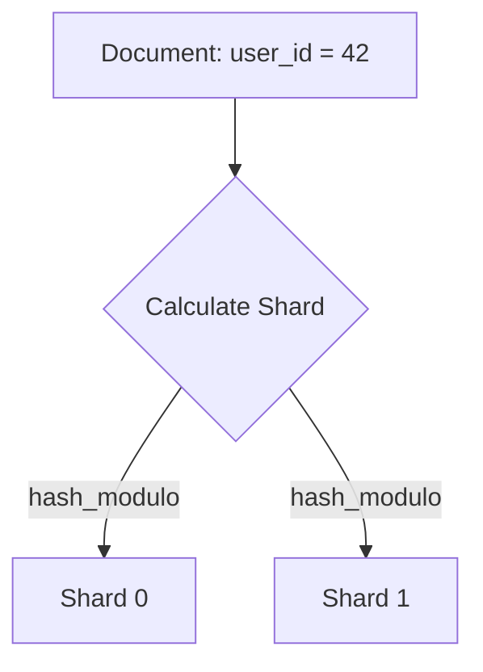

# Distributed Search Systems

Distributed search engines (like Elasticsearch) enable lightning-fast full-text searches across massive unstructured datasets.

---

## 1. The Inverted Index
Traditional databases use B-Trees, which are slow for searching text inside string columns. Search engines use an **Inverted Index**, which maps words to the document IDs containing them.

```
Document 1: "Quick brown fox"
Document 2: "Lazy dog jumps"

Inverted Index:
- quick  -> Doc 1
- brown  -> Doc 1
- fox    -> Doc 1
- lazy   -> Doc 2
- dog    -> Doc 2
```

---

## 2. Elasticsearch Sharding & Document Routing
To scale, indices are split into **Primary Shards** distributed across nodes.



### Document Routing Formula
To know which shard holds a document, Elasticsearch calculates:
$$\text{Shard ID} = \text{hash}(\text{routing\_key}) \pmod{\text{number\_of\_primary\_shards}}$$
* *Important:* Because of this modulo math, the number of primary shards **cannot be changed** after index creation without reindexing the entire dataset.

---

## Interview Q&A Corner

> [!IMPORTANT]
> **Q: How does Elasticsearch handle full-text queries across multiple shards?**
> A: It uses a **Scatter-Gather** pattern:
> 1. The coordinating node receives the query and broadcasts it to all shards (or replicas).
> 2. Each shard runs local search, scores matches using TF-IDF (or BM25), and returns the top IDs.
> 3. The coordinating node merges results, sorts them, and retrieves the full documents to respond to the client.
