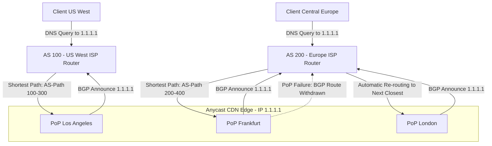

# DNS & Anycast Routing

## 1. System Scale & Core Theory

DNS (Domain Name System) is the hierarchical distributed naming system that translates human-readable hostnames to IP addresses. Anycast Routing is a network addressing and routing technique where a single destination IP address is shared by multiple physical routing endpoints.

### Mathematical Sizing & Scale Estimations

Consider a global recursive DNS resolver service (similar to Cloudflare's `1.1.1.1` or Google's `8.8.8.8`) processing query traffic:
*   **Daily Global Queries:** $10\text{ Billion queries/day}$.
*   **Active Edge locations:** $50\text{ PoPs (Points of Presence)}$ globally.
*   **Global Average QPS:**
    $$\text{Average QPS} = \frac{10\text{ Billion}}{86400\text{ seconds}} \approx 115,740\text{ Queries/Second (QPS)}$$
*   **Peak QPS (2.5x Average):** $290,000\text{ QPS}$.

#### Network Bandwidth Sizing
*   **Average DNS Request Size (UDP):** $\approx 64\text{ bytes}$.
*   **Average DNS Response Size (with EDNS0 extensions & DNSSEC signatures):** $\approx 512\text{ bytes}$ to $1024\text{ bytes}$. Let's assume an average response size of $512\text{ bytes}$.
*   **Total Bandwidth Required at Peak:**
    $$\text{Peak Outbound Bandwidth} = 290,000\text{ QPS} \times 512\text{ bytes} \approx 148.5\text{ MB/s} = 1.188\text{ Gbps}$$
*   Across 50 PoPs, the average load per PoP is $\approx 24\text{ Mbps}$, which is easily distributed. During a DDoS attack, a single location might receive $100\text{ Gbps}$ of traffic. Anycast distributes this load across all 50 PoPs to absorb the attack.

#### Cache Hit Ratio & Storage Sizing
*   **Unique DNS Records Indexed:** $500\text{ Million}$ domains.
*   **Cache Retention Strategy:** Cache records based on their Time-To-Live (TTL) values.
*   **Memory Footprint:** Each cache entry (domain name, record type, value, TTL, metadata) is $\approx 200\text{ bytes}$.
*   **Recursive Cache Size Required:**
    $$\text{Total Memory for 100M Cached Entries} = 100\text{ Million} \times 200\text{ bytes} = 20\text{ GB RAM}$$
    This can be cached in memory (e.g., using Redis or an optimized in-memory key-value store) at each edge location to keep response latencies under $15\text{ ms}$.

### Network Routing Type Comparison

| Attributes | Unicast | Anycast | Multicast | Broadcast |
| :--- | :--- | :--- | :--- | :--- |
| **Addressing Topology** | $1$-to-$1$ association | $1$-to-**Closest** association | $1$-to-**Many** (subscribed group) | $1$-to-**All** in local subnet |
| **IP Address Allocation** | Unique IP per physical interface | Shared IP across multiple locations | Dedicated Multicast IP Range (`224.0.0.0/4`) | Subnet broadcast address (e.g., `255.255.255.255`) |
| **Routing Protocol** | BGP / OSPF (Standard routes) | BGP (Multiple AS paths announced) | IGMP, PIM | Not routed beyond local subnet |
| **Primary Use Case** | Web servers, database nodes | CDNs, DNS Root servers, DDoS mitigation | IPTV streaming, video conferencing | Local ARP discovery, DHCP allocation |
| **Failover Mechanism** | DNS updates, load balancer health checks | BGP route withdrawal (sub-second) | Tree reconstruction | None |

---

## 2. Visual Architecture Diagram

This diagram shows how BGP Anycast routes clients to their physically closest Point of Presence (PoP) using BGP path routing, and demonstrates path failover if a PoP goes offline.



---

## 3. Data Models & API Signatures

### DNS Zone File Configuration (BIND Format)
A DNS zone file contains resource records that define mappings between domain names and IP addresses.

```text
$TTL 86400      ; Default Time-To-Live (24 Hours)
@       IN      SOA     ns1.example.com. admin.example.com. (
                        2026060301      ; Serial number (YYYYMMDDNN)
                        28800           ; Refresh interval (8 hours)
                        7200            ; Retry interval (2 hours)
                        604800          ; Expire limit (1 week)
                        86400           ; Minimum TTL (1 day)
)

; Nameservers (NS Records)
        IN      NS      ns1.example.com.
        IN      NS      ns2.example.com.

; Mail Exchange (MX Records)
        IN      MX  10  mail.example.com.

; Address Records (A/AAAA Records)
ns1     IN      A       192.0.2.1
ns2     IN      A       192.0.2.2
@       IN      A       198.51.100.42
@       IN      AAAA    2001:db8::42
www     IN      CNAME   example.com.
api     IN      A       203.0.113.88

; Text Records (SPF validation)
@       IN      TXT     "v=spf1 ip4:198.51.100.42 -all"
```

### API Signatures

#### 1. Add/Update DNS Record (REST API)
*   **Protocol:** HTTPS PUT
*   **Path:** `/api/v1/zones/{zone_id}/records`
*   **Request Payload:**
```json
{
  "record_type": "A",
  "name": "api.example.com",
  "content": "203.0.113.88",
  "ttl": 3600,
  "proxied": true
}
```
*   **Response Payload (200 OK):**
```json
{
  "success": true,
  "result": {
    "id": "rec_09d73f1a-b32c-473d",
    "zone_id": "zone_882cb2bc-9d3f-422d",
    "name": "api.example.com",
    "type": "A",
    "content": "203.0.113.88",
    "ttl": 3600,
    "locked": false,
    "modified_on": "2026-06-03T02:26:20Z"
  }
}
```

---

## 4. Operational Flows

### Recursive DNS Lookup Process

```
Client               OS Cache             Recursive DNS           Root DNS            TLD (.com)            Auth DNS
  │                     │                   Resolver              Nameserver          Nameserver            Nameserver
  │─── 1. Query ───────>│                      │                      │                    │                    │
  │    "api.example.com"│                      │                      │                    │                    │
  │                     │─── 2. Cache Miss ───>│                      │                    │                    │
  │                     │                      │─── 3. Query Root ───>│                    │                    │
  │                     │                      │<── 4. TLD Referral ──│                    │                    │
  │                     │                      │    (List of .com NS)                      │                    │
  │                     │                      │                      │                    │                    │
  │                     │                      │─── 5. Query TLD ─────────────────────────>│                    │
  │                     │                      │<── 6. Auth Referral ──────────────────────│                    │
  │                     │                      │    (List of example.com NS)               │                    │
  │                     │                      │                                           │                    │
  │                     │                      │─── 7. Query Authoritative Nameserver ─────────────────────────>│
  │                     │                      │<── 8. Return A Record (203.0.113.88) ──────────────────────────│
  │                     │<── 9. Return IP ─────│                                                                │
  │                     │    (Cache Response)  │                                                                │
  │<── 10. Connect ─────│                      │                                                                │
```

1.  **Client Check:** The client browser checks its local cache for the IP address of `api.example.com`.
2.  **OS Check:** If there is a cache miss, the browser queries the OS resolver (`/etc/hosts` and local OS network caches).
3.  **Recursive Query:** If the IP is not cached, the OS sends a recursive query to the configured DNS resolver (e.g., ISPs resolver, or Google `8.8.8.8`).
4.  **Root Directory Query:** The recursive resolver queries one of the 13 root DNS server IPs (`.` root). The root server returns the IPs for the `.com` Top-Level Domain (TLD) nameservers.
5.  **TLD Directory Query:** The resolver queries a `.com` TLD nameserver, which returns the nameserver IPs for the domain: `ns1.example.com`.
6.  **Authoritative Resolve:** The resolver queries `ns1.example.com` for the `api.example.com` `A` record.
7.  **Cache and Respond:** The authoritative nameserver returns the record `203.0.113.88`. The resolver caches the record locally for the duration of its TTL and returns the IP address to the client.

### Anycast BGP Route Announcement & Failover Flow

1.  **Route Announcement:** Each Anycast node (e.g., nodes in LA, London, Frankfurt) connects to neighboring networks using the Border Gateway Protocol (BGP). Each node announces it hosts the same IP prefix: `1.1.1.0/24`.
2.  **Path Propagation:** Global Autonomous Systems (ISPs and transit providers) receive these BGP announcements and select the shortest path (based on criteria like AS-Path length and network hops) to route traffic to the IP prefix.
3.  **Local Route Preference:** Routers in Europe route traffic for `1.1.1.1` to the Frankfurt node, while routers in California route traffic to the Los Angeles node.
4.  **Node Failure / Withdrawal:** If the Frankfurt node goes offline or fails a health check:
    *   The BGP daemon on the Frankfurt node withdraws the route announcement for `1.1.1.0/24`.
    *   BGP routers propagate this route change globally.
    *   Within seconds, routers reconfigure their routing tables to send European traffic to the next closest active Anycast location (e.g., London).

---

## 5. High Availability, Failovers & Bottlenecks

### BGP Route Flapping & Route Dampening
*   **Issue:** If an Anycast server's internet link is unstable, it may repeatedly announce and withdraw its BGP routes. This behavior, known as **Route Flapping**, forcing global routers to constantly update their routing tables, which consumes router CPU and can cause packet loss.
*   **Mitigation:** Transit networks apply **BGP Route Dampening**. If a route flaps too frequently, routers temporarily ignore its announcements (dampening the route) and blackhole its traffic until the link stabilizes.
*   *Architectural Defense:* Ensure edge nodes run local health checking daemons (like Keepalived or ExaBGP). If a backend service fails but the network link is stable, the node should withdraw its routes gracefully rather than letting the BGP connection flap.

### The TCP Anycast Routing Challenge

```
                   [ Client Device ]
                           │
       (BGP Path Shift / Routing Convergence Mid-Session)
                           │
             ┌─────────────┴─────────────┐
             ▼                           ▼
      [ Anycast Node A ]          [ Anycast Node B ]
      • Active TCP Socket         • No record of connection
      • Receives packets          • Drops packet / Sends TCP RST
```

*   **The Problem:** BGP is a dynamic routing protocol. If internet paths shift mid-session, traffic can route to a different Anycast node. Since Anycast nodes do not share TCP state tables by default, the new node will drop the packet or send a TCP Reset (`RST`), terminating the connection.
*   **Mitigations:**
    1.  **Keep Sessions Short:** Use Anycast primarily for stateless UDP services (like DNS queries) or short-lived TCP transactions (like TLS Handshakes).
    2.  **Consistent Route Selection:** Modern networks configure **ECMP (Equal-Cost Multi-Path)** routing switches to use 5-tuple hashes (source IP, destination IP, source port, destination port, protocol). This ensures packets from the same connection route to the same physical node.
    3.  **State Sharing Tier:** Build a shared state sync layer or direct TCP traffic to a unicast IP address after the initial Anycast connection.

---

## 6. Comprehensive Interview Q&A

### Q1: Why can't you put a CNAME record at the Zone Apex (root domain) in standard DNS? How do DNS providers work around this?
**Answer:**
According to the DNS specification (**RFC 1034**), a CNAME (Canonical Name) record cannot coexist with other record types for the same name.

*   **The Conflict:** The root domain (or zone apex, e.g., `example.com`) must contain other record types like Start of Authority (`SOA`) and Nameserver (`NS`) records. Adding a CNAME record at the zone apex conflicts with these records, which violates the DNS specification.
*   **Impact:** If a CNAME were allowed at the zone apex, resolvers querying for `example.com`'s NS records would follow the CNAME instead of checking the local zone file. This would break domain resolution.
*   **Provider Workarounds (ALIAS / ANAME Records):**
    *   DNS providers (like Cloudflare, Route 53) support custom record types like **ALIAS** or **ANAME**.
    *   These records function like CNAMEs, but they resolve mapping targets at the authoritative nameserver level.
    *   When a client queries the zone apex, the DNS provider's nameserver resolves the target domain internally and returns the resulting `A` or `AAAA` IP records directly. This allows the domain to route to a CDN or load balancer without violating the DNS specification.

---

### Q2: Explain DNS Cache Poisoning and how DNSSEC (DNS Security Extensions) protects against it.
**Answer:**
**DNS Cache Poisoning** (or DNS Spoofing) occurs when an attacker injects a fraudulent DNS record into a recursive resolver's cache. As a result, subsequent queries resolve to the attacker's server.

```
Attacker Spoofing Attack:
[ Resolver ] ─── 1. Sends DNS Query ───> [ Authoritative Nameserver ]
     │
     ├── 2. Attacker floods Resolver with fake responses (guessing Query ID)
     │
[ Poisoned Cache ] (Fake IP mapped to domain)
```

*   **Mechanism:** Standard DNS uses UDP, which is stateless. Resolvers match incoming responses to queries using the destination port and a 16-bit **Transaction ID** (yielding 65,536 combinations). An attacker can flood a resolver with spoofed responses, guessing the Transaction ID to inject a fraudulent record before the authentic response arrives.
*   **DNSSEC Protection:** DNSSEC secures domain resolution by cryptographically signing DNS records using public-key cryptography.
    1.  Each zone publishes its public keys (DNSKEY).
    2.  For every resource record set (RRSet), the zone generates a cryptographic signature (**RRSIG**).
    3.  Resolvers use the zone's public keys to verify these signatures, confirming the records are authentic and have not been altered.
    4.  To establish trust, child zones link their keys to parent zones using **DS (Delegation Signer)** records. This forms a chain of trust that extends to the root DNS keys.

---

### Q3: How do CDNs use Anycast to mitigate high-volume Distributed Denial of Service (DDoS) attacks?
**Answer:**
Anycast distributes network traffic across multiple physical points of presence (PoPs) globally. This architecture prevents any single server location from becoming a single point of failure during a DDoS attack.

*   **Traffic Distribution:** In a DDoS attack, botnets are typically distributed globally. An Anycast network routes botnet traffic to the physically closest edge locations.
*   **Attack Dispersion:** Instead of targeting a single IP address and overwhelming one server, the attack traffic is split across all active Anycast PoPs (e.g., 50 locations).
*   **Localized Isolation:** If an individual PoP is overwhelmed (e.g., in Tokyo), the outage is localized to that region. BGP routers withdraw the Tokyo node's route, and traffic is redirected to other locations. The rest of the global network remains operational.
*   **Edge Scrubbing:** Each PoP runs scrubbing hardware to filter out malicious traffic (like UDP floods or SYN floods) before it reaches origin servers.

---

### Q4: What is BGP Anycast Routing Convergence? How does it affect packet loss during failover?
**Answer:**
**BGP Convergence** is the process by which routers update their routing tables to reflect changes in network topology.

*   **Failover Convergence:** When an Anycast node fails, its BGP daemon withdraws its route announcements. Neighboring routers detect the link state change, update their routing tables, and propagate the change to adjacent routers.
*   **Packet Loss Window:** During the convergence window (which can take from seconds to minutes depending on network topology), packets sent to the failed node's IP may be dropped.
*   **Minimizing Outages:**
    1.  **Fast Convergence Configurations:** Use BGP features like **BFD (Bidirectional Forwarding Detection)** to identify link failures within milliseconds.
    2.  **Graceful Shutdown:** When performing maintenance, gradually increase BGP path lengths (AS-path prepending) on the node before withdrawing the route. This redirects traffic to other nodes without causing packet loss.
