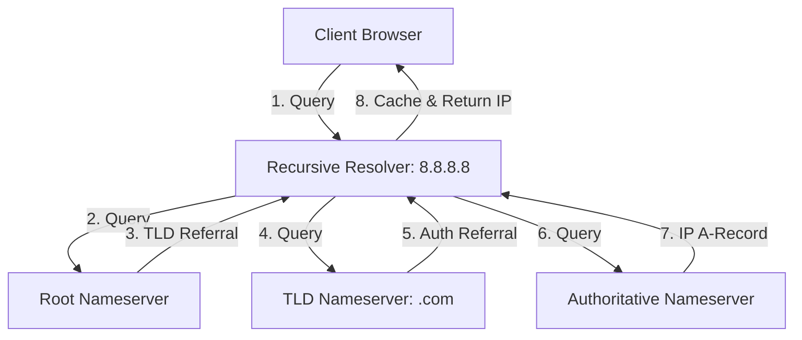

# DNS & Anycast Routing

This section describes global domain name resolution workflows and Anycast network packet routing.

---

## 1. DNS Resolution Steps
When a client queries a domain (e.g. `example.com`), the DNS resolution path is:

---

## 2. Anycast Routing
* **Unicast Routing:** Every IP address maps to exactly one physical server node.
* **Anycast Routing:** A single IP address is shared by multiple physical servers globally. Routers route packets to the **physically closest** server sharing that IP using BGP (Border Gateway Protocol) routing path calculations.

### Anycast Use-cases
Anycast is the backbone of **CDNs** (Cloudflare, Akamai) and **DNS Resolvers** (Google DNS 8.8.8.8, Cloudflare 1.1.1.1).
* If one server location goes offline or experiences a DDoS attack, global BGP routers automatically re-route traffic to the next closest location.

---

## Interview Q&A Corner

> [!TIP]
> **Q: How does Anycast route TCP connections if state is not shared between nodes?**
> A: Anycast is stateless. If BGP paths flap mid-connection, packets could hit a different Anycast node, dropping the active TCP session. To prevent this, Anycast is mostly used for stateless UDP traffic (like DNS) or paired with intelligent Load Balancers that synchronize TCP states across edge nodes.
