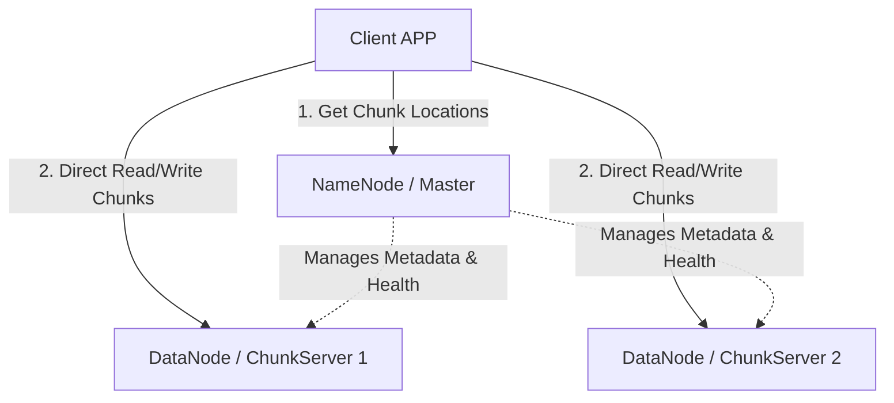

# Distributed File Systems

Distributed File Systems (like GFS - Google File System, or HDFS - Hadoop Distributed File System) store and manage petabytes of files across commodity servers.

---

## 1. GFS / HDFS Architecture

### Master (NameNode)
* Holds file metadata (file path, mapping of files to chunks, chunk locations).
* Keeps all metadata in memory for quick access.
* Acts as the controller, but **never handles actual file data transfer** (to prevent bottlenecks).

### Workers (DataNodes / ChunkServers)
* Store the physical chunks on local disk.
* Files are split into fixed size chunks (typically 64MB or 128MB).
* Replicate chunks across multiple chunk servers (default replication factor is 3).

---

## 2. Dynamic Client Read Flow
1. Client requests the Master for the chunk indices of a specific file and range.
2. Master returns the IP addresses of the ChunkServers holding those chunks.
3. Client caches this metadata.
4. Client contacts the closest ChunkServer directly to read or write the actual data.

---

## Interview Q&A Corner

> [!WARNING]
> **Q: What is the main vulnerability of the NameNode/Master in HDFS, and how is it mitigated?**
> A: The NameNode is a **Single Point of Failure (SPOF)**. If it crashes or its metadata memory corrupts, the entire filesystem becomes unreadable.
> *Mitigation:* Deploy a **Active-Standby NameNode setup** using ZooKeeper or a shared edit-log mechanism. A standby NameNode mirrors metadata changes in real-time, allowing immediate automated failover.
