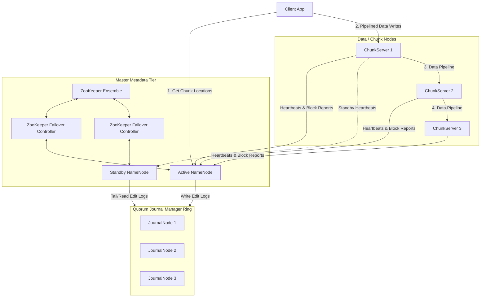

# Distributed File Systems (e.g., GFS & HDFS)

## 1. System Scale & Core Theory

Distributed File Systems (like Google File System - GFS, or Hadoop Distributed File System - HDFS) are designed to store petabytes of large files across clusters of commodity hardware, optimizing for high-throughput batch processing rather than low-latency random access.

### Mathematical Sizing & Master Memory Sizing

Consider a big data storage cluster with the following requirements:
*   **Total File System Size:** $50\text{ PB (Petabytes)}$.
*   **Replication Factor:** $3$.
*   **Average File Size:** $256\text{ MB}$.
*   **Default Chunk Size:** $64\text{ MB}$.

#### Storage & Chunk Math
*   **Total Raw Data Stored:** $50\text{ PB} \times 3 = 150\text{ PB}$.
*   **Number of Chunks per File:**
    $$\text{Chunks per File} = \frac{256\text{ MB}}{64\text{ MB}} = 4\text{ chunks}$$
*   **Total Unique Chunks:**
    $$\text{Unique Chunks} = \frac{50\text{ PB}}{64\text{ MB}} = \frac{50 \times 10^{15}\text{ bytes}}{64 \times 10^6\text{ bytes}} \approx 781,250,000\text{ Chunks}$$
*   **Total Physical Chunks (with 3x replication):** $781,250,000 \times 3 \approx 2.34\text{ Billion Chunks}$.

#### Master (NameNode) RAM Estimation
The Master maintains all metadata in memory to serve file lookup requests quickly. The metadata includes:
1.  **File Inodes:** Directory structure, permissions, and file-to-chunk mappings. Let's assume $195\text{ Million}$ files. File namespace entry: $\approx 150\text{ bytes}$.
    $$\text{Namespace Metadata} = 195\text{ Million} \times 150\text{ bytes} \approx 29.25\text{ GB}$$
2.  **Chunk Metadata:** Chunk handle, list of replicas, version number. Chunk metadata entry: $\approx 150\text{ bytes}$.
    $$\text{Chunk Metadata} = 781.25\text{ Million} \times 150\text{ bytes} \approx 117.18\text{ GB}$$
3.  **Total Master Memory Required:**
    $$\text{Total RAM} = 29.25\text{ GB} + 117.18\text{ GB} \approx 146.43\text{ GB RAM}$$
    This shows the scaling bottleneck of a single-master architecture. If the average file size decreases, the number of chunks increases, which can exhaust the Master's RAM even if the cluster has available disk space.

### Distributed Storage Systems Matrix

| Feature | Distributed File System (GFS/HDFS) | Object Storage (AWS S3 / MinIO) | Distributed Block Storage (Ceph / SAN) |
| :--- | :--- | :--- | :--- |
| **Data Hierarchy** | Hierarchical Directory Tree | Flat Namespace (Prefixes look like directories) | Block-level volumes mapped to OS |
| **Access Patterns** | Append-only, sequential streaming reads/writes | REST API read/write operations (immutable uploads) | Random read/write block operations |
| **Minimum Block Unit** | Chunk / Block ($64\text{ MB}$ - $128\text{ MB}$) | Entire Object ($1\text{ byte}$ to $5\text{ TB}$) | Disk Sector Block ($4\text{ KB}$) |
| **Consistency Model** | Relaxed consistency (writes are synchronized, reads may lag) | Strong consistency (since Dec 2020 on S3) | Strict POSIX-like consistency |
| **Typical Workloads** | MapReduce, Spark, batch analytics processing | Static media hosting, database backups, data lakes | Virtual Machine disks, active database storage |

---

## 2. Visual Architecture Diagram

This diagram shows the Active-Standby NameNode architecture using ZooKeeper and Quorum Journal Managers (QJM) to eliminate the Master Single Point of Failure (SPOF).



---

## 3. Data Models & API Signatures

### NameNode In-Memory Metadata Structure (Conceptual Schema)
While the Master stores metadata in memory as structured Java objects, the system maintains durability by writing updates to a log file on disk:
1.  **FSImage:** A point-in-time snapshot of the file system directory tree.
2.  **EditLog:** A transaction log containing recent directory and file changes.

```sql
-- Conceptual representation of the Directory Tree Table
CREATE TABLE fs_namespace (
    inode_id BIGINT PRIMARY KEY,
    parent_inode_id BIGINT REFERENCES fs_namespace(inode_id),
    name VARCHAR(255) NOT NULL,
    is_directory BOOLEAN NOT NULL,
    permissions VARCHAR(10) NOT NULL,
    modification_time TIMESTAMP WITH TIME ZONE
);

-- Conceptual representation of the File to Chunk Mappings
CREATE TABLE file_chunks (
    chunk_id UUID PRIMARY KEY,
    inode_id BIGINT REFERENCES fs_namespace(inode_id) ON DELETE CASCADE,
    chunk_index INT NOT NULL, -- Position of chunk in file (0, 1, 2...)
    chunk_version INT NOT NULL,
    replica_locations TEXT[] -- Array of ChunkServer IP addresses
);
```

### Client API Signatures

#### 1. Allocate / Register Chunk (Write Flow)
*   **Protocol:** gRPC / Protocol Buffers
*   **Interface:** `FileSystemMasterService`
```protobuf
message AllocateChunkRequest {
  string file_path = 1;
  int32 chunk_index = 2;
  string client_id = 3;
}

message AllocatedChunkResponse {
  string chunk_id = 1;
  int32 chunk_version = 2;
  string primary_chunkserver_ip = 3;
  repeated string secondary_chunkserver_ips = 4;
}
```

#### 2. Get Chunk Locations (Read Flow)
*   **Protocol:** gRPC
```protobuf
message GetChunkLocationsRequest {
  string file_path = 1;
  int64 byte_offset = 2;
  int64 length = 3;
}

message ChunkLocation {
  string chunk_id = 1;
  int32 chunk_version = 2;
  int64 start_offset = 3;
  repeated string chunkserver_ips = 4;
}

message GetChunkLocationsResponse {
  repeated ChunkLocation locations = 1;
}
```

---

## 4. Operational Flows

### Client Read Path (High Throughput)
1.  **Request Locations:** The Client contacts the Active Master (NameNode) with the file path and targeted byte range (e.g., `/data/logs.csv`, bytes $128\text{ MB}$ to $192\text{ MB}$).
2.  **Calculate Chunk Offset:** The Master calculates the chunk index:
    $$\text{Chunk Index} = \frac{\text{Byte Offset}}{\text{Chunk Size}}$$
3.  **Return Metadata:** The Master queries its in-memory tables and returns the chunk handle and the IP addresses of the ChunkServers holding that chunk.
4.  **Local Cache:** The Client caches the chunk locations to bypass the Master for subsequent reads.
5.  **Direct Read:** The Client connects directly to the physically closest ChunkServer to stream the data.

### Client Write Path (Decoupled Control & Data Flows)

```
Client App            NameNode Master        Primary ChunkServer     Secondary ChunkServers
    │                        │                        │                         │
    │─── 1. Create File ────>│                        │                         │
    │<── 2. Return Replicas ─│                        │                         │
    │                                                 │                         │
    │─── 3. Stream Data (Pipelined Data Flow) ───────>│                         │
    │    (Send chunks of data in 64KB packets)        │─── 4. Forward Packets ─>│
    │                                                 │<── 5. ACK Packets ──────│
    │<── 6. Data Cached Acknowledgment ───────────────│                         │
    │                                                 │                         │
    │─── 7. Send Commit Request (Control Flow) ──────>│                         │
    │                                                 │─── 8. Commit Write ────>│
    │                                                 │<── 9. Commit ACK ───────│
    │<── 10. Write Success ACK ───────────────────────│                         │
```

1.  **Request Allocation:** The Client requests the Master to allocate a new chunk for the target file.
2.  **Assign Replicas:** The Master selects primary and secondary replicas based on a placement policy (e.g., rack awareness) and returns their locations.
3.  **Data Pipelining:** The Client streams data to the primary ChunkServer in small $64\text{ KB}$ packets. The primary ChunkServer forwards the data to the secondary ChunkServers in a pipeline, caching it in memory.
4.  **Acknowledge Buffer:** Once all replicas have cached the data, they send an acknowledgment back to the client.
5.  **Commit Command:** The Client sends a commit request to the primary ChunkServer. The primary commits the write locally and instructs the secondaries to commit their changes.
6.  **Acknowledge Commit:** Once the secondaries confirm, the primary returns a success confirmation to the client.

---

## 5. High Availability, Failovers & Bottlenecks

### Active-Standby NameNode Failover & Fencing
*   **The ZooKeeper Failover Controller (ZKFC):** Every NameNode runs a ZKFC process. ZKFC monitors NameNode health and maintains a lock in ZooKeeper (`/hadoop-ha/mycluster/ActiveBreadCrumb`). The node holding this lock is designated the active NameNode.
*   **Split-Brain Risk:** If the active NameNode experiences a garbage collection pause or network drop, ZKFC may lose its ZooKeeper session, allowing the standby node to assume the active role. When the original active node recovers, it may still attempt to write updates, creating a split-brain scenario.
*   **Fencing Mechanisms (Mitigation):**
    1.  **Access Revocation:** Use the Quorum Journal Manager (QJM) to reject write requests from the old epoch. The JournalNodes accept writes only from the active NameNode with the highest epoch number.
    2.  **STONITH (Shoot The Other Node In The Head):** Use IPMI or network power switches to reboot the unresponsive NameNode before promoting the standby.

### The Small Files Problem
*   **The Problem:** Distributed file systems are optimized for storing large files. Each file, directory, and chunk requires approximately $150\text{ bytes}$ of metadata in the Master's memory. If a system stores $100\text{ Million}$ small files (e.g., $10\text{ KB}$ each):
    $$\text{Memory Overhead} = 100\text{ Million} \times 150\text{ bytes} \approx 15\text{ GB RAM}$$
    $$\text{Actual Data Stored} = 100\text{ Million} \times 10\text{ KB} \approx 1\text{ TB}$$
    This configuration wastes master memory, as storing $1\text{ TB}$ of data consumes $15\text{ GB}$ of RAM.
*   **Mitigations:**
    1.  **Hadoop Archives (HAR):** Pack small files into larger metadata archives.
    2.  **SequenceFiles:** Store data as binary key-value pairs, where the key is a filename and the value is the file content.
    3.  **Federation:** Split namespace management across multiple independent NameNodes that share the same pool of ChunkServers.

---

## 6. Comprehensive Interview Q&A

### Q1: Why did GFS choose a single-master architecture instead of a peer-to-peer ring model? How does it prevent the Master from becoming a bottleneck?
**Answer:**
Google chose a single-master architecture to simplify system design. A single master makes namespace management, chunk replication, and load balancing easier to implement and reason about.

To prevent the Master from becoming a performance bottleneck, the design separates control logic from actual data transfer:
1.  **Direct Client-to-ChunkServer Communication:** The Master does not read or write file data. It returns chunk metadata and locations, and the client connects directly to ChunkServers to stream data.
2.  **Client-Side Caching:** Clients cache chunk locations. This allows them to read and write data without contacting the Master for every block.
3.  **Large Chunk Sizes:** GFS uses a default chunk size of $64\text{ MB}$, which is significantly larger than typical filesystem blocks. This reduces the number of chunks, which keeps the size of the Master's metadata table small.

---

### Q2: Walk through the GFS/HDFS Rack Awareness policy. How does it balance write performance with fault tolerance?
**Answer:**
Rack Awareness is a policy used to distribute chunk replicas across different physical racks in a data center.

```
       [ Rack 1 ]                  [ Rack 2 ]
  ┌──────────────────┐        ┌──────────────────┐
  │ [Chunk Server A] │        │ [Chunk Server C] │
  │  (Replica 1)     │        │  (Replica 3)     │
  │                  │        │                  │
  │ [Chunk Server B] │        └──────────────────┘
  │  (Replica 2)     │
  └──────────────────┘
```

*   **Default Placement Policy (HDFS 3x Replication):**
    1.  Place the first replica on a random ChunkServer in the local rack.
    2.  Place the second replica on a different ChunkServer in the same rack.
    3.  Place the third replica on a ChunkServer in a different physical rack.
*   **Balance Between Write Speed & Durability:**
    *   **Write Speed:** Pipelining data between nodes on the same rack leverages local, high-speed network switches. This minimizes inter-rack network traffic during the write path.
    *   **Durability:** Placing the third replica on a different rack ensures that the data remains available even if the local rack's power supply or top-of-rack switch fails.

---

### Q3: What happens if a ChunkServer crashes during a write operation? How does GFS maintain data consistency?
**Answer:**
If a ChunkServer crashes or fails a write operation, the system uses a reconciliation flow to restore consistency:

1.  **Failure Detection:** The primary ChunkServer or the client detects a write timeout.
2.  **Retry:** The Client retries the write operation.
3.  **Version Mismatch:** If the write failed on a secondary replica but succeeded on the primary, the replica versions will diverge.
4.  **Master Intervention:** During heartbeat exchanges, ChunkServers report their chunk lists and version numbers to the Master.
5.  **Re-replication:** The Master identifies the stale replica with the lower version number and flags it for deletion. The Master then instructs another healthy ChunkServer to replicate the chunk from a valid source to restore the replication factor.

---

### Q4: Explain the difference between HDFS and GFS regarding file modifications and concurrency.
**Answer:**
Although HDFS is based on GFS, their handling of concurrent writes differs:

*   **GFS (Multi-Writer Append):**
    *   GFS supports concurrent write operations from multiple clients to the same file. It uses record appends, where the primary ChunkServer determines the write offset and appends the data.
    *   *Consistency:* The file can become inconsistent or contain duplicate records if writes fail on some replicas. GFS guarantees that the data is *defined* (meaning clients see the write in its entirety) but not necessarily *consistent*.
*   **HDFS (Single-Writer, No Random Append):**
    *   HDFS simplifies this model by supporting only a single writer per file. Random appends are not allowed.
    *   *Access Pattern:* Once a file is closed, it is immutable. This design simplifies caching and makes HDFS suitable for MapReduce and batch workloads, which process files sequentially.
*   **S3/Object Storage Comparison:**
    *   Object stores do not support appends. To modify a file, you must upload a new version of the entire object, which is expensive for large datasets.
