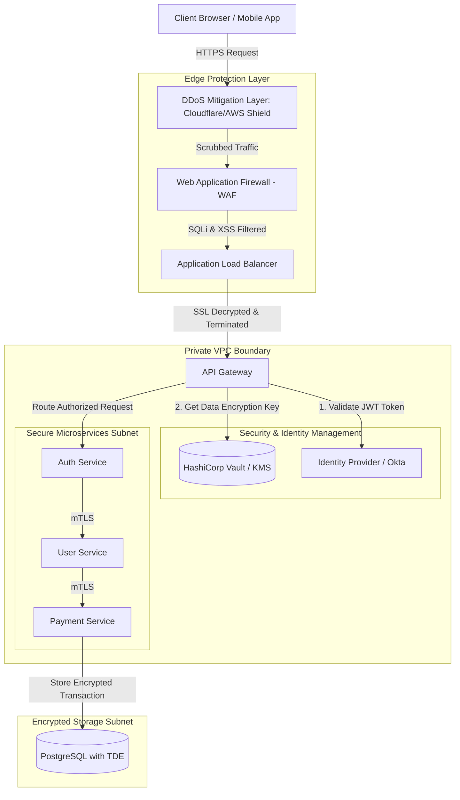

# Security in High-Level Design

## 1. System Scale & Core Theory

Integrating security into high-level system design requires applying the principle of **Defense in Depth** across all layers of the architecture. Security mechanisms must scale horizontally to handle production traffic volumes without introducing performance bottlenecks.

### Cryptographic Performance & Sizing Estimations

Consider a financial transactions API gateway handling the following traffic:
*   **Peak Traffic:** $50,000\text{ Requests/Second (RPS)}$.
*   **Average Payload Size:** $5\text{ KB}$.
*   **Security Requirements:** TLS 1.3 termination, JSON Web Token (JWT) signature verification, and field-level encryption for Social Security Numbers (SSNs).

#### 1. TLS Handshake CPU Sizing (Asymmetric)
*   TLS 1.3 handshakes use Elliptic Curve Diffie-Hellman Ephemeral (ECDHE) for key exchange. A single modern CPU core can perform $\approx 10,000\text{ ECDHE-ECDSA P-256 key exchanges/second}$.
*   **New Connections Sizing:** Assuming $10\%$ of peak traffic consists of new TLS connections (the remaining $90\%$ reuse existing sessions via TLS Session Resumption):
    $$\text{New Handshakes} = 50,000 \times 0.10 = 5,000\text{ handshakes/second}$$
    $$\text{CPU Cores Required for Handshakes} = \frac{5,000}{10,000} \approx 0.5\text{ Cores}$$

#### 2. AES Symmetric Encryption Bandwidth Sizing
Symmetric encryption (AES-256-GCM) secures data in transit and at rest.
*   **Throughput:** Modern CPUs with AES-NI (Advanced Encryption Standard New Instructions) hardware acceleration can encrypt or decrypt data at a rate of $\approx 1.5\text{ GB/second per core}$.
*   **Encryption Sizing:**
    $$\text{Payload Data Volume} = 50,000\text{ RPS} \times 5\text{ KB} = 250,000\text{ KB/s} \approx 244\text{ MB/s}$$
    $$\text{CPU Cores Required for AES} = \frac{244\text{ MB/s}}{1500\text{ MB/s}} \approx 0.16\text{ Cores}$$
    AES-NI hardware acceleration reduces the CPU overhead of symmetric encryption, making it feasible to encrypt all internal microservices traffic.

#### 3. Field-Level KMS Requests Sizing
*   Encrypting SSNs directly using a network-attached Key Management Service (KMS) like AWS KMS or HashiCorp Vault introduces significant latency.
*   **Latency Cost:** An external network call to a KMS adds $\approx 5\text{ ms}$ to $15\text{ ms}$ of latency per request. At $50,000\text{ RPS}$, this creates a network bottleneck.
*   *Mitigation:* Use **Envelope Encryption**. Retrieve a Data Encryption Key (DEK) from the KMS once, cache it locally in memory, and use it to encrypt payloads locally. This eliminates the network call to the KMS for every request.

### Security Architecture Technology Matrix

| Attribute / Feature | Stateful Sessions | Stateless JWT | OAuth 2.0 / OIDC | Mutual TLS (mTLS) |
| :--- | :--- | :--- | :--- | :--- |
| **Trust Model** | Centralized session database / cache | Decentralized cryptographic signature verification | Third-party authorization delegation | Cryptographic identity verification for both client & server |
| **Storage Overhead** | High (session state stored in Redis/DB) | Zero on server (state is stored inside the client token) | Low to Medium (requires caching client configurations) | Zero (uses client certificate verification) |
| **Revocation** | Instant (delete session ID from Redis) | Difficult (requires blacklists or short TTLs) | Dynamic (revoke tokens via authorization server) | Immediate via CRL or OCSP stapling |
| **Primary Scope** | Monolithic apps, web frontends | Microservices architecture, API gateways | Cross-domain integration, partner APIs | Internal service-to-service communication |

---

## 2. Visual Architecture Diagram

This diagram shows a defense-in-depth architecture, tracing traffic from the public internet through security scrubbing layers to secure backend services.



---

## 3. Data Models & API Signatures

### JWT Structure (Stateless Token Example)
A JWT consists of three parts separated by dots: **Header**, **Payload**, and **Signature**.

```
Header:    eyJhbGciOiJSUzI1NiIsInR5cCI6IkpXVCJ9
Payload:   eyJzdWIiOiIxMjM0NTY3ODkwIiwibmFtZSI6IkpvaG4gRG9lIiwiYWRtaW4iOnRydWUsImV4cCI6MTgwMTI5NjAwMH0
Signature: (Cryptographic hash of Header + Payload using the Private Key)
```

#### Decoded JWT Payload (JSON)
```json
{
  "sub": "usr_9d3fd2bc-9d3f-422d-a2f1",
  "name": "Jane Doe",
  "roles": ["customer", "billing_admin"],
  "iss": "https://auth.example.com",
  "aud": "https://api.example.com",
  "iat": 1780400000,
  "exp": 1780403600,
  "jti": "token_c88e7f75-3515-4428"
}
```

### OIDC Authorization Code Exchange API Signatures

#### 1. Token Exchange Request
*   **Protocol:** HTTPS POST (Content-Type: `application/x-www-form-urlencoded`)
*   **Path:** `/oauth2/v1/token`
*   **Request Payload:**
```http
grant_type=authorization_code
&client_id=client_2882cb2bc9d3f422d
&code=code_893fd2bc9d3f422da2f1
&redirect_uri=https%3A%2F%2Fapp.example.com%2Fcallback
&code_verifier=dBjftJeZ4CVP-mB92K27uhbUJU1p1r_wW1gFWFOEjXk
```

#### 2. Token Exchange Response
*   **Response Payload (200 OK):**
```json
{
  "access_token": "eyJhbGciOiJSUzI1...",
  "token_type": "Bearer",
  "expires_in": 3600,
  "refresh_token": "rfr_bfd609205c6d4ee8a92c",
  "id_token": "eyJhbGciOiJSUzI1Ni...",
  "scope": "openid profile email"
}
```

---

## 4. Operational Flows

### TLS 1.3 Connection Handshake (Fast 1-RTT Setup)

TLS 1.3 reduces handshake latency to a single round-trip time (1-RTT) by negotiating cryptographic parameters and performing the key exchange in the initial message exchange.

```
Client                                                         Server (ALB/Gateway)
  │                                                                     │
  │─── 1. ClientHello ─────────────────────────────────────────────────>│
  │    (Key Share: client public key, supported cipher suites)          │
  │                                                                     │
  │                                                                     │
  │<── 2. ServerHello ──────────────────────────────────────────────────│
  │    (Key Share: server public key, selected cipher suite)            │
  │<── 3. EncryptedExtensions & Certificate ────────────────────────────│
  │<── 4. CertificateVerify & Finished ─────────────────────────────────│
  │                                                                     │
  │                                                                     │
  │─── 5. Finished (Client) ───────────────────────────────────────────>│
  │                                                                     │
  ├─────────────────────────────────────────────────────────────────────┤
  │       Secure Channel Established (Symmetric Encryption Active)      │
  └─────────────────────────────────────────────────────────────────────┘
```

1.  **Client Proposal:** The Client sends a `ClientHello` message containing its supported cipher suites, TLS version, and a public key share.
2.  **Server Response:** The Server responds with a `ServerHello` containing the selected cipher suite and its own public key share. It computes the shared master secret using the Diffie-Hellman exchange.
3.  **Authentication:** The Server sends its encrypted certificate and a digital signature (`CertificateVerify`) to prove ownership of the public key. It concludes the exchange with a `Finished` message.
4.  **Verification:** The Client verifies the server's certificate signature. It then sends its own `Finished` message, establishing the encrypted session.

### OAuth 2.0 Authorization Flow with PKCE (Proof Key for Code Exchange)

PKCE protects the authorization code exchange against interception attacks in public clients (like Single Page Apps or mobile applications) that cannot securely store a client secret.

```
Client App (SPA)                Authorization Server (IdP)             Backend API Gateway
    │                                       │                                   │
    │─── 1. Redirect to Login ─────────────>│                                   │
    │    (Include Code Challenge)           │                                   │
    │<── 2. Authenticate & Return Auth Code ─│                                   │
    │                                       │                                   │
    │─── 3. Request Token ─────────────────>│                                   │
    │    (Include Auth Code + Verifier)     │                                   │
    │<── 4. Verify & Return Access Token ───│                                   │
    │                                                                           │
    │─── 5. Request Resource with Bearer Token ────────────────────────────────>│
    │<── 6. Return Protected Resource ──────────────────────────────────────────│
```

1.  **Generate Secrets:** The Client generates a cryptographically random string called the `code_verifier`. It hashes this string to create the `code_challenge`.
2.  **Redirect to Login:** The Client redirects the user to the Authorization Server, passing the `code_challenge` and the hashing method.
3.  **Authenticate:** The User logs in. The Authorization Server records the `code_challenge` and redirects the user back to the client app with a temporary `authorization_code`.
4.  **Request Token:** The Client sends the `authorization_code` and the raw `code_verifier` to the token endpoint of the Authorization Server.
5.  **Validate Verifier:** The Authorization Server hashes the `code_verifier` using the registered method and compares it to the original `code_challenge`. If they match, it returns the `access_token`.
6.  **Access Resources:** The Client uses the token to make authorized API calls to the Gateway.

---

## 5. High Availability, Failovers & Bottlenecks

### Microservice JWT Revocation Mitigation
Because JWTs are stateless and validated locally by services, revoking a compromised token before its expiration (TTL) is challenging.
*   **The Blacklist Strategy (High-Availability):**
    *   Store revoked token IDs (`jti`) in a distributed cache like Redis cluster.
    *   Set the cache expiration time to match the remaining TTL of the revoked token.
    *   The API Gateway checks this cache before routing requests.
    *   *Optimizing Performance:* To keep lookup latencies low, use a **Bloom Filter** at the gateway to check if a token ID is present in the blacklist. A bloom filter check is an in-memory operation that avoids a network call to the database. If the filter indicates the token *might* be blacklisted, the gateway performs a lookup in the Redis cluster to confirm.

### Envelope Encryption & Key Rotation

Using a Key Management Service (KMS) directly for encrypting database columns can create a performance bottleneck. Envelope encryption avoids this by using two tiers of keys:

```
[ Central KMS ] 
       │
 (Generates and encrypts DEK using master key KEK)
       │
       ▼
 [ Encrypted Data Encryption Key (eDEK) ] ──> Stored in Database Header
 [ Plaintext Data Encryption Key (DEK) ]   ──> Cached in App Memory
       │
       ├──> (Encrypts sensitive fields locally) ──> [ Ciphertext Data ]
```

*   **Key Encryption Key (KEK):** The master key, managed and kept secure within the KMS hardware.
*   **Data Encryption Key (DEK):** A symmetric key generated by the KMS to encrypt the actual data.
*   **The Envelope Encryption Flow:**
    1.  The Application requests a DEK from the KMS.
    2.  The KMS generates a DEK and returns two versions: a plaintext DEK and an encrypted DEK (`eDEK`) wrapped by the KEK.
    3.  The Application caches the plaintext DEK in memory. It uses this key to encrypt sensitive database fields locally using AES-256.
    4.  The plaintext DEK is discarded from memory when the application exits. The encrypted `eDEK` is stored alongside the encrypted data in the database.
    5.  **Decryption:** The application sends the `eDEK` to the KMS. The KMS decrypts it using the KEK and returns the plaintext DEK, which the application uses to decrypt the data.
*   **Key Rotation:** To rotate keys, update the KEK in the KMS. The KMS decrypts the existing `eDEK` and re-encrypts it using the new KEK. This updates the key configuration without requiring the underlying data to be decrypted and re-encrypted.

---

## 6. Comprehensive Interview Q&A

### Q1: What is the difference between encryption in transit, encryption at rest, and secure enclaves (Confidential Computing)?
**Answer:**
These security mechanisms protect data at different stages of its lifecycle:

1.  **Encryption in Transit:**
    *   Protects data while it is moving across networks (e.g., using TLS 1.3 or IPsec).
    *   Prevents attackers from sniffing or tampering with network packets using man-in-the-middle attacks.
2.  **Encryption at Rest:**
    *   Protects data while it is stored on physical media like hard drives or object storage (e.g., using AES-256 or Transparent Data Encryption).
    *   Prevents data exposure if physical disks are stolen or storage volumes are accessed directly.
3.  **Confidential Computing (Secure Enclaves):**
    *   Protects data while it is active in memory and being processed by the CPU.
    *   Uses hardware-level isolation (such as Intel SGX or AMD SEV) to run code within secure enclaves. The memory allocated to these enclaves is encrypted, preventing access from other processes, virtual machine managers, or root users on the host operating system.

---

### Q2: Explain the SSRF (Server-Side Request Forgery) attack. How do you design a system to prevent it?
**Answer:**
Server-Side Request Forgery (SSRF) occurs when an attacker forces a backend server to make HTTP requests to unintended destinations, often targeting internal resources behind the corporate firewall.

*   **The Threat:** Consider a service that generates PDF reports from a user-supplied URL: `https://api.example.com/export?url=https://usercontent.com/report`. An attacker could modify this parameter to target internal addresses: `url=http://169.254.169.254/latest/meta-data/` (the cloud instance metadata service) to retrieve sensitive configuration credentials.
*   **Prevention Strategies:**
    1.  **Input Validation with Whitelisting:** Restrict acceptable inputs to a strict whitelist of approved domains. Reject IP addresses and internal hostnames.
    2.  **Network Isolation:** Host services that process user-supplied URLs in an isolated subnet with no routing access to internal services.
    3.  **Disable Redirections:** Configure HTTP clients to reject redirects. This prevents attackers from bypassing domain whitelists by redirecting a whitelisted domain to an internal IP address.
    4.  **Local Host Resolution Blocks:** Resolve the input domain to an IP address before making the request. Confirm the resolved IP is not a private IP (e.g., `10.0.0.0/8`, `192.168.0.0/16`, `127.0.0.1`).

---

### Q3: Why is session hijacking a risk with JSON Web Tokens? How can you mitigate this risk compared to stateful session cookies?
**Answer:**
Since JWTs are stateless, any client that possesses a valid token has access to the resource. If an attacker steals a JWT (via Cross-Site Scripting or packet interception), they can access the API until the token expires.

*   **Mitigation Strategies:**
    1.  **Use Short Access Token TTLs:** Set the lifetime of access tokens to $5$ to $15$ minutes. Use a secure, HTTP-only refresh token to obtain new access tokens.
    2.  **Store Tokens in Secure Cookies:** Store JWTs in cookies configured with the `HttpOnly`, `Secure`, and `SameSite=Strict` flags. This prevents access to the tokens from client-side JavaScript, mitigating XSS risks.
    3.  **IP and User-Agent Binding:** Bind the JWT to the client's IP address or User-Agent during authentication. If the token is presented from a different IP or device, force authentication.
    4.  **Token Rotation:** Implement refresh token rotation. When a client requests a new access token using a refresh token, invalidate the old refresh token and return a new one. If a refresh token is reused, invalidate the entire token family to prevent unauthorized access.

---

### Q4: Explain the difference between Role-Based Access Control (RBAC) and Attribute-Based Access Control (ABAC). When should you use each?
**Answer:**
These access control models determine how authorization decisions are made:

1.  **Role-Based Access Control (RBAC):**
    *   Grants permissions based on user roles (e.g., `Billing Admin`, `Customer`).
    *   *Implementation:* Simple to implement and audit. Permissions are mapped directly to roles, and roles are assigned to users.
    *   *Limitation:* Lacks context. For example, it is difficult to enforce a rule like "Only allow access to billing records if the user belongs to the same department as the record owner."
2.  **Attribute-Based Access Control (ABAC):**
    *   Grants permissions by evaluating policies against attributes of the subject (e.g., user role, department), resource (e.g., owner, classification), and environment (e.g., request time, IP address).
    *   *Implementation:* More complex, but supports fine-grained access control.
    *   *Use Case:* Use RBAC for standard application permissions (such as administrative menus). Use ABAC when authorization decisions require context, such as evaluating data ownership, geographic restrictions, or business hours.
