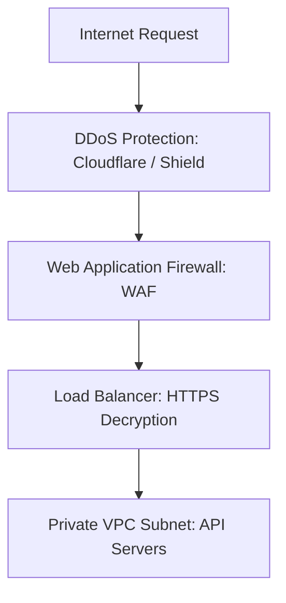

# Security in High Level Design

Security practices ensure data confidentiality, user identity validation, and infrastructure protection against attacks.

---

## 1. Network Boundary Security
Security is applied in layers (Defense in Depth):

* **DDoS Mitigation:** BGP routing shifts and traffic scrubbing layers reject bulk network flood vectors.
* **WAF (Web Application Firewall):** Inspects HTTP headers and payloads, filtering SQL injections, Cross-Site Scripting (XSS), and malicious bot patterns at layer 7.
* **VPC (Virtual Private Cloud):** Backend databases and application instances are kept in private subnets with zero public internet IP routes.

---

## 2. Authentication: JWT vs Session IDs
* **Stateful Sessions:** Client receives a random Session ID. Server stores session details in Redis/Database. On every request, server queries Redis.
  * *Pros:* Immediate session cancellation/revocation.
  * *Cons:* Requires database storage and cache lookups.
* **Stateless Tokens (JWT):** Client receives a signed JSON Web Token (JWT). Server validates the token signature using a public/private key pair.
  * *Pros:* Stateless, zero database checks. Perfect for microservices.
  * *Cons:* Hard to revoke before expiration (unless using a blacklist cache).

---

## Interview Q&A Corner

> [!IMPORTANT]
> **Q: How does a stateless JWT check verify that a token has not been forged?**
> A: A JWT consists of Header, Payload, and Signature. The signature is created by hashing the Header + Payload along with a **private key** known only to the authentication server. When an API gateway receives a JWT, it recalculates the hash using the public key. If the hash matches the signature, it guarantees the payload has not been modified.
