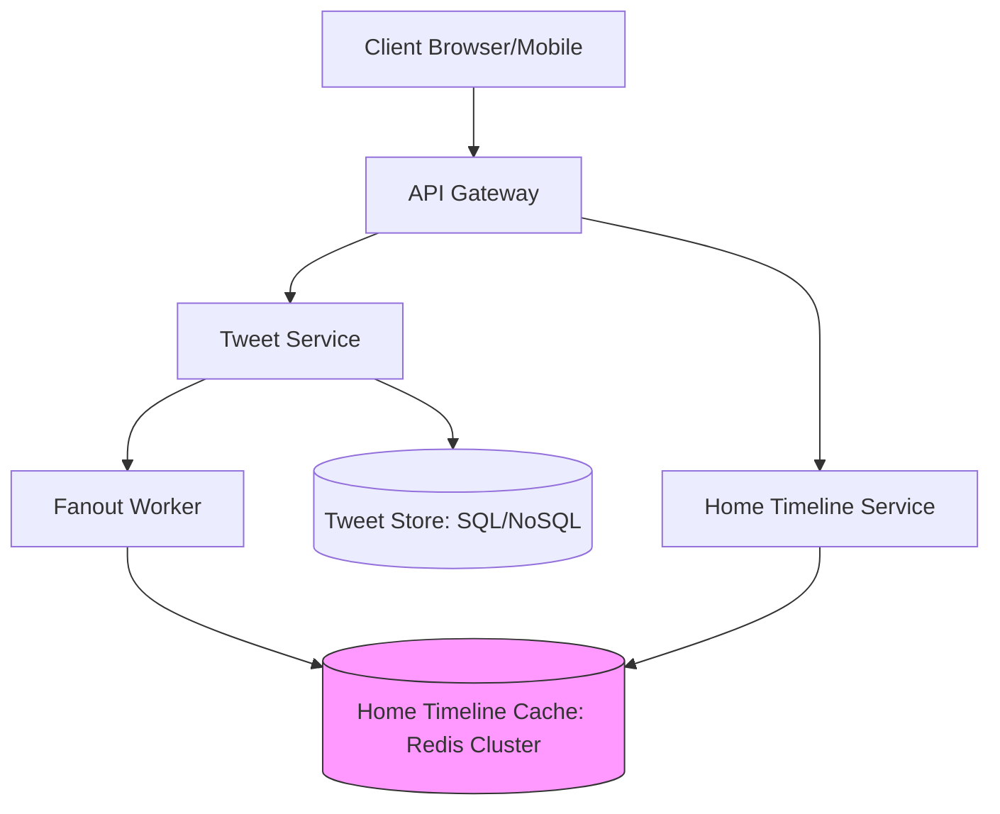

# HLD: Design Twitter / X (Newsfeed System)

This design covers posting tweets, building timelines, and handling newsfeed generation at scale, particularly dealing with the **Celebrity Fanout Problem**.

---

## 1. Requirements & Scale
* **DAU:** 300 Million.
* **Volume:** 500 Million tweets/day, $\approx 6,000$ QPS average writes, $\approx 100,000$ QPS reads.
* **Timeline Types:** User Timeline (tweets from a single user) and Home Timeline (aggregated feed of followed users).

---

## 2. Architecture Diagram

---

## 3. Fanout Model: Push vs Pull
How is the Home Timeline generated?

### Fanout-on-Write (Push Model)
* **Mechanism:** When a user posts a tweet, the system immediately fetches their followers list, and appends the tweet ID to the cached Home Timeline list (Redis) of each follower.
* **Pros:** Home Timeline read is extremely fast ($O(1)$ lookup in Redis).
* **Cons:** Celebrity problem. If a user with 50 Million followers (e.g. Elon Musk) tweets, writing to 50 Million Redis lists blocks the system.

### Fanout-on-Read (Pull Model)
* **Mechanism:** The timeline is generated only when a client refreshes their feed. The system queries the followed IDs, pulls their latest tweets from DB, merges them, and returns.
* **Pros:** Simple writes; no waste of cache space for inactive users.
* **Cons:** High read latency; queries DB extensively on feed refreshes.

### The Hybrid Solution (Twitter's Actual Architecture)
* **Normal Users:** Fanout-on-write (push to followers' Redis queues).
* **Celebrity Users (10k+ followers):** Do **not** push their tweets. 
* **Timeline Generation (Merge at read):** When a normal user refreshes their home feed, the system reads their pre-computed Redis timeline (containing normal users' tweets) and pulls the latest tweets of any celebrity they follow from a hot-cache User Timeline, merging them in memory.

---

## Interview Q&A Corner

> [!IMPORTANT]
> **Q: How would you design the database storage for tweets?**
> A: Use a wide-column store like **Cassandra** or sharded **MySQL**. The sharding key should be `user_id` so that a single user's tweets live on the same physical shard, making User Timeline rendering exceptionally fast.
