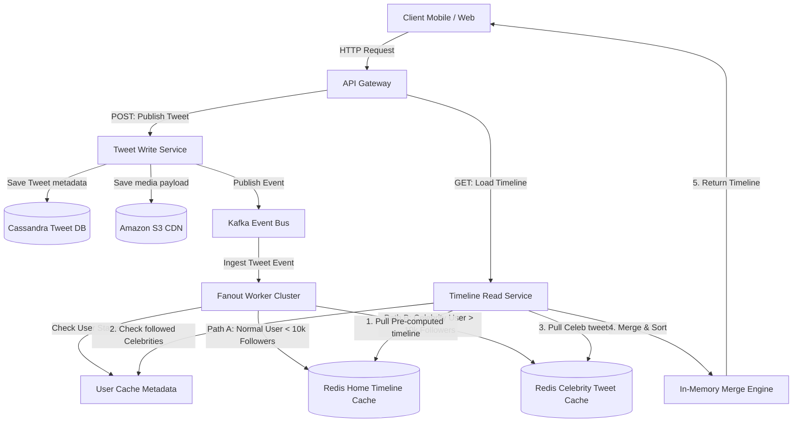

# HLD: Design Twitter / X (Newsfeed System)

## 1. System Scale & Core Theory

Twitter/X is a real-time microblogging platform characterized by highly asymmetric read/write ratios, where a small percentage of users generate content read by millions.

### Mathematical Sizing & Scale Estimations

*   **Daily Active Users (DAU):** $300\text{ Million}$.
*   **Tweets Posted:** $500\text{ Million/day}$.
*   **Average User Follow Count:** $200$ followers.
*   **Celebrity Follow Count:** Up to $100\text{ Million}$ followers.

#### 1. Read & Write QPS Calculations
*   **Write QPS (Tweets):**
    $$\text{Average Write QPS} = \frac{500,000,000\text{ tweets}}{86,400\text{ seconds}} \approx 5,787\text{ writes/sec}$$
    $$\text{Peak Write QPS (2x average)} \approx 12,000\text{ writes/sec}$$
*   **Read QPS (Timeline Views):** Assume an average user views their Home Timeline $5$ times a day.
    $$\text{Total Daily Read Requests} = 300\text{ Million DAU} \times 5 = 1.5\text{ Billion reads/day}$$
    $$\text{Average Read QPS} = \frac{1,500,000,000}{86,400} \approx 17,360\text{ reads/sec}$$
    $$\text{Peak Read QPS (5x average)} \approx 86,800\text{ reads/sec}$$
    *Read-to-Write Ratio:* $\approx 15:1$ (reads are much more frequent than writes).

#### 2. Storage Sizing Estimations
*   **Tweet Record size:**
    *   `tweet_id` (Snowflake ID): $8\text{ bytes}$
    *   `user_id` (UUID): $16\text{ bytes}$
    *   `content` (UTF-8 text, 280 chars max): Average $140\text{ bytes}$
    *   `media_urls` (JSON array of links): Average $100\text{ bytes}$
    *   `metadata` (timestamps, retweets, replies counts): $50\text{ bytes}$
    *   **Total size per tweet:** $\approx 314\text{ bytes}$.
*   **Daily Database Storage:**
    $$\text{Daily Storage} = 500\text{ Million} \times 314\text{ bytes} \approx 157\text{ GB/day}$$
    $$\text{Annual Storage (with index & replication overhead - 3x)} = 157\text{ GB} \times 365 \times 3 \approx 172\text{ TB/year}$$
*   **Media Storage (Photos/Videos):** Assume $10\%$ of tweets include media, with an average size of $1\text{ MB}$ per file.
    $$\text{Daily Media Storage} = 500\text{ Million} \times 0.10 \times 1\text{ MB} = 50\text{ TB/day}$$
    This data is uploaded directly to object storage (like AWS S3) and served via CDNs.

### Fanout Routing Strategy Matrix

| Feature / Metric | Push Model (Fanout-on-Write) | Pull Model (Fanout-on-Read) | Hybrid Model (Twitter's Solution) |
| :--- | :--- | :--- | :--- |
| **Write Path Latency** | High ($O(F)$ where $F$ is followers count; slows down on celebrity writes) | Low ($O(1)$; write to DB only) | Low for celebrities, slightly higher for standard users |
| **Read Path Latency** | Low ($O(1)$ lookup from memory cache) | High ($O(\text{Followees}) + \text{sorting joints}$) | Low ($O(1)$ memory lookup + fast merge) |
| **Database Overhead** | High cache memory consumption (duplicate references) | High CPU and read I/O load on database | Optimized; uses cache memory only for active users |
| **Failure Modes** | Write thread pool exhaustion on celebrity posts | Read timeout under heavy query loads | Complex synchronization logic between push and pull paths |

---

## 2. Visual Architecture Diagram

This diagram shows Twitter's hybrid fanout architecture, which separates write paths based on user followings and merges timeline components in memory.



---

## 3. Data Models & API Signatures

### Data Models & Sharding Keys

#### 1. Tweet Store (Wide-Column Cassandra)
To support fast retrieval of a single user's tweets, shard the database by `user_id`. This stores all tweets posted by a user on the same physical partition.

```sql
-- Cassandra Table Schema
CREATE KEYSPACE twitter_tweets WITH replication = {'class': 'SimpleStrategy', 'replication_factor': 3};

CREATE TABLE twitter_tweets.tweets (
    user_id uuid,
    tweet_id timeuuid,
    content text,
    media_list list<text>,
    reply_to_tweet_id uuid,
    retweet_count counter,
    like_count counter,
    PRIMARY KEY (user_id, tweet_id)
) WITH CLUSTERING ORDER BY (tweet_id DESC);
```

#### 2. Graph Relation Store (Graph/Relational Database)
This table stores user follow relationships. Use index strategies to query both followings and followers quickly.

```sql
-- PostgreSQL Schema for Graph Relations
CREATE TABLE follows (
    follower_id UUID NOT NULL,
    followee_id UUID NOT NULL,
    created_at TIMESTAMP WITH TIME ZONE DEFAULT CURRENT_TIMESTAMP,
    PRIMARY KEY (follower_id, followee_id)
);

CREATE INDEX idx_follows_followee ON follows(followee_id);
```

#### 3. Home Timeline Cache (Redis Structure)
Redis stores home timelines using Sorted Sets (`ZSET`). The `score` is the `tweet_id` (Snowflake timestamp), and the `value` is the `tweet_id` reference string.
*   **Key:** `timeline:usr_<user_id>`
*   **Sorted Set Command:** `ZADD timeline:usr_1234 1780400000 "tweet_5678"`
*   **Trimming Cache:** Limit timelines to the last 800 tweets to control memory usage:
    `LTRIM timeline:usr_1234 0 799`

### API Signatures

#### 1. Post a New Tweet
*   **Protocol:** HTTPS POST
*   **Path:** `/api/v1/tweets`
*   **Request Payload:**
```json
{
  "content": "Designing high-scale system architectures is all about trade-offs! #SystemDesign",
  "media_ids": ["media_77821389-9b7e-4029"]
}
```
*   **Response Payload (201 Created):**
```json
{
  "tweet_id": "780401827492810752",
  "user_id": "893fd2bc-9d3f-422d-a2f1-5f21e51b1f89",
  "content": "Designing high-scale system architectures is all about trade-offs! #SystemDesign",
  "created_at": "2026-06-03T02:26:25Z"
}
```

#### 2. Retrieve Home Timeline
*   **Protocol:** HTTPS GET
*   **Path:** `/api/v1/timeline/home`
*   **Query Parameters:** `limit=20&max_id=780401827492810752`
*   **Response Payload (200 OK):**
```json
{
  "tweets": [
    {
      "tweet_id": "780401827492810752",
      "user_id": "332cb2bc-9d3f-422d-a2f1-5f21e51b1f89",
      "username": "tech_lead",
      "content": "Designing high-scale system architectures is all about trade-offs! #SystemDesign",
      "likes": 1240,
      "retweets": 45
    }
  ],
  "next_cursor": "780401201942918231"
}
```

---

## 4. Operational Flows

### Write Path Flow (Publishing a Tweet)
1.  **Request Ingestion:** The client posts a tweet to the API Gateway. The Gateway decrypts the SSL connection and validates the user's JWT.
2.  **ID Generation:** The Tweet service uses a distributed ID generator (e.g., Snowflake) to create a unique, time-sortable `tweet_id`.
3.  **Database Storage:** The service writes the tweet metadata to the Cassandra DB cluster.
4.  **Event Generation:** The service publishes an event to the `tweet-events` Kafka topic:
    `{ "tweet_id": "7804018274", "author_id": "user_42", "is_celebrity": false }`
5.  **Fanout Processing:**
    *   *Normal User:* The Fanout Worker retrieves the author's followers from the `follows` DB index. It writes the `tweet_id` to each follower's timeline cache in Redis.
    *   *Celebrity User:* The Fanout Worker identifies the author as a celebrity (e.g., $>10,000$ followers) and bypasses the follower write path. It writes the tweet ID only to the celebrity's User Timeline cache in Redis.

### Read Path Flow (Generating Home Timeline)
1.  **Request Timeline:** The Client sends a GET request to the API Gateway for their home timeline.
2.  **Pull Normal Tweets:** The Timeline service queries Redis to retrieve the client's pre-computed timeline cache (`timeline:usr_<user_id>`), which contains tweets from non-celebrity followings.
3.  **Identify Celebrity Followings:** The service queries the followings cache to identify which of the user's followings are flagged as celebrities.
4.  **Pull Celebrity Tweets:** For each followed celebrity, the service pulls their recent tweets from their designated celebrity cache (`celeb:usr_<celebrity_id>`).
5.  **Merge & Sort:** The service merges the non-celebrity and celebrity tweets in memory, sorts them chronologically, hydrates the tweet metadata (usernames, profile images, like counts), and returns the formatted timeline to the client.

---

## 5. High Availability, Failovers & Bottlenecks

### Mitigating the Hot Key Problem
When a celebrity (e.g., $100\text{ Million}$ followers) posts, querying their timeline cache causes significant read traffic on a single Redis node. This is a **Hot Key Problem**.

```
              [ Client Read Requests for Celebrity Timeline ]
                                     │
           ┌─────────────────────────┼─────────────────────────┐
           ▼                         ▼                         ▼
  [ Redis Shard 1 ]          [ Redis Shard 2 ]          [ Redis Shard 3 ]
  (Replica A)                (Replica B)                (Replica C)
  * Holds Celeb timeline     * Holds Celeb timeline     * Holds Celeb timeline
```

*   **Mitigations:**
    1.  **Local Memory Caching:** Cache celebrity tweets in memory on the application servers for 1 to 5 seconds. This reduces read traffic to the Redis cluster.
    2.  **Read Replicas:** Scale the Redis cluster by creating read replicas for hot keys. Use consistent hashing to distribute celebrity timeline reads across these replicas.

### Active Timeline Cache Management
Storing home timelines in memory for all registered users consumes significant RAM.
*   **Sizing Optimization:** Cache timelines only for **Active Users** (users who have logged in within the last 30 days).
*   *Rehydration Flow:* If an inactive user logs back in:
    1.  Identify a cache miss in Redis.
    2.  Query the database for the user's followings.
    3.  Retrieve the latest tweets from those followings.
    4.  Rebuild the user's timeline in Redis dynamically.
    5.  Serve the timeline to the user.

---

## 6. Comprehensive Interview Q&A

### Q1: Explain how Twitter's Snowflake ID generator works. Why are random UUIDs or database auto-increment keys unsuitable?
**Answer:**
Twitter requires unique IDs that are chronologically sortable so that search indexes and caching systems can order tweets by time without additional database lookups.

```
Snowflake ID Structure (64 bits):
┌──────┬──────────────────────────────┬───────────────┬────────────────┐
│ 1 bit│ 41 bits (Timestamp in ms)    │ 10 bits       │ 12 bits        │
│ Sign │ (Relative to custom epoch)   │ Node/MachineID│ SequenceNumber │
└──────┴──────────────────────────────┴───────────────┴────────────────┘
```

*   **Structure of a Snowflake ID (64 bits):**
    1.  **Sign Bit (1 bit):** Unused (set to 0) to ensure the ID is positive.
    2.  **Timestamp (41 bits):** Milliseconds elapsed since a custom epoch (e.g., Jan 1, 2020). This provides $2^{41}$ milliseconds, or roughly 69 years of capacity.
    3.  **Machine/Node ID (10 bits):** Identifies the specific physical server generating the ID. This supports up to 1024 concurrent nodes.
    4.  **Sequence Number (12 bits):** A local counter that increments for every ID generated on the machine during the same millisecond. It resets to 0 each millisecond. This supports up to 4096 IDs per millisecond per machine.
*   **Why Alternatives Fail:**
    *   *Auto-Increment Keys:* Traditional relational databases use auto-incrementing integers. This model relies on a single database write path, which cannot scale to handle peak write rates (e.g., $12,000\text{ writes/sec}$) across sharded nodes.
    *   *UUIDs:* Standard 128-bit UUIDs are random and do not contain time information. This makes sorting inefficient and degrades index performance in databases because insertions are out of order (causing page splits).

---

### Q2: What is the "Celebrity Fanout Problem" (Herd Effect) in newsfeed design, and how does a hybrid push/pull model resolve it?
**Answer:**
The celebrity fanout problem occurs when an account with a high follower count posts content.
*   **The Bottleneck (Push Model):** If a celebrity with $80\text{ Million}$ followers tweets, the system must write the tweet ID to $80\text{ Million}$ individual Redis timeline caches. This process consumes significant memory, blocks processing threads, and creates write queues.
*   **The Inefficiency (Pull Model):** Generating timelines at read time for all users is resource-intensive. If users refresh their feeds, the system must join their following lists with the tweets database, which degrades database read performance.
*   **Hybrid Resolution:**
    *   *Categorization:* Segment users by follower count. Users with $< 10,000$ followers use the push model. Their tweets are pushed directly to their followers' timeline caches.
    *   *Celebrity Override:* Users with $> 10,000$ followers use the pull model. Their tweets are written only to their own User Timeline cache.
    *   *Read-Time Merging:* When a user reads their timeline, the system retrieves their pre-computed cache and merges it in memory with the recent tweets from any followed celebrities. This approach optimizes write speeds for celebrity posts and keeps read latency low for end users.

---

### Q3: How do you handle search functionality for tweets? How do you support real-time searches for trending topics?
**Answer:**
To support search and trend detection, route tweet events through a search pipeline:

```
[ Tweet Write Service ] ──> [ Kafka (Tweet Event) ]
                                  │
         ┌────────────────────────┴────────────────────────┐
         ▼                                                 ▼
[ Search Consumer ]                               [ Analytics Consumer ]
         │                                                 │
(Index in Elasticsearch Cluster)                  (Ingest into Apache Flink)
         │                                                 │
         ▼                                                 ▼
[ Full-Text Search Queries ]                      [ Sliding Window Trend Analysis ]
```

1.  **Full-Text Search Indexing:** Use a search consumer to read events from the Kafka topic and index the tweet text in an Elasticsearch cluster. Shard the Elasticsearch index by time (e.g., daily indexes) to prune old data efficiently.
2.  **Real-Time Analytics (Trending Topics):** Route the Kafka stream to a stream processing framework like Apache Flink or Apache Spark Streaming.
3.  **Sliding Window Calculations:** Use Flink to calculate term frequencies (such as hashtags) over a sliding window (e.g., 5-minute intervals).
4.  **Rankings:** Compare current term frequencies against historical baselines to identify spikes in activity. Write the top-ranked trends to a Redis cache to serve client requests.

---

### Q4: If a Redis node hosting Home Timeline caches crashes, how is data recovered? How do you prevent cache stampedes during recovery?
**Answer:**
*   **Redis Persistence Configuration:** Configure Redis nodes using a combination of **RDB (Redis Database snapshots)** and **AOF (Append-Only File)** persistence:
    *   Generate RDB snapshots periodically (e.g., hourly) to record the state of memory.
    *   Enable AOF with a policy of flushing updates to disk every second (`appendfsync everysec`) to capture recent writes.
*   **Failover Execution:** Run Redis in a Sentinel or Cluster configuration. If a master node crashes, Sentinel promotes a replica to master, which reconstructs its memory state using its local RDB and AOF files.
*   **Mitigating Cache Stampedes during Reconstruction:**
    *   If a cache partition is empty, applications may attempt to read from it, query the database, and write back the reconstructed timeline simultaneously. This can overwhelm the database.
    *   *Mitigation:* Use **Mutex Locking**. When a cache miss occurs, the application must acquire a distributed lock (e.g., Redlock) before querying the database to rebuild the timeline. Other application instances wait for the lock to be released and then read the reconstructed timeline from the cache.
