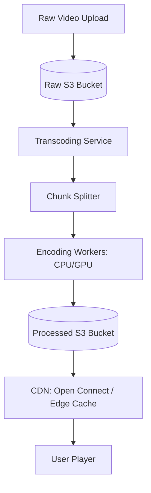

# HLD: Design Netflix / YouTube (Video Streaming)

This design focuses on scalable video uploading, transcoding pipelines, adaptive bitrate streaming, and CDN storage.

---

## 1. Scale & Core Requirements
* **Goal:** High quality video streaming with low latency and buffering.
* **Scale:** 200 Million active users, petabytes of storage.
* **Technique:** **Adaptive Bitrate Streaming (ABR)**. Videos are split into 2-10 second chunks, encoded in multiple resolutions (1080p, 720p, 480p) and formats (HLS, DASH). The client video player dynamically switches resolution based on real-time internet speed.

---

## 2. Transcoding Architecture

---

## 3. Video Transcoding Pipeline
1. **Upload:** Client uploads raw video.
2. **Splitting:** The input file is split into hundreds of small 4-second chunks (allows parallel processing).
3. **Encoding:** Workers encode chunks in parallel into target codecs (H.264, VP9, AV1) and resolutions.
4. **Merging:** Chunks are compiled. A manifest file (e.g. `.m3u8` or `.mpd` XML) is generated containing paths to all chunk variations.
5. **Distribution:** Manifest and chunks are pushed to CDNs close to users.

---

## Interview Q&A Corner

> [!WARNING]
> **Q: How does Netflix optimize CDN costs and traffic loads?**
> A: Netflix built its own custom CDN infrastructure called **Open Connect (OCA)**. Instead of buying bandwidth from AWS, Netflix installs physical storage boxes loaded with compressed video catalog files directly inside local Internet Service Provider (ISP) facilities. This places 95% of video traffic inside local ISP networks, bypassing transit costs entirely.
